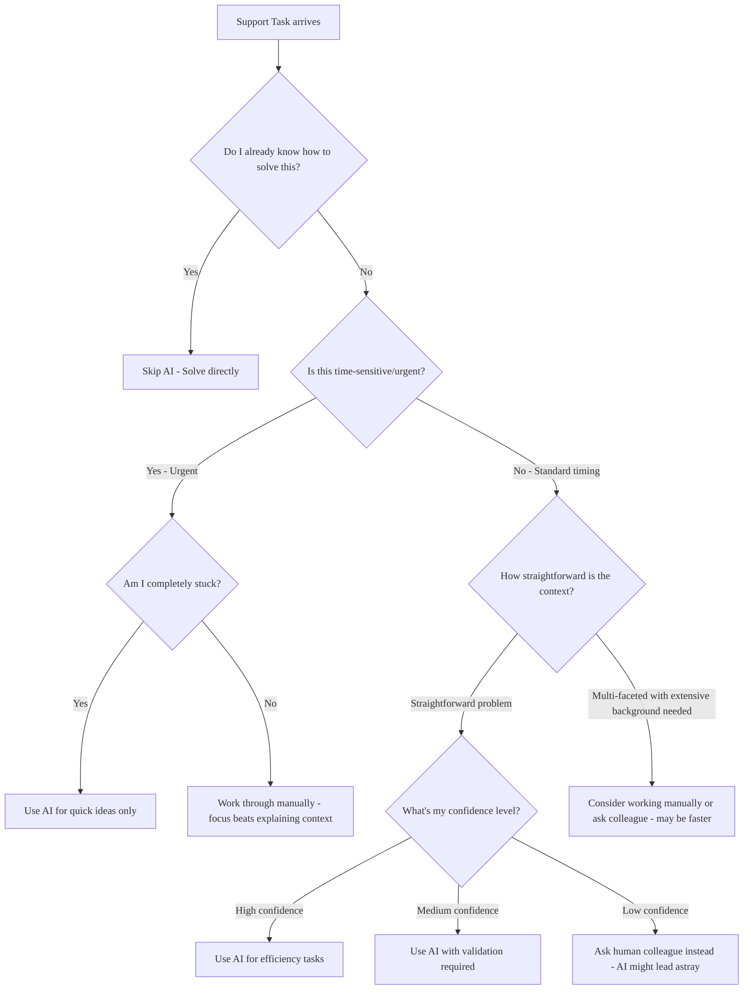

## 概要

GitLab はサポートエンジニアリングの効率を高めるため、複数の AI モデルへのアクセスを提供しています。

AI をいつ使うか、また特定のタスクに適切なツールを選択することが重要です。

## AI を使うタイミング: 意思決定フレームワーク

AI に手を伸ばす前に、自分自身に問いかけてみてください: **「この AI とのやり取りで時間を節約し、品質を向上させることができるのか、それとも単に手順を増やしているだけなのか？」**

### 赤信号: AI が時間を浪費するとき

1. 何か新しいことを学んでいる
   - AI のミスを見抜けるほどそのドメインを理解していない場合、AI を使ってはいけません
   - まず基礎を学び、それから AI で作業を加速させましょう

1. 顧客がいらだっている
   - いらだっている顧客には、本物の人間らしい応答と個別の注意が必要です
   - AI が生成した共感は、しばしば中身のない響きになります
   - 感情面に先に対処してから、技術的な調査のために責任ある形で AI を使うこともできます

1. 「なぜ」を理解する必要がある
   - AI はもっともらしい根本原因の説明を提供できますが、それが正しいとは限りません
   - 根本的な理由を深く理解する必要がある場合、AI の説明を独立して検証してください

1. セキュリティまたはコンプライアンスの問題
   - 機密データやコンプライアンスに関する質問には絶対に AI を使ってはいけません
   - AI のハルシネーションのリスクが高すぎます

1. バージョン固有のガイダンスが必要なとき
   - AI はしばしば、顧客固有の GitLab バージョン、エディション、インストール方法を考慮しない一般的なアドバイスを提供します
   - バージョンの不一致は、誤ったトラブルシューティングの方向につながる可能性があります

### 青信号: AI が役立つ可能性が高いとき

1. 複数のリソースにわたる調査が必要
   - AI は、さまざまなドキュメントから情報を統合するのが得意です
   - 「X が失敗する可能性のあるすべての方法を見つける」ようなタイプの質問に適しています

1. 反復的な分析を行っている
   - 統計分析には専用ツール（[`fast-stats`](https://gitlab.com/gitlab-com/support/toolbox/fast-stats) など）を使い、必要に応じて解釈に AI を使います
   - 設定の比較
   - 過去の類似 Issue の検索
   - 長い会話から重要なポイントを要約する

1. 批評的レビューが欲しい（[ラバーダッキング](https://en.wikipedia.org/wiki/Rubber_duck_debugging)）
   - AI に「私のアプローチに矛盾や問題を見つけて」と依頼します
   - 妥当性確認を求めるよりも、自分の前提を疑うのに適しています

1. 行き詰まってアイデアが必要
   - AI は思いつかなかったトラブルシューティングの道筋を提案できます
   - 壁にぶつかったときのブレインストーミングに役立ちます

1. 複雑な Issue で不足している情報を特定する
   - 「私はどんなコンテキストを見落としているか？」という種類の質問に適しています
   - 開発チームへの[ヘルプ依頼 Issue](../workflows/how-to-get-help.md#how-to-formally-request-help-from-the-gitlab-development-team) を準備するときに役立ちます

1. すでに下書きしたレスポンスを洗練させる
   - AI は、すでに書いたレスポンスの明瞭さ、完全性、トーンを改善するのに役立ちます
   - 顧客に送信する前のコミュニケーションを磨くのに適しています

## 中核原則: AI は補強であり置き換えではない

AI を使って既存の知識やレスポンスの上に構築し、思考を置き換えるのではなく:

- **自分の理解から始める** - 知っていることから始め、それから AI を使ってアプローチを強化または検証します
- **下書きの上に構築する** - 自分の専門知識に基づいて初期レスポンスを書き、それから AI を使って洗練、拡張、改善します
- **専門性を増幅する** - AI に追加の角度を探索したり、見逃したかもしれないことを捕まえたりするのを手伝わせます
- **オーナーシップを保つ** - あなたが専門家であり意思決定者です。AI はリサーチアシスタントであり、執筆の協働者です

このアプローチにより、AI のリサーチ、分析、コミュニケーション強化の強みを活用しながら、問題解決プロセスに関与し続けられます。

### 準備度のセルフアセスメント

これはセルフアセスメントです。技術的トラブルシューティングのスキルがまだ発展途上であったり、顧客とのコミュニケーション方法を学んでいる段階であれば、ワークフローに AI を加える前に、これらの基礎を構築することに集中してください。

アクティブなチケットで AI を使う前に、すでに解決済みの異なる問題タイプのチケット 3〜5 件で AI を使って解決を試みてみてください。これにより、AI が何に長けていて、どこで前進を助けられないかについての洞察が得られます。

AI を使う準備ができているのは:

1. 知識の基盤
   - 誤った技術的アドバイスを簡単に見抜ける
   - AI の提案や技術的詳細（環境変数、設定オプション、ドキュメント URL）を検証する方法を知っている
   - 共有する前にコマンドやコードスニペットをテストして説明できる
   - 取り組んでいる GitLab の機能/システムについて基本的な理解がある

1. 時間管理
   - 手動でのタスクにどれくらい時間がかかるかを見積もれる
   - AI が自分のスピードを上げているか、下げているかに気づける

AI を使う準備ができていないのは:

1. 知識のギャップ
   - AI が提供する技術的説明が妥当かどうか判断できない
   - 権威あるドキュメントをどこで見つけるかわからない
   - アドバイスが顧客固有の GitLab セットアップに当てはまるかどうかを確認する方法を知らない
   - GitLab 機能の基礎を学んでいる段階である

1. 問題のある利用パターン
   - 時間に追われると、適切な検証なしに AI のレスポンスを送りたくなる
   - 手動で問題を解決する方法を知らないため、AI に頼っている
   - 難しい概念を学んだり、基本的なトラブルシューティングスキルを開発したりするのを避けるために AI を使っている
   - 必要な技術的専門知識を構築する代わりに、AI に頼っている

### 「AI が機能している」テスト

AI が役立っているとわかるのは:

- 手動のベースラインよりも速くタスクを終わらせられる
- 後で応用できる新しいことを学べる
- AI の提案が、自分では思いつかなかったアイデアを引き起こす
- AI の間違いを素早く自信を持って捕まえられる

AI が悪影響を及ぼしているとわかるのは:

- 手動で解決するよりもプロンプトに時間がかかっている
- 理解していない AI のアドバイスを盲目的に従っている
- 検証していないか説明できない技術的アドバイスを共有している
- 知っているべきことを学ぶのを避けるために AI を使っている
- 顧客や同僚があなたのレスポンス品質の低下に気づいている
- 同僚が必要な技術的専門知識を構築していないと気づいている

## AI ツールの使い方

> [!important]
> 顧客データを伴う AI ツールを使用する場合、GitLab のデータ分類標準に従い、データの機密性に基づいて適切なツールを選択してください。ツール選択とデータ取り扱い要件のガイドラインについては、[顧客チケットでの責任ある AI 利用](#responsible-ai-use-in-customer-tickets)を参照してください。

### ツール選択

AI を使用するときは、Claude Sonnet 4 のような LLM が必要なのか、GitLab Duo Chat や Glean のような統合ツールが必要なのかにかかわらず、業務に適切な AI ツールとモデルを選択することが極めて重要です。

[AI ツール選択](./ai-tool-selection.md)を参照してください。

### ユースケース

以下のユースケースは、GitLab サポートワークフローにおける AI ツールの実践的な応用例を示しています。各例には使用された具体的なツールとワークフローのコンテキストが含まれており、自身の業務での同様の機会を特定するのに役立ちます。

1. Glean によるチケットの要約

   サポートエンジニアは [Glean](../../eta/css/zendesk/apps/global/#glean) を使って長い顧客チケットを自動的に要約できます。[たとえば、トークン期限切れ通知に関する複雑なチケットが要約され](https://gitlab.com/gitlab-com/support/support-team-meta/-/issues/6302)、次のステップとともに 8 つの重要ポイントにまとめられ、ハンドオフやレビューの時間を大幅に節約しました。

1. ナレッジベース記事の生成

   サポートエンジニアは GitLab Duo を使って Zendesk チケットから KB 記事のドラフトを生成できます:

   - KB テンプレートを Duo に渡す
   - チケットを解析してテンプレートに入力させる
   - 最小限の手作業で時間効率の良い KB 記事を作成する

1. チケットの分析と洞察

   サポートエンジニアは顧客チケット全体をファイルとして GitLab Duo Agentic Chat/GitLab Duo Agentic Flows にアップロードできます:

   - チケットデータを解析し、洞察を提供する
   - 見落としていた可能性のある詳細を発見する
   - 複雑な Issue について「もう一組の目」を得る
   - 類似チケット間のパターンを特定する

1. Slack スレッドの要約

   サポートエンジニアは GitLab Duo Chat や Claude のような AI ツールを使って長い Slack スレッドを要約できます。特に以下に役立ちます:

   - 数百のメッセージがある CEOC 緊急スレッド
   - 30 分の手動読書を数秒に短縮

1. コード分析とトラブルシューティング

   サポートエンジニアは GitLab Duo Chat のコード説明機能を使って:

   - 開発者でない場合でもコードパスを理解する
   - GitLab コードベースで期待される動作を特定する
   - バグをより効率的に発見する
   - 顧客から提供されたコードスニペットを分析する

1. Issue と MR のリサーチ

   サポートエンジニアは GitLab Duo Agentic Chat を使って:

   - 顧客の問題に関連する既存の Issue やマージリクエストを検索する
   - 長い Issue ディスカッションでの回避策を見つける
   - 解決策を特定する具体的なレスポンスを引用する
   - GitLab プロジェクト、Issue、MR、ドキュメントにアクセスする

1. 顧客コミュニケーションの強化

   サポートエンジニアは GitLab Duo Chat や Claude を以下に使えます:

   - 外国語チケットの翻訳
   - 理解しづらい顧客レスポンスの解読
   - 技術的説明の明瞭さの改善
   - よりプロフェッショナルなレスポンスの生成

1. ドキュメント作成

   サポートエンジニアは GitLab Duo Agentic Chat を以下に使えます:

   - ドキュメント更新のドラフト MR の自動生成
   - 手動で仕上げられる「ワイヤーフレーム」ドキュメントの作成
   - 「Document this」Issue に AI 生成ドラフトで反応する
   - ドキュメント貢献と改善の支援

1. ログとデータの処理

   サポートエンジニアは GitLab Duo Chat を以下に使います:

   - 顧客環境からのログ/データの処理と要約
   - 一般的な問題の fast-stats 出力の分析
   - 複雑な診断情報の解析
   - システムログのパターンの特定

1. GitLab Duo Agentic Flows によるワークフロー自動化

   サポートエンジニアは GitLab Duo Agentic Flows を以下に使えます:

   - 複雑な多段階分析タスク
   - GitLab のコードベース、Issue、MR、ドキュメント全体へのアクセス
   - 他の AI ツールよりも精度の高い包括的な回答の取得
   - GitLab の深い知識を必要とするタスクの処理

1. トレーニングとオンボーディング

   サポートエンジニアは GitLab Duo を以下の場面で使えます:

   - サポートエンジニア向けの Duo トレーニングモジュール
   - GitLab 機能とトラブルシューティングの学習
   - 複雑な顧客シナリオの理解
   - AI 支援問題解決の実践

これらの例は、GitLab サポートが基本的なチケット処理から複雑な技術分析まで、AI を日常のワークフローに深く統合し、サポート提供の効率と品質を大幅に向上させていることを示しています。

### プロンプトの例

#### Issue 分析と診断のプロンプト

"I'm working on a GitLab support ticket with the following details:

**Issue Summary:** [Brief description of the customer's problem]
**GitLab Version:** [Customer's GitLab version]
**Environment:** [Self-managed/SaaS, OS, Omnibus/Charts etc.]
**Error Messages/Logs:**
[Paste relevant error messages or log excerpts here]

**Steps to Reproduce:**
[List the steps the customer provided]

Please help me:

1. Analyze the error messages/logs to identify the root cause
1. Suggest potential solutions or troubleshooting steps
1. Identify if this might be related to known issues or recent changes
1. Recommend what additional information I should request from the customer if needed

Focus on GitLab-specific issues and provide actionable next steps."

#### 解決策のリサーチとドキュメンテーションのプロンプト

"I need to find GitLab documentation and resources for this support case:

**Problem:** [Describe the specific GitLab feature or issue]
**Customer's Use Case:** [What they're trying to accomplish]
**Environment:** [Self-managed/SaaS, OS, Omnibus/Charts etc.]
**Relevant Features:** [CI/CD, Runner, Security, etc.]

Please help me:

1. Find the most relevant official GitLab documentation links
1. Identify any known workarounds or best practices
1. Check for recent feature changes or deprecations that might be relevant
1. Suggest troubleshooting steps specific to this scenario
1. Point out any configuration requirements or prerequisites

Prioritize official GitLab documentation and proven solutions from the GitLab community."

#### 顧客レスポンスとコミュニケーションのプロンプト

"Help me draft a professional response for this GitLab support ticket:

**Customer's Issue:** [Summary of their problem]
**Root Cause:** [What I've determined is causing the issue]
**Solution/Next Steps:** [The fix or troubleshooting steps]

Please help me create a response that:

1. Acknowledges their issue clearly and empathetically
1. Explains the root cause in customer-friendly terms
1. Provides clear, step-by-step resolution instructions
1. Includes relevant documentation links
1. Sets appropriate expectations for timeline/follow-up
1. Maintains GitLab's professional and helpful tone

Make it technical enough to be useful but accessible to users with varying technical backgrounds."

## 顧客チケットでの責任ある AI 利用 {#responsible-ai-use-in-customer-tickets}

- 「[チケットへの返信で AI からの出力を使用できますか](../workflows/working-on-tickets.md#can-i-use-output-from-an-llm-in-ticket-replies)」を参照してください。
