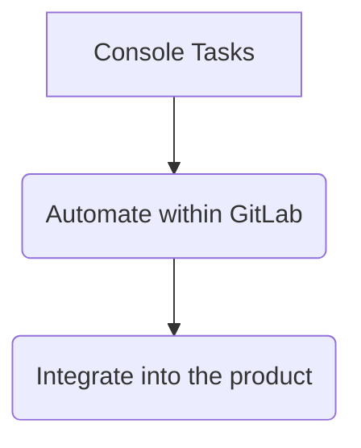
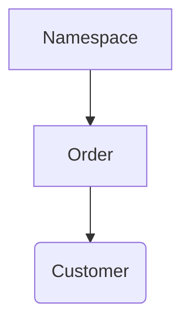

## 概要

このワークフローは、[Customers Console and Functions プロジェクト](https://gitlab.com/gitlab-com/support/toolbox/console-training-wheels) によって事前ロードされている、頻繁に使用される関数を扱います。

社内リクエストでカスタマーコンソールを使うのは、既存ツールでは対応できない特殊なケースに限られます。

コンソールアクセスは [Teleport](https://goteleport.com/docs/connect-your-client/introduction/) を介して行われ、関連する Okta グループへの所属が必要です（[CustomersDot プロジェクトのドキュメント](https://gitlab.com/gitlab-org/customers-gitlab-com/-/blob/main/doc/setup/teleport.md#group-membership)に記載）。所属を取得するには [アクセスリクエスト](/handbook/security/corporate/end-user-services/access-requests/#individual-or-bulk-access-request) を提出できます。

Teleport をインストールして本番／ステージングの rails コンソールにアクセスする方法の全体像については、[CustomersDot の Teleport に関するドキュメントページ](https://gitlab.com/gitlab-org/customers-gitlab-com/-/blob/main/doc/setup/teleport.md#using-teleport-for-db-rails-access) を参照してください。

### 本番

*本番* に対するすべてのリクエストには承認が必要です。Slack の [#teleport-requests](https://gitlab.enterprise.slack.com/archives/C06Q2JK3YPM) で自分のリクエストを確認できます。

承認:

- 読み取り専用アクセスは、エンジニアリング部門のピープルマネージャーが承認できます。
- Rake リクエストは、Monetization グループ（Fulfillment および Growth）のピープルマネージャーが承認できます。
- 書き込みアクセスは、[変更管理プロセス](/handbook/engineering/infrastructure-platforms/change-management/) に従って変更リクエストを起票する必要があります。

**注意** 本番システムは、ログイン時に自動的にサポートコンソールラッパースクリプトを実行します

1. Teleport で `tsh login` を使ってリクエストを開始します。
   - 承認が下りるまでコマンドシェルがハングしますが、ターミナルを閉じるかプロセスを kill してから `--request-id` オプションで再開することもできます:
     - *例:* `tsh login --request-id=xxx ...`
   - ID はシェルに表示され、`#teleport-requests` または Teleport-app からの Slack DM でも確認できます
1. リクエストが承認されたら、`tsh ssh` を使って Teleport でシステムに SSH 接続します
1. リクエストは通常 8〜12 時間承認状態が維持されます。`--request-id` を使ってそのセッションをいつでも再開できます

### ステージング

- ステージングには承認は不要で、即座にアクセスが許可されます
- アクセス方法は本番と同じですが、`tsh login` がすぐに承認されるため、`tsh ssh` に進めます
- ログイン時にラッパースクリプトは *実行されません*

## スコープ

コンソールは、利用可能なツールでは完了できないタスクのために使用します。

コンソールは `transition` 段階として捉える必要があります:



ある関数を使うほど、なぜそのプロセスを自動化していないのか、または製品にその欠落機能を統合していないのかを自問する必要があります。

## 検索方法

### view_namespace

> **注意**: この機能はほぼ UI の名前空間検索でカバーされています。

注文と注文に紐付いた顧客アカウントを含む、名前空間の統合ビューを提供します。

名前空間情報とリンク済みの注文／顧客プロフィールを参照する関数。
この関数は、指定された名前空間にリンクされた注文を見つけ、その注文にリンクされた顧客プロフィールを取得します:



#### パラメーター

| 名前 | 必須 | 詳細 |
| ------ | ------ | ------ |
| `:namespace` | *Yes* | 情報を取得する名前空間 |

#### サンプル

```ruby
irb(main):002:0> view_namespace('example')

[+]Namespace information
id                                7744884
name                              example
path                              example
members_count_with_descendants    15
shared_runners_minutes_limit      50000
billable_members_count            14
plan                              gold
trial_ends_on                     2020-06-22
trial                             true

[+] There are 1 orders for this namespace
 id                                00000
 customer_id                       111111
 subscription_id
 subscription_name
 start_date                        2020-04-22
 end_date                          2020-06-22
 gl_namespace_id                   2222222
 gl_namespace_name                 example

[+] Customer linked to orders
 https://customers.gitlab.com/admin/customer/111111
 id                                111111
 company                           example Ltd
 first_name                        Jane
 last_name                         Doe
 email                             jdoe@examplecorp.net
 uid                               666666
 zuora_account_id
```

### 手動検索

> *注意*: 顧客名、メール、会社、グループ名、サブスクリプション名による検索は UI から利用できます。

必要に応じて、既存の任意の注文属性で注文を検索できます。1 件しかないと考えられる場合は `find_by` を、複数該当する可能性がある場合は `where` を使います。

#### find_by の例

```ruby
irb(main):003:0> Order.find_by_gl_namespace_name "example"
#<Order:0x0000000000000
 id: 0000,
 customer_id: 00000,
 product_rate_plan_id: "2c92a00d76f0d5060176f2fb0a5029ff",
 subscription_id: nil,
 subscription_name: nil,
 start_date: Fri, 31 Aug 2019,
 end_date: Mon, 31 Aug 2020,
 quantity: 1,
 created_at: Mon, 20 May 2019 08:59:04 UTC +00:00,
 updated_at: Mon, 27 Jul 2020 14:16:12 UTC +00:00,
 gl_namespace_id: "0000000",
 gl_namespace_name: "example",
 amendment_type: nil,
 trial: true,
 last_extra_ci_minutes_sync_at: nil,
 zuora_account_id: nil,
 increased_billing_rate_notified_at: nil,
 reconciliation_accepted: false,
 billing_rate_adjusted_at: nil,
 billing_rate_last_action: nil>
```

#### where の例

```ruby
irb(main):005:0> pp Order.where(customer_id: 000000)
[#<Order:0x000000000bfd8990
  id: 00000,
  customer_id: 000000,
  product_rate_plan_id: "2c92a0ff76f0d5250176f2f8c86f305a",
  subscription_id: nil,
  subscription_name: nil,
  start_date: Tue, 12 Jun 2020,
  end_date: Mon, 12 Jun 2021,
  quantity: 1,
  created_at: Tue, 16 Jun 2020 14:37:24 UTC +00:00,
  updated_at: Wed, 19 Aug 2020 23:56:49 UTC +00:00,
  gl_namespace_id: "000000",
  gl_namespace_name: "example",
  amendment_type: nil,
  trial: true,
  last_extra_ci_minutes_sync_at: nil,
  zuora_account_id: nil,
  increased_billing_rate_notified_at: nil,
  reconciliation_accepted: false,
  billing_rate_adjusted_at: nil,
  billing_rate_last_action: nil>]
```

### 注文履歴

> **注意**: UI でこれを参照する方法が [customer #3081](https://gitlab.com/gitlab-org/customers-gitlab-com/-/issues/3081) でリクエストされています。

`versions` を使って注文の変更履歴を確認できます。

#### 例

```ruby
irb(main):005:0> pp Order.find(943369).versions
[#<PaperTrail::Version:0x00000000023248d8
  id: 943369,
  item_type: "Order",
  item_id: 159764,
  event: "create",
  whodunnit: nil,
  object: nil,
  created_at: Wed, 07 Apr 2021 00:19:21.297520000 UTC +00:00,
  transaction_id: 943369,
  object_changes:
   "---\n" +
   "id:\n" +
   "- \n" +
   "- 159764\n" +
   "customer_id:\n" +
   "- \n" +
   "- 34580\n" +
   "product_rate_plan_id:\n" +
   "- \n" +
   "- 2c92a0ff76f0d5250176f2f8c86f305a\n" +
   "start_date:\n" +
   "- \n" +
   "- 2021-04-07\n" +
   "end_date:\n" +
   "- \n" +
   "- 2021-05-07\n" +
   "quantity:\n" +
   "- \n" +
   "- 1\n" +
   "created_at:\n" +
   "- \n" +
   "- !ruby/object:ActiveSupport::TimeWithZone\n" +
   "  utc: &1 2021-04-07 00:19:21.297520292 Z\n" +
   "  zone: &2 !ruby/object:ActiveSupport::TimeZone\n" +
   "    name: Etc/UTC\n" +
   "  time: 2021-04-07 00:19:21.297520292 Z\n" +
   "updated_at:\n" +
   "- \n" +
   "- !ruby/object:ActiveSupport::TimeWithZone\n" +
   "  utc: *1\n" +
   "  zone: *2\n" +
   "  time: 2021-04-07 00:19:21.297520292 Z\n" +
   "gl_namespace_id:\n" +
   "- \n" +
   "- '8981798'\n" +
   "gl_namespace_name:\n" +
   "- \n" +
   "- to keep\n" +
   "trial:\n" +
   "- false\n" +
   "- true\n">]
```

### find_namespace

> **注意**: グループ名でアカウントを検索する機能は UI で利用できます。ただし、トライアルのアカウントは [customers #978](https://gitlab.com/gitlab-org/customers-gitlab-com/-/issues/973) のため通常表示されません。

指定された GitLab.com 名前空間を検索します。

#### パラメーター

| 名前 | 必須 | 詳細 |
| ------ | ------ | ------ |
| `:namespace` | *Yes* | 検索する名前空間。完全一致でも部分一致でもよい|

#### サンプル

```ruby
irb(main):421:0> find_namespace('test')
[!] Possible matches:
 [+] Name Test Example         | Full Path test
 [+] Name Other Example        | Full Path test1
 [+] Name My Test              | Full Path test2
=> " "
```

## プラン関連メソッド

### update_gitlab_plan {#update_gitlab_plan}

> *注意*: これは UI で利用可能になれば非推奨にできますが、それには [期限切れトライアルの表示（customers #1173）](https://gitlab.com/gitlab-org/customers-gitlab-com/-/issues/1173)、[延長機能（customers #1643）](https://gitlab.com/gitlab-org/customers-gitlab-com/-/issues/1643)、そして [トライアル開始後に GitLab グループを表示するための GitLab アカウントとカスタマーポータルの紐付け（customers #973）](https://gitlab.com/gitlab-org/customers-gitlab-com/-/issues/973) が必要です。

この関数のユースケース:

1. アクティブなトライアルの延長、または期限切れトライアルの再アクティベート。
1. Free へのダウングレード。
1. トライアルが存在しない場合に作成してサブスクリプションを「延長」。古いトライアルが存在する場合はそれを再利用します。

この関数は、分単位のクォータを有料プラン相当に変更し、共有 Runner のクレジットカード要件を回避するために追加分を加算します。

| 名前 | 必須 | 詳細 |
| ------ | ------ | ------ |
| `:namespace` | *Yes* | パスを使って更新する名前空間 |
| `:plan` | *Yes* | 名前空間に割り当てるプラン（free, silver, gold） |
| `:expire` | *No* | 任意のパラメーター。指定されると既存サブスクリプションがこの日付まで延長されます |
| `:subscription` | *No* | サブスクリプションを延長する場合は必須。トライアルでは不要です。 |

#### サンプル

```ruby
irb(main):001:0> update_gitlab_plan('example','silver','2020-10-22','A-S00000000')
{"plan"=>
  {"code"=>"silver",
   "name"=>"Silver",
   "trial"=>false,
   "auto_renew"=>nil,
   "upgradable"=>false},
 "usage"=>
  {"seats_in_subscription"=>0,
   "seats_in_use"=>1,
   "max_seats_used"=>1,
   "seats_owed"=>0},
 "billing"=>
  {"subscription_start_date"=>"2020-08-21",
   "subscription_end_date"=>"2020-10-22",
   "trial_ends_on"=>nil}}
{"id"=>0000000,
 "name"=>"Example",
 "path"=>"example",
 "kind"=>"group",
 "full_path"=>"example",
 "parent_id"=>nil,
 "avatar_url"=>nil,
 "web_url"=>"https://gitlab.com/groups/example",
 "members_count_with_descendants"=>1,
 "shared_runners_minutes_limit"=>2000,
 "extra_shared_runners_minutes_limit"=>nil,
 "additional_purchased_storage_size"=>0,
 "additional_purchased_storage_ends_on"=>nil,
 "billable_members_count"=>1,
 "plan"=>"silver",
 "trial_ends_on"=>nil,
 "trial"=>false}
```

### force_attr

注文にサブスクリプション番号は付いているものの、多くの値（特に商品プラン）が nil の場合、この関数を使うとシステムが Zuora で値を検索してコピーします。

#### パラメーター

| 名前 | 必須 | 詳細 |
| ------ | ------ | ------ |
| `:subscription_name` | *Yes* | 更新対象の注文のサブスクリプション名 |

#### サンプル

```ruby
irb(main):021:0> force_attr("A-S00000000")
=> {:success=>true}
```

### force_reassociation

> *注意*: UI で同じ操作を行えるようにする要望は [customers #2165](https://gitlab.com/gitlab-org/customers-gitlab-com/-/issues/2165) です。

.com グループを指定したサブスクリプションに強制的に関連付けます。これは通常、追加シートを課金せずにグループを関連付けるために使用します。

#### パラメーター

| 名前 | 必須 | 詳細 |
| ------ | ------ | ------ |
| `:subscription_name` | *Yes* | 再関連付けするサブスクリプション名|
| `:namespace_path` | *Yes* | [一意な GitLab 名前空間](https://docs.gitlab.com/user/group/#namespaces) の *`path`*|

#### サンプル

```ruby
irb(main):021:0> force_reassociation("A-S00000000", "example")
=> {:success=>true}
```

### unlink_sub

この関数は、注文のグループ ID と名前を `nil` に設定し、グループを Free にダウングレードします。
これは通常、別のサブスクリプションの関連付けに問題があるが、既存サブスクリプションがユーザーに表示されるべき場合に行います。

#### パラメーター

| 名前 | 必須 | 詳細 |
| ------ | ------ | ------ |
| `:subscription_name` | *Yes* | 更新対象の注文のサブスクリプション名 |

#### サンプル

```ruby
irb(main):021:0> unlink_sub("A-S00000000")
=> {:success=>true}
```

### unlink_customer

> *注意*: UI で同じ操作を行えるようにする要望は [customers #2166](https://gitlab.com/gitlab-org/customers-gitlab-com/-/issues/2166) です。

GitLab.com アカウントを CustomersDot アカウントから完全にリンク解除します。**注意:** customer ID（GitLab.com ではなく customers portal のもの）を使ってください。

**警告**: リンク解除すると .com グループは表示されなくなります。これは通常、管理者が誤って自分のアカウントを customers にリンクしてしまった場合のみ使用します。

#### パラメーター

| 名前 | 必須 | 詳細 |
| ------ | ------ | ------ |
| `:customer_id` | *Yes* |GitLab アカウントからリンク解除する Customer ID。|

#### サンプル

```ruby
irb(main):021:0> unlink_customer(0000000)
=> {:success=>true}
```

### GitLab アカウントにリンクされた複数の CustomersDot アカウントを特定する

#### パラメーター

| 名前 | 必須 | 詳細 |
| ------ | ------ | ------ |
| `:uid` | *Yes* |複数の cdot アカウントとリンクされている可能性のある GitLab.com UID |

#### サンプル

````ruby
*** PRODUCTION *** production> Customer.where(uid: 0000000)
=> [#<Customer 000000, first_name: "Jane", last_name: "Doe", created_at: "2021-12-21 16:29:53.324183000 +0000", updated_at: "2023-01-17 00:56:56.311661000 +0000", email: "jdoe@examplecorp.net", provider: "gitlab", uid: "0000000", country: "USA", state: "GA", city: "Columbus", zip_code: "12345", vat_code: nil, company: "ExampleCorp", salesforce_account_id: "000001230043203, skip_email_confirmation: false>,
#<Customer 100009, first_name: "Bob", last_name: "Doe", created_at: "2022-11-12", email: "bdoe@examplecorp.net", provider: "gitlab", uid: "0001235", country: "USA", state: "GA", city: "Columbus", zip_code: "12345", vat_code: nil, company: "ExampleCorp", salesforce_account_id: "00000123006988343, skip_email_confirmation: false>]
``````

`unlink_customer` を使って、同一 uid にリンクされていると識別された追加の customers portal アカウントを削除できます。

### associate_full_user_count_with_group

> *注意*: 機能要望は [customers #2167](https://gitlab.com/gitlab-org/customers-gitlab-com/-/issues/2167) です。

サブスクリプションに複数の商品が記載されている場合、数量（シート数）は商品プラン行のみから取得されます。アドオンのシートは自動的に追加されません。この関数はサブスクリプションに記載のすべての商品のシート数を合計して .com にコピーします。

#### パラメーター

この関数にはサブスクリプション名が必要です。

| 名前 | 必須 | 詳細 |
| ------ | ------ | ------ |
| `:subscription_name` | *Yes* | Zuora に表示されるサブスクリプション名（例: `A-S12345678`） |

#### サンプル

```ruby
irb(main):021:0> associate_full_user_count_with_group("A-S12345678")
=> {:success=>true}
```

### enable_ci_minutes

この関数は、CI/CD を使うためにクレジットカード登録を強制されないように、**営業支援トライアルに限り** CC 検証を解除します。追加の分数を加算することで実現します。

#### パラメーター

この関数には namespace オブジェクトが必要です

| 名前 | 必須 | 詳細 |
| ------ | ------ | ------ |
| `:namespace` | *Yes* | 更新する名前空間 |

#### サンプル

```ruby
irb(main):003:0> enable_ci_minutes("mmoraphotocr")


=> "{\"status\":\"success\",\"message\":\"namespace members are now enabled to run CI minutes\"}"
irb(main):004:0>
```

### create_order_from_zuora

ごくまれに、Zuora のサブスクリプションに対する Order オブジェクトが customersDot に存在しないことがあります。この関数は Zuora で見つけたサブスクリプションデータから有効な Order を作成します。作成された Order は名前空間にリンクできます。

この関数のユースケース:

1. [エンティティ変更](https://gitlab.com/gitlab-com/Finance-Division/finance/-/wikis/Process-for-change-of-entity)
1. システムバグ

#### パラメーター

| 名前 | 必須 | 詳細 |
| ------ | ------ | ------ |
| `:customer_id` | *Yes* | 請求アカウントにリンクされた customersDot アカウントの ID 番号。すなわち、サブスクリプションがその cDot アカウントに表示されている必要があります |
| `:subscription_name` | *Yes* | Zuora に表示されるサブスクリプション名（例: `A-S12345678`） |

#### サンプル

```ruby
irb(main):003:0> create_order_from_zuora(123456,'A-S12345678')

=> "{\"status\":\"success\",\"message\":{\"success\":true,\"order\" ....."
```

## GitLab.com グループ関連メソッド

これらの関数は、GitLab.com で表面化したさまざまなバグの修正に役立ちます。これらの関数は CustomersDot 内の値を *変更しません*。

### Reset max seats

ときどき、更新時に正しい数を保つためにグループの max seats の値を変更する必要があります。

#### パラメーター

名前空間だけを指定するとシート情報を表示します。max seats を入力すると値を変更します。

| 名前 | 必須 | 詳細 |
|------|----------|---------|
| :namespace      | *Yes* | 更新する名前空間 |
| :max_seats_used | *Yes*  | 使用する最大シート数 |

#### サンプル

```ruby
irb(main):089:0> account_seats("gitlab-silver",0)
{"plan"=>
  {"code"=>"silver",
   "name"=>"Silver",
   "trial"=>false,
   "auto_renew"=>nil,
   "upgradable"=>false},
 "usage"=>
  {"seats_in_subscription"=>8,
   "seats_in_use"=>10,
   "max_seats_used"=>10,
   "seats_owed"=>2},
 "billing"=>
  {"subscription_start_date"=>"2020-01-01",
   "subscription_end_date"=>"2021-01-01",
   "trial_ends_on"=>nil}}

[+] Resetting max_seats_used ...
{"plan"=>
  {"code"=>"silver",
   "name"=>"Silver",
   "trial"=>false,
   "auto_renew"=>nil,
   "upgradable"=>false},
 "usage"=>
  {"seats_in_subscription"=>8,
   "seats_in_use"=>10,
   "max_seats_used"=>0,
   "seats_owed"=>2},
 "billing"=>
  {"subscription_start_date"=>"2020-01-01",
   "subscription_end_date"=>"2021-01-01",
   "trial_ends_on"=>nil}}
***** seats_owed will be automatically recalculated at 12:00 UTC *****
```

### update_group_mins {#update_group_mins}

> *注意*: GitLab.com 管理者から実行可能です。

グループの共有 Runner 分数の月次クォータを更新します。

#### パラメーター

| 名前 | 必須 | 詳細 |
| ------ | ------ | ------ |
| `:id` | *Yes* | 更新する名前空間 ID |
| `:mins` | *Yes* | 更新する compute 分数 |

#### サンプル

```ruby
irb(main):180:0>  update_group_mins(1234,50000)
=> {:success=>true}
```

### update_extra_minutes

> *注意*: 追加分は chatops でも変更できます。UI で編集できるようにする機能要望は [gitlab#325917](https://gitlab.com/gitlab-org/gitlab/-/issues/325917) にあります。

グループの Runner 追加分数を更新します。

> **警告:** この関数で追加した分数は、使い切るまで **無期限** に残ります。「extra minutes」をトライアル期間中だけ提供したい場合は、月次の使用クォータを変更する [update_group_mins 関数](#update_group_mins)、または有料プランに合わせて使用クォータを設定する [update_gitlab_plan 関数](#update_gitlab_plan) を使ってください。

#### パラメーター

| 名前 | 必須 | 詳細 |
| ------ | ------ | ------ |
| `:namespace` | *Yes* | 更新する名前空間 |
| `:mins` | *Yes* | 更新する compute 分数 |

#### サンプル

```ruby
irb(main):180:0>  update_group_mins("gitlab-gold",50000)
=> {:success=>true}
```

### update_extra_storage

> *注意*: 追加ストレージは API でも変更できます。UI で編集できるようにする機能要望は [gitlab#325918](https://gitlab.com/gitlab-org/gitlab/-/issues/325918) にあります。

グループの追加ストレージを更新します。

#### パラメーター

| 名前 | 必須 | 詳細 |
| ------ | ------ | ------ |
| `:namespace` | *Yes* | 更新する名前空間 |
| `:extra_storage` | *Yes* | 追加ストレージ容量（MiB） |

#### サンプル

```ruby
irb(main):180:0>  update_extra_storage("gitlab-gold",5000)
{"id"=>12345678,
 "name"=>"GitLab.com - Gold",
 "path"=>"gitlab-gold",
 "kind"=>"group",
 "full_path"=>"gitlab-gold",
 "parent_id"=>nil,
 "avatar_url"=>"/uploads/-/system/group/avatar/123456/gitlab-icon-rgb.png",
 "web_url"=>"https://gitlab.com/groups/gitlab-gold",
 "members_count_with_descendants"=>105,
 "shared_runners_minutes_limit"=>50000,
 "extra_shared_runners_minutes_limit"=>nil,
 "additional_purchased_storage_size"=>5000,
 "additional_purchased_storage_ends_on"=>"2022-03-02",
 "billable_members_count"=>105,
 "seats_in_use"=>105,
 "max_seats_used"=>103,
 "plan"=>"gold",
 "trial_ends_on"=>nil,
 "trial"=>false}
=> nil
```

### container_registry_storage_usage

> 注意: 大規模なグループの場合、数時間かかることがあります。確信が持てない場合は、実行前に支援を求めてください。

指定したグループ内の各プロジェクトについて、コンテナレジストリのストレージ使用量を計算します。出力は GB 単位の合計と、プロジェクトごとの内訳になります。

#### パラメーター

| 名前 | 必須 | 詳細 |
| ------ | ------ | ------ |
| `:group` | *Yes* | クエリするグループ |

#### サンプル

```ruby
irb(main):749:0>  container_registry_storage_usage('some-group') ; nil
[*] Total Storage Used [ 0.799 GB ]

{"my-project-bash"=>
  {"project_id"=>00000000,
   "project_path"=>"example/for-output/my-project-bash",
   "container_registry_storage_used"=>"0.764 GB"},
 "my-other-project"=>
  {"project_id"=>00010000,
   "project_path"=>"example/for-output/my-other-project",
   "container_registry_storage_used"=>"0.025 GB"}}
=>

```

## FAQ

1. 関数を追加するにはどうすればよいですか？

- [Mechanizer and Hacks のメンテナンスモード移行の決定](https://gitlab.com/gitlab-com/support/support-team-meta/-/issues/4299) により、mechanizer にはこれ以上関数を追加しません

1. `support_team.rb` にないコードを使ってもよいですか？

- `support_team.rb` の関数や関数の一部は必要に応じてコンソール内で実行できます。それ以外のコードは、Issue のデバッグや回避策のために Fulfillment 開発チームから指示があった場合のみ実行すべきです。

### 属性を手動で変更することについて

ライブデータの編集はできるだけ避けるべきです。たとえ小さな変更でも、後から問題を引き起こし、変更の元の理由よりも顧客への影響が大きくなる可能性があります。
基本的なガイダンスは `support_team.rb` の関数だけを使うことです。それで対応できないものがあれば、機能要望を起票して優先度付けすべきです。
機能要望の中で、公式な機能改修が完了するまで対応できるよう、開発チームに一時的な回避策を求めることもできます。
