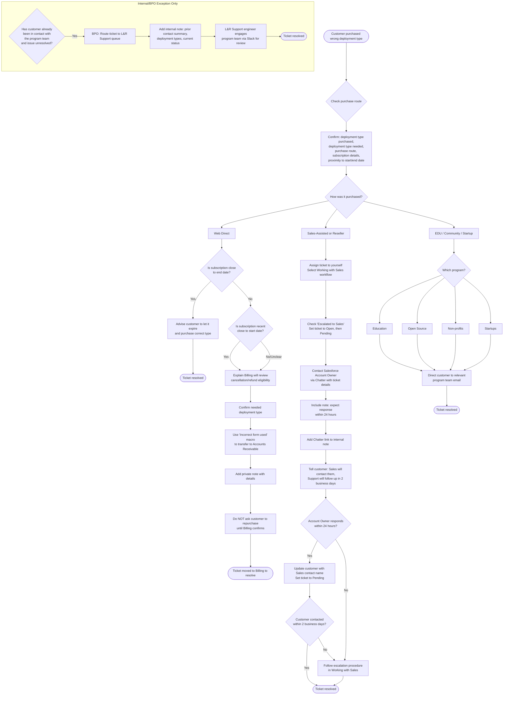

## 概要 {#overview}

このガイドでは、顧客が誤ったデプロイタイプを購入したリクエストの転送方法を説明します。具体的には、Self-Managed の代わりに GitLab.com SaaS を購入した場合、または GitLab.com SaaS の代わりに Self-Managed を購入した場合です。

**要点：Support は SaaS と Self-Managed の間でサブスクリプションを直接移行しません。顧客がサブスクリプションを購入した方法に応じてリクエストを転送してください。**

## 購入経路を確認する {#check-the-purchase-route}

Web 直接購入とセールス支援による購入を見分けるためのガイダンスについては、[クラウドライセンスと Support 免除プロセスの説明](self-managed/cloud-licensing.md)および [Working with Sales](working_with_sales.md)を参照してください。判断材料がない場合や矛盾する場合は、推測せず、そこで説明されているエスカレーションガイダンスを使用します。顧客に購入方法を確認することもできます。

Salesforce を確認するときは、**Initial Source** フィールドだけでは購入経路を確実に判断できないことに注意してください。セールス支援による更新や追加購入でも、Initial Source に「Web Direct」と表示される場合があります。[クラウドライセンス FAQ](self-managed/cloud-licensing.md#4-how-do-i-tell-if-a-purchase-was-web-direct)で説明されているように、Quote のステータス（`Sent to Z-Billing` はセールス支援を示します）と、Zuora の請求書にある `Created By` フィールドを確認してください。

**リセラー経由の購入は、セールス支援の経路に従います。** 顧客がリセラー経由で購入した場合は、Billing ではなく Account Owner と Sales にリクエストを転送します。

チケットを転送する前に、次を確認します。

1. 購入したデプロイタイプ。
1. 顧客が必要とするデプロイタイプ。
1. Web 直接購入、セールス支援、Community Program のいずれを通じた購入か。
1. サブスクリプション番号、顧客アカウント、ネームスペースまたはインスタンスの詳細、購入日。
1. サブスクリプションの開始日または終了日までの近さ（転送先に影響します）。

## Web 直接購入 {#web-direct-purchase}

Web 直接購入であることが確認できた場合、転送先はサブスクリプションの開始日または終了日までの近さによって決まります。

### 終了日が近いサブスクリプション {#subscription-close-to-end-date}

現在のサブスクリプションの終了日が近い場合は、そのまま期限を迎え、正しいデプロイタイプで新しいサブスクリプションを購入するよう顧客に案内します。これにより、解約や返金の処理が不要になります。

### 最近の購入または契約期間途中のサブスクリプション {#recent-purchase-or-mid-term-subscription}

購入したばかり（開始日に近い）の場合は、解約および返金のレビューを受けるため、リクエストを Billing／Accounts Receivable に転送します。

返金が適切かどうかは Billing が判断します。返金が承認されると約束しないでください。年間サブスクリプションは通常、顧客都合による解約や返金の対象になりません。また、返金リクエストでは通常、一部返金ではなく、サブスクリプション全体を解約して返金することになります。

1. 解約と返金が可能かどうか Billing がレビューすることを顧客に説明します。
1. 顧客が必要とするデプロイタイプを確認します。
1. `General::Forms::Incorrect form used` マクロを使用し、Support Readiness を通じて Accounts Receivable への転送をリクエストします。
1. 誤ったデプロイタイプ、リクエストされたデプロイタイプ、サブスクリプションの詳細、返金リクエストの理由を非公開メモに追加します。
1. Billing から別の案内がない限り、解約／返金の手順を Billing が確認するまで、代わりのサブスクリプションを購入するよう顧客に依頼しないでください。

サブスクリプションが契約期間途中で、開始日にも終了日にも近くない場合も、レビューのため Billing に転送します。Billing が適切な手順を判断します。これには、見積もりに基づく移行のために Sales が関与する場合があります。

## セールス支援またはリセラー経由の購入 {#sales-assisted-or-reseller-purchase}

セールス支援またはリセラー経由で購入した場合は、リクエストを Account Owner と Sales／Deal Desk に戻します。Support は商談やサブスクリプションを直接修正しないでください。

Support チケットを進めるには、次の手順に従います。

1. チケットを自分に割り当て、[Working with Sales](working_with_sales.md)ワークフローを選択します。
1. **Escalated to sales** にチェックを入れ、チケットを `Open`、次に `Pending` に設定します。（内部メモのみを作成した場合、Zendesk のトリガーによって `Open` に戻ることがあります。もう一度 `Pending` として保存すれば機能します。）
1. チケットのリンク、誤ったデプロイタイプとリクエストされたデプロイタイプ、シート数、関連するサブスクリプションまたは商談の詳細を添えて、Chatter を通じて Salesforce Account Owner に連絡します。
1. 週末、Family and Friends Day、世界共通の祝日を除き、顧客に連絡する時期または連絡するかどうかについて、24 時間以内の回答を期待していることを Chatter メッセージに含めます。
1. Zendesk チケットの内部メモに Chatter のリンクを追加します。
1. 誰が顧客に連絡するかを伝え、Sales から連絡がなかった場合は Support が 2 営業日後にフォローアップすると説明します。

Sales の担当者が顧客に連絡すると確認した場合は、次の手順に従います。

1. 連絡する担当者の名前を記載して、チケットに最新情報を投稿します。
1. 顧客が連絡を受けたかどうかを確認するため、Support が 2 営業日後にフォローアップし、必要に応じてエスカレーションすることを伝えます。
1. チケットのステータスを `Pending` に設定します。

Account Owner が 24 時間以内に応答しない場合、または顧客が 2 営業日以内に連絡を受けていない場合は、[Working with Sales](working_with_sales.md)のエスカレーション手順に従います。

## EDU および Community Program 経由の購入 {#edu-and-community-program-purchase}

Community Program のサブスクリプションには、個別のプログラムワークフローが必要です。サブスクリプションタイプを変更するために、これらのリクエストを Accounts Receivable、Sales、Support に転送しないでください。

プログラムへの申請時と同じメールアドレスから、該当するプログラムのメールアドレスへ連絡するよう顧客に案内します。

- Education：[education@gitlab.com](mailto:education@gitlab.com)
- Open Source：[opensource@gitlab.com](mailto:opensource@gitlab.com)
- Non-profits：[nonprofits@gitlab.com](mailto:nonprofits@gitlab.com)
- Startups：[startups@gitlab.com](mailto:startups@gitlab.com)

### 社内／BPO の例外：顧客がすでにプログラムチームに連絡している場合 {#internalbpo-exception-customer-already-contacted-program-team}

このセクションは、顧客がすでにプログラムチームに連絡しており、問題が未解決のままである場合に、BPO または L&R Support が社内で転送するときにのみ適用されます。顧客にこの手順を案内しないでください。これは社内のチケット対応専用です。

顧客がすでにプログラムチームに連絡しており、問題が未解決のままである場合は、チケットをプログラムチームへ直接戻さないでください。代わりに、次の手順に従います。

1. （BPO チームの場合）チケットを L&R Support キューに転送します。
1. 顧客が以前プログラムチームに連絡した内容、関係するデプロイタイプ、現在の状況をまとめた内部メモを追加します。
1. チケットを担当する L&R Support Engineer は、レビューと次のステップの調整のため、Slack を通じて該当するプログラムチームと連携します。

- Education & Open Source：[#ask-community-programs](https://gitlab.enterprise.slack.com/archives/CB21NTDJQ)
- Non-profits：[#gitlab-for-nonprofits](https://gitlab.enterprise.slack.com/archives/C08JCGNCAG2)
- Startups：[#startup-program](https://gitlab.enterprise.slack.com/archives/C04SS1ERWP9)

GitLab Support チームは、Community Program のサブスクリプション変更を処理できません。[Community Program のサブスクリプションを変更する](https://support.gitlab.com/hc/en-us/articles/22725476432028-Making-changes-to-Community-programs-EDU-OSS-Non-profits-or-Startups-subscriptions)を参照してください。

## チケットを進める方法 {#how-to-move-the-ticket-forward}

転送先を選ぶ前に、[Cloud licensing の購入元チェック](self-managed/cloud-licensing.md#4-how-do-i-tell-if-a-purchase-was-web-direct)と [CustomersDot のアカウント関連付けワークフロー](customersdot/associating_purchases.md)を使用します。最初に Salesforce で Opportunity／Quote の判断材料を確認してから、CustomersDot と Zuora を使用してサブスクリプションと請求先アカウントを確認します。購入元が不明な場合は、チケットを転送する前に Licensing & Renewals Support チャンネルで質問します。

社内で引き継ぐ際は、次の情報を含めます。

- Zendesk チケットのリンク。
- 顧客とアカウントの情報。
- 現在のデプロイタイプとリクエストされたデプロイタイプ。
- サブスクリプション番号と購入日。
- シート数。
- 顧客がすでにサブスクリプションを有効化または使用しているかどうか。
- サブスクリプションの開始日または終了日までの近さ。
- 期限またはビジネスへの影響。
- 引き継ぎ先のチームにリクエストする対応。

次のことは行わないでください。

- 返金や解約を約束する。
- SaaS と Self-Managed の間でサブスクリプションを手動で移行する。
- Community Program の顧客に、一般的な Billing または Sales へ連絡するよう伝える。
- Account Owner／Sales チームが関与する前に、セールス支援またはリセラー経由で購入した顧客に再購入を依頼する。
- 購入経路の判断を Salesforce Initial Source だけに頼る。

## 顧客向け回答の例 {#customer-facing-response-example}

> このリクエストを適切な担当へ転送するお手伝いはできますが、GitLab.com SaaS と Self-Managed の間でサブスクリプションを直接移行することはできません。今回の購入は **[Web 直接購入／Sales／リセラー／Community Program]** を通じて行われたため、適切な次のステップのために、**[Accounts Receivable／お客様の GitLab Account Owner／該当するプログラムチーム]** へご案内します。そのチームが進め方を確認するまで、代わりのサブスクリプションを購入しないでください。

## 関連ワークフロー {#related-workflows}

- [請求、請求書、支払いのリクエスト](billing_contact_change_payments.md)
- [Working with Sales](working_with_sales.md)
- [クラウドライセンスと Support 免除プロセスの説明](self-managed/cloud-licensing.md)
- [Community Program のサブスクリプションを変更する](https://support.gitlab.com/hc/en-us/articles/22725476432028-Making-changes-to-Community-programs-EDU-OSS-Non-profits-or-Startups-subscriptions)
