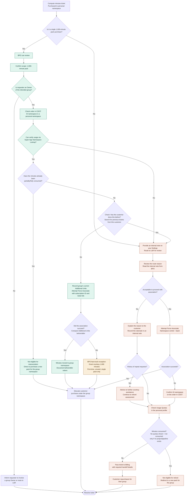

## 追加コンピュート分の追加

随時、名前空間の通常の月間クォータに *影響を与えずに* 追加のコンピュート分を付与する必要が生じることがあります。

<details>
<summary>GitLab.com ChatOps の使用</summary>

詳細については <a href="/handbook/support/workflows/chatops/#setting-additional-minutes-quota-for-a-namespace">
Support ChatOps のドキュメント</a> を参照してください。
</details>

<details>
<summary>CustomersDot Support Admin Tools</summary>

CustomersDot Support Admin Tools の [Set extra CI minutes](/handbook/support/license-and-renewals/workflows/customersdot/support_tools#set-extra-ci-minutes) ワークフローを使用します。

</details>

## ストレージの追加

<details>
<summary>CustomersDot Support Admin Tools</summary>

CustomersDot Support Admin Tools の [Set additional storage](/handbook/support/license-and-renewals/workflows/customersdot/support_tools#set-additional-storage) ワークフローを使用します。

</details>

このツールを使用したストレージの追加は、一時的な解決策として使用してください。恒久的な解決策が実施された後にストレージを削除するには、[内部リクエスト / Repo size change](https://gitlab.com/gitlab-com/support/internal-requests/-/issues/new?issuable_template=Repo%2520Size%2520Limit%2520Change#) を作成してください。実際に変更を元に戻す前に、名前空間が保有すべき量と、名前空間上の実際の量を必ず確認してください。

### 善意の行為として顧客に追加コンピュート分を承認するプロセス

- 既存の顧客に対して、サポートは以下のシナリオで善意の行為としてコンピュート分を発行できます:
  - [Channel Ops ハンドブック](/handbook/sales/field-operations/channel-operations/partner-faq/#post-sale) に従った調達遅延中のセールス AE からのリクエスト。
  - 顧客がコンピュート分に関連する製品バグに遭遇した。
  - 顧客が GitLab.com の予期しないダウンタイムを経験した。

- リクエストが上記の例の範囲外である場合、追加のコンピュート分は支払いが必要です。不明な場合は Slack の [#support_leadership](https://gitlab.slack.com/archives/C01F9S37AKT) チャンネルで確認してください。

#### 調達遅延中のセールスからのリクエスト

- 顧客が追加分を購入する調達プロセスにあり、現在使用可能なクォータが切れて作業がブロックされている場合、セールスのアカウントマネージャーがサポートチームに分を追加するよう内部リクエストを起票することがあります。
- リクエストは顧客のブロックを解除するために妥当な量である必要があります。この場合の妥当な量は顧客の使用状況に応じて変わります。使用状況ページの確認や履歴の確認は、ニーズを判断する良い方法です。
- SFDC に進行中の案件が存在する必要があります。

#### 製品バグまたは予期しないダウンタイムの影響を受けた顧客

- 必要に応じて [GitLab Status ページ](https://status.gitlab.com/) を参照しながら、バグまたは最近のダウンタイムイベントを確認します。
- Issue またはインシデント ID をチケットに記録します。
- 影響を受けたプロジェクトのリストを顧客にリクエストし、次の手順を実行します:
  1. 適用するコンピュート分を示す内部メモをチケットに投稿します。次の式を使用します:
  - `Total compute minutes = Their current compute minutes + (2 x sum of compute minutes for all failed jobs)`
  1. **マネージャー承認が必要かを判断します:**
     - **承認は不要:** 分の使用が顧客の制御外の製品問題（例: 確認済みのバグ、[GitLab Status ページ](https://status.gitlab.com/) で文書化された障害）に明確に起因している場合、進めて参考のために内部メモを残してかまいません。
     - **承認が必要:** 状況が不明確であるか、根本原因の特定が困難な場合（例: 顧客の構成ミスの可能性、製品関連かどうか不明、または異常な使用パターン）、Slack の [#support_leadership](https://gitlab.slack.com/archives/C01F9S37AKT) チャンネルで `Restore Compute Minutes as an act of goodwill` のマネージャー承認をリクエストします。
       - マネージャー: Slack で承認を確認し、チケットの内部メモで承認を投稿します。
  1. [CustomersDot Support Admin Tools の Set extra CI minutes](/handbook/support/license-and-renewals/workflows/customersdot/support_tools#set-extra-ci-minutes) を使用してコンピュート分を復元します。
- これにより、失われたコンピュート分の回復に加えて、顧客に与えた不便への配慮として追加分が提供されます。

- ([チケット例 1](https://gitlab.zendesk.com/agent/tickets/294974)
| [チケット例 2](https://gitlab.zendesk.com/agent/tickets/391109))

### GitLab トライアル顧客に対する追加コンピュート分の承認プロセス

- すべての GitLab トライアルプランはデフォルトで 400 分です。トライアルユーザーが追加分をリクエストするためにサポートチームに連絡してきた場合は、詳しい議論のためにセールス担当者に紹介してください。

- GitLab セールスチームのメンバーは、クォータの増加をリクエストするために `Change Existing Trial Plan` の内部リクエストを起票できます。これらのリクエストは、有償プランの標準割り当てに制限されます: Premium トライアルでは 10,000 分、Ultimate トライアルでは 50,000 分です。
  - 注: トライアル終了時に追加分は自動的には削除されません。顧客はすべて使い切るまで使用できます。

- それ以外の場合、追加のコンピュート分やストレージは支払いが必要です。質問がある場合は `#support_leadership` Slack チャンネルで尋ねてください。

### 購入したコンピュート分が顧客のグループに関連付けられていない

顧客が、グループ名前空間ではなく個人名前空間用に誤ってコンピュート分を購入することがあります。次の手順に従って誤購入を確認し、状況を解決してください:



#### BPO「Fast Track」プロセス

このワークフローは、誤ったコンピュート分購入チケットの大半を対象とし、BPO チームが追加の支援を必要とせずに処理するための知識とツールを提供するよう設計されています。

**BPO Fast Track の適格基準:** このプロセスは、**初回で、未使用の、単一の 1,000 分パック購入**にのみ適用されます。より大規模な購入、繰り返しのリクエスト、または一部でも使用された分は、レビューのために L&R へ転送する必要があります。

1. **購入範囲を確認する:** 購入が 1,000 コンピュート分の単一「パック」であったことを確認します。
   - 顧客の DOT アカウントまたは注文をレビューして確認できます。
   - より多くの分を購入していた場合は、レビューのために L&R Support へ転送します。
1. **Owner メンバーシップを確認する:** リクエスト元が対象のグループ名前空間で `Owner` レベルのメンバーシップを持っていることを確認します。
   - Owner でない場合は、分の再関連付けを続行できないことを伝え、グループの Owner に関与してもらうよう依頼するか、チケットを L&R へ転送します。
1. **個人名前空間での使用状況を確認する:** 顧客が購入した分を使用したかどうかを確認します。
   - **GitLab Super App** -> *Namespace Lookup* を使用して、次を確認します:
     - `Extra minutes` は `1000` である必要があります。
     - `Purchased minutes used` は `0` である必要があります。
   - **Super App で確認できない場合**（[この MR](https://gitlab.com/gitlab-org/gitlab/-/merge_requests/247465)の対応待ち）、分が未使用であると推測せず、チケットを L&R へ転送します。
   - 分が一部または全部使用されている場合は、分を移動できないことを顧客に伝え、グループ名前空間用の新しいパックを購入するよう案内します。
1. **過去のリクエストを確認する:** 同様のリクエストについて、この顧客の過去のチケットを検索します。誤購入が繰り返されている場合は、追加レビューのために L&R へ転送します。
1. **Force Associate を試行する:**
   - 続行する前に、Super App からグループ名前空間の現在の `Additional Units` 値を記録します。
   - [Force Associate](/handbook/support/license-and-renewals/workflows/customersdot/support_tools/#force-associate) ツールを使用して、購入を顧客のグループ名前空間に適用します。
   - **必須入力:** サブスクリプション ID／名前と Zendesk チケットリンク。
1. **関連付けの結果を確認する:** グループ名前空間に追加の分が関連付けられたかどうかを確認します。
   - Force Associate の実行前後で `Additional Units` 値を比較します。
   - 未解決の技術的なバグにより、分が表示されない場合があります。
   - 分が更新されている場合は、前後の値を記載した内部メモを作成し、今後の購入はグループ名前空間に対して行うよう顧客に伝えます。チケットを解決します。
1. **善意の分（BPO Fast Track の例外のみ）:** Force Associate が失敗した場合は、善意としてグループ名前空間に 1,000 コンピュート分を付与します。
   - **この善意の対応は、初回で、未使用の、単一の 1,000 分パック購入にのみ適用されます。** より大規模なリクエストや繰り返しのリクエストは、L&R へ転送する必要があります。
   - [Set extra CI minutes](/handbook/support/license-and-renewals/workflows/customersdot/support_tools/#set-extra-ci-minutes) ツールを使用します。
   - **重要:** このツールは増分ではなく、**合計**値を設定します。次のように新しい合計を計算します:
     1. Super App から既存の `Additional Units` 値を記録します。
     1. 既存の値に 1,000 を加えます。
     1. ツールに新しい合計を入力します。
   - グループ名前空間の `Additional Units` の**実行前**と**実行後**の値を内部メモに記録します。
1. **説明して解決する:** 今後の購入はグループ名前空間で行うよう顧客に伝えます。チケットを解決します。

#### L&R チームの標準プロセス

ユーザーの個人名前空間からグループ名前空間にコンピュート分を移動するには、[CustomersDot Support Admin Tools / Namespace control (SaaS) / Force Associate](/handbook/support/license-and-renewals/workflows/customersdot/support_tools/#force-associate) を使用します。

**Force Associate の要件:**

- **必須入力:** サブスクリプション ID／名前と Zendesk チケットリンク。
- **続行前:** Super App からグループの現在の `Additional Units` 値を記録します。
- **完了後:** グループの `Additional Units` 値が増加したことを確認し、前後の値を文書化します。

**強制関連付けが機能しない場合**、顧客に返金をリクエストする必要があります。この場合:

- [CDOT 内の注文](https://customers.gitlab.com/admin/order) の「Gl namespace」を確認して、コンピュート分が *確かに* ユーザーの個人名前空間に関連付けられていることを確認します。
- 個人名前空間に関連付けられたコンピュート分が消費されていないことを確認します。これはユーザーの個人プロファイルの Usage Quotas で確認できます。
  - **注:** コンピュート分が**プロジェクトもパイプラインもない**個人名前空間に割り当てられている場合、Usage Quotas は表示されません。この場合に限り、分が消費されていないと判断できます。
  - **消費されていない場合**、コンピュート分の購入時にグループではなく個人名前空間を選択してしまったことを顧客に伝え、返金処理のためにチケットを [billing チーム](/handbook/support/license-and-renewals/workflows/billing_contact_change_payments#refunds) に渡します。その後、顧客はグループ用にコンピュート分を再購入できます。
  - **消費されている場合**、顧客は返金の対象外です。購入したコンピュート分を既に使用していることを顧客に伝え、グループに対応する新しいコンピュート分パックを購入するよう顧客を誘導します。

**L&R／Billing への引き継ぎに必要な詳細:**

チケットを L&R または Billing に転送する場合は、内部メモに次の情報を含めます:

- 請求書番号または注文／サブスクリプション ID
- 誤って指定された個人名前空間（ユーザー名または URL）
- 対象となるグループ名前空間のパス
- 購入数量（分パックの数）
- Owner 確認結果（リクエスト元は対象グループの Owner か）
- 使用状況の確認結果（使用済みか未使用か、および確認方法）
- 過去のチケット確認結果（初回か繰り返しか）
- 転送理由（このチケットに L&R／Billing のレビューが必要な理由）

### 購入時に GitLab.com グループが表示されない

- コンピュート分を購入する際、課金ページにはコンピュート分を関連付ける名前空間を選択するドロップダウンメニューが表示されます。ユーザーが購入時に必要なグループを表示または選択できない場合、その GitLab ユーザーがそのグループのオーナーではない可能性があります。ユーザーに対して、課金ページでグループを選択できるようオーナーに権限を更新してもらう必要があるか、または既存のグループのオーナーに自分の顧客ポータルアカウントを使用してコンピュート分を購入してもらうようリクエストする必要がある旨を返信してください。

## コンピュート分の有効化

### コミュニティコントリビューターの手動クレジットカード検証

要件:

1. 依頼者が [内部リクエスト](https://support-super-form-gitlab-com-support-support-op-651f22e90ce6d7.gitlab.io/) または ZenDesk チケットを起票してリクエストを追跡している。
1. リクエストが [Community Relations](/handbook/marketing/developer-relations/#i-classfas-fa-users-fa-fw-color-orange-font-awesomei-meet-the-team) または [Developer Relations Engineering](/handbook/marketing/developer-relations/engineering/#team-members) のチームメンバーによって承認または作成されている。
1. GitLab.com 管理者アカウントを保有している。

確認後、次の手順を実行します:

1. ユーザーアカウントを編集します `https://gitlab.com/admin/users/USERNAME/edit`。
1. `Validate user account` チェックボックスを選択します。
1. [Admin note](/handbook/support/workflows/admin_note/) を追加します。
1. `Save changes`。

### セールス支援トライアルでのコンピュート分の有効化

以下のプロセスにより、セールス支援トライアルに参加しているグループでコンピュート分を使用する際の制限を解除します。

### 手順

#### CustomersDot Support Admin Tools の使用

[Bypassing credit card validation for pipeline execution via CustomersDot Support Admin Tools](/handbook/support/license-and-renewals/workflows/customersdot/support_tools#bypassing-credit-card-validation-for-pipeline-execution) を使用します。

#### customerDot Console の使用

customerDot Console から次の関数を実行します:

##### セールス支援トライアル向け

```ruby
irb(main) enable_ci_minutes_trial('namespace')

=> "{\"status\":\"success\",\"message\":\"namespace members are now enabled to run compute minutes\"}"
```

### クレジットカード検証の失敗の対応

共有ランナーでコンピュート分を使用するには、顧客がアイデンティティを検証する必要がある場合があります。一部の顧客はそのためにクレジットカードを使用する必要があります。検証用にクレジットカードを使用しようとしてエラーが発生したと顧客がサポートに報告してきた場合、以下の手順に従う必要があります。検証プロセスではクレジットカードに対して請求は発生せず、1 ドルのオーソリゼーション取引が使用されます。

1. Zendesk マクロ `Support::L&R::Credit Card Authorisation Failed' を使用してチケットに応答します。
1. 24 時間後に顧客が依然として進行できない、しかし GitLab.com 以外でクレジットカードが動作することを確認していると伝えてきた場合、追加のガイダンスのために Trust and Safety に紹介します。Trust and Safety チームの連絡先の詳細はハンドブックで確認できます: [GitLab Trust and Safety チームと連携する](/handbook/security/security-operations/trustandsafety/#working-with-gitlab-trust-and-safety-team)。
