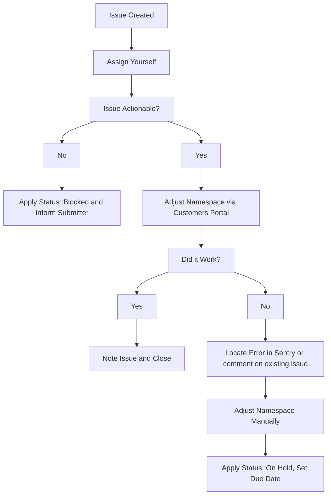

## GitLab.com トライアルリクエストの取り扱い

### サブスクリプションを持たない GitLab.com のお客様

1. 既存の GitLab.com サブスクリプションと名前空間を持たない新規のお客様は、次の [フォーム](https://gitlab.com/-/trial_registrations/new?glm_source=about.gitlab.com/&glm_content=default-saas-trial) に記入することで、30 日間の GitLab Ultimate サブスクリプションを申請できます。
1. 既存の名前空間を持っているがアクティブな GitLab.com サブスクリプションを持っていない GitLab.com ユーザーは、グループ名前空間の billing セクションに移動し `Start Trial` ボタンを押すことができます。その名前空間で以前トライアルが存在した場合、このボタンは表示されません。その場合、ユーザーは GitLab セールスに連絡して新しいトライアルまたはトライアル延長を要求する必要があります。

### Premium サブスクリプションを持つ GitLab.com のお客様

SaaS Ultimate を試したい GitLab.com Premium のお客様には、2 つの選択肢があります:

1. お客様は既存の有料 Premium プランの上で、Duo Enterprise を含む Ultimate トライアルを 60 日間セルフサービスでアクティブ化できます。グループの Billing ページの CTA ボタンから実行できます。詳細は [internal handbook のこちら](https://internal.gitlab.com/handbook/product/fulfillment/saas-ultimate-trials/#gitlabcom-ultimate-trial-on-existing-premium-group-details) または [ドキュメントページ](https://docs.gitlab.com/subscriptions/gitlab_duo_trials/#start-gitlab-duo-pro-trial) を参照してください
1. [GitLab の公式トライアルページ](https://about.gitlab.com/free-trial/?hosted=sass) から Ultimate トライアルをリクエストします。これには、トライアルを適用するために新しい名前空間をセットアップする必要があります。セールスやサポートのアクションは不要です。

#### サブスクリプション上でのトライアル中のサブスクリプションシート

Ultimate トライアルをサブスクリプションの上に適用する場合、お客様のライセンス対象サブスクリプションシート数は引き続き適用されます。Ultimate トライアル中にシート数を増やしたい場合は、通常通りシートを購入する必要があります。トライアル中にシート許容数を超過した場合、次回のリコンサイル時に請求され、トライアル終了後もそのシートは適用されます。

#### 以前に Ultimate トライアルを使用した名前空間

これらの名前空間は、グループが複数のトライアルを取得できないようにする通常のガードレールを回避して、Premium サブスクリプションの上で Ultimate トライアルを開始することが許可されています。

#### ワークフローの注意点

- すべてのトライアルにおいて、更新開始日は前のサブスクリプション期間の終了日と一致する必要があるため、更新日より前に延長することを目的とした Ultimate トライアルのリクエストは拒否すべきです。更新日を前のサブスクリプション期間の終了に揃えるのが GitLab のポリシーです。
- GitLab.com Ultimate トライアルは 30 日間を超えて延長できません。
- GitLab.com トライアルは GitLab Ultimate サブスクリプションプランでのみ利用可能です。

### GitLab.com トライアル制限の回避リクエスト

GitLab.com トライアルには [いくつかの制限](https://about.gitlab.com/free-trial/#what-is-included-in-my-free-trial-what-is-excluded) があり、グループアクセストークンの使用などが含まれます。移行後のチェックを容易にするなどのケースで、これらの制限の回避を要求するお客様もいます。

セールスは Deal Desk と協力し、この [ワークフロー](../../../../sales/field-operations/sales-operations/deal-desk#concurrent-subscriptions) を使用して、トライアル制限のない $0 有料サブスクリプションとなる一時的な Premium または Ultimate サブスクリプションを要求する必要があります。

## トライアルの延長

セールスは Zendesk チケットを通じて、お見込み顧客の代わりに GitLab.com トライアルの期間を延長するよう要求することがよくあります。これらのチケットは常に GitLab Support End User <gitlab_support@example.com> から発行され、申請者は CC されます。お客様またはセールス担当者が *お客様チケット* でトライアル延長のリクエストを行った場合、トライアル延長のリクエストはセールス担当者が内部リクエストを **必ず** 作成しなければならないと回答すべきです。

チケットを開いた際に正しく入力されていないフィールドがある場合は、不足情報の提供を求める公開返信をチケットに送ってください。

1. ZD チケットの所有権を取得します。
1. リクエストを確認し、リクエストを実行するのに十分な情報が提供されていることを確認します。これを行うには、次のことを確認します:
   1. `Namespace:` フィールドに有効な GitLab 名前空間が含まれており、それがトライアルプラン（アクティブまたは期限切れ）を保持していること。これは Salesforce のリンクやメールアドレスであってはなりません。
   1. `Extend the date to:` フィールドに将来の日付が含まれていること（トライアルはこの日付の 23:59 UTC 頃に期限切れとなります）。
   1. `Trial license plan:` フィールドが入力されていること
   1. `I acknowledge that approval for this extension has been granted..` チェックボックスがチェックされており、依頼者がマネージャーまたはディレクターが延長リクエストを承認したことを示す必要な証拠を提供していること。申請者が必要な証拠を提供していない場合は、`Deviation from GitLab.com Subscription Extension Workflow` マクロを使用し、その後チケットをクローズします。
   1. 承認要件への準拠は必須です。依頼者が承認の必要性または妥当性に異議を唱える場合は、レビューして最善の道筋を判断できるよう、オンコール中の Support Manager をチケットに CC してエスカレーションしてください。
1. [CustomersDot Support Admin Tools の `Trial changes (SaaS)`](/handbook/support/license-and-renewals/workflows/customersdot/support_tools/#update) を使用してリクエストを処理します。
   1. アクション実行中にエラーが発生した場合は、何が問題だったかを確認するために [GCP Logs Explorer ダッシュボード](https://console.cloud.google.com/logs/query?project=gitlab-subscriptions-prod) を確認してください。また、[sentry のエラー](https://sentry.gitlab.net/gitlab/customersgitlabcom/) を見つけ（必要に応じて [Sentry の検索](/handbook/support/workflows/500_errors/#searching-sentry) を参照）、Issue を作成するか、既存のものにコメントしてください。
1. 名前空間を手動で調整する必要がある場合は、詳細と `~Console Escalation::Customers` ラベルを付けた新しい内部 Issue を作成します。

お客様がトライアル延長を要求している場合、セールスチームがお客様と話し合いたい場合に備えて、[Working with Sales workflow](/handbook/support/license-and-renewals/workflows/working_with_sales/) に従ってセールスチームに通知してください。

### サブスクリプション延長のお客様リクエスト

お客様がサブスクリプション延長を要求した場合、曜日とお客様が Enterprise または SMB として分類されているかに基づいて、以下の手順に従ってください。

1. Account Owner を特定する:
    - Zendesk (ZD) チケットで、`Organization Info` というラベルの内部ノートを探し、Account Owner を特定します:
        - Enterprise/Commercial のお客様の場合、特定の個人がリストされます。
        - SMB のお客様の場合、名前付きの人物の代わりに `EMEA/AMER/APAC SMB Sales` が表示されます。

2. 曜日とお客様タイプに基づいて次のステップを判断する:

    | 曜日 | Enterprise/Commercial | SMB |
    |--|-----------------------|-----|
    | **平日** | セールスへリダイレクト | セールスへリダイレクト |
    | **週末/祝日** | セールスへリダイレクト | 一時延長を発行しセールスへリダイレクト |

3. セールスへリダイレクトする手順:

    **Enterprise/Commercial のお客様:**
        - そのようなリクエストはセールスを通す必要があることをお客様に伝え、チケットをクローズする前にお客様の AE のメールアドレスを提供します。
        - Chatter を通じて Account Executive (AE) に通知し、リクエストを認識していることを確認します。
    **SMB のお客様:**
        - [Working with the Global Digital SMB Account Team](/handbook/sales/commercial/high_velocity_sales_first_orders/#working-with-the-global-digital-smb-account-team) のハンドブックページに記載されているプロセスに従います。
        - Salesforce (SFDC) チケット ID をお客様に提供します。
        - チケットをクローズします。

4. 週末または祝日の SMB のお客様の場合、セールスへリダイレクトする前に一時サブスクリプション延長を発行してください。

### SFDC で生成された一時的な更新延長

Account Executive (AE) は SalesForce.com (SFDC) を使用して、更新の商談がクローズするまでに予想以上に時間がかかっている場合、お客様に SaaS 21 日間のサブスクリプション延長を発行できます。AE がこの機能を使用すると、L&R サポートの関与なしにサブスクリプションが自動的に延長されます。[Temporary renewal extensions](/handbook/product/groups/fulfillment/#temporary-renewal-extensions) ハンドブックエントリーがこのアプローチを文書化しています。

なお、上記のアプローチには以下の注意点があります:

1. この機能の悪用を防ぐためのガードレールが設けられています。その結果、更新イベントごとに 1 つのサブスクリプション延長しか生成できません。したがって、L&R サポートがさらにサブスクリプション延長を生成する必要がある場合もあります。これが発生した場合は、[アクティブまたは期限切れのサブスクリプションを延長する](#extend-an-existing-active-or-expired-subscription) の手動プロセスに従ってください。
1. また、サブスクリプションは非トライアルサブスクリプションでなければなりません。サブスクリプションが次の 15 日以内に期限切れになる予定の場合は、`Deviation from SM License Extension Workflow macro` を使用して SFDC 機能を利用するようセールス担当者をリダイレクトし、その後チケットをクローズしてください。
1. サブスクリプションの期限切れまで 15 日以上ある場合は、期限切れが 15 日以内になるまで待ってから SFDC 機能を利用するようセールス担当者にアドバイスしてください。15 日以内のウィンドウになったら、`Deviation from SM License Extension Workflow` マクロを使用して SFDC 機能を使用するようセールス担当者をリダイレクトし、その後チケットをクローズします。

## 既存のアクティブまたは期限切れサブスクリプションを延長する {#extend-an-existing-active-or-expired-subscription}

1. トライアルライセンスを作成するためのアクションを取る前に、トライアルに伴う [制約](https://about.gitlab.com/free-trial/#what-is-included-in-my-free-trial-what-is-excluded) を理解し受け入れることをお客様から確認してください。この目的のため、Zendesk で `Support::L&R::Trial Subscription - Exclusions Sign Off` マクロを使用してください。お客様の返信を受け取り、迅速にアクションを取れるよう、必ずチケットを自分に割り当ててください。
1. これは CustomersDot Support Admin Tools の [`Trial changes (SaaS)`](/handbook/support/license-and-renewals/workflows/customersdot/support_tools/#update) を介して行います。
1. `Extend an (almost) expired subscription` という名前の内部リクエストフォームからのリクエストを処理する場合は、`I acknowledge that approval for this extension has been granted..` チェックボックスがチェックされており、依頼者がマネージャーまたはディレクターが延長リクエストを承認したことを示す必要な証拠を提供していることを確認してください。申請者が必要な証拠を提供していない場合は、`Deviation from GitLab.com Subscription Extension Workflow` マクロを使用し、その後チケットをクローズします。

**注:** お客様が名前空間でトライアルを開始していない場合、トライアルを延長することはできません。お客様がトライアルを開始していない場合は開始する必要があります。または期限切れのものを使用する必要があります。

## ワークフロー図

## プラン変更リクエスト

プラン変更は、以下の場合を除き、**決して** 手動で行うべきではありません:

1. Free へのダウングレード。
1. 緊急: お客様が手動プランから外れるよう、翌営業日のフォローアップが必要な場合。チケットを L&R に渡すか、内部チケットを作成すべきです。

有料の非トライアル名前空間でのプラン変更は、サブスクリプション購入を通じて行うべきです。

緊急でない場合に手動プラン変更が必要な場合は、プランを手動で変更するとデータの不整合が生じ、法的問題やバグの問題を引き起こす可能性があるため、[Legal Issue](/handbook/legal/#how-to-reach-us) を作成し、Legal の承認を得る必要があります。

### Free プランへのダウングレード

ダウングレードリクエストを実行する前に:

1. [Ownership verification ワークフロー](/handbook/support/license-and-renewals/workflows/customersdot/associating_purchases#ownership-verification) に従って、依頼者が承認を提供していることを確認します。
1. 返金を希望するかどうかを判断します。希望する場合は、[refunds workflow](/handbook/support/license-and-renewals/workflows/billing_contact_change_payments#refunds) に従ってください。

| サンプルチケット | 日付 |
| --- | --- |
| [ZD Link](https://gitlab.zendesk.com/agent/tickets/322319) | 2022-09-02 |

### customerDot を使用する

**重要**

CustomerDot からはプランタイプのみ変更でき、サブスクリプション終了日は変更できません。

1. 左側のメニューから `customers` をクリックし、お客様を検索します。
1. 検索結果で、更新したいお客様の GitLab グループアイコンをクリックします。
1. お客様が所有するグループのリストが表示され、ここで変更を行うことができます。

> エラーが発生した場合は、通常のトラブルシューティング手順に従い、sentry でエラーを確認したり、既存の CustomersDot Issue を確認したりして、必要に応じて既存の Issue に追加するか、新規作成してください。

エラーが発生した場合は、次のセクションの手順に従って admin を使用してください。

### 遅延が発生したお客様の更新と新規セールスのためのライセンスパスウェイ

お客様の更新または新規顧客セールスで遅延が発生する特定のシナリオでは、L&R Support プロセスワークフローが柔軟性を提供してこれらの課題に対応します。次の表は、特定のユースケースに基づいて一時的なトライアルライセンスを発行するために利用できるオプションを示しています:

| ユースケース | パスウェイ |
| ------ | ------ |
|  お客様の更新が予想より時間がかかっている      | セールス AE (Account Executive) が SFDC を介して 1 回限りの 21 日 [temporary renewal extension](/handbook/product/groups/fulfillment/#temporary-renewal-extensions) を生成        |
|  お客様の更新が追加の 21 日を超える     |  セールス AE は L&R サポートに新しい Internal Request (IR) チケットを開き、最大 1 ヶ月のトライアルサブスクリプション延長をリクエストできます      |
|  お客様の更新が追加の 21 日 + 1 ヶ月を超える     | セールス AE は L&R サポートに新しい Internal Request (IR) チケットを開き、シニアディレクターの収益担当 @andrew_murray からチケットを介して承認を得ることができます       |
|  新規顧客の潜在的なセールス     |  セールス AE は L&R サポートに IR を介して最大 1 ヶ月のトライアル延長をリクエストできます。|
|  新規顧客セールスが 1 ヶ月以上かかる | セールス AE が SFDC で $0 の商談を生成し、L&R サポートに新しい IR チケットを開いて、シニアディレクターの収益担当 @andrew_murray からチケットを介して承認を得ます       |

### NFR (Not for resale) SaaS ライセンスの作成方法

2025 年 2 月 19 日以降、[partner NFR subscriptions](/handbook/resellers/channel-working-with-gitlab/#not-for-resale-nfr-program-and-policy)) はトライアルサブスクリプションではなく標準的な GitLab.com サブスクリプションとしてプロビジョニングされます。Ecosystem Operations がこのプロセスを管理し、プロビジョニングのためにサポートチームの支援は不要になりました。質問がある場合は Slack で #global-ecosystem-programs-ops に連絡してください。
