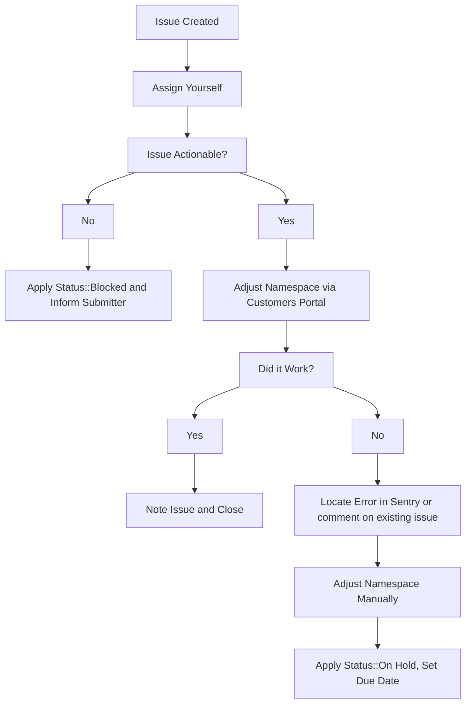

## GitLab.com トライアルリクエストの取り扱い

### サブスクリプションを持たない GitLab.com 顧客

1. 既存の GitLab.com サブスクリプションと名前空間を持たない新規顧客は、次の [フォーム](https://gitlab.com/-/trial_registrations/new?glm_source=about.gitlab.com/&glm_content=default-saas-trial) に記入することで 30 日間の GitLab Ultimate サブスクリプションを申請できます。
1. 既存の名前空間を持つがアクティブな GitLab.com サブスクリプションを持たない GitLab.com ユーザーは、自分のグループ名前空間の課金セクションに移動し、`Start Trial` ボタンを押すことができます。以前にその名前空間でトライアルが存在していた場合、ボタンは表示されません。そのような状況では、ユーザーは GitLab セールスに連絡して新しいトライアルまたはトライアル延長をリクエストする必要があります。

### Premium サブスクリプションを持つ GitLab.com 顧客

SaaS Ultimate のトライアルを希望する GitLab.com Premium 顧客には、2 つのオプションがあります:

1. 顧客は、グループの課金ページの CTA ボタンから既存の有償 Premium プランの上に Duo Enterprise を含む 60 日間の Ultimate トライアルをセルフサービスで開始できます。詳細は [社内ハンドブック](https://internal.gitlab.com/handbook/product/fulfillment/saas-ultimate-trials/#gitlabcom-ultimate-trial-on-existing-premium-group-details) または [ドキュメントページ](https://docs.gitlab.com/subscriptions/gitlab_duo_trials/#start-gitlab-duo-pro-trial) を参照してください。
1. [GitLab のパブリックトライアルページ](https://about.gitlab.com/free-trial/?hosted=sass) から Ultimate トライアルをリクエストします。これには、顧客がトライアルを適用するための新しい名前空間をセットアップする必要があります。セールスやサポートのアクションは不要です。

#### サブスクリプション上のトライアル中のサブスクリプションシート

サブスクリプション上に Ultimate トライアルを適用した場合、顧客のライセンスされたサブスクリプションシート数は引き続き適用されます。Ultimate トライアル中に顧客がシート数を増やしたい場合、通常通りシートを購入する必要があります。トライアル中に顧客がシートの許容数を超えた場合、次の調整時に課金され、トライアル終了後もシートは引き続き適用されます。

#### 過去に Ultimate トライアルを使用した名前空間

これらの名前空間は、Premium サブスクリプション上で Ultimate トライアルを開始することが許可されており、グループが複数のトライアルを取得することを防ぐ通常のガードレールを回避します。

#### ワークフローの注意点

- すべてのトライアルにおいて、更新開始日は前のサブスクリプション期間の終了日に合わせる必要があります。そのため、更新日に先んじて延長することを目的とした Ultimate トライアルのリクエストは拒否されるべきです。GitLab のポリシーとして、更新日は前のサブスクリプション期間の終了日に合わせるルールとなっています。
- GitLab.com の Ultimate トライアルは 30 日間を超えて延長することはできません。
- GitLab.com トライアルは GitLab Ultimate サブスクリプションプランでのみ利用可能です。

### GitLab.com トライアルの制限を回避するリクエスト

GitLab.com トライアルにはグループアクセストークンの使用などの [いくつかの制限](https://about.gitlab.com/free-trial/#what-is-included-in-my-free-trial-what-is-excluded) があります。一部の顧客は、移行後のチェックを支援する場合などにこれらの制限の回避をリクエストすることがあります。

セールスは Deal Desk と連携し、この [ワークフロー](../../../../sales/field-operations/sales-operations/deal-desk#concurrent-subscriptions) を使用して一時的な Premium または Ultimate サブスクリプションをリクエストする必要があります。これにより、トライアルの制限のない $0 の有償サブスクリプションが提供されます。

## トライアルの延長 {#extending-trials}

セールスは見込み客に代わって GitLab.com トライアルの期間を延長するように、Zendesk チケットを通じて依頼してくることが多くあります。これらのチケットは常に GitLab Support End User <gitlab_support@example.com> から起票され、提出者がチケットに cc されます。顧客またはセールス担当者が *顧客チケット* でトライアル延長リクエストを起票してきた場合、トライアル延長をリクエストするためにはセールス担当者が内部リクエストを起票する **必要がある** 旨を返信する必要があります。

チケットを開く際にいずれかのフィールドが正しく入力されていなかった場合は、不足している情報を提供するよう提出者に依頼するパブリックの返信をチケット上で送信してください。

1. ZD チケットのオーナーを引き受けます。
1. リクエストを確認し、リクエストを処理するのに十分な情報が提供されていることを確認します。これを行うには次を確認します:
   1. `Namespace:` フィールドに有効な GitLab 名前空間が含まれており、トライアルプラン（アクティブまたは期限切れ）を保有していること。これは Salesforce のリンクやメールアドレスであってはなりません。
   1. `Extend the date to:` フィールドに将来の日付が含まれていること。（トライアルはこの日付の UTC 23:59 頃に期限切れになります）
   1. `Trial license plan:` フィールドが入力されていること。
   1. `I acknowledge that approval for this extension has been granted..` チェックボックスがチェックされており、依頼者がマネージャーまたはディレクターによる延長リクエスト承認の証拠も提供していること。提出者が必要な証拠を提供していない場合は `Deviation from GitLab.com Subscription Extension Workflow` マクロを使用し、その後チケットをクローズします。
   1. 承認要件への準拠は必須です。依頼者が承認の必要性または有効性に異議を唱える場合、対応中のサポートマネージャーをチケットに CC してエスカレーションし、レビューと最善の進路を判断してもらってください。
1. [CustomersDot Support Admin Tools の `Trial changes (SaaS)`](/handbook/support/license-and-renewals/workflows/customersdot/support_tools/#update) を使用してリクエストを処理します。
   1. アクション中にエラーが発生した場合、[GCP Logs Explorer ダッシュボード](https://console.cloud.google.com/logs/query?project=gitlab-subscriptions-prod) を確認して何が問題だったかを把握します。また [sentry でエラーを特定](https://sentry.gitlab.net/gitlab/customersgitlabcom/) し（必要な場合は [Sentry の検索方法](/handbook/support/workflows/500_errors/#searching-sentry) を参照）、Issue を起票するか既存の Issue にコメントしてください。
1. 名前空間を手動で調整する必要がある場合、詳細とともに新しい内部 Issue を起票し、`~Console Escalation::Customers` ラベルを追加します。

顧客がトライアル延長をリクエストしている場合、[セールスとの連携ワークフロー](/handbook/support/license-and-renewals/workflows/working_with_sales/) に従って、セールスチームが顧客と話し合いたい場合に備えて知らせてください。

### サブスクリプション延長に対する顧客のリクエスト

顧客がサブスクリプション延長をリクエストしてきた場合、曜日と顧客が Enterprise か SMB のどちらに分類されるかに基づいて、以下の手順に従ってください。

1. アカウントオーナーを特定します:
    - Zendesk（ZD）チケット内で、`Organization Info` というラベルの内部メモを探してアカウントオーナーを特定します:
        - Enterprise／Commercial の顧客の場合、特定の個人がリストされます。
        - SMB の顧客の場合、特定の個人ではなく `EMEA/AMER/APAC SMB Sales` と表示されます。

2. 曜日と顧客タイプに基づいて次のステップを判断します:

    | 曜日 | Enterprise/Commercial | SMB |
    |--|-----------------------|-----|
    | **平日** | セールスにリダイレクト | セールスにリダイレクト |
    | **週末／祝日** | セールスにリダイレクト | 一時延長を発行してセールスにリダイレクト |

3. セールスにリダイレクトする手順:

    **Enterprise／Commercial の顧客:**
        - そのようなリクエストはセールスを経由する必要があることを顧客に伝え、チケットをクローズする前に AE のメールアドレスを提供します。
        - Chatter を通じてアカウントエグゼクティブ（AE）にリクエストを認識させるために通知します。
    **SMB の顧客:**
        - [Working with the Global Digital SMB Account Team](/handbook/sales/commercial/high_velocity_sales_first_orders/#working-with-the-global-digital-smb-account-team) ハンドブックページに概説されているプロセスに従います。
        - Salesforce（SFDC）チケット ID を顧客に提供します。
        - チケットをクローズします。

4. 週末または祝日の SMB 顧客については、セールスにリダイレクトする前に一時的なサブスクリプション延長を発行してください。

### SFDC で生成される一時的な更新延長

アカウントエグゼクティブ（AE）は、更新案件のクローズに想定以上の時間がかかっている場合に、SalesForce.com（SFDC）を使用して顧客に SaaS の 21 日間サブスクリプション延長を発行できます。AE がこの機能を使用すると、L&R サポートの関与なしにサブスクリプションが自動的に延長されます。[一時的な更新延長](/handbook/product/groups/fulfillment/#temporary-renewal-extensions) のハンドブックエントリにこのアプローチが文書化されています。

上記のアプローチには以下の注意点があります:

1. この機能の悪用を防ぐためのガードレールが設けられています。その結果、更新イベントごとに発行できるサブスクリプション延長は 1 回のみです。そのため、L&R サポートがさらにサブスクリプション延長を生成する必要がある場合があります。これが発生した場合は、[アクティブまたは期限切れのサブスクリプションを延長する](#extend-an-existing-active-or-expired-subscription) の手動プロセスに従ってください。
1. さらに、サブスクリプションはトライアル以外のサブスクリプションである必要があります。サブスクリプションが今後 15 日以内に期限切れになる予定の場合、`Deviation from SM License Extension Workflow macro` マクロを使用してセールス担当者に SFDC 機能を活用するようリダイレクトし、その後チケットをクローズします。
1. サブスクリプションの期限切れが 15 日以上先の場合、有効期限が 15 日以内になるまで待ってから SFDC 機能を活用するようセールス担当者に助言します。15 日以内のウィンドウに入ったら、`Deviation from SM License Extension Workflow` マクロを使用してセールス担当者に SFDC 機能を使用するようリダイレクトし、その後チケットをクローズします。

## アクティブまたは期限切れの既存サブスクリプションの延長 {#extend-an-existing-active-or-expired-subscription}

1. トライアルライセンスを作成するアクションを取る前に、トライアルに伴う [制約](https://about.gitlab.com/free-trial/#what-is-included-in-my-free-trial-what-is-excluded) を顧客が理解し受け入れていることを確認します。この目的のために Zendesk の `Support::L&R::Trial Subscription - Exclusions Sign Off` マクロを使用します。チケットを自分に割り当てて、顧客の応答を受け取り、迅速にアクションを取れるようにしてください。
1. これは CustomersDot Support Admin Tools の [`Trial changes (SaaS)`](/handbook/support/license-and-renewals/workflows/customersdot/support_tools/#update) を介して行います。
1. `Extend an (almost) expired subscription` という名前の内部リクエストフォームからのリクエストを処理する場合、`I acknowledge that approval for this extension has been granted..` チェックボックスがチェックされており、依頼者がマネージャーまたはディレクターによる延長リクエスト承認の証拠も提供していることを確認してください。提出者が必要な証拠を提供していない場合は `Deviation from GitLab.com Subscription Extension Workflow` マクロを使用し、その後チケットをクローズします。

**注**: 顧客が名前空間でトライアルを開始していない場合、トライアルを延長することはできません。ZenDesk Mechanizer アプリの Subscription name フィールドはこの理由のためにあります。Subscription name がある場合、mechanizer は名前空間に対して新しいトライアルを作成します。

## ワークフロー図

## プラン変更リクエスト

プラン変更は、以下のケースを除き **絶対に** 手動で行ってはいけません:

1. Free へのダウングレード。
1. 緊急時: 顧客が手動プランから外れるためには翌営業日のフォローアップが必要です。チケットは L&R に渡すか、内部チケットを作成する必要があります。

有償の非トライアル名前空間でのプラン変更は、サブスクリプション購入を通じて行う必要があります。

緊急以外で手動のプラン変更が必要な場合、手動でプランを変更するとデータの不整合、法的問題、バグの問題を引き起こす可能性があるため、[法務 Issue](/handbook/legal/#how-to-reach-us) を作成し、法務によって承認される必要があります。

### Free プランへのダウングレード

ダウングレードリクエストを処理する前に:

1. [所有権検証ワークフロー](/handbook/support/license-and-renewals/workflows/customersdot/associating_purchases#ownership-verification) に従って、依頼者が認可を提供していることを確認します。
1. 返金を希望するかどうかを判断します。希望する場合は [返金ワークフロー](/handbook/support/license-and-renewals/workflows/billing_contact_change_payments#refunds) に従います。

| チケット例 | 日付 |
| --- | --- |
| [ZD リンク](https://gitlab.zendesk.com/agent/tickets/322319) | 2022-09-02 |

### customerDot の使用

**重要**

CustomerDot からは、サブスクリプションの終了日ではなくプランタイプのみを変更できます。

1. 左側のメニューから `customers` をクリックし、顧客を検索します。
1. 検索結果で、更新したい顧客の GitLab グループのアイコンをクリックします。
1. その顧客が所有するグループのリストが表示され、ここで変更を実行できます。

> エラーが表示された場合は、sentry および／または既存の CustomersDot Issue でエラーを検索する通常のトラブルシューティング手順に従い、必要に応じて既存の Issue に追加するか、新しい Issue を作成してください。

エラーが表示された場合は、次のセクションの手順に従って admin を使用します。

### 顧客の更新および新規販売が遅延した場合のライセンス発行経路

顧客の更新または新規顧客販売が遅延しているシナリオにおいて、L&R サポートのプロセスワークフローはこれらの課題に対処するための柔軟性を提供します。次の表は、特定のユースケースに基づいて一時トライアルライセンスを発行するために利用可能なオプションをまとめたものです。

| ユースケース | 経路 |
| ------ | ------ |
|  顧客更新が想定より時間がかかる      | セールス AE（アカウントエグゼクティブ）が SFDC 経由で 1 回限りの 21 日間 [一時的な更新延長](/handbook/product/groups/fulfillment/#temporary-renewal-extensions) を生成        |
|  顧客更新が追加の 21 日間を超える     |  セールス AE は L&R サポートに新しい内部リクエスト（IR）チケットを起票し、最大 1 ヶ月のトライアルサブスクリプション延長をリクエストできる      |
|  顧客更新が追加の 21 日間 + 1 ヶ月を超える     | セールス AE は L&R サポートに新しい内部リクエスト（IR）チケットを起票し、L&R サポートはチケット経由で revenue のシニアディレクター @andrew_murray から承認を得る       |
|  新規顧客の見込み販売     |  セールス AE は L&R サポートとの IR 経由で最大 1 ヶ月のトライアル延長をリクエストできる。|
|  新規顧客販売が 1 ヶ月以上かかる | セールス AE は SFDC で $0 ドルの案件を生成し、その後 L&R サポートに新しい IR チケットを起票し、L&R サポートはチケット経由で revenue のシニアディレクター @andrew_murray から承認を得る       |

### NFR（再販不可）SaaS ライセンスの作成方法

2025 年 2 月 19 日時点で、[パートナー NFR サブスクリプション](/handbook/resellers/channel-working-with-gitlab/#not-for-resale-nfr-program-and-policy)） はトライアルサブスクリプションとしてではなく、標準の GitLab.com サブスクリプションとしてプロビジョニングされます。Ecosystem Operations がこのプロセスを管理しており、プロビジョニングのためにサポートチームの支援を必要としません。質問があれば slack で #global-ecosystem-programs-ops に連絡してください。
