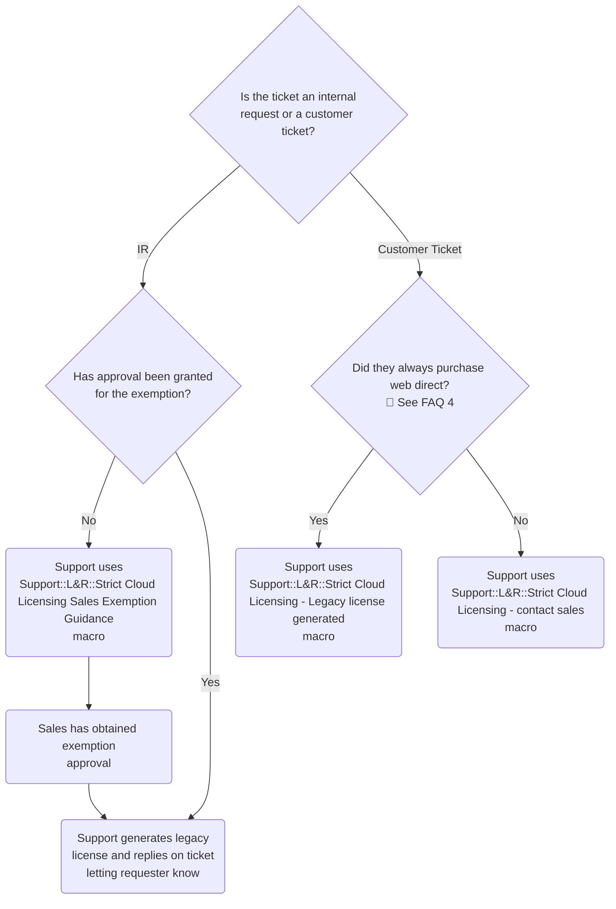

## Cloud Licensing の概要

[Cloud Licensing](https://about.gitlab.com/pricing/licensing-faq/cloud-licensing/) は、ライセンスファイルを管理してインスタンスへ手動でアップロードする代わりに、アクティベーションコードを使って GitLab 顧客が Self-Managed インスタンス上で有償サブスクリプションの機能を有効化できる仕組みです。Cloud Licensing でアクティベートすると、顧客の GitLab インスタンスは [Subscription Data](https://docs.gitlab.com/subscriptions/manage_subscription/#subscription-data) を GitLab と定期的に同期します。

Cloud Licensing をさらに促進するため、Strict Cloud Licensing プロジェクトでは、レガシーライセンスファイルではなく Cloud License アクティベーションコードを使用するよう顧客に促す複数のイテレーションを実施します。次の [GitLab 内部のライセンシング用語ページ](https://internal.gitlab.com/handbook/product/fulfillment/definitions/#licensing-terms) では、Cloud Licensing に関連する現在の 3 種類のライセンス（Cloud Licensing、Offline、Legacy）の技術的な定義を提供しています。

## Strict Cloud Licensing

Cloud Licensing はすべての新規および更新顧客に対してデフォルトで有効になっており、詳細は [Strict Cloud Licensing roll out plan](https://gitlab.com/gitlab-org/gitlab/-/issues/351682) に記載されています（OSS、EDU、または Start-Up 製品を除く）。Cloud Licensing を利用している顧客は、Customers Portal からライセンスファイルをダウンロードできません。エアギャップ環境やオフラインインスタンスを利用している顧客でも Cloud Licensing の恩恵を受けられるよう、Offline ライセンスが用意されています。レガシーライセンスまたは Offline ライセンスを受け取るには、顧客は以下に概説するプロセスに従う必要があります。

### Strict Cloud Licensing プロセス

注：これは standard および resold の顧客にのみ適用されます。

## Cloud Licensing の除外

### Pre-Sale 除外（Sales）

Cloud Licensing でアクティベートできない顧客は、Offline Cloud License またはレガシーライセンスのいずれかを取得する必要があります。販売時にこのプロセスが正しく処理されていれば、Support の介入は不要です。

デフォルトでは、Salesforce の `TurnOnCloudLicensing__c` フラグはセールスサイクル中のすべての見積で `Yes` に設定されます。Sales 担当者が顧客をオプトアウトさせたい場合、見積フィールド `[Cloud Lic] Add Cloud Licensing Opt Out` を `Legacy License File` または `Offline License` に更新します。これに伴い `TurnOnCloudLicensing` の値はそれぞれ `No` または `Offline` に更新されます。見積が送信されると、標準の Salesforce 承認プロセスにより Sales VP の承認が必要になります。承認されると、見積は Zuora に同期され、サブスクリプションが作成・アクティベートされます。このシナリオでは、顧客はライセンスファイルが添付されたアクティベーションメールを受け取り、[GitLab Customers portal](https://customers.gitlab.com/customers/sign_in) からライセンスファイルをダウンロードすることもできます。

### Post-Sale 除外（Support） {#post-sale-exemptions-support}

Pre-Sale 除外プロセスは **唯一の** オプトアウト手段として想定されており、すべての顧客に対して使用されるべきです。しかし、販売中にアカウントマネージャーがオプトアウトを失念し、顧客が利用できない Cloud License アクティベーションコードを受け取ってしまうケースもあります。

顧客が **販売後** にレガシーライセンスまたは Offline ライセンスを必要とする場合、Sales のアカウントマネージャーは Cloud Licensing 除外（CLE）について Sales VP の承認を得る必要があります。承認が取得され、Salesforce 上に **各 Opportunity ごとに** ドキュメント化されたら、アカウントマネージャーは **各 Opportunity ごとに** 次の手順で Support 内部リクエストを起票する必要があります。

1. 適切な Zendesk インスタンスにサインインします。
   1. Global Support: [Zendesk Global](https://gitlab-internal.zendesk.com/hc/en-us/requests/new?ticket_form_id=22783840298780)
   1. US Gov Support: [Zendesk US Gov](https://gitlab-federal-internal.zendesk.com/hc/en-us/requests/new?ticket_form_id=41826474429588)
1. "What category of request?*" のプロンプトで以下を選択します。
   1. サブメニュー "Self-Managed License Related (for paid customers only)" を選択
   1. そのサブメニューの中で "Cloud Licensing exemption" を選択
**Note:** PubSec 顧客の場合、SFDC ベースの Chatter リンク承認は不要です。リクエスト処理には必ず Federal Zendesk フォームを使用してください。

アカウントマネージャー向けの完全な手順は [Highspot で確認できます](https://gitlab.highspot.com/items/629a82af9092e7ac989947ca?lfrm=srp.0)（Sales チームのみ閲覧可能）。

顧客のサブスクリプションまたは trial/temp ライセンスが期限切れで、承認プロセス中もアクセスが必要な場合、アカウントマネージャーは別の Support 内部リクエストを起票する必要があります。手順は上記と同じですが、サブメニュー選択を **Extend an (almost) expired subscription** にしてください。Support エンジニアは、関連の内部リクエスト内で post-sales オプトアウトの承認を受領・処理するまで、[顧客にトライアルライセンスを提供](/handbook/support/license-and-renewals/workflows/self-managed/trials/) してください。

#### Cloud Licensing 除外内部リクエストの処理方法

1. `Chattr with approval` リンクをクリックし、次の手順を行います。
    1. 以下を確認します。
        - Chatter が Salesforce の **Opportunity** ページ上にあること。
        - Opportunity が `Closed-Won` であること（そうでない場合は [FAQ #5](#5-what-if-the-exemption-is-on-an-opportunity-that-is-not-closed-won) を参照）。
        - Chatter スレッドに **Approval** メッセージが含まれていること。
        - 除外承認が **VP** によって行われていること。承認者の名前にホバーしてタイトルを確認します。
    1. 上記の要件のいずれかが満たされていない場合、修正すべき内容をリクエスターに伝え、内部リクエストをクローズします。すべて満たされていれば、ステップ 2 に進みます。
1. Opportunity ページにいる間に、[関連サブスクリプションの詳細を見つけます](#find-the-related-subscription-details)。
1. `Sold To Email` を使用して、CustomersDot の [Customers](https://customers.gitlab.com/admin/customer) ページで顧客アカウントを検索します。
1. ブックマークアイコンをクリックして、アカウントの `Zuora Subscriptions` タブに移動します。
1. ステップ 2 の `Subscription Name` で更新すべきサブスクリプションを確認します。
1. IR チケットに戻り、`GitLab Version` 値を確認します。
    - バージョンが 15.0 未満の場合、`Cloud Licensing` フラグの値を `No` に設定します。
    - バージョンが 15.0 以上の場合、`Cloud Licensing` フラグの値を `Offline` に設定します。
1. `Update` をクリックします。
1. `Impersonate` タブをクリックします。
1. `Copy license key to clipboard` をクリックします。この方法を使うことで、ライセンスの詳細がすべて正しく自動入力されます。
    - `An error occurred...` メッセージが表示された場合は、もう一度 `Copy license key to clipboard` をクリックしてみてください。
    - それでも失敗する場合は、ログを確認するか、支援を求めてください。
1. ブラウザの `Back` ボタンをクリックして、顧客アカウントの impersonate を停止します。
1. [Licenses](https://customers.gitlab.com/admin/license) ページに移動します。
1. 新しく生成されたライセンスを見つけます。
    - ライセンスは最上部の最初のいくつかのうちの 1 つになっているはずです。
    - そうでない場合は、ステップ 2 の `Sold To Email` を使ってライセンスを検索します。
1. 自動生成されたライセンスはライセンスメールの通知をトリガーしないため、[ライセンスを再送します](/handbook/support/license-and-renewals/workflows/self-managed/sending_license_to_different_email)。
1. ライセンスへのリンクとともに IR チケットに返信し、チケットを `Solved` にマークします。

##### Note

下記のマトリクスは、`Cloud Licensing` フラグの値を `Yes`、`Offline`、`No` に設定した場合に、3 種類のライセンスの適用可否に与える影響を定義しています。

| Cloud Licensing フラグ値 | Cloud License | Offline Cloud | Legacy License |
| ------ | ------ | ------ | ------  |
| Yes | 適用可 | 適用不可 | 適用可 |
| Offline | 適用可 | 適用可 | 適用不可 |
| No  | 適用可 | 適用可 | 適用可 |

#### 関連サブスクリプションの詳細を見つける {#find-the-related-subscription-details}

Closed-Won の Opportunity 内でサブスクリプションを見つける方法はいくつかあります。
状況に応じて、以下の代替手段を参照してください。

##### Customer Subscription (CS-0000000000) {#customer-subscription-cs-0000000000}

1. Opportunity ページで `Subscription Information` セクションまでスクロールします。
1. `CS-0000000000` 形式の `Customer Subscription` 値をクリックして、**Customer Subscription** ページに移動します。
1. `Current Zuora Subscription` 値をクリックして、**Subscription** ページに移動します。
1. **Subscription** ページから `Sold To Email` と `Subscription Name` を確認します。

##### Quote

1. Opportunity ページで `Quotes` セクションまでスクロールします。
1. `Status` が `Sent to Z-Billing` となっている、最も関連性の高い Quote を見つけます。
    - **すべての** Quote の `Status` が `New` の場合、これは web-direct 購入を示しています。**複数の** Quote がすべて `Status` `New` の場合は、`Primary` としてマークされている Quote を使用します。
1. Quote を開きます。
    - `Content cannot be displayed...` エラーが発生した場合は、代わりに [Customer Subscription (CS-0000000000)](#customer-subscription-cs-0000000000) のプロセスを試すか、支援を求めてください。
1. Sold To 連絡先のメールを確認します。
    1. Quote の詳細にある `Sold to Contact` までスクロールします。
    1. 名前にホバーすると連絡先のモーダルが開きます。メールを右クリックしてアドレスをコピーします。
1. Subscription Name を確認します。
    - Quote の `Subscription Name` を確認します。これは上部セクションの 4 行目にあります。
    - 空の場合、または CustomersDot に表示されない場合は、Sold To 連絡先のメールを使って顧客アカウントを特定し、開いた Quote のシート数とサブスクリプションのシート数が一致することを検証してサブスクリプションを見つけます。

### Support FAQ

#### 1. 承認されたオプトアウトに対しては、どのライセンスタイプを提供すべきですか？

Offline と Legacy のどちらを提供すべきかは、顧客の具体的なシナリオと要望によりますが、以下が参考になります。

- Offline ライセンスは、レガシーライセンスよりも GitLab に好まれます。これは、顧客がより簡単に利用データを提供できるためです。これらは、エアギャップ環境やインターネットに接続していないインスタンスのため Cloud License を使用できない顧客に最適です。ただし、Offline Cloud License を使用するには顧客が 15.0 以上である必要があります。
- レガシーライセンスは、顧客が GitLab バージョン 14.1 以上にアップグレードしたくない、またはできない場合、または Subscription Data の共有を懸念している場合に送信できます。

#### 2. リセラー購入にはどのワークフローが適用されますか？ {#2-are-reseller-purchases-considered-the-same-as-sales-assisted-if-a-customer-purchased-after-2022-07-07-and-needs-a-legacy-license-should-we-send-them-to-their-account-manager-to-go-through-the-exemption-process-or-do-we-treat-them-the-same-as-web-direct-and-give-them-a-legacy-license-file-no-questions-asked}

例：2022-07-07 以降に顧客が購入し、レガシーライセンスを必要としている場合、除外プロセスを進めるためアカウントマネージャーに紹介すべきか、それとも web-direct と同様に扱い、何も尋ねずにレガシーライセンスファイルを提供すべきか？

リセラー顧客は、Sales 支援の購入と同じ除外プロセスを使用するため、Sales に案内してください。

#### 3. 1 つのサブスクリプションで複数のライセンスタイプをアクティブにできますか？

例：顧客が、本番インスタンスを Cloud License アクティベーションコードでアクティベートした後、開発インスタンスでレガシーライセンスを使用したい場合。

この状況ではレガシーライセンスを生成できますが、除外が承認された後に限ります。**現在 CL 有効になっているサブスクリプションには除外を適用しないでください。** 代わりに、既存のライセンスのレガシーライセンスの複製を生成します。

この回避策の詳細なコンテキストについては、[このコメントスレッド](https://gitlab.com/gitlab-org/fulfillment-meta/-/issues/610#note_1052615060) を参照してください。

#### 4. 購入が web-direct かどうかをどう確認しますか？

(1) 顧客の Zuora アカウントにある特定の購入の請求書（<https://www.zuora.com/apps/CustomerAccount.do?method=view&id=><ACCOUNT_ID>）または (2) サブスクリプションの Change History（<https://www.zuora.com/platform/subscriptions/><SUBSCRIPTION_ID>）の `Created By` 値を確認します。

- Web direct: **Fulfillment API User**（`svc_zuora_fulfillment_int@gitlab.com` または `ruben_APIproduction@gitlab.com`）の場合。
- Web direct ではない: **SalesForce API User**（`svc_ZuoraSFDC_integration@gitlab.com`）または GitLab チームメンバーのメール（多くは Billing チームメンバー）の場合。

Salesforce の "New Business" web-direct 購入 Opportunity は、`ACCOUNT-NAME - Web Direct` として作成されることが多いです。**Initial Source** フィールドも "Web Direct" になっています。

- **Note:** Sales 支援の更新やアドオンでも **Initial Source** が "web direct" のままになっていることがあるため、さらに以下のように確認できます。

Web direct 購入では、顧客の SalesForce アカウントにも Quote が作成されます。ただし、Quote の **Status** はほぼ常に `New` です。

- Sales 支援およびリセラー購入の場合は、顧客の SalesForce アカウントにある **Status** が `Sent to Z-Billing` の Quote を確認することで、購入が成功した詳細を確認できます。

#### 5. 除外が Closed-Won ではない Opportunity に対するものだったら？ {#5-what-if-the-exemption-is-on-an-opportunity-that-is-not-closed-won}

Cloud Licensing は **Closed-Won の Opportunity で必須** です。これは、Support が `Status` `Sent to Z-Billing` の Quote をたどって除外されたライセンスの詳細を確認するためです。

- 提供された Opportunity がオープンステージにある場合、リクエスターに [pre-sale opt out プロセス](https://docs.google.com/presentation/d/1gbdHGCLTc0yis0VFyBBZkriMomNo8audr0u8XXTY2iI/edit#slide=id.g137e73c15b5_0_298) を使用するよう伝え、内部リクエストを invalid としてクローズします。
- 提供された Opportunity が Closed Lost の場合、Opportunity が Closed Won でなければならないことをリクエスターに伝え、内部リクエストを invalid としてクローズします。

### Cloud Licensing は複数年 GitLab サブスクリプションを購入した顧客にどのような影響を与えますか？

- 既存または新規の顧客が複数年サブスクリプションを購入し、Cloud Licensing が有効になっている場合、受け取る Cloud Activation コードはサブスクリプション期間全体で有効です。
- 既存顧客がすでにアクティベーションコードでサブスクリプションをアクティベートしている場合、顧客側で何もする必要はありません。サブスクリプションのライセンスは同期プロセス中に自動的に更新されます。
- 既存顧客がまだ Cloud Licensing を有効化／アクティベートしていない場合（TurnOnCloudLicensing が Null）、いつでもアクティベーションコードでインスタンスをアクティベートできます。
  - 過去に未決定（つまり `Turn On Cloud Licensing` が `Null`）または Cloud Licensing をオプトアウト（つまり `Turn On Cloud Licensing` が `No` または `Offline`）であった既存顧客が Cloud Licensing に切り替えたい場合、Support に連絡する必要があります。Support は、[post sales 除外サポート](#post-sale-exemptions-support) で詳述しているとおり、CustomerDot Admin でアクティベーションコードを生成し送信できます。
  - アクティベーション時に、顧客はサブスクリプション期間全体で有効な Cloud Activation コードを受け取ります。

## 追加リソース

Cloud Licensing についての詳細情報は、以下のリソースを参照してください。

1. [Cloud Licensing 内部ハンドブックページ](https://internal.gitlab.com/handbook/product/fulfillment/cloudlicensing/cloud-licensing/)
1. [Offline Cloud Licensing 内部ハンドブックページ](https://internal.gitlab.com/handbook/product/fulfillment/cloudlicensing/offline-cloud-licensing/)
1. [Cloud Licensing Field Team FAQ](https://docs.google.com/document/d/1C8kQlxvK2LFBsb3N6cvS8wXkqOw5cnAvuqy_4miUbYQ/edit)

ドキュメントで回答されていない質問はありますか？ [Cloud Licensing AMA doc](https://docs.google.com/document/d/1f3RzLobMn2OaHNztXVU4Sr1qwsd2IQ-a6oKVctprggY/edit#) に追加してください（社内のみ）！
