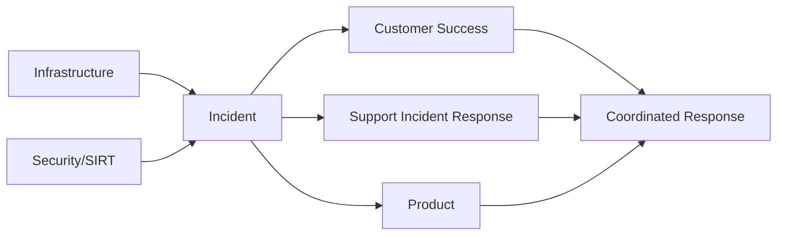
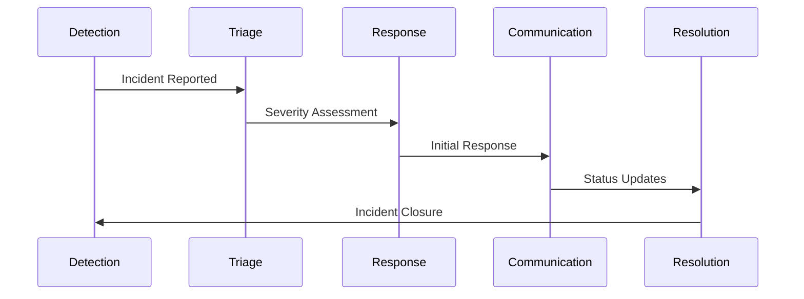

## サポートインシデント対応フレームワーク

サポートエンジニアは、技術的卓越性を維持しながら迅速で協調的な対応を必要とする顧客向けインシデントに定期的に遭遇します。サポートインシデント対応フレームワークは、こうした重要な瞬間に構造を提供し、顧客の権利擁護と効果的な問題解決のバランスを取るのに役立ちます。これは、より広範な組織のインシデントプロセスを補完しつつ、サポートのコンテキストにおける顧客の権利擁護と技術的問題解決という固有の要件に焦点を当てた構造化されたアプローチを提供します。

このフレームワークは、明確なプロセス、定義された役割、体系的な知識共有を通じて実用的なメリットを提供します。個人の経験をチームの知恵に変えることで、ストレスのかかる状況下での認知的負荷を軽減し、調整を改善します。これにより最終的に、サポートエンジニアとしての専門的な成長を支えながら、顧客への解決を迅速化します。

{}

GitLab がインシデントを確実に報告、調査、対応できるようにするための情報をお探しの場合は、[Incident Response Guidance](/handbook/security/product-security/vulnerability-management/incident-response-guidance/) をお探しかもしれません。

インシデントがサポートからの非標準ワークフローまたはコミュニケーションを必要とする場合、まだ作成されていなければ [Support Response Issue](https://gitlab.com/gitlab-com/support/support-team-meta/-/blob/master/.gitlab/issue_templates/Support%20Response.md) を作成してください。

サポートでオンコールを行う詳細をお探しの場合は、[GitLab Support On-Call Guide](/handbook/support/on-call.md) で必要な情報が見つかるかもしれません。

{}

## スコープ内

- 顧客から報告される本番環境の緊急事態
- サポート調整を必要とする GitLab.com サービス停止
- サポート対応を必要とするセキュリティインシデント
- 大量影響の製品 Issue
- リリース後の顧客影響シナリオ

## スコープ外

- 顧客への影響を伴わない純粋なインフラストラクチャインシデント
- 内部システム停止
- 個別の顧客サービスリクエスト
- 機能リクエストとバグレポート
- 緊急ではないサポート問い合わせ

## 統合ポイント





## ワーキング原則

ワーキング原則とは、チームメンバーが顧客のニーズと、より広範なビジネスインシデント対応のニーズに合わせてインシデント対応作業を実施できるようにする行動です。これらは、サポートエンジニアリングインシデント対応者としての作業に GitLab のコアバリューと運用原則を適用することがどのように見えるかを示すのに役立ちます。これらのワーキング原則は GitLab のコアバリューと運用原則を補完するものであり、それらに従属するべきです。両者間で対立がある場合は、ワーキング原則の変更または削除を提案する MR を作成してください。

### 顧客最優先の対応

インシデントの決定では、技術的考慮事項よりも顧客への影響を優先します。顧客体験メトリックは主要な成功指標として機能します。対応戦略は、ワークフローの中断を最小限にし、解決への最速経路を目指します。リソース配分は、まず顧客に影響するコンポーネントに焦点を当てます。

### 明確な説明責任

インシデントは定義された RACI マトリックスと明示的な役割割り当てで運用されます。意思決定権限は、曖昧さを防ぐために文書化された階層に従います。エスカレーションのしきい値は、特定の通知プロトコルをトリガーします。クリティカルパスタスクは、インシデントのライフサイクルを通じて指定された所有者を維持します。

### 継続的な改善

インシデントは追跡されたアクション項目を伴う標準化されたポストモーテム分析を生成します。プロセスレビューは定義された完了基準とともにスケジュールされた間隔で実施されます。パフォーマンスメトリックはデータ検証を通じてフレームワークの強化を推進します。プロセス変更は、完全な実装前に管理されたテストを受けます。

## インシデント対応ガイダンス

このサポートインシデント対応フレームワークは、既存の組織のセキュリティおよびインフラストラクチャのインシデント対応プロセスを補完するように設計されており、[Incident Response Guidance](/handbook/security/product-security/vulnerability-management/incident-response-guidance/) で定義された確立された組織のワークフローから分岐するべきです。

組織全体で改善努力が進むにつれて、サポートインシデント対応フレームワークと他のインシデントフレームワークの間で重複しているように見えるコンテンツが特定されます。重複が検出された場合は、このフレームワークから重複コンテンツを削除し、より広い組織のインシデントフレームワークに統合するためのマージリクエスト（MR）を作成してください。

この統合の取り組みは、顧客向けサポートインシデントに必要な特殊なワークフローを保持しながら、インシデント管理への統一されたアプローチを作成することを目指しています。サポートインシデント対応フレームワークは、それに応じて進化し、一般的なインシデント手順を複製するのではなく、インシデント時の顧客サポートのユニークな側面に重点を置きます。

重複の領域や統合の機会に気付いた場合は、この調整作業を促進するため、適切なプロジェクトで Issue または MR を作成してください。

## 主要な役割とその責務

役割構造と責務のコンポーネントは、顧客に影響を与えるインシデント中に誰が何をするかを定義し、明確な権限ライン、コミュニケーション経路、説明責任を確立します。

これらの役割、責務、およびインターフェースを明確に定義することで、重要なインシデントや高圧的な状況での混乱を排除し、必要なすべての機能を包括的にカバーし、インシデント対応における継続的な改善の基盤を提供します。

## サポート固有の役割

### CMOC（Communications Manager On-call）

**主な焦点:** 顧客影響管理とサポート調整

**ハンドブック:** [CMOC Workflows](/handbook/support/workflows/cmoc_workflows/)

- チケットとモニタリングを通じて顧客影響の範囲と性質を評価
- インシデントの重大度に基づいてサポートチームのリソース配分を調整
- 顧客コミュニケーション戦略を策定・実行
- 明確さと正確性のため、すべての顧客向けメッセージをレビュー・承認
- 追跡のためインシデント固有のタグを Zendesk で作成・適用
- インシデント関連の問い合わせに対する一括チケット応答を処理
- インシデント固有のサポートドキュメントとマクロを管理
- リージョナルサポートチームと連携して 24 時間 365 日のカバレッジを確保
- インシデント全体を通じて変化する顧客影響パターンを追跡

### SMOC（Support Manager On-Call）

**主な焦点:** エスカレーション管理とサポートチームリソース調整

**ハンドブック:** [Support Manager On-Call](/handbook/support/workflows/support_manager-on-call/)

- インシデント中に Support Ticket Attention Requests を処理
- 緊急事態の認定について最終的な判断を下す
- 複数の緊急事態が同時に発生したときに追加のカバレッジを見つける
- サポートに影響するセキュリティインシデントの通知ポイントとして機能
- 必要な場合、顧客との緊急コールをリードする
- 特に困難な顧客コミュニケーションを支援
- プロアクティブな介入を通じて SLA 違反を防ぐ
- アカウントエスカレーション用のサポートマネージャー DRI を見つける
- サポートチームの対応戦略をレビュー・検証

## クロスファンクショナル調整

これらの役割は、さまざまなハンドブックページでさらに詳細に説明されています。以下の定義は、サポートエンジニアリングチームメンバー向けに要約されたコンテキストを提供します。

### Incident Manager On-Call（IMOC）

- 全体的なインシデント対応と技術的側面を調整
- status.io の更新と公開コミュニケーションを管理
- 解決中のクロスチームコラボレーションを促進
- インシデントの重大度とクロージャーのタイミングを判断

### インフラストラクチャチーム

- プラットフォーム Issue の技術的解決を提供
- サポートチームに技術的なステータス更新を提供
- 顧客コミュニケーション用に解決の時間枠を見積もる
- インシデント後の分析でコラボレーション

### カスタマーサクセスチーム

- 戦略的な顧客とのコミュニケーションを管理
- 顧客固有のニーズに関するコンテキストを提供
- 適切な場合、顧客コールに参加
- インシデント後の顧客満足度の測定を支援

### Product チーム

- 製品固有のインシデントとバグを支援
- 顧客コミュニケーションのための製品の専門知識を提供
- 顧客影響データに基づいて修正を優先順位付け
- バグ関連のメッセージングでコラボレーション

### Security Incident Response Team（SIRT）

- セキュリティ関連のインシデント中にセキュリティの専門知識を提供
- 適切な情報開示制限を判断
- セキュリティインシデント用のサポートメッセージングをガイド
- セキュリティ関連の顧客コミュニケーションをレビュー

## 役割インターフェースとハンドオフ

フレームワークは役割間の明確なインタラクションポイントを定義します:

### CMOC <-> IMOC

- IMOC が顧客コミュニケーション用の技術的ステータスを提供
- CMOC が技術的優先順位を伝えるための顧客影響詳細を提供
- 公開ステータス更新の共同承認
- 重大度に基づいた定義された間隔での定期的な同期ポイント

### CMOC <-> SMOC

- SMOC が複雑なサポートシナリオに関するガイダンスを提供
- CMOC がリソースニーズと複雑な顧客状況をエスカレーション
- 緊急事態認定に関する共同決定
- サポートチームのリソース配分でのコラボレーション

### SMOC <-> IMOC

- IMOC がサポートエスカレーション用の技術的コンテキストを提供
- SMOC が対応に伝えるためのサポート影響詳細を提供
- インシデント重大度判断でのコラボレーション
- 顧客影響評価の共同レビュー

### リージョン間ハンドオフ

- リージョン間の引き継ぎに関する文書化要件の定義
- リージョン境界での構造化されたハンドオフコール
- 一貫性のための共通ツールとテンプレート
- タイムゾーンを超えた明確なエスカレーション経路

## サポート役割の関与と離脱

### 関与トリガー

- **CMOC:** 複数の顧客が影響を受ける、または一括コミュニケーションが必要、またはサポートリソース調整が必要
- **SMOC:** 複雑な顧客影響、またはリソース競合、または SLA リスク、または SIRT の関与

### 離脱基準

- 顧客コミュニケーションが安定
- サポートキューが正常化
- 新しい影響パターンがない
- 通常のチケットフローが再開
- 最終ステータスが文書化されている
- 通常のサポートフローへの引き継ぎ

## 今後の検討事項

<details><summary>役割の有効性の測定</summary>

**PROPOSED:** 各役割にはパフォーマンスを評価するための特定の KPI がある | **ISSUE:** TBC

### CMOC メトリック

- 最初の顧客コミュニケーションまでの時間
- インシデント中の顧客満足度
- インシデント全体でのコミュニケーションの一貫性
- サポートリソース活用効率

### SMOC メトリック

- エスカレーション解決までの時間
- リソース配分の有効性
- インシデント中の SLA コンプライアンス
- エスカレーションの適切性

</details>

<details><summary>実装とトレーニング</summary>

**PROPOSED** | **ISSUE:** TBC

- 役割固有のトレーニングカリキュラム
- 定期的なシミュレーション演習
- 新しいチームメンバー向けのシャドウイング機会
- 継続的なスキル開発の道筋

</details>

<details><summary>メトリックと成功指標</summary>

**PROPOSED** | **ISSUE:** TBC

- **応答時間**
  - 説明: 検出から最初の応答までの時間
  - 目標: SEV1/SEV2 で < ____ 分

- **解決時間**
  - 説明: 検出から解決までの時間
  - 目標: 重大度により異なる

- **顧客満足度**
  - 説明: インシデント処理の CSAT スコア
  - 目標: > 90%

</details>

## ハンドオーバーサマリーテンプレート

CMOC と SMOC の役割が Slack チャンネルや Issue で他のステークホルダーと情報を共有する必要があるさまざまなコミュニケーションシナリオ用のサマリーテンプレートをコードブロックとして示します。

### CMOC コミュニケーションテンプレート

#### 初期ステータス更新テンプレート

```markdown
## Incident #[number] - [title]
**Status:** In Progress
**Severity:** [SEV1/SEV2/SEV3]
**Time Detected:** [YYYY-MM-DD HH:MM UTC]

### Issue Summary
[Brief description of the issue - 1-2 sentences]

### Customer Impact
- Systems/services affected: [list affected services]
- Impact type: [complete outage/degraded performance/feature unavailability]
- Estimated affected customers: [number/percentage if known]

### Current Actions
- [Bullet points of what the team is currently doing]

### Next Update
Next status update expected by [time] UTC
```

#### 定期ステータス更新テンプレート

```markdown
## Incident #[number] - [title] - UPDATE #[X]
**Status:** In Progress
**Severity:** [SEV1/SEV2/SEV3]
**Time Detected:** [YYYY-MM-DD HH:MM UTC]
**Last Updated:** [YYYY-MM-DD HH:MM UTC]

### Current Status
[Brief description of the current state - 1-2 sentences]

### Progress Since Last Update
- [Bullet points of actions taken and progress made]

### Ongoing Customer Impact
- [Updated impact assessment]
- Current ticket volume: [number]
- Notable patterns: [describe any patterns in customer reports]

### Next Steps
- [Bullet points of planned actions]

### Next Update
Next status update expected by [time] UTC
```

#### 解決時更新テンプレート

```markdown
## Incident #[number] - [title] - RESOLVED
**Status:** Resolved
**Severity:** [SEV1/SEV2/SEV3]
**Time Detected:** [YYYY-MM-DD HH:MM UTC]
**Time Resolved:** [YYYY-MM-DD HH:MM UTC]
**Duration:** [X hours Y minutes]

### Resolution Summary
[Brief description of how the issue was resolved]

### Final Impact Assessment
- Systems/services affected: [list affected services]
- Total customers impacted: [number/percentage if known]
- Total tickets received: [number]

### Follow-up Actions
- [Any post-incident actions customers should take]
- [Any monitoring customers should perform]

### Additional Information
A full post-incident review will be conducted and findings shared as appropriate.

For any additional questions, please contact support referencing Incident #[number].
```

#### リージョン間ハンドオフテンプレート

```markdown
## Incident #[number] - [title] - HANDOFF
**Status:** In Progress
**Current Region:** [EMEA/AMER/APAC]
**Handoff To:** [EMEA/AMER/APAC]
**Handoff Time:** [YYYY-MM-DD HH:MM UTC]

### Current Situation
[Brief summary of current status - 2-3 sentences]

### Customer Impact Status
- Active tickets: [number]
- Pending responses: [number]
- Escalated issues: [number]

### Communication Status
- Last status.io update: [time] UTC
- Next scheduled update: [time] UTC
- Draft status update: [link or text]

### Priority Actions for Next Shift
1. [Most important action]
2. [Second priority action]
3. [Additional actions as needed]

### Key Stakeholders
- [List of key contacts involved]

### Handoff Acknowledgement
Please acknowledge receipt of this handoff in the incident channel.
```

### SMOC コミュニケーションテンプレート

#### サポートリソース配分テンプレート

```markdown
## Incident #[number] - [title] - SUPPORT RESOURCES
**Status:** In Progress
**Time:** [YYYY-MM-DD HH:MM UTC]
**Resource Request Type:** [Initial/Update/Release]

### Current Support Load
- Active incident-related tickets: [number]
- Current response time: [time]
- Queue health status: [Healthy/Strained/Critical]

### Resource Allocation
- AMER: [X] engineers allocated to incident
- EMEA: [X] engineers allocated to incident
- APAC: [X] engineers allocated to incident

### Priority Guidelines
1. [Top priority issue type]
2. [Second priority issue type]
3. [Standard handling for other issues]

### Special Handling Instructions
- [Any special routing or handling instructions]
- [Any customer-specific considerations]

### Actions Needed
- [Team leads]: [specific action requested]
- [Regional managers]: [specific action requested]
- [Other stakeholders]: [specific action requested]

### Duration Estimate
This resource allocation is expected to remain in place for approximately [time period].
```

#### 顧客影響レポートテンプレート

```markdown
## Incident #[number] - [title] - CUSTOMER IMPACT REPORT
**Status:** [In Progress/Resolved]
**Time:** [YYYY-MM-DD HH:MM UTC]

### Impact Summary
[Brief description of customer impact - 2-3 sentences]

### Impact Metrics
- Total customers reporting issues: [number]
- Percentage of customer base: [estimated percentage]
- Geographic distribution: [regions affected]
- Customer segments affected: [Enterprise/SMB/Personal]

### Common Issues Reported
1. [Most common issue] - [X] reports
2. [Second most common issue] - [X] reports
3. [Third most common issue] - [X] reports

### Customer Sentiment
- Current CSAT trending: [Stable/Declining/Improving]
- Notable customer concerns: [list major themes]

### Recommended Actions
- [Technical team]: [recommended action]
- [Communications team]: [recommended action]
- [Customer success]: [recommended action]

### Additional Information
[Any other relevant details about customer impact]
```

#### CMOC アクティベーションテンプレート

```markdown
## Incident #[number] - [title] - CMOC ACTIVATION
**Status:** In Progress
**Activation Time:** [YYYY-MM-DD HH:MM UTC]
**Requested By:** [Name/Role]

### Activation Criteria Met
- [List specific criteria that triggered activation]

### Current Support Status
- Active tickets: [number]
- Affected customers: [number/types]
- Current response time: [time]

### Initial CMOC Actions
1. [First immediate action]
2. [Second immediate action]
3. [Ongoing monitoring focus]

### Resource Requirements
- Personnel needed: [specific roles/numbers]
- Tools/access needed: [specific requirements]
- Stakeholder engagement needed: [specific teams]

### Actions Needed
- [CMOC]: Acknowledge activation and implement response plan
- [Regional managers]: [specific action requested]
- [Technical teams]: [specific action requested]

### Communication Plan
- Initial customer communication to be sent by: [time]
- Coordination meeting scheduled for: [time]
- Reporting cadence: [frequency]
```

#### インシデント後サポートサマリーテンプレート

```markdown
## Incident #[number] - [title] - SUPPORT SUMMARY
**Status:** Resolved
**Incident Duration:** [start time] to [end time] UTC
**Report Time:** [YYYY-MM-DD HH:MM UTC]

### Support Response Summary
[Brief overview of the support response - 3-4 sentences]

### Key Metrics
- Total tickets handled: [number]
- Peak tickets per hour: [number]
- Average response time: [time]
- Support resources utilized: [number of staff]

### Customer Impact Analysis
- Most affected customer segments: [details]
- Geographic distribution: [details]
- Common workarounds provided: [list]

### Effectiveness Assessment
- What worked well: [bullet points]
- Improvement areas: [bullet points]
- Tool/process gaps identified: [bullet points]

### Follow-up Actions
- [Specific action items with owners and timelines]

### Lessons Learned
[Key takeaways for future incident response]
```

### クロスファンクショナルテンプレート

#### 技術-サポート間ハンドオフテンプレート

```markdown
## Incident #[number] - [title] - TECHNICAL TO SUPPORT HANDOFF
**Status:** [In Progress/On Hold/Resolved]
**Time:** [YYYY-MM-DD HH:MM UTC]

### Technical Summary
[Brief technical explanation of the issue - keep simple and customer-focused]

### Customer-Facing Impact
- What customers are seeing: [observable symptoms]
- Affected components/features: [specific details]
- Scope of impact: [broad/limited/specific customers]

### Workaround Instructions
[Step-by-step workaround if available]

### Customer Communication Guidance
- Key points to communicate: [bullet points]
- Points to avoid mentioning: [bullet points]
- Technical accuracy verified by: [name]

### Expected Resolution
- Estimated time to resolution: [timeframe if known]
- Fix delivery method: [hotfix/regular release/etc.]

### Actions Needed
- [Support team]: [specific guidance on ticket handling]
- [CMOC]: [guidance on status.io messaging]
- [Other teams]: [any other coordination needed]
```

#### エグゼクティブ更新テンプレート

```markdown
## Incident #[number] - [title] - EXECUTIVE SUMMARY
**Status:** [In Progress/On Hold/Resolved]
**Time:** [YYYY-MM-DD HH:MM UTC]

### Situation Overview
[Concise explanation of the incident - 1-2 sentences]

### Business Impact
- Customer impact: [High/Medium/Low] - [brief description]
- Revenue impact: [Yes/No/Unknown] - [brief description if Yes]
- Reputation risk: [High/Medium/Low] - [brief explanation]

### Response Status
- Technical response: [On track/Delayed/Blocked] - [brief status]
- Support response: [On track/Delayed/Blocked] - [brief status]
- Communications: [On track/Delayed/Blocked] - [brief status]

### Key Metrics
- Duration so far: [time]
- Estimated time to resolution: [time or unknown]
- Support tickets: [number]
- Affected customers: [number/percentage]

### Critical Decisions Needed
[List any decisions requiring executive input]

### Next Update
Next executive update scheduled for: [time] UTC
```

これらのテンプレートは、CMOC と SMOC の役割がインシデント中にステークホルダーと共有する必要のあるさまざまなタイプのコミュニケーションのための構造化されたフレームワークを提供します。これらは、フォーマットの一貫性を維持しながら、明確で実行可能、さまざまなインシデントシナリオに適応できるように設計されています。
