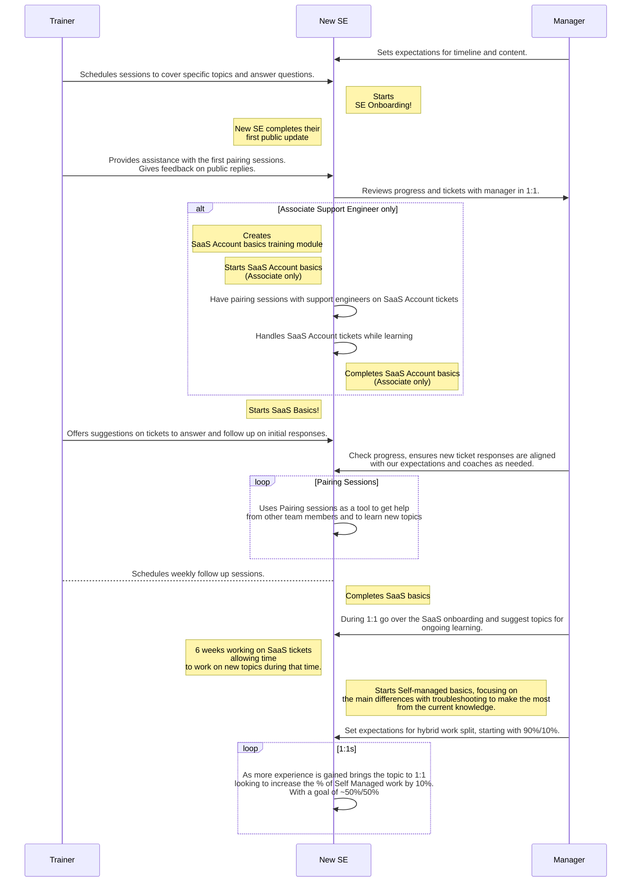

## サポート学習パスウェイ {#support-learning-pathways}

サポートで提供しているすべての学習パスウェイは [こちら](https://gitlab-com.gitlab.io/support/team-pages/skills-by-subject.html) に一覧があります。各パスウェイには複数のモジュールが含まれ、1 つのモジュールが複数のパスウェイに含まれることもあります。

モジュールテンプレートを使って自分用の Issue を作成するには:

- [スキルカタログ](https://gitlab-com.gitlab.io/support/team-pages/skills-catalog.html) ページから、取り組みたいモジュールをクリックする
- タイトルを **_あなたの名前_ - _モジュール名_** とする
- 自分にアサインする
- これでモジュールの指示に従って進める準備が整いました！

**注:** これらのパスウェイについて疑問があれば、[オンボーディングバディ](/handbook/support/training/onboarding_buddy) に連絡してください。バディはいつでも喜んで助けてくれます！

## サポートのハイブリッドモデル {#support-hybrid-model}

ハイブリッドモデルは、[GitLab.com](https://docs.gitlab.com/subscriptions/gitlab_com/)、[Self-Managed](https://docs.gitlab.com/subscriptions/self_managed/)、[GitLab Dedicated](https://docs.gitlab.com/subscriptions/gitlab_dedicated/) のサポートチケットに対応できるよう準備するための、構造化されたトレーニング計画です。ハイブリッドモデルのパスを進めるうえで、これらの [チェックポイント](/handbook/support/training/onboarding_hybrid_path_checkpoints) が役立つかもしれません。

## サポートオンボーディングの概要

チームに加わって間もない頃は、すべてが新しく感じられるはずです。心配いりません！GitLab に素早く慣れていただくため、入社初日に PeopleOps からアサインされる全社共通のオンボーディング Issue とは別に、サポートでもオンボーディングプログラムを用意しています。

オンボーディングの初期に、[サポートチケットライフサイクル](/handbook/support/workflows/ticket_lifecycle/) を学びます。これは、6 つのフェーズ（ロギング、トリアージ／ルーティング、認可、診断、解決、クローズ）にわたるチケット業務を語るための共通言語です。このフレームワークによって、1 対 1、レビュー、チームディスカッションでチケットについて一貫した会話ができるようになります。

パスウェイは 2 つあります。

1. [サポートエンジニアのオンボーディングパスウェイ](#support-engineer-onboarding-pathway)
1. [サポートマネージャーのオンボーディングパスウェイ](#support-manager-onboarding-pathway)

**注:** PeopleOps のオンボーディングとサポートのオンボーディングは同時に開始することもできますし、PeopleOps を完了してからサポートに切り替えることも可能です。最適なパスはマネージャーと相談して決めてください。

## サポートエンジニアのオンボーディングパスウェイ {#support-engineer-onboarding-pathway}

サポートエンジニアのオンボーディング Issue は [New Support Team Member Start Here テンプレート](https://gitlab.com/gitlab-com/support/support-training/-/blob/main/.gitlab/issue_templates/New%20Support%20Team%20Member%20Start%20Here.md) から作成されます。この Issue では、下表のオンボーディングモジュールの完了状況を追跡します。

モジュールは記載された順序で開始することを推奨しますが、学習スタイルにもよります。表には特定の学習パスウェイのモジュールは含まれていない点、またそれらのモジュールをいつ開いて取り組み始めるかも、メンバーによって異なる場合がある点に注意してください。

たとえば、「GitLab サポート学習パスウェイ」を進めるサポートエンジニアの多くは、各種 Basic モジュールの一部を完了したタイミングで「Working on Tickets」モジュールを開いて、他メンバーとのペアリングを始めます。同様に、Self-Managed の GitLab インスタンスを管理した経験があると、モジュールの完了順序が変わることもあります。オンボーディングの進め方に迷ったら、マネージャーに相談してください。

通常、サポートの新メンバーは、下記のオンボーディングモジュール（フォーカス領域パスウェイのモジュールを含む）を **約 6 週間** で完了します。新メンバーが最初のチケット返信を行うのは、通常入社後 28〜38 日（サポートオンボーディングの第 3〜5 週）の間です。

| モジュール                                                                                                                                                                                                      | 期間   | 概要                                                                                                           |
| ----------------------------------------------------------------------------------------------------------------------------------------------------------------------------------------------------------- | ---------- | --------------------------------------------------------------------------------------------------------------------- |
| [Git & GitLab Basics](https://gitlab.com/gitlab-com/support/support-training/-/issues/new?%5Bissue%5Dtitle=YOUR%20NAME%20-%20Git%20and%20GitLab%20Basics&description_template=Git%20and%20GitLab%20Basics)  | 2 日     | 私たちの製品とサービスを理解する                                                                                  |
| [Customer Service Skills](https://gitlab.com/gitlab-com/support/support-training/-/issues/new?issuable_template=Customer%20Service%20Skills&%5Bissue%5Dtitle=YOUR%20NAME%20-%20Customer%20Service%20Skills) | 2 日     | 顧客とどのように関わるかを理解し、カスタマーサービススキルを活用して顧客の成功を確実にする方法を学ぶ |
| [GitLab Support Basics](https://gitlab.com/gitlab-com/support/support-training/-/issues/new?issuable_template=GitLab%20Support%20Basics&%5Bissue%5Dtitle=YOUR%20NAME%20-%20GitLab%20Support%20Basics)       | 1 日      | GitLab サポートの運営方法と最も一般的なワークフローを理解する                                                  |
| [Zendesk Basics](https://gitlab.com/gitlab-com/support/support-training/-/issues/new?issuable_template=Zendesk%20Basics&%5Bissue%5Dtitle=YOUR%20NAME%20-%20Zendesk%20Basics)                                | 1 日      | Zendesk を活用してチケット管理を行う                                                                          |
| [Customer Calls](https://gitlab.com/gitlab-com/support/support-training/-/issues/new?issuable_template=customer_calls&%5Bissue%5Dtitle=YOUR%20NAME%20-%20Customer%20Calls)                                  | 6〜12 時間 | 顧客との成功するコールをいつ、どのように準備しリードするかを理解する                                          |
| [Documentation](https://gitlab.com/gitlab-com/support/support-training/-/issues/new?issuable_template=Documentation&%5Bissue%5Dtitle=YOUR%20NAME%20-%20Documentation)                                       | 1 日      | ドキュメントとマージリクエストの作成に習熟する                                                          |
| [Knowledge Base](https://gitlab.com/gitlab-com/support/support-training/-/issues/new?issuable_template=Knowledge%20Base&%5Bissue%5Dtitle=YOUR%20NAME%20-%20Knowledge%20Base)                                | 1〜2 時間 | GitLab Knowledge Base を理解し、ナレッジ記事の作成方法を学ぶ                                       |

### GitLab サポート学習パスウェイ

GitLab サポートのパスウェイは、私たちが提供するすべてのプラットフォームをカバーします。これらのモジュールを完了することで、サポートエンジニアはどのプラットフォームに関するチケットにも回答できるようになることが期待されます。

**注:** [サポートのハイブリッドモデル](#support-hybrid-model) で述べているとおり、エンジニアは通常、まず 1 つのフォーカス領域を完了し、その後に別の領域を追加します。タイムラインはマネージャーと相談してください。複数のトレーニングモジュールを並行して進めることも可能です！

| モジュール                                                                                                                                                                                                                                                                                 | 期間 | 概要                                                                |
| -------------------------------------------------------------------------------------------------------------------------------------------------------------------------------------------------------------------------------------------------------------------------------------- | -------- | -------------------------------------------------------------------------- |
| [Working on Tickets](https://gitlab.com/gitlab-com/support/support-training/-/issues/new?issuable_template=Working%20On%20Tickets&%5Bissue%5Dtitle=YOUR%20NAME%20-%20Working%20on%20Tickets)                                                                                           | 2 週間  | サポートエンジニアとペアリングしながら顧客を支援し、チケットに返信する   |
| [GitLab-com SaaS Basics](https://gitlab.com/gitlab-com/support/support-training/-/issues/new?issuable_template=GitLab-com%20SaaS%20Basics&%5Bissue%5Dtitle=YOUR%20NAME%20-%20GitLab-com%20SaaS%20Basics)                                                                               | 2 週間  | GitLab.com (SaaS) 製品関連のチケットに回答するための基礎を理解する  |
| [Introduction to GitLab Architecture](https://gitlab.com/gitlab-com/support/support-training/-/issues/new?description_template=Introduction%20to%20GitLab%20Architecture&issue%5Btitle%5D=YOUR%20NAME%20-%20Introduction%20to%20GitLab%20Architecture)                                 | 0.5 日  | GitLab のアーキテクチャを理解する                                             |
| [GitLab Installation & Administration Basics](https://gitlab.com/gitlab-com/support/support-training/-/issues/new?%5Bissue%5Dtitle=YOUR%20NAME%20-%20GitLab%20Installation%20and%20Administration%20Basics&description_template=GitLab%20Installation%20and%20Administration%20Basics) | 1 週間   | GitLab をインストールし管理するさまざまな方法を理解する |
| [Self-Managed Support Basics](https://gitlab.com/gitlab-com/support/support-training/-/issues/new?issuable_template=Self-Managed%20Basics&%5Bissue%5Dtitle=YOUR%20NAME%20-%20Self-Managed%20Basics)                                                                                    | 2 週間  | Self-Managed 製品関連のチケットに回答するための基礎を理解する       |
| [GitLab Dedicated Basics](https://gitlab.com/gitlab-com/support/support-training/-/issues/new?issuable_template=GitLab%20Dedicated&%5Bissue%5Dtitle=YOUR%20NAME%20-%20GitLab%20Dedicated)                                                                                              | 1 週間   | GitLab Dedicated 関連のチケットに回答するための基礎を理解する           |

#### 役割固有のモジュール

一部の役割では、追加のモジュールも必須です。マネージャーから次のモジュールのうち 1 つ以上を完了するよう指示があるかもしれません。

| モジュール | 期間 | 概要 |
| ------ | -------- | ----------- |
| [GitLab.com Administration Access](https://gitlab.com/gitlab-com/support/support-training/-/issues/new?issuable_template=GitLab-com%20Admin) | 0.5 日 | 一部のタスクには Admin アクセス権が必要です。他のトレーニングモジュールから本モジュールの完了を指示されることがあります。 |
| [GitLab-com SaaS Account Basics](https://gitlab.com/gitlab-com/support/support-training/-/issues/new?description_template=GitLab-com%20Saas%20Account%20Basics&%5Bissue%5Dtitle=YOUR%20NAME%20-%20GitLab-com%20SaaS%20Account%20Basics) | 4 日 | **(Associate Support Engineer のみ)** GitLab.com (SaaS) アカウント関連のチケットに回答するための基礎を理解する |
| [License and Renewals](https://gitlab.com/gitlab-com/support/support-training/-/issues/new?issuable_template=Subscriptions%20License%20and%20Renewals&%5Bissue%5Dtitle=YOUR%20NAME%20-%20Subscriptions%20License%20and%20Renewals) | 2 週間 | 製品のライセンスと更新に関するチケットに回答するための基礎を理解する |
| [Shift Engineer](https://gitlab.com/gitlab-com/support/support-training/-/issues/new?description_template=Shift%20Engineer)| 3 日 | **(Shift Engineer のみ)** Shift Engineer 役割の責務を理解する |

これらのモジュールを完了したら:

1. マネージャーに [対応するオンコールローテーションのトレーニングに進む準備ができた](#on-call-rotations) ことを伝える。
1. マネージャーと一緒に、[support-team プロジェクト](https://gitlab.com/gitlab-com/support/team-pages) における Area of Focus の割合の記述方法を相談し、オンボーディングを除外する。

### オンコールローテーション {#on-call-rotations}

Area of Focus を完了したら、マネージャーとオンコールローテーションへの参加について相談しましょう。通常、これらのモジュールはどれか 1 つだけを完了し、参加するオンコールローテーションも 1 つだけです。

| モジュール                                                                                                                                                                                                            | 期間 | 概要                                                                                                                                                                                               |
| ----------------------------------------------------------------------------------------------------------------------------------------------------------------------------------------------------------------- | -------- | --------------------------------------------------------------------------------------------------------------------------------------------------------------------------------------------------------- |
| [GitLab.com CMOC](https://gitlab.com/gitlab-com/support/support-training/-/issues/new?description_template=GitLab-com%20CMOC&%5Bissue%5Dtitle=YOUR%20NAME%20-%20GitLab-com%20CMOC)                                | 1 日    | アクティブな GitLab.com インシデントに対する [Communications Manager On Call (CMOC)](/handbook/engineering/infrastructure-platforms/incident-management/#incident-response-roles) としての責務を理解する |
| [Customer Emergencies](https://gitlab.com/gitlab-com/support/support-training/-/issues/new?description_template=Customer%20Emergency%20On-Call&%5Bissue%5Dtitle=YOUR%20NAME%20-%20Customer%20Emergency%20On-Call) | 1 週間   | Customer Emergencies のオンコールとしての責務を理解する                                                                                                                                 |

### サポートエンジニアの達成可能な進捗 - 最初の 6 か月 {#support-engineer-achievable-progress---first-6-months}

私たちのオンボーディングパスウェイでは、新人サポートエンジニアが自分のペースで学び、探求できるよう設計されています。私たちは [70/20/10 ラーニングモデル](https://trainingindustry.com/wiki/content-development/the-702010-model-for-learning-and-development/) に基づき、実践による学びを強く信じており、サポートエンジニアにはできるだけ早くチケット業務に貢献し始めることを推奨します。

成長やスキルはメトリクスのみで測れるものではありませんが、次の参考表は、GitLab サポートでの最初の 6 か月でチケット管理に慣れていく際のガイドラインとして使えます。進捗やチケット量に不安があれば、自分の貢献状況についてマネージャーと話してください。

**月次進捗の参考表**
下記の表は、最初の 6 か月にわたる Ticket Assignment（チケットアサイン）の期待される進捗と、オンコール責務へのオンボーディングのマイルストーンを示しています。これらのガイドラインは、顧客の問題対応における効率性と専門性の高まりを把握するのに役立ちます。

| 月 | 週次チケットアサイン量（アソシエイトエンジニア） | 週次チケットアサイン量（インターミディエイト／シニアエンジニア） | オンコールマイルストーン（インターミディエイト／シニアエンジニア）                                                                                                                                                                                               |
| ----- | ----------------------------------------------------- | --------------------------------------------------------------- | ------------------------------------------------------------------------------------------------------------------------------------------------------------------------------------------------------------------------------------------------ |
| 1     | SM/SaaS/Dedicated 1〜2 件 もしくは SaaS Account 5〜7 件             | SM/SaaS/Dedicated 1〜2 件                                           | -                                                                                                                                                                                                                                                |
| 2     | SM/SaaS/Dedicated 1〜2 件 もしくは SaaS Account 8〜12 件            | SM/SaaS/Dedicated 2〜4 件                                           | -                                                                                                                                                                                                                                                |
| 3     | SM/SaaS/Dedicated 2〜3 件 もしくは SaaS Account 10〜15 件           | SM/SaaS/Dedicated 4〜5 件                                           | -                                                                                                                                                                                                                                                |
| 4     | SM/SaaS/Dedicated 2〜3 件 もしくは SaaS Account 10〜15 件           | SM/SaaS/Dedicated 4〜5 件                                           | オンコールモジュールを完了                                                                                                                                                                                                                      |
| 5     | SM/SaaS/Dedicated 3〜5 件 もしくは SaaS Account 15〜20 件           | SM/SaaS/Dedicated 5〜6 件                                           | シャドウシフトを開始                                                                                                                                                                                                                               |
| 6     | SM/SaaS/Dedicated 3〜5 件 もしくは SaaS Account 15〜20 件           | SM/SaaS/Dedicated 5〜6 件                                           | シャドウシフトを継続し、マネージャーと連携しつつ 7〜8 か月目あたりで CEOC 業務への対応準備を目指す。CEOC レベルのサポートを提供するうえで自信や能力を確かにするためにより多くの時間が必要であれば、開始時期を後ろ倒しすることに合意できます。 |

加えて、3 か月目までに必要なすべてのオンボーディングモジュールを完了し、学びと知識共有を加速させるために、週 4〜5 回のペアリングセッションに参加してください。

---

### 継続的な学習

サポートエンジニアにはオンボーディング後も継続的に学び続けることが期待されます。[サポートエンジニアの責務](/handbook/support/support-engineer-responsibilities/#develop-your-skills-through-learning-and-training-weekly) のとおり、サポートエンジニアは四半期（3 か月）ごとにトレーニングモジュールを 1 つ完了することを目指してください。

現行のすべてのトレーニングモジュール／モジュールは [Support Training プロジェクト](https://gitlab.com/gitlab-com/support/support-training/-/tree/main/.gitlab/issue_templates) で確認できます。私たちは継続的にモジュールを追加し、より多くの学習パスウェイを構築しています。[GitLab の誰でもサポート専用のトレーニングを作成・貢献できます！](#creating-and-viewing-gitlab-component-based-training)

### GitLab コンポーネントベースのトレーニングの作成と閲覧 {#creating-and-viewing-gitlab-component-based-training}

GitLab で働く誰もが、GitLab とその各種コンポーネントの使い方、設定、デバッグに関するサポート専用のカスタムトレーニングの作成に貢献できます。既存の [Support Training プロジェクト](/handbook/support/training/) の中には [Support Specific Trainings](https://gitlab.com/gitlab-com/support/support-training/-/tree/main/Support%20Specific%20Trainings) というディレクトリがあり、モジュール形式ではない短めのトレーニング資料や動画を保管できる場所として用意されています。このディレクトリには [ReadMe](https://gitlab.com/gitlab-com/support/support-training/-/blob/main/Support%20Specific%20Trainings/ReadMe.md) があり、ディレクトリへのトレーニング資料の追加方法と関連動画のアップロード先について具体的に説明しています。

---

## サポートマネージャーのオンボーディングパスウェイ {#support-manager-onboarding-pathway}

サポートマネージャーのオンボーディング Issue は [New Support Team Member Start Here テンプレート](https://gitlab.com/gitlab-com/support/support-training/-/blob/main/.gitlab/issue_templates/New-Support-Team-Member-Start-Here.md) をベースとしています。この Issue は、下表のオンボーディングモジュールの追跡と完了を行います。

別の作業を同時に始めて構わないと Issue に明記されている場合を除き、モジュールは記載された順序で完了することを推奨します。通常、サポートの新マネージャーは下記のオンボーディングモジュールを **3 週間** で完了します。

| モジュール                                                                                                                                                                                                                  | 期間 | 概要                                                                        |
| ----------------------------------------------------------------------------------------------------------------------------------------------------------------------------------------------------------------------- | -------- | ---------------------------------------------------------------------------------- |
| [Support Manager Basics](https://gitlab.com/gitlab-com/support/support-training/-/issues/new?description_template=Support%20Manager%20Basics&%5Bissue%5Dtitle=YOUR%20NAME%20-%20Support%20Manager%20Basics)             | 2 週間  | オンコールローテーションを含む、サポートマネジメントのプロセスとワークフローを理解する |
| [Git & GitLab Basics](https://gitlab.com/gitlab-com/support/support-training/-/issues/new?%5Bissue%5Dtitle=YOUR%20NAME%20-%20Git%20and%20GitLab%20Basics&description_template=Git%20and%20GitLab%20Basics)              | 2 日   | 私たちの製品とサービスを理解する                                               |
| [GitLab Support Basics](https://gitlab.com/gitlab-com/support/support-training/-/issues/new?issuable_template=GitLab%20Support%20Basics&%5Bissue%5Dtitle=YOUR%20NAME%20-%20GitLab%20Support%20Basics)                   | 1 日    | GitLab サポートの運営方法と最も一般的なワークフローを理解する               |
| [Zendesk Basics](https://gitlab.com/gitlab-com/support/support-training/-/issues/new?issuable_template=Zendesk%20Basics&%5Bissue%5Dtitle=YOUR%20NAME%20-%20Zendesk%20Basics)                                            | 1 日    | Zendesk を活用してチケット管理を行う                                       |
| [Customer Emergencies](https://gitlab.com/gitlab-com/support/support-training/-/issues/new?description_template=Customer%20Emergency%20On-Call&%5Bissue%5Dtitle=YOUR%20NAME%20-%20Customer%20Emergency%20On-Call)       | 1 週間   | Customer Emergencies のオンコールとしての責務を理解する          |
| [SSAT Reviewing for Managers](https://gitlab.com/gitlab-com/support/support-training/-/issues/new?description_template=SSAT%20Reviewing%20Manager&%5Bissue%5Dtitle=YOUR%20NAME%20-%20SSAT%20Reviewing%20for%20Managers) | 1 日    | サポート満足度フィードバックの結果に対応する方法を理解する                     |

このパスウェイを完了したら、マネージャーに対応するオンコールローテーションへの参加準備ができたことを伝えてください。（具体的な手順は Support Manager Basics の Issue に含まれています。）

_いつものことながら、このページをよりよくする提案があれば、Issue や MR を提出してください！_
