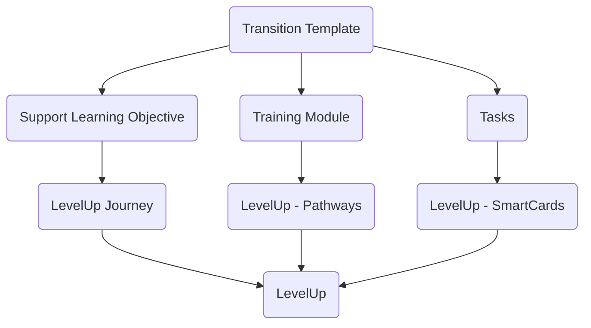

このドキュメントでは、既存の [GitLab サポートのトレーニングモジュール](https://gitlab.com/gitlab-com/support/support-training/) を [LevelUp](https://levelup.edcast.com/home) に移行するためのプロセスについて説明します。

## 移行テンプレート

次のテンプレートは、トレーニングモジュールの各要素が LevelUp のコンポーネントにどのように対応するかを示しています。

## 移行プロセス

### Step 1 - 移行の目標を定義する

移行の最初のステップは、LevelUp 上でそのトレーニングがどのように機能するか、どんな新しいコンポーネントが使われるか、どんな制約があるかを可視化することです。

LevelUp で考慮すべき主な要素は次のとおりです。

1. **クイズ**

    現時点では、シングルセレクトまたはマルチセレクト形式の回答質問のみが利用可能です。

1. **プロジェクト型 SmartCard**

    この SmartCard では、URL の入力を求めることができます。アクセスリクエストやペアリング Issue など、Issue を依頼して検証するのに便利な機能です。

### Step 2 - Pathway を作成する

[LevelUp ハンドブックページ](/handbook/people-group/learning-and-development/level-up/#pathways) に記載された手順に従うことを推奨します。

トレーニングモジュールは LevelUp 上で Pathway になります。

- Pathway を作成する

    Pathway はトレーニングモジュールで使用される Issue に相当します。

- 共同編集者を定義する

    共同編集者は Pathway の設定を変更したり、Pathway に SmartCard を追加したりできます。

- Pathway をプライベートに設定する

    この設定は移行中に必要です。最終的な設定は、トレーニングモジュールの対象者によって異なる場合があります。

- バッジを作成し、教材を完了したメンバーがプロフィールにバッジを表示できるようにします。

### Step 3 - SmartCard を作成する

[LevelUp ハンドブックページ](/handbook/people-group/learning-and-development/level-up/#smartcards) に記載された手順に従うことを推奨します。

タスクは LevelUp 上で SmartCard になります。

- Pathway を編集するオプションを選び、そこから SmartCard を作成します。
- どの SmartCard 種別でも使用できます。
- クイズは任意ですが推奨されます。トレーニングの長さに応じて、セクションごとに 1 つ、または途中と最後に 1 つずつ用意できます。
- SmartCard をロック設定にして、各 SmartCard が前の SmartCard の完了を必要とするようにしてください。
- 工夫を凝らしましょう！LevelUp ではさまざまな SmartCard 種別が利用でき、`iframe with html` により他のツールも組み込めます。

### Step 4 - テスト実行

共同編集者または作成者の立場では、Pathway を完全にテストすることはできません。このステップでは、Pathway をテストしてくれるボランティアが必要になります。

- Pathway をプライベートのまま公開します。
- Pathway の `Share` フィールドに `reviewers` を追加します。
- Pathway の URL を `reviewers` と共有します。

#### 成功とはどのような状態か？

- どの SmartCard もスキップできない。
- クイズの正解が正しく設定されている。
- Pathway を完了すると進捗が 100% と表示される。

### Step 5 - L&D チームの最終レビューを依頼し、公開する

- 最初のステップで作成した Issue にコメントを残し、最終レビューを依頼します。
- Pathway が承認されたら、対象者に応じて公開設定に変更します。

## 留意事項

- Pathway の作成者は DRI とみなされます。トレーニングの重要な更新が LevelUp にも可能な限り早く反映されるようにしてください。
