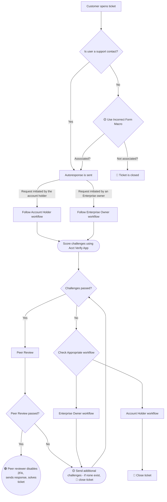

## 概要

このワークフローは、GitLab.com アカウントの [二要素認証](https://docs.gitlab.com/ee/user/profile/account/two_factor_authentication.html)（2FA）の無効化に焦点を当てています。リクエストの認証に関する一般的な原則は、[アカウント認証ワークフロー](account_verification.html) でカバーされています。

2FA 解除およびその他のアカウントアクションは、以下の[ワークフロー](#workflows)が成功した場合にのみ完了できます。

## 関連トピック

### GitLab チームメンバー

ユーザーが GitLab チームメンバーである場合は、[IT Ops に連絡](/handbook/security/corporate/end-user-services/_index.md)してもらってください。

## GitLab 内での 2FA 解除

### セルフサービスでの 2FA 解除

多くの場合、ユーザーは **サポートに連絡せずに** 自分で 2FA を無効化してアカウントへのアクセスを取り戻せます。サポートチケットを作成する前に、ユーザーは以下の該当するすべての回復方法を試すべきです。

*なお、GitLab Support は、GitLab サブスクリプションを購入し、[本人確認チャレンジ](https://support.gitlab.com/hc/en-us/articles/24875626886556-Two-Factor-Authentication-2FA-Reset-Requirements-for-GitLab-com)に正常に合格しない限り、[無料ユーザーの 2FA リセットには対応しません](https://about.gitlab.com/blog/gitlab-support-no-longer-processing-mfa-resets-for-free-users/)。無料ユーザーに対してセルフサービスの方法が機能しない場合は、まずサブスクリプションを購入するために [GitLab Sales](https://about.gitlab.com/sales/) に連絡するよう案内してください。サブスクリプションを取得し購入の証明を提供できる場合に限り、サポートは 2FA リセットのための本人確認を進めるべきです。*

## 利用可能な回復方法

1. **GitLab リカバリーコード -** ユーザーは多要素認証を最初に有効化したときに保存した [リカバリーコード](https://docs.gitlab.com/user/profile/account/two_factor_authentication/#recovery-codes) を使用できます。
1. **SSH キーを使ったコードの再生成 -** ユーザーが GitLab アカウントに SSH キーを追加している場合、SSH を使ってリカバリーコードを再生成できます。以下に説明します。

   1. コンソール／ターミナルで `ssh git@gitlab.com 2fa_recovery_codes` を実行します。
   1. 新しいリカバリーコードを生成するか尋ねられたら 'yes' と答えます。
   1. リカバリーコードのうち 1 つをコピーします。
   1. [https://gitlab.com](https://gitlab.com) に通常のユーザー名とパスワードでサインインします。二要素認証コードを尋ねられたら、先ほどコピーしたリカバリーコードを貼り付けます。
   1. 認証に成功したら、**Profile -> Account** に進みます。
   1. 二要素認証を無効化します。
   1. 新しいデバイス（Google Authenticator、Duo Security など）で二要素認証を再度有効化します。

1. **認証アプリのクラウドバックアップ -** 一部の認証アプリは、新しいデバイスで [2FA コードを復元できるクラウドバックアップ機能](https://docs.gitlab.com/user/profile/account/two_factor_authentication_troubleshooting/#restore-2fa-codes-from-authenticator-backup)を提供しています。**これはデバイスを失う前にバックアップが有効化されていた場合にのみ機能します。**

   1. 新しいデバイスに認証アプリをインストールします。
   1. 特定の認証アプリの回復プロセスに従います。
   1. ユーザー名、パスワード、復元された 2FA コードを使って [https://gitlab.com](https://gitlab.com) にサインインします。

   **注:** GitLab Support は認証アプリ固有の回復問題には対応しません。詳細な回復手順については、ユーザーは認証アプリの公式ドキュメントを参照する必要があります。

### Enterprise ユーザーに対する Enterprise オーナーによる 2FA 解除

トップレベルグループのオーナーは、グループメンバーでもある [すべての enterprise ユーザーに対して 2FA を無効化](https://docs.gitlab.com/security/two_factor_authentication/#enterprise-users)できます。ユーザーは、[グループに検証済みドメインがあり](https://docs.gitlab.com/ee/user/enterprise_user/#verified-domains-for-groups)、ユーザーが [Enterprise ユーザーの基準](https://docs.gitlab.com/user/enterprise_user/#automatic-claims-of-enterprise-users)を満たしている場合に、自動的に Enterprise ユーザーとしてクレームされます。

## 定義

- **アカウント保有者**: アカウントを日常的に使用する人。本人がアカウントオーナーであるとは限りません。
- **Enterprise オーナー**: GitLab で有償プランを購入したビジネス事業体を代表し、その有償ネームスペースで Owner 権限を持ち、[Enterprise ユーザーとしてクレームされている](https://docs.gitlab.com/user/enterprise_user) 1 人以上の人。
- **Owner**: GitLab で有償プランを購入したビジネス事業体を代表し、その有償ネームスペースで Owner 権限を持つが、[Enterprise ユーザーとしてクレームされていない](https://docs.gitlab.com/user/enterprise_user) 1 人以上の人。

**注:** サポートの目的では、ユーザーが [サポートにおける Enterprise ユーザーの定義](/handbook/support/workflows/gitlab-com_overview/#enterprise-users) を満たす場合は、引き続き enterprise ユーザーとみなされる可能性があります。

## GitLab.com ユーザーの条件

GitLab.com ユーザーが 2FA リセットの対象となるためには、以下の条件 **のいずれか** を満たす必要があります。

1. ユーザーが GitLab.com の有償グループでシートを占めている、またはトップレベルグループのオーナーがそのユーザーを有償グループに追加する意向がある。
1. ユーザーが [Enterprise ユーザー](https://docs.gitlab.com/user/enterprise_user/#automatic-claims-of-enterprise-users) としてクレームされている。
1. ユーザーが [Enterprise ユーザー](/handbook/support/workflows/gitlab-com_overview/#enterprise-users) のサポートでの定義を満たしている。
1. ユーザーが GitLab.com の購入に関する現行の請求書のプライマリー請求担当者である。
1. GitLab チームメンバー（アカウントマネージャー、CSM、その他）がアカウント管理プロジェクトでこのアカウントの保有者と協力している。
1. ユーザーアカウントが、有償サブスクリプションを管理するための Customers Portal への SSO アクセスに必要である - [Customers Portal アクセスにアカウントが使用される場合の 2FA リセット条件](#conditions-when-account-is-used-to-access-customers-portal)を参照。

より簡潔に言うと: 有償ユーザーである、アカウントを支払いに使用している、または私たちがアカウントを通じて連絡を取っている、ということです。

多くの場合、トップレベルグループのオーナーがユーザーに代わってチケットを提出することがあります。詳細と適格性については、[アカウント認証マトリクス](/handbook/support/workflows/account_verification.md#account-verification-matrix) を参照してください。

### アカウント認証マトリクス

アカウント認証マトリクスは [Account Owner Verification ハンドブックページ](/handbook/support/workflows/account_verification.md#account-verification-matrix)にあります。

### Customers Portal アクセスにアカウントが使用される場合の条件

[Customers Portal](https://customers.gitlab.com) では、すべての顧客が [リンクされた GitLab アカウント](https://docs.gitlab.com/ee/subscriptions/customers_portal.html#link-a-gitlabcom-account) を通じてアクセスする必要があります。

ユーザーが対象であり、2FA をリセットできるのは、以下の条件 **のいずれか** が満たされる場合です:

1. リクエストが GitLab サブスクリプションの最新の請求書のプライマリー請求担当者から行われている。
1. GitLab アカウントが、サブスクリプション購入の最新の請求書のプライマリー請求担当者の Customers Portal アカウントにリンクされている。

請求書を提供できない場合は、[レガシーのメール／パスワードでサインイン](https://customers.gitlab.com/customers/sign_in?legacy=true)するように提案してください。そこで請求書をダウンロードできます。

## チケットを簡潔かつ正確に保つ

2FA 解除のチケットは **記録の対象** であるため、チケットは簡潔で、正確で、アクセス問題に厳密にフォーカスしている必要があります。
**お客様が無関係なトピックを持ち込むことを許してはいけません。**

## サポート介入による 2FA の無効化

上記の手順を試した後のサポート介入による 2FA 解除は、チケット作成時に *有償プラン* を持つユーザーに対してのみ可能です。

### ワークフロー

#### アカウント保有者によって開始された 2FA 解除リクエスト

アカウント保有者によって開始されたリクエストは、セキュリティチャレンジを満たすための情報を提供するように自動返信が促します。

##### Step 0: 検証

いくつかの初期検証ステップが自動的に実行されます:

- メール／ユーザー名の一致
- グループメンバーシップの検証
- グループサブスクリプションの検証

これらのいずれかが不正確な場合、チケットはクローズされます。

ユーザーが `2FA Assistance` カテゴリを使用して 2FA リセットリクエストチケットを送信したが `2FA removal` チケットサブカテゴリを使用していない場合、フォームのサブカテゴリを `2FA removal` に設定してください。チケットが明らかに 2FA リセットに関するものでありながら、お客様が 2FA チケットカテゴリのいずれも使用していなかった場合は、[`General::Forms::Incorrect form used` マクロ](https://gitlab.com/gitlab-com/support/zendesk-global/macros/-/blob/master/active/General/Forms/Incorrect%20form%20used.md) を使用して、Support Operations にチケットに対する適切なアクションを取ってもらってください。ユーザーがサポート対象でない場合、チケットは自動的にクローズされます。

##### Step 1: チャレンジの回答を確認する

> **注**: ユーザーが返してきた情報がごく僅かで、明らかに不十分または曖昧な場合は、その回答後すぐに追加情報を求める返信を行ってください。「コミットの正確な日付と時刻を提供してください、おおよそのものでなく」など、追加のガイダンスを提供できます。

1. チャレンジの回答を検証するには、Zendesk GitLab User Lookup App を使用するか、admin アクセスがある人は `https://gitlab.com/admin/users/USERNAME` で確認します。
1. ZenDesk GitLab Super App の 2FA Helper を使用して、ユーザーの回答に基づき [リスクファクター](https://internal.gitlab.com/handbook/support/#risk-factors-for-an-individual-trying-to-access-their-own-account) （GitLab 内部）を判定します。データ分類基準と注釈は [Internal Handbook - Data Classification table](https://internal.gitlab.com/handbook/support/#data-classification) （GitLab 内部）にあり、これが情報源として扱われます。アプリ経由ではなく手動でコメントを残す必要がある場合は、[`Support::SaaS::Gitlab.com::2FA::2FA Internal Note` マクロ](https://gitlab.com/gitlab-com/support/zendesk-global/macros/-/blob/master/active/Support/SaaS/GitLab.com/2FA/2FA%20Internal%20Note.md?ref_type=heads) を使用してチケットに内部ノートを追加してください。
   - ユーザーが有償ネームスペースのメンバーである場合、チャレンジの回答は有償ネームスペースに対して評価する必要があります。ユーザーが有償ネームスペースのメンバーでない場合は、追加のガイダンスのために [2FA リセット検討の条件](#conditions-for-gitlabcom-users) を参照してください。

1. **検証に合格した場合:** Slack `#support_gitlab-com` でチームの別のメンバーに自分の決定をピアレビューしてもらうようリクエストします。彼らが 2a の手順を実行します。
1. **検証に失敗した場合**: Step 2b に進みます。

##### Step 2a: ユーザーがアカウント所有権の証明に成功した場合

このセクションは通常ピアレビュアーが行います。必要であれば、ピアレビュアー（または承認マネージャー）が承認ノートを残し、その場合は元のレビュアーがアクションを実行します。

1. その決定に同意する場合、admin アカウントにサインインしてユーザーテーブルからユーザー名を見つけるか、`https://gitlab.com/admin/users/usernamegoeshere` に移動します
      1. account タブで `Edit` をクリックし、[Admin Note](/handbook/support/workflows/admin_note.md) を追加して保存します。
      1. account タブで `Disable 2FA` をクリックします。
      1. `Support::SaaS::Gitlab.com::2FA::2FA Removal Verification - Successful` [マクロ](https://gitlab.com/gitlab-com/support/zendesk-global/macros/-/blob/master/active/Support/SaaS/GitLab.com/2FA/2FA%20Removal%20Verification%20-%20Successful.md?ref_type=heads) を使用します。

##### Step 2b: ユーザーがアカウント所有権の証明に失敗した場合

> **注**: 回答へのヒントを提供したり、どのチャレンジが正しかった／間違っていたかをユーザーに伝えたりしては *いけません*。それがソーシャルエンジニアリングの仕組みです！

1. ユーザーがリスクファクターをパスできない場合:
   1. 検証なしでは 2FA を解除できないことを伝え、ただし Enterprise オーナーが彼らに代わってリクエストを作成することは可能（資格を満たす場合）と伝えるために、`Support::SaaS::Gitlab.com::2FA::2FA Removal Verification - GitLab.com - Failed - Final Response` [マクロ](https://gitlab.com/gitlab-com/support/zendesk-global/macros/-/blob/master/active/Support/SaaS/GitLab.com/2FA/2FA%20Removal%20Verification%20-%20GitLab.com%20-%20Failed%20-%20Final%20Response.md?ref_type=heads) を使用します。
   1. チケットを「Solved」としてマークします。

#### Enterprise オーナーによって開始された 2FA 解除リクエスト

Enterprise オーナーによって開始されたリクエストには、[Support PIN](https://docs.gitlab.com/user/profile/#generate-or-change-your-support-pin) が含まれている必要があります。

Enterprise オーナーが開始した 2FA 解除のチケットが提出されると、Zendesk は次のチェックを行うことに注意してください:

1. サポート資格を持っているか？
1. リクエスター側のメールドメインがターゲットのメールドメインと一致するか？
1. リクエスターがトップレベル有償ネームスペースのオーナーか？
1. ターゲットがトップレベル有償ネームスペース配下のメンバーか？

これらのいずれかが失敗した場合、ユーザーには通常の 2FA チャレンジが送信されます。この場合は以下の [Step 1b](#step-1b-checking-challenge-answers) を使用してください。

他のチャレンジが送信される場合、オーナーは **自分の** アカウントに関して回答すべきであることに注意してください。他の回答は受け入れられません。

##### Step 0: 検証

いくつかの初期検証ステップが自動的に実行されます:

- メール／ユーザー名の一致
- グループメンバーシップの検証
- グループサブスクリプションの検証

これらのいずれかが不正確な場合、チケットはクローズされます。

##### Step 1a: Support PIN の検証

> **注**: ユーザーが返してきた情報がごく僅かで、明らかに不十分または曖昧な場合は、その回答後すぐに追加情報を求める返信を行ってください。

1. **ユーザーに通常のチャレンジ回答が送信されていた場合**、代わりに [Step 1b](#step-1b-checking-challenge-answers) を使用します。
1. ZenDesk GitLab Super App の 2FA Helper（[2025 年 5 月 1 日時点](https://gitlab.com/gitlab-com/gl-security/corp/cust-support-ops/issue-tracker/-/issues/1)）を使用して、ユーザーの回答に基づいて [リスクファクター](https://internal.gitlab.com/handbook/support/#risk-factors-for-an-enterprise-owner-operating-on-an-enterprise-user-account) （GitLab 内部）を判定します。データ分類基準と注釈は [Internal Handbook - Data Classification table](https://internal.gitlab.com/handbook/support/#data-classification) （GitLab 内部）にあり、これが情報源として扱われます。アプリ経由ではなく手動でコメントを残す必要がある場合は、[`Support::SaaS::Gitlab.com::2FA::2FA Internal Note` マクロ](https://gitlab.com/gitlab-com/support/zendesk-global/macros/-/blob/master/active/Support/SaaS/GitLab.com/2FA/2FA%20Internal%20Note.md?ref_type=heads) を使用してチケットに内部ノートを追加してください。
1. Support PIN を検証するには admin アクセスを使用し `https://gitlab.com/admin/users/USERNAME` で確認します。
   - **注:** Support PIN がチケットの該当オーナーから提供されたものであることを確認してください。チケット内の他のユーザーがオーナーに代わって提供した Support PIN は受け入れられません。
1. ユーザーに Support PIN レスポンスが送信されているため、他の必要な条件はすでに満たされています:
    - リクエスターは Enterprise オーナー
    - ターゲットは Enterprise ユーザー

1. **検証に合格した場合:** Slack `#support_gitlab-com` でチームの別のメンバーに自分の決定をピアレビューしてもらうようリクエストします。彼らが 2a の手順を実行します。
1. **検証に失敗した場合**: Step 2b に進みます。

##### Step 1b: チャレンジの回答を確認する

> **注**: ユーザーが返してきた情報がごく僅かで、明らかに不十分または曖昧な場合は、その回答後すぐに追加情報を求める返信を行ってください。

1. ユーザーに Zendesk で Support PIN の自動応答が送信された場合は、このステップをスキップします。
1. チャレンジの回答を検証するには、Zendesk GitLab User Lookup App を使用するか、admin アクセスがある人は `https://gitlab.com/admin/users/USERNAME` で確認します。
1. ZenDesk GitLab Super App の 2FA Helper を使用して、ユーザーの回答に基づき [リスクファクター](https://internal.gitlab.com/handbook/support/#risk-factors-for-account-ownership-verification) （GitLab 内部）を判定します。データ分類基準と注釈は [Internal Handbook - Data Classification table](https://internal.gitlab.com/handbook/support/#data-classification) （GitLab 内部）にあり、これが情報源として扱われます。アプリ経由ではなく手動でコメントを残す必要がある場合は、[`Support::SaaS::Gitlab.com::2FA::2FA Internal Note` マクロ](https://gitlab.com/gitlab-com/support/zendesk-global/macros/-/blob/master/active/Support/SaaS/GitLab.com/2FA/2FA%20Internal%20Note.md?ref_type=heads) を使用してチケットに内部ノートを追加してください。
   - ユーザーが有償ネームスペースのメンバーである場合、チャレンジの回答は有償ネームスペースに対して評価する必要があります。ユーザーが有償ネームスペースのメンバーでない場合は、追加のガイダンスのために [2FA リセット検討の条件](#conditions-for-gitlabcom-users) を参照してください。

1. **検証に合格した場合:** Slack `#support_gitlab-com` でチームの別のメンバーに自分の決定をピアレビューしてもらうようリクエストします。彼らが 2a の手順を実行します
1. **検証に失敗した場合**: Step 2b に進みます

##### Step 2a: Enterprise オーナーが本人確認に成功した場合

このセクションは通常ピアレビュアーが行います。必要であれば、ピアレビュアー（または承認マネージャー）が承認ノートを残し、その場合は元のレビュアーがアクションを実行します。

1. その決定に同意する場合、admin アカウントにサインインしてユーザーテーブルからユーザー名を見つけるか、`https://gitlab.com/admin/users/usernamegoeshere` に移動します
      1. account タブで `Edit` をクリックし、[Admin Note](/handbook/support/workflows/admin_note.md) を追加して保存します。
      1. account タブで `Disable 2FA` をクリックします。
      1. `Support::SaaS::Gitlab.com::2FA::2FA Removal Verification - Successful` [マクロ](https://gitlab.com/gitlab-com/support/zendesk-global/macros/-/blob/master/active/Support/SaaS/GitLab.com/2FA/2FA%20Removal%20Verification%20-%20Successful.md?ref_type=heads) を使用します。

##### Step 2b: Enterprise オーナーが本人確認に失敗した場合

> **注**: 回答へのヒントを提供したり、どのチャレンジが正しかった／間違っていたかをユーザーに伝えたりしては *いけません*。それがソーシャルエンジニアリングの仕組みです！

1. ユーザーがリスクファクターをパスできない場合:
   1. `Support::SaaS::GitLab.com::2FA::Additional 2FA Challenges` [マクロ](https://gitlab.com/gitlab-com/support/zendesk-global/macros/-/blob/master/active/Support/SaaS/GitLab.com/2FA/Additional%202FA%20Challenges.md?ref_type=heads) で追加のチャレンジを送信します。
   1. オーナー保証として [Support PIN](https://docs.gitlab.com/user/profile/#generate-or-change-your-support-pin) を生成し、チケットへの返信で提供してもらうようオーナーに依頼することができます。注: 別のユーザーがチケットに CC されている場合、Support PIN を検証したらユーザーに新しい PIN を生成して以前のものを無効化するよう依頼してください。
      - **注:** Support PIN がチケットの該当オーナーから提供されたものであることを確認してください。チケット内の他のユーザーがオーナーに代わって提供した Support PIN は受け入れられません。
   1. [オーナーを認証するためのバックアップ方法](#backup-methods-for-authenticating-an-owner)も活用できます。
1. ユーザーがそれでもリスクファクターをパスできない場合:
   1. 検証なしでは 2FA を解除できないことを伝え、`Support::SaaS::Gitlab.com::2FA::2FA Removal Verification - GitLab.com - Failed - Final Response` [マクロ](https://gitlab.com/gitlab-com/support/zendesk-global/macros/-/blob/master/active/Support/SaaS/GitLab.com/2FA/2FA%20Removal%20Verification%20-%20GitLab.com%20-%20Failed%20-%20Final%20Response.md?ref_type=heads) を使用します。
   1. チケットを「Solved」としてマークします。

#### Owner（非 Enterprise ユーザー）によって開始された 2FA 解除リクエスト

Owner（非 Enterprise ユーザー）によって開始されたリクエストは、セキュリティチャレンジを満たすための情報を提供するように自動返信が促します。

**注:** ターゲットユーザーはチケットに CC される必要があり、チャレンジ質問はターゲットユーザーが直接回答する必要があります。オーナーがターゲットユーザーに代わって質問に回答することは **絶対に** いけません。

初期検証およびその後のステップは [アカウント保有者によって開始された 2FA 解除リクエスト](#request-for-2fa-removal-initiated-by-the-account-holder) と同じです。

##### オーナーを認証するためのバックアップ方法

グループオーナーがオーナー保証を含めない場合、別の方法で本人確認できます。これは Support によって具体的に指示され、その状況に固有なものとして識別可能なアクションでなければなりません。例として、オーナーに以下を依頼することができます:

- チケット番号を文字列として含む [プライベートスニペット](https://docs.gitlab.com/user/snippets/#create-snippets) を作成する。
- アクセス権を持つプロジェクトに、こちらが指定する特定のテキストを含む Issue を作成する。
- こちらが指定するパスに新しいプロジェクトを作成する。

## 大規模顧客（廃止）


注: このプロセスは [2025 年 4 月 30 日に廃止](https://gitlab.com/gitlab-com/content-sites/handbook/-/issues/462) されました。このプロセスを使用していたすべての顧客には通知済みです。


## フローチャート

以下は、上記の [GitLab 内での 2FA 解除](#2fa-removal-within-gitlab) セクションで説明されている手順を可視化するのに役立つフローチャートです。

## メールワンタイムパスワード（OTP）の強制

### 概要

GitLab.com では、パスワードでサインインするユーザーには MFA が必須\*になります。ユーザーはアプリベースの TOTP または WebAuthn デバイスでこの要件を満たせます。どちらも設定されていない場合、ユーザーはサインインを完了するためにメール経由で送信されるワンタイムパスワードを入力する必要があります。

\* GitLab チームメンバーは、タイミングについて [Mandatory MFA Rollout Plan](https://gitlab.com/gitlab-org/gitlab/-/issues/566615) を参照できます。

**意図された副作用:** API、Git over HTTPS、Container Registry のパスワード認証は失敗します。代わりに別の認証メカニズムを使用する必要があります:

- [アクセストークンを使った API リクエストの認証](https://docs.gitlab.com/api/rest/authentication/#personal-project-and-group-access-tokens)
- [トークンを使ったクローン](https://docs.gitlab.com/topics/git/clone/#clone-using-a-token)
- [Container Registry での認証](https://docs.gitlab.com/user/packages/container_registry/authenticate_with_container_registry/#authenticate-with-a-token)

### セルフサービスのオプション

ユーザーは Email OTP コードを、自分のプライマリーメールアドレスや、アカウントに設定された任意の検証済み [セカンダリーメールアドレス](https://docs.gitlab.com/user/profile/#add-emails-to-your-user-profile) に送信できます。

### 有償アカウントへのサポート介入

Email One-Time Passwords (Email OTP) 開発ガイドの
[ロギングに関するセクション](https://docs.gitlab.com/development/email_one_time_passwords/)
を参照して、Email OTP に関連する Issue のトリアージとデバッグを支援してください。

#### メールアカウントの喪失

ユーザーがメールアドレスへのアクセスを失い Email OTP を受信できない場合は、[Lost Email Account ワークフロー](/handbook/support/workflows/lost_emails/)に従ってください。

#### Email OTP コードのメールが届かない場合のサポート介入

ユーザーがメールアドレスにはアクセスできるが Email OTP コードを受信できない場合、[Mailgun ログの確認](/handbook/support/workflows/confirmation_emails/#checking-mailgun-logs) と [Mailgun でメールを確認または再送する方法](/handbook/support/workflows/confirmation_emails/#how-to-see-or-resend-emails-in-mailgun) の手順に従ってください。

#### ブロックされた API エンドポイントの調査

サポートは ElasticSearch ログを使用して、現在ブロックされている API エンドポイントでパスワード認証を試みているエンドポイントおよびユーザーを見つけられます。

##### ワークフロー

1. ユーザーが [対象条件](#conditions-for-gitlabcom-users) を満たすことを確認します
1. [アカウント認証マトリクス](/handbook/support/workflows/account_verification.md#account-verification-matrix) を使用して本人確認を完了します
1. お客様のトップレベルパスとユーザー名を収集します
1. https://log.gprd.gitlab.net/ にアクセスし `pubsub-rails-inf-gprd-*` インデックスを検索するか、以下の検索を使用します:
   - お客様のネームスペース内のプロジェクトに対するパスワード認証付きの Git over HTTPs 操作の表示 - [リンク](https://log.gprd.gitlab.net/app/r/s/mRCq0)
      - `json.path` の値を `/gitlab-org/*` のようにお客様のネームスペースに置き換えます。
   - 単一ユーザーのパスワード認証付きの Git over HTTPs 操作の表示 - [リンク](https://log.gprd.gitlab.net/app/r/s/XPMwu)
      - `json.username` の値を確認したいユーザー名に置き換えます。
   - 単一ユーザーのすべてのパスワード認証イベントの表示 - [リンク](https://log.gprd.gitlab.net/app/r/s/ZKEYX)
      - `json.username` の値を確認したいユーザー名に置き換えます。  
1. 必要に応じて検索ウィンドウのルックバック期間を延ばします。

<https://docs.gitlab.com/development/email_one_time_passwords/#password-api-authentication-failures> も参照してください。

#### Email OTP の遅延に対するサポート介入

サポートは、トップレベルネームスペースのオーナーからリクエストを受けた場合に、有償ユーザーの Email OTP の強制を遅延させることができます。

##### Enterprise ユーザーに対する強制の遅延

**Enterprise ユーザー** に対する Email OTP 強制を遅延させるには、リクエストはトップレベルネームスペースの Enterprise オーナーから発信されている必要があります。各リクエストの適格性を確認するには、[アカウント所有権検証適格性マトリクス](/handbook/support/workflows/account_verification/#account-verification-matrix) を参照してください。これは [サポートの Enterprise ユーザーの定義](/handbook/support/workflows/gitlab-com_overview/#enterprise-users) を満たすユーザーにも適用されます。

##### 非 Enterprise ユーザーに対する強制の遅延

**有償（非 Enterprise）ユーザー** に対する Email OTP 強制を遅延させるには、リクエストはトップレベルネームスペースのオーナーから発信され、**単一ユーザーをターゲット** にする必要がありますが、アカウント所有権検証の回答は [アカウント所有権検証適格性マトリクス](/handbook/support/workflows/account_verification/#account-verification-matrix) に従ってターゲットユーザーが提出する必要があります。

> 1 チケットにつき 1 ユーザー。コミュニケーションはチケットに CC される必要があるターゲットユーザーから直接行われます。

強制の遅延がリクエストされる可能性のあるシナリオ:

- API エンドポイントが Email OTP 要件によりブロックされている（上記参照）ため、別の認証への切り替えに時間が必要。
- お客様が組織全体での移行計画のための遅延をリクエストしている。

##### ワークフロー

1. リクエスターが [アカウント所有権検証適格性マトリクス](/handbook/support/workflows/account_verification.md#account-verification-matrix) に基づいて変更をリクエストする資格があることを確認します
2. [チャレンジ質問](/handbook/support/workflows/account_verification/#step-1-sending-challenges) を発行してアカウント所有権検証を完了します
3. #support_gitlab-com でピアレビューをリクエストします
4. 遅延期間を決定します - 1 日から 90 日が許容されます。
5. リクエストタイプに基づいてユーザー ID を収集します:
   - **Enterprise オーナーが Enterprise ユーザーをターゲットとする場合**: すべてのユーザー ID を収集します。これらの ID がすべて有償アカウントに属し、Enterprise ユーザーである（または [サポートの定義](/handbook/support/workflows/gitlab-com_overview/#enterprise-users) を満たす）ことを確認します。すべてのターゲットユーザーがすでに `email_otp_required_after` を設定済みであることを確認します。GitLab.com 管理者は `/admin/users/<username>` にアクセスして `Email OTP` フィールドを確認することでこれを確認できます。
   - **トップレベルグループオーナーが非 Enterprise ユーザーをターゲットとする場合**: 1 人のターゲットユーザーに対してのみ強制を遅延できます。ターゲットユーザーの ID を収集し、有償アカウントに属することを確認します。ターゲットユーザーがすでに `email_otp_required_after` を設定済みであることを確認します。GitLab.com 管理者は `/admin/users/<username>` にアクセスして `Email OTP` フィールドを確認することでこれを確認できます。
6. 少数のユーザーには、GitLab Admin エリアを使用します:
   1. Admin > Users で、各ユーザーの「Edit」をクリックします
   2. 「Access」セクションまでスクロールし「Email OTP」を探します
   3. 日付ピッカーを使用して選択した遅延を反映する日付を選びます。（注: 空白の日付はアカウントセキュリティのロジックによってオーバーライドされる可能性があります）。
   4. 変更を説明する [Admin Note](/handbook/support/workflows/admin_note.md) をアカウントに追加します。例: `<date> | Email OTP required set to <value> | <ticket link>`
   5. Save をクリックします
   6. 更新された `Email OTP` フィールドを確認します。UI には保存された値が反映され、検証ルールが尊重されます。例:
      1. MFA が必須（`Gitlab::CurrentSettings.require_minimum_email_based_otp_for_users_with_passwords?`）でユーザーが代替の MFA を持たない場合、`nil` にできない
      2. ユーザーが MFA を有効化していて、2FA を強制するネームスペース／トップレベルグループの一部である場合、値を設定できない
7. 多数のユーザーの場合は、[コンソールエスカレーション内部リクエスト](https://gitlab.com/gitlab-com/support/internal-requests/-/issues/new?description_template=GitLab.com%20Console%20Escalation%20%28Read-write%29) を起こして、適用対象のすべてのユーザーに対して `email_otp_required_after` を合意した将来日に設定するよう依頼します。

<!--template sourced from https://gitlab.com/gitlab-org/gitlab/-/blob/master/.gitlab/issue_templates/Default.md-->
