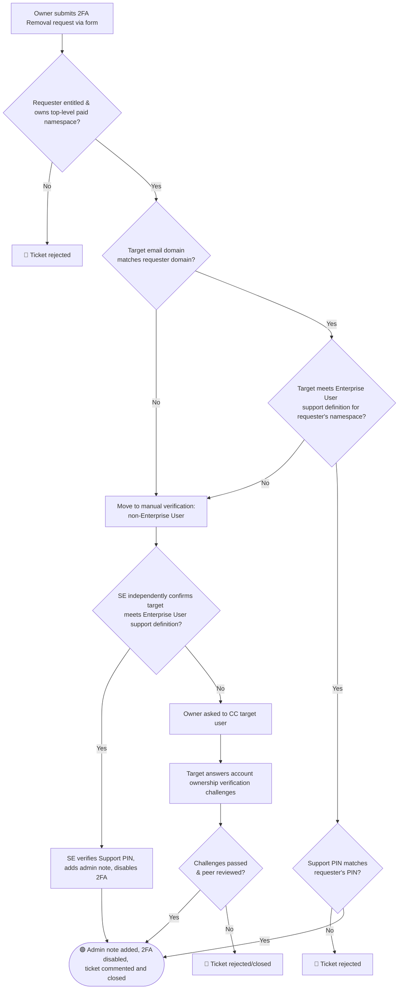

## 概要 {#overview}

このワークフローは、GitLab.com アカウントの[二要素認証](https://docs.gitlab.com/ee/user/profile/account/two_factor_authentication.html)（2FA）の無効化に焦点を当てています。リクエストの認証に関する一般的な原則は、[アカウント認証ワークフロー](account_verification.html)で説明しています。

2FA の解除は、以下のワークフローが成功した場合にのみ完了できます。

{}
**2026 年 9 月 15 日より、Enterprise ユーザーの 2FA 解除リクエストは自動化されています。**[サポートにおける Enterprise ユーザーの定義](/handbook/support/workflows/gitlab-com_overview/#enterprise-users)を満たさないユーザーのリクエストは、[手動検証](/handbook/support/workflows/2fa-removal/#manual-verification-fallback)に切り替わります。告知については、[2FA 解除リクエストの変更](https://support.gitlab.com/hc/en-us/articles/30223695893660-2FA-Removal-Request-Changes)を参照してください。

**トップレベルグループのオーナーが、ロックアウトされたユーザーに代わってチケットを提出する必要があります。GitLab Support は、ロックアウトされたユーザー本人が直接提出する 2FA 解除チケットを受け付けなくなりました。**これは、手動検証に切り替わる非 Enterprise ユーザーを含むすべてのユーザーに適用されます。その場合も、オーナーがユーザーに代わって提出する必要があり、異なるのは検証方法（自動検証か、手動のチャレンジ質問か）のみです。

{}

## セルフサービスの回復オプション {#self-service-recovery-options}

チケットが必要になる前に、ユーザーは GitLab ドキュメントの[回復オプションと 2FA リセット](https://docs.gitlab.com/user/profile/account/two_factor_authentication_troubleshooting/#recovery-options-and-2fa-reset)を確認できます。これらのセルフサービスのオプションでは Support の関与は不要であり、以下のオーナーに関する要件にかかわらず利用できます。

いずれも該当しない場合、ユーザーはトップレベルグループのオーナーに、自分に代わって 2FA 解除チケットを提出するよう依頼する必要があります。以下を参照してください。

## 関連トピック {#related-topics}

### GitLab チームメンバー {#gitlab-team-members}

ユーザーが GitLab チームメンバーである場合は、[IT Ops に連絡](/handbook/eta/corporate-it/end-user-services/)してもらってください。

## GitLab.com ユーザーの条件 {#conditions-for-gitlabcom-users}

GitLab.com ユーザーが 2FA リセットの対象となるためには、以下の条件**のいずれか**を満たす必要があります。

1. ユーザーが GitLab.com の有償グループでシートを占めている、またはトップレベルグループのオーナーがそのユーザーを有償グループに追加する意向がある。
1. ユーザーが [Enterprise ユーザー](https://docs.gitlab.com/user/enterprise_user/#automatic-claims-of-enterprise-users)としてクレームされている。
1. ユーザーが [Enterprise ユーザー](/handbook/support/workflows/gitlab-com_overview/#enterprise-users)のサポートでの定義を満たしている。
1. ユーザーが GitLab.com の購入に関する現行の請求書のプライマリー請求担当者である。
1. GitLab チームメンバー（Account Manager、CSM、その他）がアカウント管理プロジェクトでこのアカウントの保有者と協力している。
1. ユーザーアカウントが、有償サブスクリプションを管理するための Customers Portal への SSO アクセスに必要である - [Customers Portal アクセスにアカウントが使用される場合の 2FA リセット条件](#conditions-when-account-is-used-to-access-customers-portal)を参照。

より簡潔に言うと、有償ユーザーである、アカウントを支払いに使用している、または私たちがアカウントを通じて連絡を取っている、ということです。

*なお、GitLab Support は[無料ユーザーの 2FA リセットには対応しません](https://about.gitlab.com/blog/gitlab-support-no-longer-processing-mfa-resets-for-free-users/)*

### Customers Portal アクセスにアカウントが使用される場合の条件 {#conditions-when-account-is-used-to-access-customers-portal}

[Customers Portal](https://customers.gitlab.com)では、すべてのお客様が[リンクされた GitLab アカウント](https://docs.gitlab.com/ee/subscriptions/customers_portal.html#link-a-gitlabcom-account)を通じてアクセスする必要があります。

ユーザーが対象となり、2FA をリセットできるのは、以下の条件の**いずれか 1 つ**が満たされる場合です。

1. リクエストが GitLab サブスクリプションの最新の請求書のプライマリー請求担当者から行われている。
1. GitLab アカウントが、サブスクリプション購入の最新の請求書のプライマリー請求担当者の Customers Portal アカウントにリンクされている。

請求書を提供できない場合は、[レガシーのメール／パスワードでサインイン](https://customers.gitlab.com/customers/sign_in?legacy=true)するように提案してください。そこで請求書をダウンロードできます。

## チケットをシンプルかつ正確に保つ {#keep-the-ticket-simple-and-accurate}

2FA 解除チケットは**記録に残るもの**であるため、シンプルかつ正確で、アクセスの問題に厳密に焦点を絞る必要があります。
**お客様が無関係な話題を持ち出さないようにしてください。**

## 2FA の無効化：オーナーが開始する自動ワークフロー {#disable-2fa-automated-owner-initiated-workflow}

{}
**このワークフローは Enterprise ユーザーに対してのみ自動化されています。**対象ユーザーが[サポートにおける Enterprise ユーザーの定義](/handbook/support/workflows/gitlab-com_overview/#enterprise-users)を満たす場合、Zendesk は Support の介入なしで以下のチェックを実行します。非 Enterprise ユーザーを対象とするリクエストは自動化では解決できず、必ず[手動検証](/handbook/support/workflows/2fa-removal/#manual-verification-fallback)に切り替わります。
{}

トップレベルグループのオーナーが、対象ユーザーのメールアドレスと、オーナー自身のアカウントから生成した Support PIN を使ってリクエストを提出します。

Zendesk は自動的に以下を実行します。

1. リクエスターがリクエストを行う権利を持ち、かつ有償のトップレベルネームスペースのオーナーであることを確認します。そうでない場合、チケットは却下されます。
1. 対象ユーザーのメールドメインがリクエスターのドメインと一致することを確認します（既知の汎用／無料ドメインは除外します）。一致しない場合、チケットは[手動検証](#manual-verification-fallback)のためにサポートに移されます。
1. 対象ユーザーがリクエスターのネームスペースに対して[サポートにおける Enterprise ユーザーの定義](/handbook/support/workflows/gitlab-com_overview/#enterprise-users)を満たすことを確認します。対象ユーザーがこの定義を満たさない場合、チケットは[手動検証](#manual-verification-fallback)のためにサポートに移されます。
1. 提供された Support PIN が、リクエストしたオーナーが生成したものと一致することを確認します。一致しない場合、**チケットは却下されます**。このステップでは、フォールバックや代替の検証はありません。
1. すべてのチェックに合格した場合、対象ユーザーのアカウントに Admin Note を追加し、2FA を無効化し、チケットにコメントしてクローズします。

### 手動検証（フォールバック） {#manual-verification-fallback}

この経路は、自動チェックが失敗した場合に適用されます。自動化が失敗した理由にかかわらず、ここから開始してください。

1. **ステップ 1**：対象ユーザーが[サポートにおける Enterprise ユーザーの定義](/handbook/support/workflows/gitlab-com_overview/#enterprise-users)を満たすかを手動で確認します。
1. **ステップ 2**：満たす場合は、[Enterprise ユーザーのワークフロー](#enterprise-user-workflow)に従います。
1. **ステップ 3**：満たさない場合は、[非 Enterprise ユーザーのワークフロー](/handbook/support/workflows/2fa-removal/#non-enterprise-user-workflow)に従います。

#### Enterprise ユーザーのワークフロー {#enterprise-user-workflow}

対象ユーザーが自動化のチェックに失敗したものの、サポートにおける Enterprise ユーザーの定義を満たすことを独自に確認できた場合に使用します。

1. 管理画面 `https://gitlab.com/admin/users/USERNAME` で、リクエストしたオーナーの Support PIN を確認します。Support PIN は、オーナーがチケットのメタデータで提供します。
1. ZenDesk の [GitLab Super App](/handbook/eta/css/zendesk/apps/global#gitlab-super-app)の `2FA Helper` を使用して、[リスクファクター](https://internal.gitlab.com/handbook/support/#risk-factors-for-account-ownership-verification)（GitLab 社内向け）を判断します。
1. 検証に成功した場合は、Slack の #support_gitlab-com を通じて、チームの別のメンバーに自分の決定のピアレビューを依頼します。
1. 検証に失敗した場合は、以下を実行します。
   1. 検証なしではアカウントに対して何も対応できないことを伝えます。2FA については、[Support::SaaS::GitLab.com::2FA::2FA Removal Verification - GitLab.com - Failed - Final Response](https://gitlab.com/gitlab-com/support/zendesk-global/macros/-/blob/master/active/Support/SaaS/GitLab.com/2FA/2FA%20Removal%20Verification%20-%20GitLab.com%20-%20Failed%20-%20Final%20Response.md?ref_type=heads) マクロを使用します。
   1. チケットを「Solved」としてマークします。

#### 非 Enterprise ユーザーのワークフロー {#non-enterprise-user-workflow}

自動判定か手動確認かにかかわらず、対象ユーザーがサポートにおける Enterprise ユーザーの定義を
満たさない場合に使用します。

1. リクエストしたオーナーに、チケットの CC に対象ユーザーを追加するよう依頼し、[Support::SaaS::GitLab.com::Account Ownership Verification - GitLab.com](https://gitlab.com/gitlab-com/support/zendesk-global/macros/-/blob/master/active/Support/SaaS/GitLab.com/Account%20Ownership%20Verification%20-%20GitLab.com.md?ref_type=heads) マクロを送信します。
1. 対象ユーザー本人が[アカウント所有権検証](account_verification.html)のチャレンジ質問に直接回答する必要があります。オーナーが対象ユーザーに代わって回答することはできません。
1. 標準の[アカウント認証ワークフロー](/handbook/support/workflows/account_verification/#step-2-checking-challenge-answers)に従って進めます。リスクファクターの算出には、オーナーが提供した Support PIN を Zendesk フォームに含めます。
1. 検証に成功した場合は、Slack の #support_gitlab-com を通じて、チームの別のメンバーに自分の決定のピアレビューを依頼します。
1. ユーザーが利用可能なチャレンジに合格できない場合は、以下を実行します。
   1. 検証なしではアカウントに対して何も対応できないことを伝えます。2FA については、[Support::SaaS::GitLab.com::2FA::2FA Removal Verification - GitLab.com - Failed - Final Response](https://gitlab.com/gitlab-com/support/zendesk-global/macros/-/blob/master/active/Support/SaaS/GitLab.com/2FA/2FA%20Removal%20Verification%20-%20GitLab.com%20-%20Failed%20-%20Final%20Response.md?ref_type=heads) マクロを使用します。
   1. チケットを「Solved」としてマークします。

## アカウント管理プロジェクトのメンバーであるユーザーの 2FA 解除リクエスト {#request-for-2fa-removal-for-a-user-who-is-a-member-of-an-account-management-project}

Support は、アカウント管理プロジェクトのメンバーである GitLab.com ユーザーの 2FA をリセットするリクエストを受け取ることがあります（[GitLab.com ユーザーの条件](#conditions-for-gitlabcom-users)の項目 5 に記載されています）。

このシナリオで 2FA リセットを進めるには、以下を確認してください。

1. ユーザーは他の GitLab.com グループのメンバーまたはオーナーですか？
   - 該当する場合、この方法では進めず、代わりに上記の自動ワークフローを参照してください。
   - 該当しない場合は続行します。
1. Zendesk で、そのユーザーの組織の CSM、AM、または ASE（担当者がいるお客様の場合）を特定します。
1. 特定した GitLab チームメンバーをチケットに CC し、内部ノートでメンションします。このノートには以下を含める必要があります。
   - リクエストが有効であることを確認するため、お客様の組織の連絡先に連絡するよう依頼します。
   - Support PIN を生成するよう依頼します。
   - PIN と、リクエストが有効であることの確認の両方を、チケット上の別の内部ノートで提供する必要があります。
   - 注：上記に加えて、その GitLab チームメンバーに Slack で連絡してもかまいません。
1. 上記の GitLab チームメンバーが保証し、PIN を検証したら、管理者アカウントにサインインして[Admin Note](/handbook/support/workflows/admin_note.md)を追加し、2FA を無効化します。

## フローチャート {#flowchart}

以下のフローチャートで、上記の自動ワークフローと、そのフォールバックとなる手動検証の流れを確認できます。

```mermaid
flowchart TD
    A[Owner submits 2FA Removal request via form]
    B{Requester entitled & <br/>owns top-level paid namespace?}
    C[🛑 Ticket rejected]
    D{Target email domain <br/>matches requester domain?}
    E{Target meets Enterprise User <br/>support definition for requester's namespace?}
    F[Move to manual verification: <br/> non-Enterprise User]
    G{Support PIN matches <br/>requester's PIN?}
    H[🛑 Ticket rejected]
    I([🟢 Admin note added, 2FA disabled, <br/>ticket commented and closed])
    N{SE independently confirms target <br/>meets Enterprise User support definition?}
    O[SE verifies Support PIN, <br/>adds admin note, disables 2FA]
    J[Owner asked to CC target user]
    K[Target answers account <br/>ownership verification challenges]
    L{Challenges passed <br/>& peer reviewed?}
    M[🛑 Ticket rejected/closed]

    A --> B
    B -->|No| C
    B -->|Yes| D
    D -->|No| F
    D -->|Yes| E
    E -->|No| F
    E -->|Yes| G
    G -->|No| H
    G -->|Yes| I
    F --> N
    N -->|Yes| O
    O --> I
    N -->|No| J
    J --> K
    K --> L
    L -->|Yes| I
    L -->|No| M

click F href "#manual-verification-fallback"
click N href "#manual-verification-fallback"
    click O href "#enterprise-user-workflow"
click J href "#non-enterprise-user-workflow"
```

## メールワンタイムパスワード（OTP）の強制 {#email-one-time-password-otp-enforcement}

### 概要 {#overview-1}

GitLab.com では、パスワードでサインインするユーザーには MFA が必須\*になります。ユーザーはアプリベースの TOTP または WebAuthn デバイスでこの要件を満たせます。どちらも設定されていない場合、ユーザーはサインインを完了するためにメール経由で送信されるワンタイムパスワードを入力する必要があります。

\* GitLab チームメンバーは、タイミングについて [Mandatory MFA Rollout Plan](https://gitlab.com/gitlab-org/gitlab/-/issues/566615)を参照できます。

**意図された副作用:** API、Git over HTTPS、Container Registry のパスワード認証は失敗します。代わりに別の認証メカニズムを使用する必要があります:

- [アクセストークンを使った API リクエストの認証](https://docs.gitlab.com/api/rest/authentication/#personal-project-and-group-access-tokens)
- [トークンを使ったクローン](https://docs.gitlab.com/topics/git/clone/#clone-using-a-token)
- [Container Registry での認証](https://docs.gitlab.com/user/packages/container_registry/authenticate_with_container_registry/#authenticate-with-a-token)

### セルフサービスのオプション {#self-service-options}

ユーザーは Email OTP コードを、自分のプライマリーメールアドレスや、アカウントに設定された任意の検証済み [セカンダリーメールアドレス](https://docs.gitlab.com/user/profile/#add-emails-to-your-user-profile)に送信できます。

### 有償アカウントへのサポート介入 {#support-intervention-for-paid-accounts}

Email One-Time Passwords (Email OTP) 開発ガイドの
[ロギングに関するセクション](https://docs.gitlab.com/development/email_one_time_passwords/)
を参照して、Email OTP に関連する問題のトリアージとデバッグを支援してください。

#### メールアカウントの喪失 {#lost-email-accounts}

ユーザーがメールアドレスへのアクセスを失い Email OTP を受信できない場合は、[メールアカウント喪失のワークフロー](/handbook/support/workflows/lost_emails/)に従ってください。

#### Email OTP コードのメールが届かない場合のサポート介入 {#support-intervention-for-missing-email-otp-code-emails}

ユーザーがメールアドレスにはアクセスできるが Email OTP コードを受信できない場合、[Mailgun ログの確認](/handbook/support/workflows/confirmation_emails/#checking-mailgun-logs)と [Mailgun でメールを確認または再送する方法](/handbook/support/workflows/confirmation_emails/#how-to-see-or-resend-emails-in-mailgun)の手順に従ってください。

#### ブロックされた API エンドポイントの調査 {#investigating-blocked-api-endpoints}

サポートは ElasticSearch ログを使用して、現在ブロックされている API エンドポイントでパスワード認証を試みているエンドポイントおよびユーザーを見つけられます。

##### ワークフロー {#workflow}

1. ユーザーが [対象条件](#conditions-for-gitlabcom-users)を満たすことを確認します
1. [アカウント認証マトリクス](/handbook/support/workflows/account_verification.md#account-verification-matrix)を使用して本人確認を完了します
1. お客様のトップレベルパスとユーザー名を収集します
1. https://log.gprd.gitlab.net/ にアクセスし `pubsub-rails-inf-gprd-*` インデックスを検索するか、以下の検索を使用します:
   - お客様のネームスペース内のプロジェクトに対するパスワード認証付きの Git over HTTPs 操作の表示 - [リンク](https://log.gprd.gitlab.net/app/r/s/mRCq0)
      - `json.path` の値を `/gitlab-org/*` のようにお客様のネームスペースに置き換えます。
   - 単一ユーザーのパスワード認証付きの Git over HTTPs 操作の表示 - [リンク](https://log.gprd.gitlab.net/app/r/s/XPMwu)
      - `json.username` の値を確認したいユーザー名に置き換えます。
   - 単一ユーザーのすべてのパスワード認証イベントの表示 - [リンク](https://log.gprd.gitlab.net/app/r/s/ZKEYX)
      - `json.username` の値を確認したいユーザー名に置き換えます。
1. 必要に応じて検索ウィンドウのルックバック期間を延ばします。

<https://docs.gitlab.com/development/email_one_time_passwords/#password-api-authentication-failures> も参照してください。

#### Email OTP の遅延に対するサポート介入 {#support-intervention-for-delaying-email-otp}

サポートは、トップレベルネームスペースのオーナーからリクエストを受けた場合に、有償ユーザーの Email OTP の強制を遅延させることができます。

##### Enterprise ユーザーに対する強制の遅延 {#delay-enforcement-for-enterprise-users}

**Enterprise ユーザー** に対する Email OTP 強制を遅延させるには、リクエストはトップレベルネームスペースの Enterprise オーナーから発信されている必要があります。各リクエストの適格性を確認するには、[アカウント所有権検証適格性マトリクス](/handbook/support/workflows/account_verification/#account-verification-matrix)を参照してください。これは [サポートの Enterprise ユーザーの定義](/handbook/support/workflows/gitlab-com_overview/#enterprise-users)を満たすユーザーにも適用されます。

##### 非 Enterprise ユーザーに対する強制の遅延 {#delay-enforcement-for-non-enterprise-users}

**有償（非 Enterprise）ユーザー** に対する Email OTP 強制を遅延させるには、リクエストはトップレベルネームスペースのオーナーから発信され、**単一ユーザーをターゲット** にする必要がありますが、アカウント所有権検証の回答は [アカウント所有権検証適格性マトリクス](/handbook/support/workflows/account_verification/#account-verification-matrix)に従ってターゲットユーザーが提出する必要があります。

> 1 チケットにつき 1 ユーザー。コミュニケーションはチケットに CC される必要があるターゲットユーザーから直接行われます。

強制の遅延がリクエストされる可能性のあるシナリオ:

- API エンドポイントが Email OTP 要件によりブロックされている（上記参照）ため、別の認証への切り替えに時間が必要。
- お客様が組織全体での移行計画のための遅延をリクエストしている。

##### ワークフロー {#workflow-1}

1. リクエスターが [アカウント所有権検証適格性マトリクス](/handbook/support/workflows/account_verification.md#account-verification-matrix)に基づいて変更をリクエストする資格があることを確認します
2. [チャレンジ質問](/handbook/support/workflows/account_verification/#step-1-sending-challenges)を発行してアカウント所有権検証を完了します
3. #support_gitlab-com でピアレビューをリクエストします
4. 遅延期間を決定します - 1 日から 90 日が許容されます。
5. リクエストタイプに基づいてユーザー ID を収集します:
   - **Enterprise オーナーが Enterprise ユーザーをターゲットとする場合**: すべてのユーザー ID を収集します。これらの ID がすべて有償アカウントに属し、Enterprise ユーザーである（または [サポートの定義](/handbook/support/workflows/gitlab-com_overview/#enterprise-users)を満たす）ことを確認します。すべてのターゲットユーザーがすでに `email_otp_required_after` を設定済みであることを確認します。GitLab.com 管理者は `/admin/users/<username>` にアクセスして `Email OTP` フィールドを確認することでこれを確認できます。
   - **トップレベルグループオーナーが非 Enterprise ユーザーをターゲットとする場合**: 1 人のターゲットユーザーに対してのみ強制を遅延できます。ターゲットユーザーの ID を収集し、有償アカウントに属することを確認します。ターゲットユーザーがすでに `email_otp_required_after` を設定済みであることを確認します。GitLab.com 管理者は `/admin/users/<username>` にアクセスして `Email OTP` フィールドを確認することでこれを確認できます。
6. 少数のユーザーには、GitLab Admin エリアを使用します:
   1. Admin > Users で、各ユーザーの「Edit」をクリックします
   2. 「Access」セクションまでスクロールし「Email OTP」を探します
   3. 日付ピッカーを使用して選択した遅延を反映する日付を選びます。（注: 空白の日付はアカウントセキュリティのロジックによってオーバーライドされる可能性があります）。
   4. 変更を説明する [Admin Note](/handbook/support/workflows/admin_note.md)をアカウントに追加します。例: `<date> | Email OTP required set to <value> | <ticket link>`
   5. 保存をクリックします
   6. 更新された `Email OTP` フィールドを確認します。UI には保存された値が反映され、検証ルールが尊重されます。例:
      1. MFA が必須（`Gitlab::CurrentSettings.require_minimum_email_based_otp_for_users_with_passwords?`）でユーザーが代替の MFA を持たない場合、`nil` にできない
      2. ユーザーが MFA を有効化していて、2FA を強制するネームスペース／トップレベルグループの一部である場合、値を設定できない
7. 多数のユーザーの場合は、[コンソールエスカレーション内部リクエスト](https://gitlab.com/gitlab-com/support/internal-requests/-/issues/new?description_template=GitLab.com%20Console%20Escalation%20%28Read-write%29)を起こして、適用対象のすべてのユーザーに対して `email_otp_required_after` を合意した将来日に設定するよう依頼します。

<!--template sourced from https://gitlab.com/gitlab-org/gitlab/-/blob/master/.gitlab/issue_templates/Default.md-->
