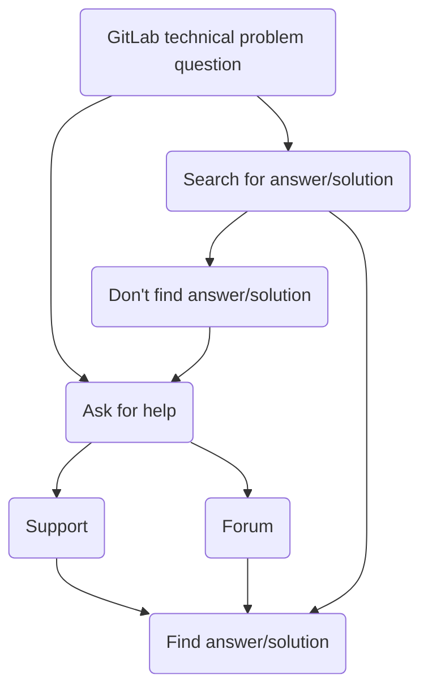
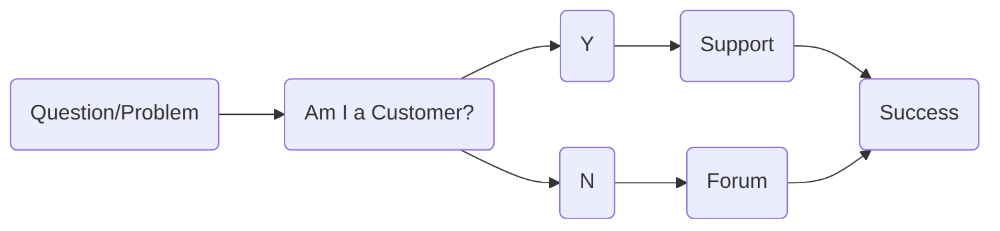
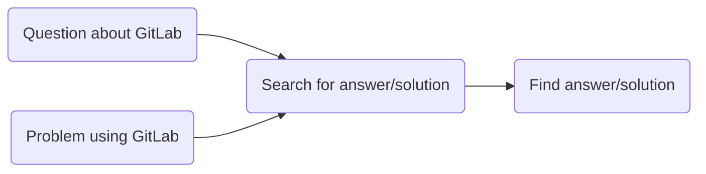

## コミュニティフォーラムでのテクニカルサポート

コミュニティフォーラムは、GitLabに関するテクニカルサポートを求めるための、私たちの広範なコミュニティ向け公式の場です。

フォーラムで共有されるテクニカルサポートのソリューションは、検索エンジンによってインデックスされるため、解決策を探しているGitLabユーザーが容易に発見できる広い読者層に届きます。

私たちのより広いコミュニティが遭遇する技術的な問題や尋ねる質問の多くは、サポートチケットでGitLabサポートチームメンバーがお客様に提供したことのある既知の解決策と回答を持っています。このような状況では、Support Engineerがこれらの既知のテクニカルサポートのソリューションをコミュニティフォーラムで共有することが、非常に効果的なチケット軽減の形態となります。

### Docs-first（ドキュメント優先）でのコミュニティ支援

GitLab Support の ZenDesk チケットと同様に、フォーラムでの未解決の GitLab テクニカルサポートスレッドは、しばしば次の機会となります:

- 関連するドキュメントへのリンクを貼る
- ユーザーのインタラクション/フィードバックに基づいてドキュメントを改善する

そのため、GitLab Support Engineer は、コミュニティ支援に対して **Docs-first（ドキュメント優先）アプローチ** をデフォルトとすべきです。

コミュニティ支援における Docs-first アプローチの重要なポイントは:

- 常に、ドキュメントへのリンクで応答する（よう試みる）。
- 私たちのドキュメントから役に立つコンテンツが欠けていることを発見した場合は、それを追加するためのマージリクエストまたは Issue を作成します。そして、その MR や Issue を返信内でリンクします。
- コミュニティメンバーがドキュメントが正しくない、混乱させる、または不十分だと言った場合 - 問題を説明する Issue を作成するか、修正するための MR を貢献するように促します。

#### 特殊なタイプ

ドキュメントには適していないコンテンツの「特殊なタイプ」がいくつか存在します。たとえば、チュートリアル、「ハウツー」ガイド、コンテキスト固有の説明などです。

フォーラムでのコミュニティ支援への docs-first アプローチは、関連する回答／解決策を発見しやすく、すぐに利用できるようにすることで、これらの「特殊なタイプ」のギャップを埋めるのに役立ちます。

たとえば、これらのコミュニティフォーラムスレッドでは、回答や解決策がドキュメントには「合わない」「特殊なタイプ」となっています:

- 状況固有のチュートリアル／ハウツー -（例: 「DockerコンテナとしてGitLab CE 11.0を実行していて、ダウンタイムを最小限に抑えてGitLab 13.2 EE Omnibusにアップグレードしたいのですが、どうすれば安全にこれを行えますか?」）
- コンテキストベースの説明 -（例: 「ドキュメントを読みましたが、Xを行う方法がわかりません。」）
- 問題固有のトラブルシューティング手順（例: 「GitLab を 12.9 から 13.1 にアップグレードしたら動作しなくなり、すべてのページで 404 エラーが発生します - 助けてください！」）

### コミュニティ支援ワークフロー

- **[First Responder（初動対応者）](#first-responder)** - お客様向けの問題、バグ、リグレッションの早期発見
- **[Silo-breaker（サイロブレーカー）](#silo-breaker)** - フリーユーザーに関連する解決策／回答を公開的に共有
- **[Fruit picker（フルーツピッカー）](#fruit-picker)** - 簡単で素早い勝利のために、低い枝のフルーツを摘む
- **[Fishing Instructor（釣り指導者）](#fishing-instructor)** - セルフサービスとコミュニティ優先のGitLabサポートを教える

#### First Responder（初動対応者）

バグの検出、ドキュメントの改善、有料のお客様に影響を与える私たちの製品の問題の特定のために、GitLabコミュニティは優れたリソースです。

コミュニティフォーラムは、お客様向けの問題に対する早期検知・早期警告システムです。

GitLab FOSS は、GitLab コードベースの 80% 以上を占めています。このコードベースの 80% に関する技術的な問題は、お客様を含む *すべての* GitLab ユーザーに影響します。

フリーユーザーは、お客様からそれらに関するサポートチケットを受け取り始める前に、私たちの製品やドキュメントのバグ、リグレッション、問題をコミュニティフォーラムで浮き彫りにすることがよくあります。

#### Silo breaker（サイロブレーカー）

Silo-breaker は Support ZenDesk における共通の回答／解決策を取り上げ、それらがすべての GitLab ユーザーに利用可能で発見可能であることを確実にします。

サポートチームメンバーは、受信するサポートチケットのパターンや傾向に気づくことがあります。新しいFAQ、ますます一般的になる問題、新機能に関する混乱、不明確なドキュメント、お客様に影響を与えるバグなどです。

私たちは社内で、通常は Slack や Support Week in Review を介してコミュニケーションを取り、Support 内で認識を高め、対象についてのチケットに遭遇する人を支援します。

これらの同じパターンや傾向がコミュニティフォーラムにも存在する場合、フォーラムスレッドで回答や解決策を提供することで、検索エンジンを介して回答／解決策が発見可能になることを確実にできます。

#### Fruit-picker（フルーツピッカー）

既知の回答や解決策を公開的に共有することで「低い枝のフルーツ」を摘むことに特化します。

- 簡単で素早い勝利。（「*問題／質問を知っており、解決策／回答を簡単に説明できる*」）
- 答えは私たちのドキュメントにある。（ドキュメントへの丁寧なリンクで十分）
- シングルタッチでの解決。（フォローアップ不要）

#### Fishing Instructor（釣り指導者）

誰かに何かを（自分自身でできるよう）教えるほうが、（継続的に）その人の代わりにそれをするよりも価値があります。

フォーラムは釣りに似ています。「質問や問題を投げ込み、回答や解決策を得る」。

このコンテキストにおける「釣り指導」は、利用可能なリソースとそれらを見つける方法を紹介する機会です（ドキュメント、Issue、MR、コードベース、フォーラムスレッド）。

現在、多くの人々が、まず簡単な回答／解決策を探さずに Support に連絡してきます。

ユーザーを適切なサポートオプションに最も効率的かつ効果的に結び付ける方法は、次のサポート探索ユーザーフローを促進し増加させる方法で行動することです。

「Fishing instructor」は、GitLabのユーザーやお客様が自分の魚を釣れるようにし、Support の介入なしに解決策を見つけ、質問に答えられるようにします。

受信したフリーユーザーチケットをコミュニティフォーラムに誘導することで、フリーユーザーは GitLab Support に頼らずに回答／解決策を見つける習慣を身につけます。

### 最適なフリーユーザーサポート体験

Win-win-win - GitLabコミュニティ、お客様、チームメンバーの全員に利益をもたらします。

- [x] セルフサービスサポート
- [x] docs-first（ドキュメント優先）
- [x] チケット軽減

### 追加のリソース

コミュニティフォーラムで作業する際の追加のヒントとベストプラクティスについては、[コミュニティフォーラムに関するDeveloper Relationsハンドブックエントリ](/handbook/marketing/developer-relations/workflows-tools/forum/) を参照してください。
