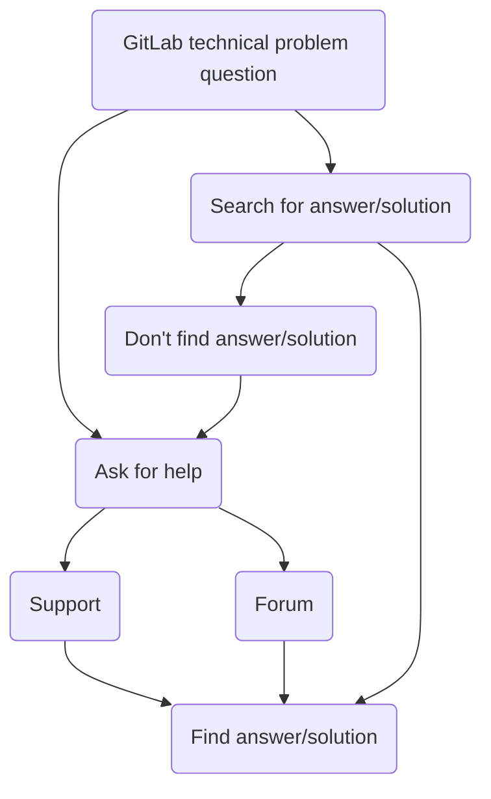
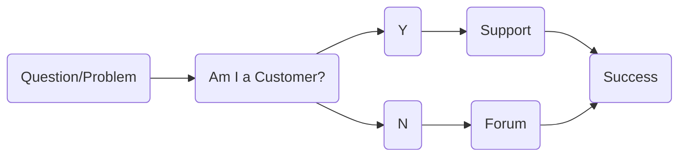
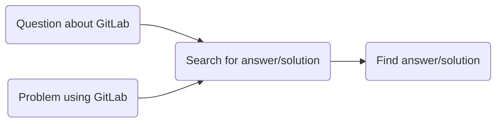

## コミュニティフォーラムでのテクニカルサポート

コミュニティフォーラムは、GitLab に関するテクニカルサポートを求めるための、私たちの広範なコミュニティ向け公式の場です。

フォーラムで共有されるテクニカルサポートのソリューションは、検索エンジンによってインデックスされるため、解決策を探している GitLab ユーザーが容易に発見できる広い読者層に届きます。

私たちのより広いコミュニティが遭遇する技術的な問題や尋ねる質問の多くは、サポートチケットで GitLab サポートチームメンバーがお客様に提供したことのある既知の解決策と回答を持っています。このような状況では、Support Engineer がこれらの既知のテクニカルサポートのソリューションをコミュニティフォーラムで共有することが、非常に効果的なチケット軽減の形態となります。

### ドキュメント優先でのコミュニティ支援

GitLab Support の ZenDesk チケットと同様に、フォーラムでの未解決の GitLab テクニカルサポートスレッドは、しばしば次の機会となります:

- 関連するドキュメントへのリンクを貼る
- ユーザーのインタラクション/フィードバックに基づいてドキュメントを改善する

そのため、GitLab Support Engineer は、コミュニティ支援に対して **ドキュメント優先アプローチ** をデフォルトとすべきです。

コミュニティ支援における ドキュメント優先アプローチの重要なポイントは:

- 常に、ドキュメントへのリンクで応答する（よう試みる）。
- 私たちのドキュメントから役に立つコンテンツが欠けていることを発見した場合は、それを追加するためのマージリクエストまたは Issue を作成します。そして、その MR や Issue を返信内でリンクします。
- コミュニティメンバーがドキュメントが正しくない、混乱させる、または不十分だと言った場合 - 問題を説明する Issue を作成するか、修正するための MR を貢献するように促します。

#### 特殊なタイプ

ドキュメントには適していないコンテンツの「特殊なタイプ」がいくつか存在します。たとえば、チュートリアル、「ハウツー」ガイド、コンテキスト固有の説明などです。

フォーラムでのコミュニティ支援への ドキュメント優先アプローチは、関連する回答／解決策を発見しやすく、すぐに利用できるようにすることで、これらの「特殊なタイプ」のギャップを埋めるのに役立ちます。

たとえば、これらのコミュニティフォーラムスレッドでは、回答や解決策がドキュメントには「合わない」「特殊なタイプ」となっています:

- 状況固有のチュートリアル／ハウツー -（例: 「Docker コンテナとして GitLab CE 11.0 を実行していて、ダウンタイムを最小限に抑えて GitLab 13.2 EE Omnibus にアップグレードしたいのですが、どうすれば安全にこれを行えますか?」）
- コンテキストベースの説明 -（例: 「ドキュメントを読みましたが、X を行う方法がわかりません。」）
- 問題固有のトラブルシューティング手順（例: 「GitLab を 12.9 から 13.1 にアップグレードしたら動作しなくなり、すべてのページで 404 エラーが発生します - 助けてください！」）

### コミュニティ支援ワークフロー

- **[初動対応者](#first-responder)** - お客様向けの問題、バグ、リグレッションの早期発見
- **[サイロの解消担当](#silo-breaker)** - フリーユーザーに関連する解決策／回答を公開的に共有
- **[手早い解決担当](#fruit-picker)** - 簡単で素早い勝利のために、低い枝のフルーツを摘む
- **[釣りの指導者](#fishing-instructor)** - セルフサービスとコミュニティ優先の GitLab サポートを教える

#### 初動対応者 {#first-responder}

バグの検出、ドキュメントの改善、有料のお客様に影響を与える私たちの製品の問題の特定のために、GitLab コミュニティは優れたリソースです。

コミュニティフォーラムは、お客様向けの問題に対する早期検知・早期警告システムです。

GitLab FOSS は、GitLab コードベースの 80% 以上を占めています。このコードベースの 80% に関する技術的な問題は、お客様を含む *すべての* GitLab ユーザーに影響します。

フリーユーザーは、お客様からそれらに関するサポートチケットを受け取り始める前に、私たちの製品やドキュメントのバグ、リグレッション、問題をコミュニティフォーラムで浮き彫りにすることがよくあります。

#### サイロの解消担当 {#silo-breaker}

サイロの解消担当は Support ZenDesk における共通の回答／解決策を取り上げ、それらがすべての GitLab ユーザーに利用可能で発見可能であることを確実にします。

サポートチームメンバーは、受信するサポートチケットのパターンや傾向に気づくことがあります。新しい FAQ、ますます一般的になる問題、新機能に関する混乱、不明確なドキュメント、お客様に影響を与えるバグなどです。

私たちは社内で、通常は Slack や Support Week in Review を介してコミュニケーションを取り、Support 内で認識を高め、対象についてのチケットに遭遇する人を支援します。

これらの同じパターンや傾向がコミュニティフォーラムにも存在する場合、フォーラムスレッドで回答や解決策を提供することで、検索エンジンを介して回答／解決策が発見可能になることを確実にできます。

#### 手早い解決担当 {#fruit-picker}

既知の回答や解決策を公開的に共有することで「低い枝のフルーツ」を摘むことに特化します。

- 簡単で素早い勝利。（「*問題／質問を知っており、解決策／回答を簡単に説明できる*」）
- 答えは私たちのドキュメントにある。（ドキュメントへの丁寧なリンクで十分）
- シングルタッチでの解決。（フォローアップ不要）

#### 釣りの指導者 {#fishing-instructor}

誰かに何かを（自分自身でできるよう）教えるほうが、（継続的に）その人の代わりにそれをするよりも価値があります。

フォーラムは釣りに似ています。「質問や問題を投げ込み、回答や解決策を得る」。

このコンテキストにおける「釣り指導」は、利用可能なリソースとそれらを見つける方法を紹介する機会です（ドキュメント、Issue、MR、コードベース、フォーラムスレッド）。

現在、多くの人々が、まず簡単な回答／解決策を探さずに Support に連絡してきます。

```mermaid
graph TD
  A(GitLab technical problem question)
  A --> C(Ask for help)
  A --> D(Search for answer/solution)
  C --> 1a(Support) --> E
  C --> 1b(Forum) --> E
  D --> E(Find answer/solution)
  D --> F(Don't find answer/solution) --> C(Ask for help)
```

ユーザーを適切なサポートオプションに最も効率的かつ効果的に結び付ける方法は、次のサポート探索ユーザーフローを促進し増加させる方法で行動することです。

```mermaid
graph LR
  A(Question/Problem)
  B(Am I a Customer?)
  C(Y)
  D(N)
  E(Support)
  F(Forum)
  G(Success)
  A --> B
  B --> C
  B --> D
  C --> E --> G
  D --> F --> G
```

「釣りの指導者」は、GitLab のユーザーやお客様が自分の魚を釣れるようにし、Support の介入なしに解決策を見つけ、質問に答えられるようにします。

受信したフリーユーザーチケットをコミュニティフォーラムに誘導することで、フリーユーザーは GitLab Support に頼らずに回答／解決策を見つける習慣を身につけます。

### 最適なフリーユーザーサポート体験

三者すべてにメリット - GitLab コミュニティ、お客様、チームメンバーの全員に利益をもたらします。

- [x] セルフサービスサポート
- [x] ドキュメント優先
- [x] チケット軽減

```mermaid
graph LR
  A1(Question about GitLab) & B1(Problem using GitLab) --> D(Search for answer/solution)
  D --> E(Find answer/solution)
```

### 追加のリソース

コミュニティフォーラムで作業する際の追加のヒントとベストプラクティスについては、[コミュニティフォーラムに関する Developer Relations ハンドブックの項目](/handbook/marketing/product-and-technical-marketing/developer-advocacy/tools-and-platforms/forum/)を参照してください。
