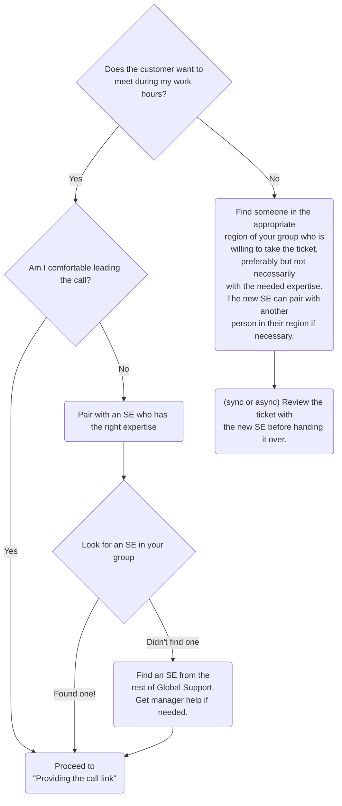

## はじめに

このページでは、サポートエンジニアリングにおいて顧客との通話をスケジュール、準備、実施、フォローアップするためのワークフローを示します。

## 感情面の逆風

私たちは [賢いサポートを提供するために賢い人間を採用しています](/handbook/support/workflows/how-to-respond-to-tickets#smart-humans-provide-smart-support)。人間には *感情* があります。通話のスケジュールや通話中に対処を難しくする感情的な逆風があることを認識しておくことが重要です。通話中、あなたは以下を管理する必要のある状況に身を置いています:

- 自分自身の感情
- 顧客の体験
- 顧客の感情
- 技術的なトラブルシューティング
- 時間、効率、自分自身のエネルギー

通話は、人間の中核的な恐怖に触れる、傷つきやすい体験になり得ます:

**無視される (重要であることの反対)**

- **道に迷う** - 多くのステークホルダーが参加する通話で、グループを正しい結果に導く影響力を発揮できない
- **罠にはまる** - 緊張した、または困難な状況をコントロールしたり、そこから脱出したりできない
- **孤独である** - 困難な状況に取り組むときに、サポートやガイダンスがない

**屈辱を受ける (有能であることの反対)**

- **間違っている** - 不正確な情報や不十分なガイダンスを提供すること
- **無能だと思われる** - 自分の強みを発揮できる機会があるのに、弱点の領域から仕事をすること
- **消耗する** - 通話の準備、実施、フォローアップに大量のエネルギーを使い果たし、他のところに貢献するエネルギーが残らないこと

**拒絶される (好かれることの反対)**

- **対立／緊張の中にいる** - 感情が高ぶった顧客と仕事をしなければならない
- **拒絶される** - 顧客から、課題に対処するには不十分・無能・力不足だと判断される
- **攻撃される** - 怒った顧客に怒鳴られたり、侮辱されたりする

これらの逆風の影響を感じている場合、なぜチケットを通話に移すべきでないかを正当化することは簡単です。あなたが感じている感情は無視されるべきではありません。通話に移すかどうかを判断する前に:

1. **立ち止まり**、判断を加えずに自分が感じていることを体験してみてください。
1. **自分の感情に好奇心を持って向き合う**: 抵抗のいずれかが中核的な恐怖に関連していますか？
1. **ケースの事実を切り分けてみる**: 解決時間、SSAT、または顧客体験について、状況を多面的に捉えるために [「鋼鉄の人」議論](/handbook/values/#assume-positive-intent) を組み立ててみましょう。
1. 顧客に **共感** し、ケースを彼らの視点から見てみるよう試みましょう。
1. **同僚やマネージャーと話して**、自分自身に二番目の／より客観的な意見を与えましょう。

### 双方向に作用します

顧客もサポートエンジニアと同じ恐怖の対象になります。すべての人々の中核的な恐怖についてより理解を深めるには、[Introduction to Core Human Needs](https://youtu.be/ddM6Ex7ei1o) ビデオと続編の [Triggering Fears](https://youtu.be/Lm6FgLDwsiE) ビデオを視聴することを検討してください。通話におけるあなたの行動が、顧客の恐怖を鎮めることも、引き起こすこともあるということを意識してください。

また、顧客は彼らのビジネスや GitLab に依存しているユーザーからのプレッシャーを受けている可能性が高いことも意識してください。そして、GitLab のエキスパートの前で無知に見えることに、緊張や恐怖を感じているかもしれません。これら 2 つのビデオで議論されているように、顧客に作用するこれらの力を理解しようとすることは、非常に役に立つ可能性があります:

1. [Understanding the Customer Intro](https://www.youtube.com/watch?v=krnLqcSrZNs&list=PL05JrBw4t0Kq13oaMq0DCl2gUz_g1u29o&index=42) - 顧客に作用する力を理解するという考え方を紹介します
1. [Understanding the Customer Discussion](https://www.youtube.com/watch?v=CIMKLG8D5jQ&list=PL05JrBw4t0Kq13oaMq0DCl2gUz_g1u29o&index=43) - そういった力の多くの例についての議論を提示します

## チケットを通話に移すべきタイミングは？

感情面はさておき、非同期のチケット作業とリアルタイムのサポートの要求のバランスをどう取るかを判断するのは難しいことがあります。顧客との通話には、準備、通話の実施、所見をまとめて次のステップを伝える通話後の作業という観点でコストがかかります。

ハンドブックのさまざまな部分で、幅広い行動を正当化できます:

- ハンドブックの ["Communication ページの Video Calls セクション"](/handbook/communication/#video-calls) では次のように述べられています

> Issue／メール／チャットで何度もやり取りしていることに気付いたらビデオ通話を使ってください。ガイドライン: 3 回やり取りをしたなら、ビデオ通話の時間です。

- DIB バリューの ["非同期コミュニケーションへのバイアス" 運用原則](/handbook/values/#bias-towards-asynchronous-communication) では次のように述べられています:

> 可能な限り非同期で運用するイニシアチブを取ってください。

- 効率バリューの ["他者の時間を尊重する" 運用原則](/handbook/values/#be-respectful-of-others-time) では次のように述べられています:

> 会議で他者に求める時間投資について考慮してください……会議を避けるよう試みてください。

GitLab サポートでは、時に矛盾するガイダンスを解釈するため、2 つの運用原則を使用しています:

1. **[顧客の成果](/handbook/values/#results)**: *私たちの焦点は、顧客が達成する成果を改善することです*
1. **[硬直性ではなく自由と責任を](/handbook/values/#freedom-and-responsibility-over-rigidity)**: *私たちは人々に意思決定する責任を与え、その判断について彼らに説明責任を持たせます*

私たちの顧客向けの [Statement of Support のビデオ通話セクション](https://about.gitlab.com/support/#phone-and-video-call-support) はこれをサポートしています:

> チケットの進行を改善するために、お客様との通話、ビデオ通話、画面共有セッションを実施することが有用かつ重要となる場合があります……サポートエンジニアは……以下を判断します:
>
> - 通話が必要かどうか、および
> - 通話を成功させるための十分な情報があるかどうか。

**サポートエンジニアとして、あなたは顧客の最善の利益のために行動することが求められます。** 顧客との通話はあなたのツールボックスにあるツールの 1 つです。上手く使えば、顧客との通話によって、より効率的に、関係を築き、より早くチケットを解決できるようになります。

### 通話への移行を検討すべき指標

1. **顧客が通話を求める**: 通話をきっぱりと拒否することは、否定的な SSAT 評価を得るための最も速い方法の 1 つです。すぐに通話に飛びつく必要はありません。しかし、通話を効果的にするための情報をいつどのように収集してアップロードするか、また自分の都合を伝えることを強く検討すべきです。
1. **複数回のやり取りの後でもチケットが進展しない**: 顧客が必要なデータを提供しない、問題を説明することに苦労している、または問題解決の緊急度が私たちと一致していないと示唆している場合は、通話への移行を強く検討すべきです。
1. **チケットが [STAR](/handbook/support/internal-support/support-ticket-attention-requests) を受けた**: STAR されたチケットは、私たちのコントロール内外の何らかの要因によって SSAT が脅かされていることが強調された状況を表します。通話に移行することは関係性の回復に役立つことがあります。迅速で高品質な助言を提供することは、顧客の懸念を和らげる可能性があります。
1. **顧客が報告した体験とあなたの再現の間に重要な不足要素がある**: 顧客が、すぐにあなたのトラブルシューティングツリー内にない重要なコンテキストの詳細を省略していることがあります。通話に移行することで、双方が同じ地点から始めていることを確認できます。
1. **チケット内の顧客のトーンが否定的に変化した**: 通話を提案して開始することは、顧客の問題を解決することへの私たちのコミットメントを示すことがあります。技術的な仲間と話すことは、双方の信頼と共感を築くのに役立ちます。
1. **チケットの次のステップが複雑、または分岐する判断ツリーがある**: トラブルシューティングプロセスのある時点では、よりインタラクティブな通話のコミュニケーションモードに切り替えることが最善になり得ます。これにより、方向性を提供し、結果を観察し、リアルタイムでフィードバックを提供して、最終的に非同期に戻すのが理にかなったタイミングまで進められます。
1. **サポートマネージャーが通話を推奨した**: チケットをレビューする際、サポートマネージャーは上記のポイントに加えて、顧客や他の GitLab チームメンバーからの外部のコンテキストを考慮し、通話への移行を推奨することがよくあります。

## 通話の種類

チケットと顧客のニーズに合わせて、通話の長さ、タイミング、議題を自由に調整してください。以下は、サポートエンジニアが過去に有用だと感じた通話タイプの例です。

可能な範囲で、顧客と取り決めた通話の長さを超えないようにしてください。これは、その顧客と次に作業するサポートエンジニアに対して非現実的な期待を作り出してしまうおそれがあるためです。解決に近づいている、または情報収集にもう少し時間が必要だと感じる場合は、必ず一時停止して、顧客に続行する時間があるかを確認し、続行できる残り時間を伝えてください。

### ディスカバリー通話

#### 目的

ディスカバリー通話は、再び非同期でトラブルシューティングを始めるのに十分な情報を学ぶことのみを目的とした、短い通話です。

#### 所要時間

15〜30 分

### トラブルシューティング通話

#### 目的

トラブルシューティング通話は、追加情報を収集したり、Issue 解決に向けて進展させるために作成した一連のトラブルシューティング手順を顧客に案内するために、リアルタイムで顧客と作業する、より長い通話です。

#### 所要時間

30〜60 分

### リセット & レビュー通話

#### 目的

リセット & レビュー通話は、長期間または優先度の高いチケットについて、エンジニアが顧客とつながり、これまでに行われたトラブルシューティングをレビューし、解決に向けて取られる次のステップを説明する機会です。特に [緊急対応とまではいかない](/handbook/support/workflows/customer_emergencies_workflows#situations-that-might-or-might-not-be-emergencies) 優先度の高いチケットでは、早い段階でリセット & レビュー通話のリズムを確立することが、[アカウントエスカレーション](/handbook/customer-success/csm/escalations/) を回避する (またはスムーズに移行する) のに役立ちます。

#### 所要時間

15〜30 分

### アップグレードアシスタンス

#### 目的

Premium サポートの顧客は、アップグレード支援の一環として通話をリクエストできます。詳細は専用の [アップグレードアシスタンスワークフロー](/handbook/support/workflows/upgrade-assistance) をご覧ください。

#### 所要時間

30 分

## 通話の実施

### 通話のスケジュール

チケットが通話の準備が整っているとわかったら、まず誰が通話を主導するかを決定します:



### 通話リンクの提供

まず、Zendesk で
[`Support::Customer Calls::Offer a call`](https://gitlab.com/gitlab-com/support/zendesk-global/macros/-/blob/master/active/Support/Customer%20Calls/Offer%20a%20call.md?ref_type=heads)
マクロを使用します。`ONETIME_PERSONAL_CALENDLY_LINK` を必ず自分の個人的な
Calendly リンクに変更してください。

顧客に通話リンクを送信する際:

- ゴーストコール (応答のない通話) を避けるため、必ず [使い捨ての Calendly リンク](/handbook/support/workflows/calendly#generating-a-single-use-calendly-link)
  を使用して顧客を通話に招待してください。
- [イベントタイトル](https://calendly.com/event_types) に [`Support` という単語が含まれている](/handbook/support/workflows/calendly#support-calls-in-the-team-calendar)
  ことを確認してください (大文字小文字は区別されません)。これは、イベントが
  `GitLab Support` カレンダーに表示されるために必要です。
- Calendly イベントに、Zendesk チケット番号を尋ねる必須の招待者質問が
  含まれていることを確認してください。
- 自分の都合が限られていることがわかっている、またはバックアップが必要な場合は、
  別の SE に通話を担当できるかどうか確認してください。

### 通話開始前に通話の必要性をなくす

顧客も通話で時間を浪費したくないことを忘れないことが重要です。ほとんどの顧客が通話を *したい* と思う主な理由は、自分たちの問題解決に向けて前進するための時間の最善の使い方だと考えているからです。通話を提案してから実際に通話するまでの間に、通話の必要性を完全になくす機会があります。**通話に向かうにつれて、より迅速な対応モードに移行することが賢明です。**

顧客に通話の議題作成に関与してもらうことで、調査を行い、十分な準備をすることができます。通話中に答える必要がある質問のリストを顧客に求める (または自分自身で用意する) のです。リストができたら (時間が許す範囲で)、通話前にチケット内で答えるか、顧客が自分で答えるための手順を提供します。

通話の議題の各項目について、通話前に非同期ワークフローに移して完了する方法を見つけることを目指します。たとえば、顧客が Issue を実演するための通話を希望する場合: Issue を再現してログを tail している間に画面を録画してもらい、録画と関連ログを添付するよう依頼します。

これにより (場合によっては):

- 非同期で顧客をトラブルシューティングにより深く関与させることができます
- 通話を完全にキャンセルできるようになります
- 通話中に、チケット内で以前に文書化された回答を指し示すための余裕が生まれます

覚えておいてください: 通話中にすべてを解決する必要はありません。時間や知識の制約にぶつかった場合は、フォローアップをスケジュールしても問題ありません。非同期 *に戻る* のに役立つかもしれないフレーズをいくつか紹介します:

1. *その点については追加の調査をして、チケットでフォローアップする必要があります。*
1. *私の知る限り答えは X ですが、専門家に確認してから連絡させてください。*
1. *この時点ではいくつかの良い進展がありましたが、フォローアップが必要な未解決の質問があります。チケットに戻って、もう少し情報を得たらお送りします。*
1. *私側の宿題: X、あなた側: Y。今は非同期に戻して、今週末にフォローアップをスケジュールしましょう。*

### 通話前メール

通話前メールの送信を検討してください。これは、通話の目的、所要時間、効果的なトラブルシューティングのために通話に必要な人々について期待値を設定するのに役立ちます。Zendesk の [`Support::Customer Calls::Call scheduled`](https://gitlab.com/gitlab-com/support/zendesk-global/macros/-/blob/master/active/Support/Customer%20Calls/Call%20scheduled.md?ref_type=heads) マクロを
使用できます。必要に応じて変更してください。

### 通話を予定時間内に収めるためのヒント

- 通話の開始時に期待値を (再度) 設定する:
   1. 通話の所要時間は X
   1. 終了時刻の 5〜15 分前に通話のラップアップが行われる (下記)
   1. 該当するシステムへのアクセスが必要
- ラップアップ時:
   1. 通話を巻き取り始める
- 通話を停止し、進捗とステータスをレビューする (解決した、解決していない、追加情報が必要)
   1. 数分以内に解決可能
   1. 調査／追加の通話のスケジュールが必要
- レビュー
   1. 学んだことのまとめ
   1. GitLab サポートエンジニアの次のステップ
   1. ユーザーの次のステップ
   1. 次の通話の推奨事項 (タイミング／目的／期待値)

例:

> 今日は添付ファイル用のオブジェクトストレージの設定を見ていきます。チケットでは、デプロイの `values.yaml` を提供していただき、添付ファイルの表示でいくつかのエラーをキャプチャできました。また、添付ファイルが正しく S3 に保存されていることも確認できました。使用している IAM ロールがオブジェクトを取得するための適切な権限を持っているかは確認できていません。今日は 30 分かけて、チケットに詳細を記したいくつかのシナリオを実行していきます。

## 通話を成功させるためのヒント

1. **準備を整えて来る**: 調査をして、通話がどう進むべきかの計画を持っておきましょう
1. **好奇心を持つ**: 計画通りにいかないこともあり、計画を適応させたり、通話を早く終了して新しい計画を立てたりする必要があります。
1. **顧客を技術的な仲間として扱う**: 礼儀正しくプロフェッショナルに、そして人間らしく、通話相手の人間とつながろうとしてください。
1. **わからない場合は、わからないと言う (そして答えを見つけるために何をするか伝える)**: 顧客は、GitLab のすべての構成の詳細をライブで知っていることをあなたに期待していません。わからない場合は、それで構いません。透明性を保ち、進む道を説明する方が良いのです。次のことができます:
   - 通話中にライブでドキュメントを調べる
   - 非同期に移行して、[開発に支援を要請](/handbook/support/workflows/how-to-get-help#how-to-formally-request-help-from-the-gitlab-development-team) するか、同僚に依頼する
   - 自分の環境で何かを試す、または (安全であれば) 顧客の環境で試す
1. **戦術を状況に適応させる**: 多くのチームが代表する大規模な通話は、優先度の低いケースの単独のエンジニアと比べて、異なるレベルの形式的さと精度を必要とします。

### 通話を優雅に終わらせる

通話を始める前にコンテキストと期待値を設定することが、優雅な退出への最善の方法です。通話全体の流れを扱うヒントについて、[通話を予定時間内に収めるためのヒント](#tips-to-keep-calls-within-the-scheduled-time) をレビューしてください。

ただし、終了が *難しい* 通話もあります:

- 顧客が無関係なトピックを議論したい
- 顧客側の遅延により通話時間が十分に長くならなかった
- 議論されている Issue の進捗が予想より遅かった
- 誰のコントロール外の理由で、それ以上の進展ができない

状況の詳細によっては [マネージャーの支援を受ける](#getting-manager-help) 必要があるかもしれませんが、慎重な対応で顧客の問題のタイムリーな解決へのコミットメントを再確認させるのに十分なことがよくあります。覚えておくと役立ちます: あなたはチケットを調整し、解決に導く専門知識を見つける責任があります。すべてを直接再現して解決する責任はありません。

1. **コンテキストを確立する**: Issue はどんな影響を与えていますか？ Issue の重大度を減らす回避策を見つけましたか？ この Issue はエスカレーションが必要ですか、緊急に引き継ぐ必要がありますか？ 別のチケットを開く必要がありますか？
1. **自分の制約を説明する**: 自分の知識の限界に達して、専門家を見つける時間が必要ですか？ 別の通話が控えていますか？ 調査のための追加時間が必要ですか？
1. **進む道を提供する**: 次のステップは何ですか？ あなたにはどんな宿題がありますか？ 顧客にはどんな宿題がありますか？
1. **再開の条件に合意する**: 自分の環境で再現を完了したら会いますか？ 明日または今週後半に作業を続ける時間を設定しますか？

全体として: 顧客があなたを信頼でき、あなたが状況を積極的に管理していることを伝えてください。

次にどんな作業が行われるか理解しており、(あなたが果たすであろう) 将来どう関わるかについてあなたから約束を得ている顧客は、大切に扱われていると感じます。

### マネージャーの支援を受ける

マネージャーは、[オンコールマネージャーを呼び出す](/handbook/support/on-call/#engaging-the-on-call-manager) ことで参加してもらえます:

- 通話を優雅に終わらせられない
- 顧客が虐待的／いじめのような行動を取っている
- 緊急のマネージャー関与が必要な別の状況がある

### 顧客のノーショー

顧客が通話に参加できない理由はたくさんあります。顧客が通話に参加せず、*10 分以上* 待った場合、通話を終了し、チケットを更新し、新しい通話をスケジュールするために Calendly リンクを再送します。チケットへのあなたの返信は、「お会いできなかったことを申し訳なく思い、新しい通話をスケジュールするためにリンクを使用するよう招待します」とだけ述べるべきです。

## 通話後

おめでとうございます！ 通話を乗り切りました。残念ながら、(Issue が解決していたとしても) あなたの仕事はまだ終わっていません。

### 通話のサマリー

通話のサマリーは、通話中に話されたこと・行われたことを顧客と確認し、合意したアクションプランを彼らと私たちのために文書化するうえで重要です。

通話の **直後** に、Zendesk チケットでマクロ
[`Support::Customer Calls::Call completed - Summary`](https://gitlab.com/gitlab-com/support/zendesk-global/macros/-/blob/master/active/Support/Customer%20Calls/Call%20completed%20-%20Summary.md?ref_type=heads)
を使用して通話サマリーを構築します。
このマクロは、サマリーを構造化するためのテンプレートを提供し、顧客通話に関する作業を追跡するためのチケットタグを適用します。

なぜサマリーは直後に書くべきなのでしょうか？ 第一に、特に通話が一日の終わりだった場合、通話の詳細を覚えている能力はすぐに薄れていきます。第二に、他の人によるフォローアップアクションが必要となる可能性があり、彼らは通話サマリーが利用可能でなければ適切に行動できません。

通話サマリーを書く際は、サマリーが、自分のチケットに似たチケットから解決ガイダンスを探しているサポートエンジニアにとって、貴重な情報源になることを念頭に置いてください。

## 特別な対応

### WebEx

一部の顧客では、Cisco システムのみが許可されており、その場合は WebEx が通話の最適なツールとなります。通話／セッションを開始するには、`GitLab Support` WebEx アカウントを使用します。WebEx ポータルにアクセスし、右上のログインボタンをクリックし、1Password の Support Vault にある認証情報を使用します。


ログインしたら、`Enter Room` ボタンをクリックして WebEx ミーティングを開始し、以下のリンクを顧客に送信して通話に参加するよう依頼します。

```text
https://gitlabmeetings.webex.com/meet/gitlabsupport
```


> 注: ミーティングをロックして、(プレゼンターである) あなたが人々を入室させる必要があるようにしてください。そうしないと、他の人がそのルームを使おうとする可能性があります。

WebEx を使用すると、顧客のデスクトップを見ることができ、要求に応じて操作することもできます。また、顧客に電話での参加と、私たちにコンピュータ音声接続を使用する選択肢を提供します。

### 顧客がサポート通話を録音したい場合

画面共有セッション中には、平文の秘密情報やその他の機密情報がしばしば表示されることがあります。これらの情報が誤って含まれる録画が、顧客のセキュリティ境界内に留まるようにするために、録画は顧客が開始して保存するよう依頼すべきです。

顧客がセッションを録音したい場合は、通話の所有権を顧客に移すか、顧客に新しい通話に招待してもらい、録音が顧客によって行われることを確実にしてください。

通話が録音されることに不快感がある場合は、顧客との議論にマネージャーを巻き込んでください。

## 顧客通話におけるサポートエンジニアの音声・ビデオガイドライン

### ビデオ

カメラをオンにする義務はなく、一部のクライアントはオフにすることを選ぶかもしれません。GitLab では、[参加者にとってよりエンゲージングなので、常にビデオをオンにするよう試みています](/handbook/communication/#video-calls)。

ビデオ、環境、服装に関するヒントは、[コミュニケーションページ](/handbook/communication/#video-calls) と [オールリモートミーティングページ](/handbook/company/culture/all-remote/meetings/#8-meetings-are-about-the-work-not-the-background) で参照できます。

### 音声

マイク付きのヘッドセットの使用が強く推奨されます。

詳しいヒントは [オールリモートワークスペースページ](/handbook/company/culture/all-remote/workspace/) を参照してください。

- [ヘッドフォンについて](/handbook/company/culture/all-remote/workspace/#headphones)
- [マイクについて](/handbook/company/culture/all-remote/workspace/#microphone)

#### GitLab サポートチーム向けの Krisp.ai ライセンス

[Krisp.ai](https://krisp.ai/) は、騒がしい環境にいるときに背景ノイズをミュートしてくれるので、通話で聞いたり聞かれたりするのが容易になります。通話のためにこのアプリのインストールを検討してもよいでしょう。ライセンス取得に関心がある場合は、Procurement に [Individual Use Software request](/handbook/finance/procurement/individual-use-software/#i-need-individual-use-software--where-do-i-start) を開いてください。現在、Linux では利用できません。
