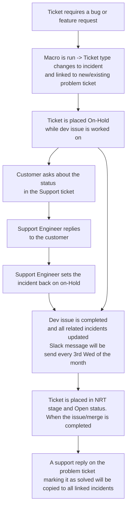

## Dev Pulse とは?

Dev Pulse は、バグの解決や機能リクエストの実装に関する Issue やマージリクエストを積極的に監視するために私たちが利用するスクリプト群と Zendesk セットアップの名称です。

すべてのコンポーネントを通じて、Dev Pulse は Zendesk チケットを Issue またはマージリクエストが特定の状態に達するのを待つ間、`On-hold` ステータスのまま保持できるようにします。

特定の状態に達すると、Dev Pulse を使用している Zendesk 内のチケットは、待機していた Issue またはマージリクエストに状態変更があったことを示すように更新されます。

Dev Pulse の実装の詳細については [ドキュメント](/handbook/security/customer-support-operations/zendesk/dev-pulse) を参照してください。

## どのように動作するか?

## 使用方法

1. Zendesk チケットフィールド `Waiting on issue or merge request` にバグ Issue または MR へのリンクを追加します。URL からは余分なパラメータ（Issue または MR の IID 以降のすべて）を必ず削除してください。

2. Issue または MR のどちらを持っているかに応じて、次の手順を実行します:

   - バグ Issue または関連する MR
   `General::Waiting on bug resolution` マクロを適用します

   - 機能リクエスト Issue または関連する MR
   `General::Waiting on feature request resolution` マクロを適用します

   - [Request for Help (RFH) Issue](../workflows/how-to-get-help.md)
   `General::Waiting on RFH` マクロを適用します

3. マクロはチケットのステータスを `On-hold` に設定するので、更新を送信してプロセスを開始してください。

### Dev Pulse でどのようなビューが利用できるか

#### バグまたは機能リクエストのチケット

バグ/機能リクエストの解決を待っているチケット

#### バグまたは機能リクエストへのリンク

親問題チケット

#### RFH チケット

request for help を待っているチケット

## 表示と報告

- [Explore ダッシュボード](https://gitlab.zendesk.com/explore/dashboard/8A40804AF5438788D3839999DC2751523E962D04C5CD07AC4040B4108BB90B4F)

### 同じ MR または Issue に関連付けられたすべてのチケットを一括更新できますか?

はい。同じバグまたは機能リクエストに依存するすべての関連サポートチケットをグループ化するために、各 Issue またはマージリクエストごとに親問題チケットが作成されます。

親問題チケットが更新されると、リンクされたすべてのチケット（つまり、同じ Issue または MR の解決を待っているもの）も更新されます。

このプロセスが意図したとおりに動作するように、次の手順に従ってください:

1. 添付されたすべてのチケットで使用されることを希望する公開コメントを入力します
1. チケットページの右下にある `Submit as Solved` をクリックします
1. 表示されるポップアップモーダルを読みます
1. 更新を送信するには `Solve this ticket and xxx linked incident(s)` をクリックします

### すでに使用しているチケットでこれを使用するのを止めたい場合はどうすればよいですか?

これは非常に特定の手順を必要とするため、[#support_operations](https://gitlab.enterprise.slack.com/archives/C018ZGZAMPD) Slack チャンネルに投稿して Support Readiness チームに依頼してください。

### 関連する Issue または MR が重複としてマークされたり移動された場合はどうすればよいですか?

このような場合、Issue/MR が実際には解決されていないと顧客に一括で更新を送信したくはありません。代わりに、使用している Issue/MR のリンクを更新し、新しいものを監視し始める必要があります。

これは非常に特定の手順を必要とするため、[#support_operations](https://gitlab.enterprise.slack.com/archives/C018ZGZAMPD) Slack チャンネルに投稿して Support Readiness チームに依頼してください。

### チケットでプロセスを再開する方法

プロセスを再開する必要がある場合は、状況に応じた上記の手順に再度従ってください。マクロとセットアップは適切に対応します。
