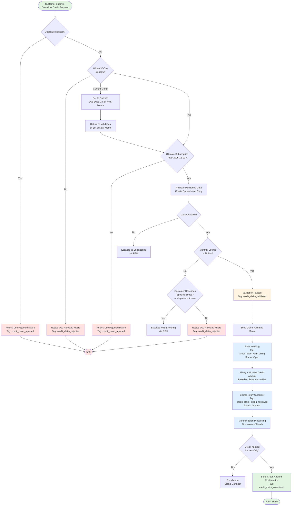

## フローチャート



## 概要

このワークフローでは、サポートが GitLab.com のダウンタイムによるクレジットの顧客リクエストを処理する方法を詳述します。クレジットは月間稼働時間が 99.9% を下回ったときに、対象となる顧客に提供されます。SLA がカバーする機能とサービスのリストについては [こちら](/handbook/engineering/infrastructure-platforms/service-level-agreement/) を参照してください。SLA は失敗するリクエスト（5xx エラー）を明示的にカバーしますが、特定の障害は捕捉されない場合があります:

- カバーされた機能を 5xx エラーを生成せずに使用不能にするアプリケーションのバグ
- ジョブ処理を妨げる Sidekiq の障害
- 失敗するリクエストなしにユーザー体験に影響するその他のインフラ問題

顧客がそのような Issue を説明する場合、さらに調査するために (GitLab.com の場合) [Observability チームへの RFH](https://gitlab.com/gitlab-com/request-for-help/-/blob/main/.gitlab/issue_templates/SupportRequestTemplate-DowntimeCredits-GitLabCom.md?ref_type=heads) を、(GitLab Dedicated の場合) [Environment Automation チームへの RFH](https://gitlab.com/gitlab-com/request-for-help/-/blob/main/.gitlab/issue_templates/SupportRequestTemplate-DowntimeCredits-Dedicated.md?ref_type=heads) を開いてください。

**重要:** このワークフローは **Ultimate GitLab.com または GitLab Dedicated 顧客**、または組織のメモに文書化された例外を持つ顧客に **のみ** 適用されます。Self-Managed 顧客は対象外です。

## 定義

- **Monthly Uptime**: モニタリングデータから計算した、暦月中に GitLab.com サービスが利用可能だった時間の割合。
- **Eligible Customer**: GitLab.com または GitLab Dedicated（Self-Managed ではない）で、新規または更新された Ultimate サブスクリプションを持つ顧客。サブスクリプションは 2025-12-01 以降の開始日を持つ必要があるか、組織のメモに例外が記載されている必要があります。
- **Affected Month**: ダウンタイムが発生した暦月。
- **Credit Tiers**: クレジットは月間稼働時間の割合に基づいて計算されます。クレジット計算については [SLA ハンドブックページ](https://gitlab.com/gitlab-com/content-sites/handbook/-/merge_requests/15942/diffs#c01d3f1a95e516a85744800ee399622ba1e31df3_0_96) を参照してください。

## 適格要件

顧客は次の **すべて** の条件を満たす必要があります:

1. GitLab.com または GitLab Dedicated で 2025-12-01 以降の開始日を持つ **新規または更新された Ultimate** サブスクリプションを持つ、または組織のメモに文書化された例外を持つ。
1. **月間稼働時間が 99.9% を下回る** 結果となるダウンタイムを経験した
1. 影響を受けた月が終了してから **30 日以内** に申請を提出する。

    - 例: 2025 年 11 月のダウンタイムについては、申請は 2025 年 12 月 1 日から 2025 年 12 月 31 日までの間に提出する必要があります
    - 顧客は **影響を受けた月が終了した後にのみ** 申請を提出できます

1. 同じ月に対して以前に申請を提出していない

## 処理タイムライン

- **顧客提出ウィンドウ**: 影響を受けた月が終了してから 30 日以内
- **サポートの検証**: 提出から 1 営業日以内
- **Billing の計算**: 検証から 3 営業日以内
- **クレジットの適用**: 月次バッチ処理（通常は翌月の最初の週）
- **総タイムライン**: 受付からクレジット発行まで 60 日以内

## ワークフロー

### ステップ 1: 顧客によるリクエスト提出

顧客は **Downtime Credit Request** Zendesk フォームを通じてダウンタイムクレジットリクエストを提出します。

**必要な情報:**

- 影響を受けた月
- ネームスペースパスまたは GitLab Dedicated インスタンスの URL
- 経験した影響の簡単な説明
- 顧客は影響を受けたことを証明する必要があります

**注意:** 顧客が 1 つのチケットで複数の月のダウンタイムを申請する場合、各月ごとに別々のチケットを作成する必要があります。

### ステップ 2: サポートの検証

サポートは、モニタリングデータと適格要件に対して申請を検証します。

#### 検証チェックリスト

次のチェックを順番に完了します:

1. **重複チェック**: 同じ顧客から同じ月に対する既存のチケットを検索します。

    - **重複リクエストが見つかった場合**: `Support::Downtime Credits::Claim Rejected` マクロを使って新しいチケットをクローズします。元のチケット番号を参照し、重複であることを説明します。
    - **クレジットがすでに適用されている場合**: `Support::Downtime Credits::Claim Rejected` マクロを使ってクローズします。クレジットが以前に処理されたことを説明します。

1. **サブスクリプション適格チェック**

    - 顧客が GitLab.com または GitLab Dedicated で 2025-12-01 以降の開始日を持つ **新規または更新された Ultimate** サブスクリプションを持っているか、または組織のメモに文書化された例外を持っていることを確認します。
    - 適格でない場合: `Support::Downtime Credits::Claim Rejected` マクロを使用し、却下の理由を提供します

1. **タイミング検証**

    - 月末から 30 日のウィンドウ内に提出されたことを確認します
    - 当該月を提供した場合:

        - 月が終了した後にのみ申請を検証できることを説明する返信をします
        - チケットタイプを `Task` に設定し、期日を翌月の 1 日に設定します
        - チケットを On hold に設定します
        - 翌月の 1 日に検証ステップに戻ります

    - ウィンドウ外の場合: `Support::Downtime Credits::Claim Rejected` マクロを使用し、却下の理由を提供します

1. **モニタリングデータの取得**

    - [計算スプレッドシート](https://docs.google.com/spreadsheets/d/1GNZOq3K9tIR6LzWGay_2WHCTabksAVBDV26S7FPb4Zs/) を開きます
    - `Downtime credits spreadsheets` [ドライブフォルダ](https://drive.google.com/drive/folders/1hfVWvkFPYQoWpyc4rNkCjlNMYG8N-cxQ?usp=sharing) を選択してスプレッドシートのコピーを作成します
    - スプレッドシートのタイトルを `[CustomerName]-[YYYY-MM]-[TicketNumber]` に設定します
    - 指定された月のネームスペースまたはインスタンスの稼働時間の割合を取得します。デモは [このビデオ](https://gitlab.com/-/group/1112072/uploads/71eb8ae1b42cf6c38ca63d6feb52284b/video1277894444.mp4) を視聴してください。

        - GitLab.com: `Customer ID` には **トップレベルグループパス**（グループ ID や URL ではなく）を入力し、`Platform` には `gitlab.com` を選択していることを確認してください。
        - GitLab Dedicated: 計算スプレッドシートの **Dedicated Customer IDs** シートから関連する `customer_id` を取得し、`Customer ID` に入力した後、`Platform` には `gitlab-dedicated` を選択します。

    - モニタリングデータが欠落しているか不完全な場合: RFH 経由で Engineering にエスカレーションします。GitLab.com の場合は [SupportRequestTemplate-DowntimeCredits-GitLabCom](https://gitlab.com/gitlab-com/request-for-help/-/blob/main/.gitlab/issue_templates/SupportRequestTemplate-DowntimeCredits-GitLabCom.md?ref_type=heads) を、GitLab Dedicated の場合は [SupportRequestTemplate-DowntimeCredits-Dedicated](https://gitlab.com/gitlab-com/request-for-help/-/blob/main/.gitlab/issue_templates/SupportRequestTemplate-DowntimeCredits-Dedicated.md?ref_type=heads) を使用します
    - 顧客が検証結果に異議を唱える場合: [紛争解決ワークフロー](https://internal.gitlab.com/handbook/support/workflows/downtime-credit-conflict-resolution) をレビューし、（適切な場合）RFH 経由で Engineering にエスカレーションします。GitLab.com の場合は [SupportRequestTemplate-DowntimeCredits-GitLabCom](https://gitlab.com/gitlab-com/request-for-help/-/blob/main/.gitlab/issue_templates/SupportRequestTemplate-DowntimeCredits-GitLabCom.md?ref_type=heads) を、GitLab Dedicated の場合は [SupportRequestTemplate-DowntimeCredits-Dedicated](https://gitlab.com/gitlab-com/request-for-help/-/blob/main/.gitlab/issue_templates/SupportRequestTemplate-DowntimeCredits-Dedicated.md?ref_type=heads) を使用します

1. **しきい値チェック**

    - 月間稼働時間が 99.9% 未満であることを確認します
    - 稼働時間が 99.9% 以上の場合: 顧客の影響の説明をレビューします

        - モニタリングで捕捉されない可能性のある特定の Issue を顧客が説明している場合（例: Sidekiq ジョブ処理失敗、5xx エラーなしで機能を使用不能にするアプリケーションのバグ）、却下する前に RFH 経由で Engineering にエスカレーションします。GitLab.com の場合は [SupportRequestTemplate-DowntimeCredits-GitLabCom](https://gitlab.com/gitlab-com/request-for-help/-/blob/main/.gitlab/issue_templates/SupportRequestTemplate-DowntimeCredits-GitLabCom.md?ref_type=heads) を、GitLab Dedicated の場合は [SupportRequestTemplate-DowntimeCredits-Dedicated](https://gitlab.com/gitlab-com/request-for-help/-/blob/main/.gitlab/issue_templates/SupportRequestTemplate-DowntimeCredits-Dedicated.md?ref_type=heads) を使用します
        - そのような Issue が説明されていない場合: `Support::Downtime Credits::Claim Rejected` マクロを使用し、却下の理由を提供します

#### 検証結果

- **PASS**: すべてのチェックが成功 → ステップ 3（Billing への引き継ぎ）に進みます
- **FAIL**: `Support::Downtime Credits::Claim Rejected` マクロを使用し、却下の理由を提供します

1. 申請をレビューし、適用される却下理由を特定します
2. マクロ本文を編集し、関連する理由セクション **のみ** を残します
3. 送信前に他のすべての理由セクションを削除します
4. 結びの段落がそのまま残っていることを確認します

### ステップ 3: Billing への引き継ぎ

1. **Support::Downtime Credits::Claim Validated** マクロを使って顧客に返信します
1. マクロ `General::Forms::Incorrect form used` を使用します
1. 不正なフォームのマクロの内容を削除します
1. 検証の詳細とともに内部メモを追加し、`credit_claim_with_billing` タグを追加する `Support::Downtime Credits::Pass to Billing` マクロを使用します:

   ```text
   Customer name: [Org name]
   Monthly Uptime: [X]%
   Namespace Path or Instance URL: [Path/URL]
   Month: [YYYY-MM]
   Uptime Spreadsheet: [Link to copy of uptime spreadsheet, shared with GitLab]
   ```

1. Open として送信します

### ステップ 4: Billing ワークフロー

**注意:** このセクションは情報提供のみを目的としています。Billing ワークフローは Billing が所有しており、変更される可能性があります。

サポートが検証してチケットを Billing に引き継ぐと、Billing チームは次を行います:

1. 月次サブスクリプション料金と稼働時間の割合に基づいてクレジット金額を計算する
1. 計算されたクレジット金額と予定される適用日について顧客に通知する
1. 月次バッチ処理（通常は毎月最初の週）でクレジットを適用する
1. クレジットが請求書に表示されたら、顧客に適用を確認する
1. チケットを解決する

## よくある質問

**Q: このワークフローは CI/CD 分の使用に影響するインシデントに使用することを意図していますか?**
A: いいえ、このワークフローは [Covered Experiences](/handbook/engineering/infrastructure-platforms/service-level-agreement/#covered-experiences) にリストされている機能をカバーします。

**Q: 顧客は当該月の申請を提出できますか?**
A: いいえ。申請は影響を受けた月が終了した後にのみ提出できます。顧客がダウンタイムクレジットを請求する資格がある場合は、手順に従ってください。

**Q: 顧客が 1 つのリクエストで複数の月を提出した場合はどうなりますか?**
A: 各月ごとに別々のチケットを作成して、追跡を明確にします。監査上の理由から、1 つのチケットで複数の月を処理することはありません。

**Q: プロセス全体にはどれくらい時間がかかりますか?**
A: 提出からクレジット適用まで、プロセスには最大 60 日かかり、その時間のほとんどは月次バッチ処理に充てられます。

**Q: モニタリングデータが顧客が経験したものとは異なる稼働時間を示している場合はどうなりますか?**
A: Engineering のモニタリングデータが信頼できるものです。差異がある場合は、RFH 経由で Engineering にエスカレーションします。

**Q: 顧客がダウンタイムを経験したが、モニタリングデータが 99.9% を超える稼働時間を示している場合はどうなりますか?**
A: 私たちの SLA は失敗するリクエスト（5xx エラー）を明示的にカバーします。ただし、機能を使用不能にするアプリケーションのバグや Sidekiq ジョブ処理失敗など、標準モニタリングで捕捉されない障害もあります。顧客がそのような Issue を経験した場合、具体的な詳細を提供するよう要求してください。モニタリングシステムで捕捉されなかった障害があったかどうかを調査するために、RFH 経由で Engineering にエスカレーションします。

**Q: 顧客は特定のクレジット適用方法をリクエストできますか?**
A: クレジットはデフォルトで次回の請求書に適用されます。代替リクエストはケースバイケースで Billing が処理します。

**Q: 顧客にクレジットの計算に使用しているデータと数式を提供することは許可されていますか?**
A: はい、リクエストに応じて - "Availability Calculation" タブから生データを .csv ファイルとしてエクスポートし、添付ファイルとして送信してください。クレジット金額に関する質問は Billing チームに転送してください。

**Q: 検証に失敗したダウンタイムクレジット申請に対して Sales が反対した場合、サポートエンジニアは何をすべきですか?**
A: 反対の理由によります:

- 顧客がデータに反映されていない障害の影響を受けたと考える場合: そのケースが適切に検討されるよう、Request for Help (RFH) を開きます。
- Sales が顧客満足度の理由から反対している場合: CSAT 上の理由から一回限りの例外を許可するかどうかを決定するために、サポートエンジニアリングマネジメントにエスカレーションします。

**Q: 顧客が稼働時間の計算に異議を唱えたり、データに関する質問が増えたりした場合、サポートはこのデータを「説明」することが期待されます。このデータの抽出方法に関するトレーニングはありますか?**
A: デモビデオがデータの概要を提供します。さらに支援が必要な場合は、Request for Help (RFH) を開いてください。

**Q: スプレッドシートを更新するコストはありますか?**
A: データを更新することに関連する小さなコストがあります。詳細は [このコメント](https://gitlab.com/gitlab-com/gl-infra/data/sla-analytics-pipeline/-/issues/27#note_2879084261) を参照してください。
