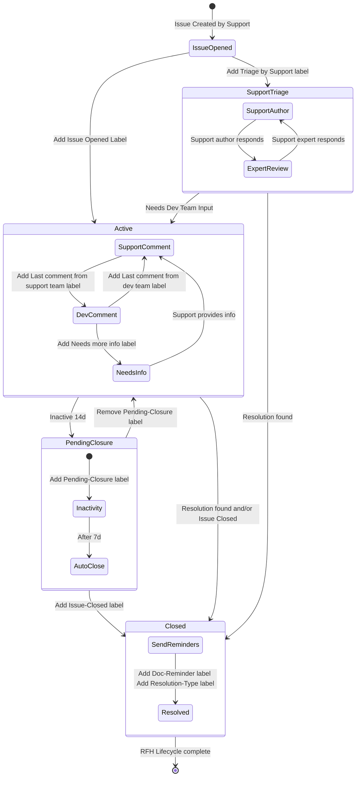

## チケットに対するヘルプを求める

[チケットに取り組む](/handbook/support/workflows/working-on-tickets)際、コラボレーションは非常に重要です。特に複雑な問題のトラブルシューティングや、自分の経験範囲を超える技術領域に関わる場合はそうです。ヘルプを求めるということは、[低い恥のレベル](/handbook/values/#low-level-of-shame-when-dogfooding)を持つことを意味し、また、顧客の問題解決に取り組んでいることから、顧客を最優先にしていることを示します。

### 良い質問をする

良い質問をすることは、必要なヘルプを得るための鍵です。迷ったときは、自分にこう問いかけてください:

> 自分の質問には、読み手が良い回答を作るために必要なすべての情報が含まれているか?

質問には、読み手が文脈を切り替えずに状況を把握できるように必要な情報を含めるべきです。また、明確で直接的な依頼を含めるべきです。質問する際は、以下を考えてください:

- 質問には、問題の簡潔で説明的な要約があるか?
- チケット、Issue、ドキュメントページ、その他の関連リソースへのリンクはあるか?
- 含めるべき注目すべきエラーメッセージや動作はあるか?
- 質問の冒頭または末尾に依頼内容が明確に記載されているか?

問題の要約や概要から始めることで、読み手はチケットなど別の場所に行かなくても状況を把握できます。他の資料へのリンクを含めることで、顧客の詳細やログファイルなど、必要な追加情報を読み手が収集しやすくなります。特定のエラーメッセージや動作を強調することで、範囲を絞り込めます。質問の冒頭または末尾に依頼内容を明確に記載することで、読み手が何についてヘルプを必要としているかを簡単に識別できるようになります。

これらのガイドラインは参考であり、質問の **必須要件ではありません**。出発点としてあなたを導くものですが、ヘルプを求めることを妨げるものではありません。

最後の振り返りの機会として、GitLab の顧客がこの質問をしていると想像してみてください。回答を作り始めるのに十分な詳細があるか、それとももっと情報を集める必要があるか?

しばしば、質問を書き出すことは [ラバーダックデバッグ](https://en.wikipedia.org/wiki/Rubber_duck_debugging) のように機能します。つまり、上記の項目について考える行為が、不足している情報を浮き彫りにしたり、これまで調査していなかった事項を調べさせたり、解決策に直接導いたりすることがあります。

{}
情報量が多いほうが役に立ちますが、補足情報が多すぎると混乱を招くことがあります。最初の投稿では、上記の質問を満たす程度の情報を提供してください。ログやスクリーンショットなどの追加詳細は、いつでもスレッドに追加できます！
{}

### ヘルプを求めるワークフロー

チケットで行き詰まった場合、以下のワークフローは、サポートエンジニアがチケットを解決へと進めるために利用可能なすべてのリソースに気づき、活用するのに役立つことを目指しています。このワークフローでは、必要なヘルプを得るために頼れるいくつかの一般的なリソースをリストアップしています。

チケットで行き詰まったら、まず行き詰まりの原因を特定します。例:

- このチケットを進めるための適切な知識を持っていない。
- 顧客の問い合わせはサポート対象外だが、解決を期待されている。
- 開発エキスパートの相談が必要な深い技術的問題がある。

次に、ブロッキングを解消するために以下のオプションを検討してください。そして、[ブロックを解消するためのエスカレーション](/handbook/values/#escalate-to-unblock)は Results の運用原則であることを忘れないでください。

#### チケットを仲間のグループに持ち込む

他のサポートエンジニアは、チケットを支援する素晴らしいリソースです。仲間からヘルプを得るには、以下のいずれかを試してみてください:

1. ペアリングセッションをスケジュールするか、クラッシュセッションやヘルプセッションに参加します。これは、ヘルプを得て同時に学ぶ最も速い方法であることが多いです。ガイダンスについては [ペアリングセッションを始める](pairing-sessions.md#getting-started-with-pairing-sessions) を参照してください。
1. より広範な [サポート Slack チャンネル](/handbook/support/#slack)のいずれかでヘルプを求めます。

#### サポート Pod や他の専門家に範囲を広げる

以下のいずれかを行うこともできます:

- あなたのチケットの分野をカバーする [サポート Pod](/handbook/support/workflows/working-with-pods/) があるかどうかを確認し、Pod のメンバーの 1 人にヘルプを求めます。
- サポート内のエキスパートに尋ねます。スキルを持つ可能性のある人を確認するには、[Skills by Subject](https://gitlab-com.gitlab.io/support/team-pages/skills-by-subject.html) サポートページを確認するか、適切な製品分野の [サポート Stable Counterpart](/handbook/support/support-stable-counterparts/) に連絡します。スレッドおよびチケットでそれらの人をメンションして、その方が助けになると考えていることを伝えます。
- 簡単で具体的な質問で、すぐに答えられそうな場合は、開発チームの Slack チャンネルで直接連絡を取ります。専門知識が問題をより効率的に解決するのに役立つ可能性がある場合、開発チームに早期に関与してもらうことをためらわないでください。相手の時間を尊重しましょう - あなたの質問により詳細な情報や調査が必要な場合、開発チームから正式な [ヘルプリクエスト Issue](#how-to-formally-request-help-from-the-gitlab-development-team) を起票するように案内されることがあります。
- [関連する GitLab 開発チームにヘルプをリクエスト](#how-to-formally-request-help-from-the-gitlab-development-team)します。
  手元にある情報を集め、Issue で開発チームのためにできるだけ多くの詳細を記入します。注目を集めるために、関連するグループの Slack チャンネルにメッセージと Issue へのリンクを投稿することができます。
  SLO 内に応答が得られない場合は、プロジェクト readme に記載されているエンジニアリングマネージャーに連絡してください。
  詳細については[以下](#how-to-formally-request-help-from-the-gitlab-development-team)を参照してください。
- 再現可能な問題がある場合は、適切な [GitLab 製品トラッカー](https://gitlab.com/gitlab-org) のバグ Issue に直接進みます。

#### チケットをマネージャーに持ち込む

特に、チケットで行き詰まりを感じ、次のステップを特定するための支援が必要な場合:

1. いつでも、利用可能なマネージャー（あなたのマネージャー、または `#support_leadership` チャンネルの[オンコール中のサポートマネージャー](/handbook/support/workflows/support_manager-on-call) など）に気軽に連絡してください。マネージャーは次のステップを決定するのを助けてくれます。
   - `#support_leadership` で対応の DRI が特定されていないメッセージは見逃されたり、傍観者効果の犠牲になったりする可能性があるため、避けてください。
1. 以下のような状況で緊急かつ重要な場合は、[STAR を起票](/handbook/support/internal-support/support-ticket-attention-requests#submitting-a-support-ticket-attention-request-star--starring-a-ticket)します:
   - 顧客がチケットを通じて、私たちが提供しているサービスへの不満を表明した
   - サポートエンジニアが、より一貫した対応に役立つ可能性のある顧客の複数のチケット間の関連性に気づいた
   - 別のリージョンでの緊急の対応が必要（たとえば、チケットの担当者を見つける、コールをスケジュールするなど）

### GitLab 開発チームに正式にヘルプをリクエストする方法 {#how-to-formally-request-help-from-the-gitlab-development-team}

サポートチームと開発チーム間のコラボレーションを強化するため、GitLab はヘルプリクエスト（RFH）プロセスを導入しました。これにより、チケットの解決を妨げる技術的な課題に直面した際に、サポートエンジニアが関連する機能を担当する特定の GitLab 開発グループから正式に支援を要求できます。このセクションでは、RFH プロセスを効果的に活用するために必要な手順を説明します。

このプロセスは、GitLab のすべての開発セクションおよびグループにこのワークフローを展開することを目的とした、より広範な反復戦略の一部であることに注意してください。特定の開発グループの RFH テンプレートがまだ利用できない場合は、[John Lyttle](https://gitlab.com/jlyttle) に連絡して、必要な RFH テンプレートの作成を開始してください。

#### 開発チームへのヘルプリクエストは早すぎる?

いいえ! この点を強調するため、開発者の **Chad Woolley** からのコメントを紹介します:

> _もしサポートと顧客の両方が次のステップに困惑しているのであれば、それは少なくとも、ドキュメントやサポートプロセスに何か欠けているという指標であり、これらの分野を改善する機会です。_

#### ヘルプを求めるための正しい開発セクションとグループの見つけ方

サポートヘルプリクエスト Issue の正しい場所を判断する最も簡単な方法は、ドキュメントページを使用することです。1 つの可能なワークフローは次のとおりです:

1. ヘルプが必要な機能やトピックのドキュメントページを見つけます。
1. ページの下部までスクロールし、「View page source」リンクをクリックします。
1. これで、そのドキュメントページの `.md` ソースファイルが開き、上部にそのページを担当する `stage` と `group` が記載されています。
1. 次に、[製品カテゴリのハンドブックページ](/handbook/product/categories/) に移動し、前のステップで特定したグループが属する開発セクションを検索します。
1. 以下の表とワークフローを使用して、上記で特定したプロジェクトでヘルプリクエスト Issue を作成します。

または、[Support dotfiles](https://gitlab.com/gitlab-com/support/toolbox/dotfiles) を設定している場合は、`gls_request_for_help` コマンドを使用して、正しい Issue テンプレートを含む「New issue」リンクを素早く取得できます。

_注:_ 上記で説明したものと同様のワークフローのビデオ録画は、[Support Training リポジトリ](https://gitlab.com/gitlab-com/support/support-training/-/blob/main/Support%20Specific%20Trainings/training-videos/Support%20Request%20for%20Help%20Workflow.mp4) で確認できます

#### ヘルプリクエストのランディングページ

[ヘルプリクエスト](https://gitlab.com/gitlab-com/request-for-help) ランディングページは、すべての GitLab 開発セクションとそれぞれのグループを単一のリポジトリに統合しています。以前のプロセスとは異なり、すべての RFH テンプレートはアクセスと管理を容易にするためにこのリポジトリ内に集約されています。Issue を提出するには、ページに移動し、関連する GitLab グループを見つけて、その「Associated Template」をクリックします。

**変更プロセス:**
セクションまたはグループが最近変更された場合は、GitLab プロジェクトトラッカーで confidential Issue を作成し、@jlyttle に割り当て、関連する Slack チャンネルに通知してください。
詳細については、[サポートエピック #222](https://gitlab.com/groups/gitlab-com/support/-/epics/222) を参照してください。

#### Issue を起票する前のリサーチ

類似の Issue やリクエストを特定するために、以下のリポジトリとリソースを使用してください:

1. 関連チケットの Zendesk。
1. 過去の GitLab アプリケーションの[バグや機能リクエスト](https://gitlab.com/gitlab-org/gitlab/-/issues)。
1. 過去に提出された GitLab.com の Issue。
1. 過去に提出された [ヘルプリクエスト](https://gitlab.com/gitlab-com/request-for-help) Issue。
1. 知識のあるエキスパートやサポート Stable Counterpart と相談する。

#### 詳細な Issue を作成する

1. [ヘルプリクエスト](https://gitlab.com/gitlab-com/request-for-help) ランディングページを開きます。
1. 開発グループと対応するテンプレートのセクションを確認します。
   - どのセクション、サブグループ、対応するテンプレートを使用すべきか不明な場合は、プロジェクト ReadMe ファイルの下部にある GitLab Handbook Section Breakdown リンクを使用してください。
1. 新しい Issue を作成する際は、必ず正しい対応する Issue テンプレートを使用してください。
1. Issue テンプレートのすべてのフィールドを記入し、必要なファイルをすべて添付します。
1. [サポート影響度](https://about.gitlab.com/support/definitions/#definitions-of-support-impact)で定義されている適切な重大度が設定されていることを確認します。Zendesk の優先度レベルに対応するように、`severity::1`、`severity::2`、`severity::3`、`severity::4` の適切なラベルを設定してください。
1. Zendesk チケットがエスカレートされている場合は、`Support::escalated` ラベルを追加します。
1. 必要に応じて「Customer Impact」ステートメントを追加し、顧客を代弁します。
1. テンプレート自体の指示（たとえば、自動的に割り当てられない場合は誰に Issue を割り当てるか）に従ってください。
1. Issue 作成後:
   - 内部メモとして Issue へのリンクを Zendesk チケットに、`GitLab Issues` という名前のチケットフィールドに追加します。
   - Issue 上で Duo Chat を使用して、追加で共有すべき詳細やコンテキストを特定します。次のようなプロンプトを使用できます:
     > This issue is a request for help from the customer support team to Engineering. Identify any context that has not been shared, but that would be useful for Engineering to help provide a solution for this issue.

#### 顧客応答待ちの間の自動クローズ防止

顧客からの応答を待っている場合で、非アクティブによる RFH Issue の自動クローズを防ぐ必要がある場合は、以下のラベルを手動で適用してください: **`RFH::Awaiting Customer Response`**

**このラベルを使用するタイミング:**

- 顧客に追加情報や説明を求めた場合
- 顧客が提案された解決策や回避策をテストするのを待っている場合
- 調査を進めるために顧客の入力が必要な場合
- 顧客のアクションなしには Issue を進められない場合

#### クローズ: ドキュメント化と知識共有

RFH Issue をクローズする際は、以下の必須アクションを完了してください:

##### 1. クローズコメントとラベルを追加

Issue がクローズされる理由を説明するコメントを追加し、適切なクローズ理由ラベルを適用します:

- `Closed::Bug Fixed` – バグ修正により Issue が解決された
- `Closed::Workaround` – 回避策が提供されて Issue が解決された
- `Closed::Other Request` – パブリックトラッカーで関連する機能リクエストやバグレポートが作成され、そちらで追跡が継続される
- `Closed::Moved to Public Issue` – 継続的な追跡のために Issue がパブリックトラッカーに移動された
- `Closed::No Solution` – 回避策や解決策が見つからなかった
- `Closed::Insufficient Information` – 詳細不足により RFH に対応できなかった、または顧客が応答しなかった
- `Closed::Documentation` – 既存のドキュメントが従われなかった
- `Closed::Out of Scope` – リクエストがサポートの範囲外と判断された

##### 2. ドキュメントの更新（該当する場合）

Issue 内に含まれる解決策や情報が、GitLab ドキュメントの更新に使用できるかを検討してください:

- GitLab ドキュメントを **更新した** 場合は、`documentation::created` ラベルを追加し、マージリクエストをリンクします
- ドキュメントを **更新すべき** だが、まだ行っていない場合は、`documentation::candidate` ラベルを追加し、関連するドキュメントを更新するための GitLab Issue を作成します

##### 3. レトロスペクティブの実施（該当する場合）

RFH にレトロスペクティブが必要な場合は、Issue をクローズする前に [RFH ReadMe](https://gitlab.com/gitlab-com/request-for-help/-/tree/main#retrospectives) に記載されているとおりに完了することを確認してください。

#### 迅速な応答を得るためのヒント

1. ヘルプリクエスト Issue 起票時の手順をすべてカバーしたかを確認します。
2. レビューや応答が必要なコメントごとに、_毎回_ 助けてくれているエンジニアや割り当てられたエンジニアをメンションします。
3. Issue が別のグループに移動された場合（ラベルの変更や別のプロジェクトへの移動を通じて）、新しいグループの対応するテンプレートを確認して、誰に割り当てるか、コメントでメンションするかを確認します。
4. Kibana にリンクする際は、ログが 7 日後にローテーションアウトされるため、関連エントリのコピー、グラフのスクリーンショットなどもアップロードしてください。可能であれば、関連する Sentry エントリにもリンクしてください。
5. 多くのチームは顧客情報にアクセスできません。そのため、GitLab.com 管理者などの昇格したアクセス権を使用して情報にアクセスしている場合は、問題を理解するために必要となる可能性のある情報を Issue に直接記載してください。

#### 開発側で追加情報が必要な場合

開発エンジニアは、追加の詳細が必要な場合に Issue に `RFH::Needs more info` ラベルを適用することがあります。このラベルは、Issue を進めるために明確化や追加情報が必要であることを示します。このラベルを見たら:

1. 開発チームからのコメントを注意深くレビューします。
1. 新しいコメントで要求されたすべての情報を提供します。
1. 応答内で関連する開発者をメンションします。
1. 問題の詳細な説明、必要なログ、スクリーンショット、または必要な再現手順を含めたことを確認します。

要求された情報を提供すると、開発チームは RFH::Needs more info ラベルを削除し、調査を続行します。

注意: このラベルが適用された際に徹底的かつ迅速に応答することで、Issue が効率的に調査・解決されるのを保証できます。

#### リクエストのブロックを解除するためのエスカレーション

ヘルプリクエストが停滞している場合（たとえば、開発チームからの応答や進捗がない）、以下の手順は Issue のブロックを解除するのに役立ちます。サポートはユーザーに代わって作業しています。エンジニアリングチームから適時に回答を得ることを保証することは、顧客の満足度を維持するのに役立ちます。

リクエストがブロックされている場合、またはサポートチケットで更新が要求されている場合:

1. 割り当てられたエンジニアが PTO 中かどうかを Slack または GitLab ステータスで確認します。PTO 中の場合は、エンジニアリングマネージャーと Issue テンプレートに記載されている連絡先（またはこれらの連絡先も利用できない場合はそのバックアップ）を @mention します。バックアップは通常、カバレッジ Issue または Slack に記載されています。
2. Issue 内で @mention して、開発グループのエンジニアリングマネージャーに通知します。各プロジェクトの README セクションから開発グループハンドブックページを確認することで、関連する EM を特定できます。`Development Groups with their corresponding templates and labels` というセクションを提供します。
3. 対応する製品または開発グループの Slack チャンネルで、RFH Issue へのリンクとともに、割り当てられたエンジニアやエンジニアリングマネージャーに ping を送り、更新を要求します。
4. 上記の手順でリクエストのブロックが解除されなかった場合は、サポートマネージャーに直接、または `#support_leadership` Slack チャンネルでさらなるガイダンスを求めてください。

#### クローズ: ドキュメント化と知識共有

1. 必要な支援をすべて受けた後、Issue をクローズし、なぜクローズするのかを説明するコメントを追加することを忘れないでください。
1. Issue 内に含まれる解決策や情報が、GitLab ドキュメントの更新に使用できるかを検討してください。
   1. GitLab ドキュメントを更新した場合は、`documentation::created` ラベルを追加し、マージリクエストをリンクします。
   1. それ以外の場合は、`documentation::candidate` ラベルを追加し、関連するドキュメントを更新するための GitLab Issue を作成します。

### クイックリンクとリソース

- ZenDesk の [Needs Collaboration view](https://gitlab.zendesk.com/agent/filters/360080204660)。
- サポート [ペアリングセッション Issue](https://gitlab.com/gitlab-com/support/support-pairing) を作成します。
- 関連するトラブルシューティングワークフローに従うための [サポートワークフロー](/handbook/support/workflows/)。
- 役立つ GitLab ドキュメントへのクイックリファレンスのための [サポートドキュメントリンク](/handbook/support/#documentation)。
- ヘルプに必要なスキルセットに合わせたサポートエンジニアを見つけるための [Skills by Subject](https://gitlab-com.gitlab.io/support/team-pages/skills-by-subject.html)。
- 適切な開発または製品チームを見つけるための [DevOps ステージ](/handbook/product/categories/#devops-stages)。
- 緊急時でなくてもトラブルシューティングのヒントが含まれている [緊急 runbook](https://gitlab.com/gitlab-com/support/emergency-runbook/-/tree/master/.gitlab/issue_templates)。
- 緊急の事項についてガイダンスが必要な場合に [どのマネージャーがオンコール中か](https://gitlab.pagerduty.com/escalation_policies#PGNLUZ1) を確認します。

#### 一般的なトラブルシューティングリソース

問題ごとに少しずつ違います。時には別のトラブルシューティング技法を試すのが意味のあることもあります。これらのリソースは、一般的なアプローチでのトラブルシューティングについて述べています:

- Julia Evans の [comics](https://wizardzines.com/comics/)、特にデバッグに関するもの
- [The Pocket Guide to Debugging (PDF)](https://store.wizardzines.com/products/the-pocket-guide-to-debugging)
- [General Purpose Troubleshooting Principles](https://brie.dev/troubleshooting/)

#### ヘルプリクエストのライフサイクル図

