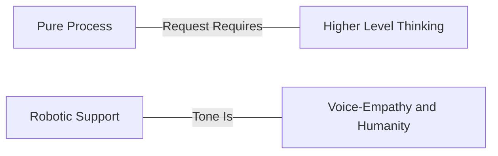

## チケットへの応答方法

### 賢い人間が賢いサポートを提供する

私たちは賢い人々を雇い、人々に賢く振る舞ってもらうことを目指しています。これは、役立つ常識的なガイドラインを提供しようとしますが、「スクリプト」や硬直性を避けることを意味します。カンファレンスで同僚に話すように、自然な声で話してください。当然ながら、プロフェッショナルでない言葉は避けますが、顧客のトーンに合わせたいでしょう。誰もがロボットのようなトーンで話すことで「統一」したいという願望がしばしばあります:

> "Thank you for contacting support. We can help you with this. It looks like you are asking for help with resetting your password…"

これは私たちを非人間化し、私たちの最大の資産である *人間からのサポート* を失います。より自然に話すことで、私たちも実在の人間であり、「サポートマインドをサービスとして提供する」のではないことを示せます:

> "Ah, sorry to hear that you lost your password. I've issued a password reset and you are good to go. In the future, you can use this link:
>
> <link>
>
> Let us know if there is anything else we can help with. "

### 私たちは缶詰工場ではない（しかし、時には缶詰を使う）

GitLab では、応答の要素を慎重に検討します。定型応答を使いたくなったり、同じことを何度も言っていることに気づいたりする場合、それはおそらくプロセスを改善する機会です。つまり、ログを要求するためのテキストエクスパンダーを作成する代わりに、一歩下がってください。サポートチケットを開く体験のもっと早い段階で、繰り返しのテキストの必要性を減らすためにできることはないでしょうか?
形式的な言葉や定型的な返信を使うのが適切な時もありますが、それはまれです。可能な限り、私たちは共感と人間性に向かって押し進め、プロセスを自動化・事前ロードします。

このスペクトルを考えてみてください:

権限を持ちましょう: GitLab サポートでは、エージェントではなく、主体性を持つ人間が必要です。何かが壊れていると感じたら、聞いてください。
何かが非効率だと感じたら、修正してください。誰もが貢献できる *そして貢献すべき* です。

### サンドイッチ法

実際にチケットに応答する際、サンドイッチ法は応答を向上させるのに役立つ素晴らしい 3 つのポイントのガイドラインです。優れた顧客への返信には、次の 3 つのことが含まれます:

- 顧客から必要なもの。
- 要求された項目が役立つと考える理由を説明する前提や仮説を提示する。
- 引き続きサポートする旨の申し出。

たとえば、顧客はこう尋ねるかもしれません:

> " My GitLab server appears to be slowing down. Can you help me?"

*まあまあ* な応答は:

> " Please send us over your production logs and we can use that to troubleshoot some more. "

私たちは必要なものを尋ね、助けることができることに注目してください。サンドイッチ法を使ってこれを素晴らしいものにしましょう:

> "It will be helpful to get as many logs as possible during the slowness to help us isolate the problem. You can find them in /var/log/gitlab (This is our ask)
>
> Usually when we see slowness, it's isolated to a specific part of the application. Can you help us narrow down the issue by outlining when you see things slow down? (This is our premise for them to reinforce our expertise.)
>
> Once you send these over and help us understand how you are getting to the slow state we'll be happy to help you dive in some more." (This is us reassuring them we'll help.)

私たちは早めに必要なものを尋ねました。顧客が早く考え始められるように、また、そこで読むのをやめても依頼を見逃さないように、依頼を *早く* 強調します。私たちの視点を理解してもらうための仮説を、考えるためのものとして提供しています。
私たちは顧客に *奉仕* したいのではなく、顧客と *パートナー* になりたいのです。これは、顧客が私たちを「サポートマインドをサービスとして提供する」のではなく、対等の存在として見るための一つの方法です。

そして、顧客が戻ってきたとき、*私たちはまだここにいる* ことを知らせます。

時には、もっと追加したり、何かについて謝罪したりする必要があるかもしれませんが、この方法は大多数のチケットに適用でき、卓越性を提供するのに役立つはずです。

### 2 つの操作モード: 特性化モードと仮説テストモード

チケットに取り組むことを、2 つの操作モード、特性化モード（CM）と仮説テストモード（HT）の交互の作業として考えることができます。

特性化モードでは、ユーザーが何をしようとしているか、実際には何が起こっているか、関連する可能性のある状況や状態についての基本的な事実を確立するために働きます。チケットをパズルとして捉えることで便利な比喩となり、その矛盾を明らかにすることを目指します。これは、再現手順や潜在的なバグレポートのベースラインとしても役立ちます。

ユーザーの問題を特性化するために働いていることを透明性を持って伝えられます。この操作モードでは、以下を尋ねることができます:

- ユーザーが何をしようとしているか
- なぜユーザーがそれをしようとしているか
- システムが実際にどのように振る舞っているか
- ユーザーがシステムがどのように振る舞うべきと考えているか
- 観察している動作に影響を与えている可能性のある状態や状況の情報

第 2 の操作モードは仮説テストモードです。これは創造的なステップで、科学者のように振る舞い、ユーザー側で何が起こっているかを理論化できます。

私たちは、仮説テストモードにあることも透明性を持って伝えられます。その際、以下を明確にできます:

- 仮説は何か
- どのように動作を説明するか
- すでに確立されている他の事実をどのように説明するか
- 一部の事実をどのように説明できないか
- どのようにテストできるか
- テストにリスクが伴うか

興味深いことに、仮説テストは特性化モードに戻ります。テストとともにユーザーのシナリオに関する新しい事実を確立するからです。

1 つの応答内で複数の理論と対応するテストを思いつくことができます。実際、そうすることは、上記で説明した操作モードの構造を明確にするのに役立つ可能性があります。特性化ステップで確立された事実は、すべての理論に共通します。しかし、1 つの理論で説明される可能性は他の理論には適用されない可能性があるため、それらを別々に保つことが重要です。

このアイデアは [Jeff Anderson の話](https://www.youtube.com/watch?v=DK1ew1HpmeY&t=127s) から取られました。

### チケット偏向によるカスタマーエクスペリエンスの改善

「チケット偏向」は仕事から逃げる方法のように聞こえますが、実際にはカスタマーエクスペリエンスの改善についてです。
顧客はサポートに *書きたい* わけではありません。むしろそもそも問題を抱えたくないのです。
それができないなら、自分で問題を解決したいのです。それができないなら、**そのとき**、技術的に熟練した個人に問題を解決してもらうことを望みます。

チケット偏向には 4 つの主要なツールがあります:

- 優れた製品
- サポートステートメント
- ドキュメント
- 技術的卓越性

要するに、すべてのチケットの最後には、ドキュメント、Issue、マージリクエスト、またはサポートステートメントへのリンクがあるべきです。

#### 優れた製品

優れた製品を持つことは偏向の第一線です - 欠陥がなく期待どおりに動作する製品は、有機的にサポートケースの数を減らします。

サポートは、ユーザーが GitLab を使用中に遭遇する問題を表面化させる重要な役割を果たします。以下によって:

- [バグの報告](/handbook/support/workflows/working-with-issues/#creating-issues)
- [Issue へのタグ付け](/handbook/support/workflows/working-with-issues/#adding-labels)
- [Issue への参加](/handbook/support/workflows/working-with-issues/#adding-comments-on-existing-issues)
- [フィードバックの表面化](/handbook/support/workflows/feedbacks_and_complaints/#product-feedback)
- [MR を提出して Issue を修正する](https://about.gitlab.com/community/contribute/)

#### サポートステートメント

[サポートステートメント](https://about.gitlab.com/support/statement-of-support/) はサポートがカバーする領域、およびカバーすることを約束できない領域を説明します。これは顧客の期待を設定するためのツールであり、サポートチームが私たちが専門とするものをサポートしていることを確認するのに役立ちます。背景にある哲学について詳しくは、[サポートステートメントを紹介したブログ投稿](https://about.gitlab.com/blog/2018/12/20/introducing-our-statement-of-support/) で読めます。

GitLab のサポートチームのメンバーとして、あなたは:

- サポートステートメントの内容に精通している必要があります
- 顧客に何かが範囲外であることを快く説明できるべきです
- 意図的に範囲外に出ているときには気づき、「礼儀として」そうしていることを顧客に明確に伝えることを意識してください

##### それは範囲内ですか?

**Greg's [razor](https://en.wikipedia.org/wiki/Philosophical_razor)** は、サポートの範囲内であるかを判断するのに役立つシンプルな質問です。

> [ドキュメント](https://docs.gitlab.com) にあるか?

はいの場合、私たちはそれをサポートします。

ドキュメントにない場合、顧客が本番環境で使用する前の最初のステップは、それをドキュメントに含めることです。

#### ドキュメント {#documentation}

応答に [docs-first](https://docs.gitlab.com/development/documentation/styleguide/#docs-first-methodology) アプローチを取ることで、ドキュメントが非常に有用な [単一の情報源](https://docs.gitlab.com/development/documentation/styleguide/#documentation-is-the-single-source-of-truth-ssot) であり続けることを保証できます。実際の問題に基づいて構築されたドキュメントのコーパスを構築することで、GitLab の顧客が必要な答えや解決策をキューに来る前に見つけるのを助けます。**ナレッジベース** は成長し繁栄しています - 現在 300 を超えるナレッジ記事が公開されており、一貫して高い視聴率を得ているため、ドキュメント作成の取り組みの本当の影響を見ています。これらの記事は、顧客とチームメンバーの双方にとって頼れるリソースになりつつあります。

**常にドキュメントへのリンクまたは関連するナレッジ記事で応答してください。ドキュメントの内容が欠けている場合は、それを作成し、MR へのリンクを顧客に提供してください。ナレッジ記事が一般的な質問に対処できる場合は、それらを作成してください。違反しそうなチケットに取り組んでいる場合は、応答で違反をクリアしてから、その後 MR またはナレッジ記事をフォローアップしてください。覚えておいてください: 速く進むためにゆっくり進む。**

#### 技術的卓越性

カスタマーエクスペリエンスを改善する最善の方法は、製品について知識があることです。
強みを基に構築するか、知識を広げる意図的な学習計画を作成するために、マネージャーと連携する必要があります。
質問を自由に行い、他の人とペアを組み、他の人がついていくよう促す脆弱性の姿勢を示してください。

何を学んでも、常にそれを共有し、放送するようにしてください:

- 学習中: ドキュメントを（再）作成し、ナレッジ記事を作成する
- トラブルシューティング中: ドキュメントと既存のナレッジ記事を使用する
- 何か欠けている場合: ドキュメントを更新し、ナレッジ記事を書くか変更する
- パターンを見つけたとき: 他の人がそこから恩恵を受けられるようにナレッジ記事として文書化する

**メリット:** ドキュメントだけでなく知識も追加することで、ドキュメントと知識の両方が GitLab の重要な成功要因であるという認識を高めます。

#### サポートポータルでのドキュメントとハンドブックリンクのハイライト

時には、サポートポータルページで GitLab ドキュメントやハンドブック記事をハイライトしたい場合があります。私たちは Zendesk でリダイレクト記事を作成し、特定のキーワードをこのリンクに関連付ける（同時に関連するドキュメントやハンドブックリンクを指す）機能を持っています。サポートチケットの作成中、上記のキーワードがチケットの件名で使用されている場合、この記事がポップアップし、顧客がサポートチケットを送信する前に質問への回答を見ることができます。

現在、記事とリダイレクトのリストをキュレーションしているため、記事（のリスト）を反復するには Support-Ops またはマネージャーに連絡する必要があります。

### 自分の間違いを率直に共有し、それから学ぶ

私たちは皆人間であり、顧客とのやり取りが 100% 正しいことを確認するために努力していますが、真実は時々間違いを犯すことになるということです。これは、たとえば顧客に間違ったアドバイスを与えた場合や、後で指摘されたチケットの特定の側面を認識していなかった場合、ストレスや不安を生み出す可能性があります。

状況に関係なく、間違いを犯したら、それを所有し、そこから学んでください。私たちの [透明性](/handbook/values/#transparency) の価値を覚えておいてください。
当面の状況は望ましくないかもしれませんが、状況を解決すると、非常にエンパワーメントを感じられます。状況を解決する方法がわからない場合、ヘルプを求めることを恐れないでください。誰もが助けにここにいます。顧客にフォローアップする際は、誠実に、間違いを犯したことを説明し、正しい情報を提供してください。

状況が解決したら、自分の行動と、その状況が再び起こらないようにするために次回何ができるかを振り返る時間を取ってください。

サポートチームの広範なメンバーが学べることがあると感じる場合、地域のサポートチームミーティングや [Support Week in Review (SWIR)](/handbook/support/#support-week-in-review) で経験を共有してください。
適切な場合は、サポートドキュメントへのマージリクエストも作成することを確認してください。
経験を共有することで、他の人があなたの状況にどう対処したかについての他の方法に貢献でき、また気づきを与えるため、同じ間違いを繰り返す可能性が低くなります。
