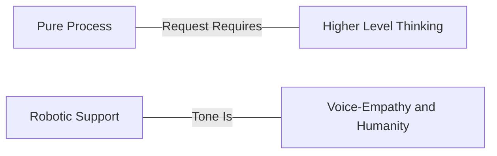

## チケットへの応答方法

### 賢い人間が賢いサポートを提供する

私たちは賢い人々を雇い、人々に賢く振る舞ってもらうことを目指しています。これは、役立つ常識的なガイドラインを提供しようとしますが、「スクリプト」や硬直性を避けることを意味します。カンファレンスで同僚に話すように、自然な声で話してください。当然ながら、プロフェッショナルでない言葉は避けますが、顧客のトーンに合わせたいでしょう。誰もがロボットのようなトーンで話すことで「統一」したいという願望がしばしばあります:

> "Thank you for contacting support. We can help you with this. It looks like you are asking for help with resetting your password…"

これは私たちを非人間化し、私たちの最大の財産を失わせます: *人間によるサポート* です。より自然に話すと、私たちもまた本物の人間であり、「サービスとしてのサポート頭脳」ではないことが定着します:

> "Ah, sorry to hear that you lost your password. I've issued a password reset and you are good to go. In the future, you can use this link:
>
> <link>
>
> Let us know if there is anything else we can help with. "

### 私たちは缶詰工場ではない（しかし時には缶詰を使う）

GitLab では、応答の要素を慎重に検討します。もしあなたが定型応答（canned responses）を使いたくなったり、同じことを何度も繰り返し言っていることに気づいたりしたら、それはおそらく私たちのプロセスを改善する機会です。つまり、ログを求めるテキストエキスパンダーを作成する代わりに、一歩下がってください。サポートチケットを開く体験のもっと早い段階で、繰り返しのテキストの必要性を減らすためにできることはないでしょうか。
フォーマルな言葉や定型返信を使うことが適切な場合もありますが、それは稀です。可能な限り、私たちは共感と人間味を追求し、プロセスを自動化して事前に組み込みます。

このスペクトラムを考えてみてください:

権限を持ってください: GitLab サポートでは、私たちはエージェントではなく、主体性を持つ人間を求めています。何かが壊れていると感じたら、尋ねてください。
何かが非効率だと感じたら、修正してください。誰もが貢献 *でき、そして貢献すべき* です。

### サンドイッチメソッド

実際にチケットに回答するにあたって、サンドイッチメソッドは応答を向上させるのに役立つ素晴らしい 3 つのポイントのガイドラインです。優れた顧客への返信は、次の 3 つを含みます:

- 相手に必要としていること。
- 要求した項目がなぜ役立つのかについて、あなたの考えを説明する前提や仮説を提示すること。
- 引き続き支援するという申し出。

たとえば、顧客が次のように尋ねるかもしれません:

> " My GitLab server appears to be slowing down. Can you help me?"

*まあまあ* の応答はこうです:

> " Please send us over your production logs and we can use that to troubleshoot some more. "

私たちは必要なものを尋ね、支援できるようになることに注目してください。サンドイッチメソッドを使ってこれを素晴らしいものにしましょう:

> "It will be helpful to get as many logs as possible during the slowness to help us isolate the problem. You can find them in /var/log/gitlab (This is our ask)
>
> Usually when we see slowness, it's isolated to a specific part of the application. Can you help us narrow down the issue by outlining when you see things slow down? (This is our premise for them to reinforce our expertise.)
>
> Once you send these over and help us understand how you are getting to the slow state we'll be happy to help you dive in some more." (This is us reassuring them we'll help.)

私たちは必要なものを早い段階で尋ねました。ask を *早く* 強調することで、相手はそれについて考え始めることができ、そこで読むのをやめてしまっても ask を見逃すことはありません。私たちは仮説を提示しました。これは相手が吟味し、私たちの視点を理解するためのものです。
私たちは顧客に *サービスを提供する* のではなく、顧客と *パートナーになる* ことを望んでいます。これは、相手が私たちを「サービスとしてのサポート頭脳」ではなく対等な存在として見るための 1 つの方法です。

そして私たちは、*まだここにいる* こと、そして相手が戻ってきたときにもいることを必ず伝えます。

何かを追加したり、何かについて謝罪したりする必要がある場合もありますが、このメソッドは大多数のチケットに適用でき、卓越性を提供するのに役立つはずです。

### 2 つの操作モード: 特徴づけモードと仮説検証モード

チケットへの対応は、2 つの操作モード、特徴づけモード（Characterization Mode, CM）と仮説検証モード（Hypothesis Testing mode, HT）を交互に切り替えるものと考えることができます。

特徴づけモードでは、ユーザーが何をしようとしているのか、実際に何が起きているのか、関連する可能性のあるコンテキストや状態に関する情報といった、基本的な事実を確立するために取り組みます。チケットをパズルとして捉えることが有用なメタファーになり、その矛盾を詳しく調べていきます。これは、再現手順や潜在的なバグ報告のベースラインとしても役立つかもしれません。

私たちはユーザーの問題を特徴づけようとしていることを透明にできます。この操作モードのとき、次のことを尋ねられます:

- ユーザーが何をしようとしているか
- なぜユーザーがそれをしようとしているか
- システムが実際にどのように振る舞っているか
- システムがどのように振る舞うべきだとユーザーが考えているか
- 私たちが目にしている振る舞いに影響している可能性のある状態やコンテキストの情報

2 つ目の操作モードは仮説検証モードです。これは、私たちが科学者のように振る舞い、ユーザー側で何が起きているかもしれないかを理論立てる、創造的なステップです。

私たちは仮説検証モードにいることも透明にできます。その際、次のことを明確にできます:

- 仮説が何であるか
- それがどのように振る舞いを説明するか
- それがすでに確立された他の事実をどのように説明するか
- それがどのように一部の事実を説明しないか
- それをどのように検証できるか
- その検証に何らかのリスクが伴うかどうか

仮説検証が特徴づけモードへフィードバックされる点は興味深いものです。検証によってユーザーのシナリオに関する新しい事実を確立するからです。

1 つの応答の中で、複数の理論とそれに対応する検証を考え出すことができます。実際、そうすることで、上で説明した操作モードの構造を明示的にするのに役立つかもしれません。特徴づけステップで確立された事実は、すべての理論に共通します。しかし、1 つの理論で説明される可能性は、他の理論には当てはまらないかもしれないので、それらを分けておくことが重要です。

このアイデアは [Jeff Anderson のトーク](https://www.youtube.com/watch?v=DK1ew1HpmeY&t=127s) から取られています。

### チケットディフレクションによる顧客体験の向上

「チケットディフレクション」は仕事から逃れる方法のように聞こえるかもしれませんが、実際には顧客体験を向上させることに関するものです。
顧客はサポートに連絡したい *わけではありません*。そもそも問題が起きないほうがずっと良いのです。
それが叶わなければ、自分で問題を解決したいと思うでしょう。それもできなければ、**そのときに** 技術的に熟練した個人に問題の解決を手伝ってほしいと思うのです。

チケットディフレクションには 4 つの主要なツールがあります:

- 優れたプロダクト
- サポートステートメント（Statement of Support）
- ドキュメント
- 技術的卓越性

要するに、すべてのチケットの最後には、ドキュメント、Issue、マージリクエスト、または私たちのサポートステートメントへのリンクがあるべきです。

#### 優れたプロダクト

優れたプロダクトを持つことが、ディフレクションの第一線です。欠陥がなく、期待どおりに動作するプロダクトは、サポートケースの数を自然に減らします。

サポートは、ユーザーが GitLab を使用中に遭遇する問題を表面化させる上で、次のことによって重要な役割を果たします:

- [バグの報告](/handbook/support/workflows/working-with-issues/#creating-issues)
- [Issue のタグ付け](/handbook/support/workflows/working-with-issues/#adding-labels)
- [Issue への参加](/handbook/support/workflows/working-with-issues/#adding-comments-on-existing-issues)
- [フィードバックの表面化](/handbook/support/workflows/feedbacks_and_complaints/#product-feedback)
- [MR を提出して Issue を修正する](https://about.gitlab.com/community/contribute/)

#### サポートステートメント

[サポートステートメント（Statement of Support）](https://about.gitlab.com/support/statement-of-support/) は、サポートがカバーする領域と、私たちがカバーを約束できない領域を説明します。これは、顧客に対して期待値を設定するためのツールであると同時に、サポートチームが自分たちが専門とするものをサポートしていることを確認するのに役立つツールでもあります。その背後にある哲学については、[サポートステートメントを紹介したブログ記事](https://about.gitlab.com/blog/2018/12/20/introducing-our-statement-of-support/) で詳しく読むことができます。

GitLab のサポートチームのメンバーとして、あなたは次のようであるべきです:

- サポートステートメントの内容に精通している
- 何かが範囲外であるときに顧客に説明することに抵抗がない
- 意図的に範囲外に出ているときにそれを認識し、そうしていることを「好意として」顧客に明確に伝えることを意識している

##### それは範囲内か？

**Greg の [レイザー](https://en.wikipedia.org/wiki/Philosophical_razor)** は、サポートの範囲内にあるものを判断するのに役立つシンプルな問いです。

> それは [ドキュメント](https://docs.gitlab.com) にあるか？

もしあれば、私たちはそれをサポートします。

ドキュメントにない場合、顧客が本番環境でそれを使用する前の最初のステップは、それをドキュメントに記載することであるべきです。

#### ドキュメント

回答に [docs-first](https://docs.gitlab.com/development/documentation/styleguide/#docs-first-methodology) アプローチを取ることで、ドキュメントが非常に有用な [単一の信頼できる情報源](https://docs.gitlab.com/development/documentation/styleguide/#documentation-is-the-single-source-of-truth-ssot) であり続けることを確実にできます。実世界の問題に基づいたドキュメントのコーパスを積み上げることで、GitLab の顧客がキューに入る前に必要な答えや解決策を見つけられるよう支援します。私たちの **ナレッジベース** は成長し、繁栄しています。現在 300 を超えるナレッジ記事が公開され、一貫して高い閲覧数を記録しており、ドキュメント努力の真の効果が見えてきています。これらの記事は、顧客とチームメンバーの双方にとって頼りになるリソースになりつつあります。

**常にドキュメントまたは関連するナレッジ記事へのリンクとともに応答してください。ドキュメントのコンテンツが欠けている場合は、それを作成し、顧客に MR へのリンクを提供してください。ナレッジ記事がよくある質問に対応できそうなら、それを作成してください。期限切れになりそうなチケットに取り組んでいる場合は、まず応答で期限切れを解消し、その後 MR またはナレッジ記事でフォローアップしてください。覚えておいてください: 速く進むためにゆっくり進む。**

#### 技術的卓越性

顧客体験を向上させる最良の方法は、私たちのプロダクトについて精通することです。
あなたは、自分の強みを伸ばしたり知識を広げたりする意図的な学習計画を立てるために、マネージャーと連携すべきです。
また、自由に質問し、他者とペアを組み、他者が後に続きたくなるような弱さを見せる姿勢を示すべきです。

何を学んでも、それを絶えず浮かび上がらせ、広く発信していることを確認してください:

- 学んでいるとき: ドキュメントを（再）執筆し、ナレッジ記事を作成する
- トラブルシューティングしているとき: ドキュメントと既存のナレッジ記事を使う
- 何かが欠けている場合: ドキュメントを更新し、ナレッジ記事を書くか修正する
- パターンに気づいたとき: 他者が恩恵を受けられるよう、それをナレッジ記事として文書化する

**メリット:** ドキュメントだけでなくナレッジを追加することで、ドキュメントとナレッジの両方が GitLab の重要な成功要因であるという認識を高めます。

#### サポートポータルでのドキュメントおよびハンドブックリンクの強調表示

ときには、サポートポータルのページで GitLab のドキュメントやハンドブック記事を強調表示したい場合があります。私たちには、Zendesk でリダイレクト記事を作成し、特定のキーワードをこのリンク（関連するドキュメントやハンドブックのリンクを指す）に関連付ける仕組みがあります。サポートチケットの作成中に、上記のキーワードがチケットの件名で使用されると、この記事がポップアップ表示され、顧客はサポートチケットを送信する前に質問への答えを見ることができます。

現在、記事とリダイレクトのリストをキュレーションしているので、記事（のリスト）をイテレーションするには Support-Ops またはマネージャーに連絡する必要があります。

### 自分のミスをオープンに共有し、そこから学ぶ

私たちは皆人間であり、顧客とのやり取りが 100% 正しいものになるよう全員が努力していますが、実際のところ、私たちは時々ミスをするものです。たとえば、顧客に誤ったアドバイスを提供してしまったり、後で指摘されるまでチケットの特定の側面に気づいていなかったりした場合、これはストレスや不安のある状況を生み出す可能性があります。

状況にかかわらず、ミスをした場合は、それに対する当事者意識を持ち、そこから学んでください。私たちの [透明性](/handbook/values/#transparency) のバリューを思い出してください。
目の前の状況は望ましくないかもしれませんが、いったん状況を解決すれば、それは非常に力を与えてくれるものになり得ます。状況の解決方法がわからない場合は、ためらわずに助けを求めてください。誰もが支援するためにここにいます。顧客にフォローアップする際は、誠実であり、ミスをしたことを必ず説明し、正しい情報を提供してください。

状況が解決したら、自分の行動と、その状況が再発するのを緩和するために次回できることについて振り返る時間を取ってください。

それがより広いサポートチームが学べる何かだと感じたら、地域のサポートチームミーティングや [Support Week in Review (SWIR)](/handbook/support/#support-week-in-review) で、あなたの経験を共有してください。
適切であれば、私たちのサポートドキュメントへのマージリクエストも必ず作成してください。
あなたの経験を共有することで、他のメンバーは、あなたの状況にどう対処したかもしれないかという別の方法に貢献でき、また彼らにそれを認識させることにもなるため、彼ら自身が同じミスを繰り返す可能性が低くなります。
