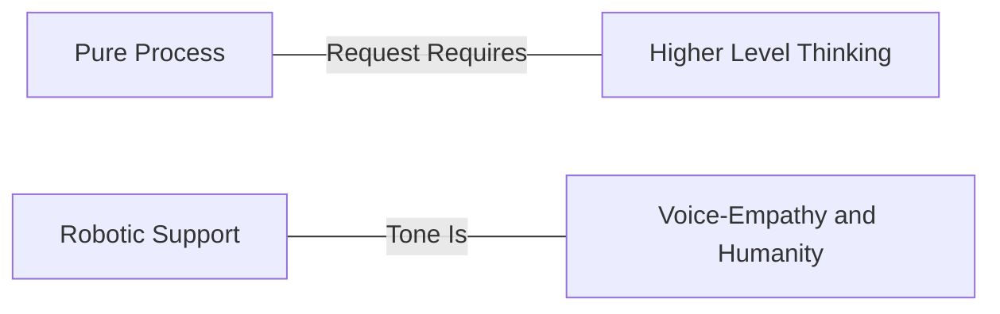

## チケットへの対応方法 {#how-to-respond-to-a-ticket}

### スマートな人間がスマートなサポートを提供する {#smart-humans-provide-smart-support}

私たちはスマートな人を採用し、その人がスマートに振る舞えるようにすることを目指しています。これは、役立つ賢明なガイドラインを提供するよう努める一方で、「スクリプト」や硬直さを避けることを意味します。カンファレンスで同僚に話しかけるときのように、自分自身の自然な声で話してください。当然ながら非専門的な言葉遣いは避けますが、顧客のトーンに合わせるとよいでしょう。誰もがロボットのような口調で話すことで「統一」したいという欲求がしばしば生じます。

> 「サポートにお問い合わせいただきありがとうございます。こちらの件についてお手伝いできます。パスワードのリセットについてのご支援をお求めのようですね…」

これは私たちを非人間的にし、私たちの最大の強みである *人間によるサポート* を失わせます。より自然に話すことで、私たちもまた本物の人間であり、「サービスとしてのサポート頭脳 (support minds as a service)」ではないことが印象づけられます。

> 「ああ、パスワードを紛失されたとのこと、お気の毒です。パスワードのリセットを発行しましたので、もう大丈夫です。今後はこちらのリンクをご利用ください。
>
> <link>
>
> 他にお手伝いできることがあればお知らせください。」

### 私たちは缶詰工場ではない（でも、ときには缶詰も使う） {#we-arent-a-cannery-but-we-sometimes-use-canned-goods}

GitLab では、私たちは応答の要素を慎重に検討します。もし定型応答 (canned responses) を使いたくなったり、同じことを何度も繰り返し言っていたりすることに気づいたら、それはおそらく私たちのプロセスを改善する機会です。つまり、ログを求めるテキストエクスパンダーを作る代わりに、一歩下がってみるのです。サポートチケットを開くという体験のもっと早い段階で、繰り返しのテキストの必要性を減らすためにできることはないでしょうか。
フォーマルな言葉遣いや定型返信を使うのが適切な場合もありますが、それはまれです。可能な限り、私たちは共感と人間味の方へ押し進め、プロセスを自動化し、あらかじめ準備しておきます。

次のスペクトラムを考えてみてください。

権限を委ねられていると考えてください。GitLab サポートでは、私たちは代理人 (agents) ではなく、主体性 (agency) を持った人間を求めています。何かが壊れていると感じたら、尋ねてください。
何かが非効率だと感じたら、直してください。誰もが貢献 *できますし、すべきです*。

### サンドイッチ法 {#the-sandwich-method}

実際にチケットに回答するにあたって、サンドイッチ法は応答の質を高めるのに役立つ素晴らしい 3 点ガイドラインです。優れた顧客返信には、次の 3 つが含まれています。

- 相手に必要としているもの。
- 求めた項目がなぜ役立つかについての自分の考えを説明する前提または仮説を提示すること。
- 引き続き支援するという申し出。

たとえば、顧客が次のように尋ねるかもしれません。

> 「私の GitLab サーバーの動作が遅くなっているようです。お手伝いいただけますか?」

*まずまず* の応答は次のとおりです。

> 「本番環境のログをお送りください。それを使ってさらにトラブルシューティングを行えます。」

私たちが必要なものを求め、お手伝いできることに注目してください。サンドイッチ法を使って、これを素晴らしいものにしましょう。

> 「問題を切り分けるために、動作が遅いときのログをできるだけ多く取得できると助かります。ログは /var/log/gitlab にあります。（これが私たちのお願いです）
>
> 通常、動作の遅さが見られる場合、それはアプリケーションの特定の部分に限定されています。どのようなときに動作が遅くなるかを概説して、問題の絞り込みにご協力いただけますか?（これは、私たちの専門知識を補強してもらうための前提です。）
>
> これらをお送りいただき、どのように遅い状態に至るのかを理解する手助けをしていただければ、喜んでさらに詳しく調査いたします。」（これは、私たちがお手伝いしますと相手を安心させているものです。）

私たちは必要なものを早い段階で求めています。お願いを *早く* 強調することで、相手はそれについて考え始めることができ、もしそこで読むのをやめたとしても、お願いを見逃すことはありません。私たちは、相手が噛み砕いて私たちの視点を理解するための材料となる仮説を提示しました。
私たちは顧客に *サービスを提供する* のではなく、顧客と *パートナーを組み* たいのです。これは、相手が私たちを「サービスとしてのサポート頭脳」ではなく、対等な存在として見るための 1 つの方法です。

次に、私たちが *まだここにいる* ことを必ず伝え、相手が戻ってきたときにもいることを伝えます。

何かを追加したり、何かについて謝罪したりする必要がある場合もありますが、この方法は大半のチケットに適用でき、私たちがエクセレンスを提供する助けとなるはずです。

### 2 つの動作モード: 特徴づけモードと仮説検証モード {#two-modes-of-operation-the-characterization-mode-and-the-hypothesis-testing-mode}

チケットに取り組むことを、2 つの動作モード、すなわち特徴づけモード (Characterization Mode, CM) と仮説検証モード (Hypothesis Testing mode, HT) を交互に切り替えることとして考えることができます。

特徴づけモードでは、ユーザーが何をしようとしているのか、実際に何が起きているのか、そして関連しそうなコンテキストや状態に関する情報といった、基本的な事実を確立するために取り組みます。便利なメタファーとして、チケットをパズルとして捉え、その矛盾を詳しく掘り下げることができます。これはまた、ステップを再現するためのベースラインや、潜在的なバグレポートのベースラインとしても役立ちます。

私たちは、ユーザーの問題を特徴づけるために取り組んでいることを透明に示せます。この動作モードにあるときは、次のことを尋ねられます。

- ユーザーが何をしようとしているか
- なぜユーザーがそれをしようとしているか
- システムが実際にどう振る舞っているか
- ユーザーはシステムがどう振る舞うべきだと考えているか
- 私たちが目にしている挙動に影響を与えているかもしれない状態やコンテキストの情報

2 つ目の動作モードは仮説検証モードです。これは、私たちが科学者のように振る舞い、ユーザー側で何が起きているかもしれないかを理論立てることができる、創造的なステップです。

私たちは、仮説検証モードにあることも透明に示せます。その際、次のことを明確にできます。

- 仮説が何であるか
- それが挙動をどう説明するか
- それが既に確立された他の事実をどう説明するか
- それがいくつかの事実をどう説明できないか
- それをどうやって検証できるか
- 検証にリスクが伴うかどうか

興味深いことに、仮説検証は特徴づけモードへとフィードバックします。検証によって、ユーザーのシナリオに関する新しい事実を確立しているからです。

1 つの応答の中で、複数の理論と対応する検証を考え出すことができます。実際、そうすることで、上記で説明した動作モードの構造を明確にする助けになるかもしれません。特徴づけステップで確立された事実は、すべての理論に共通します。一方、1 つの理論で説明された可能性は、他の理論には当てはまらないかもしれないので、それらを区別しておくことが重要です。

このアイデアは [Jeff Anderson のトーク](https://www.youtube.com/watch?v=DK1ew1HpmeY&t=127s) から取り入れたものです。

### チケットデフレクションによる顧客体験の向上 {#improving-the-customer-experience-through-ticket-deflection}

「チケットデフレクション (ticket deflection)」は、仕事から逃れる方法のように聞こえるかもしれませんが、実際には顧客体験の向上に関するものです。
顧客はサポートに連絡 *したい* わけではありません。そもそも問題が起きない方がはるかに好ましいのです。
それが叶わないなら、自分で問題を解決したいと考えます。それもできないなら、**そのとき初めて** 技術的に熟練した人に問題解決を手伝ってほしいと思うのです。

チケットデフレクションには、主に 4 つのツールがあります。

- 優れたプロダクト
- サポート方針 (Statement of Support)
- ドキュメント
- 技術的エクセレンス

要するに、すべてのチケットの最後には、ドキュメント、Issue、マージリクエスト、または私たちのサポート方針へのリンクがあるべきです。

#### 優れたプロダクト {#excellent-product}

優れたプロダクトを持つことが、デフレクションの第一線です。欠陥がなく期待どおりに動作するプロダクトは、サポートケースの数を自然に減らします。

サポートは、ユーザーが GitLab を使用する際に遭遇する問題を、次のことによって表面化させるという重要な役割を果たします。

- [バグの報告](/handbook/support/workflows/working-with-issues/#creating-issues)
- [Issue のタグ付け](/handbook/support/workflows/working-with-issues/#adding-labels)
- [Issue への参加](/handbook/support/workflows/working-with-issues/#adding-comments-on-existing-issues)
- [フィードバックの表面化](/handbook/support/workflows/feedbacks_and_complaints/#product-feedback)
- [MR を提出して Issue を修正する](https://about.gitlab.com/community/contribute/)

#### サポート方針 {#statement-of-support}

[サポート方針 (Statement of Support)](https://about.gitlab.com/support/statement-of-support/) は、サポートがカバーする領域と、カバーを約束できない領域を説明しています。これは、顧客に期待値を設定するためのツールであると同時に、サポートチームが自分たちの専門領域をサポートしていることを確認する助けにもなるツールです。その背後にある考え方については、[サポート方針を紹介したブログ記事](https://about.gitlab.com/blog/2018/12/20/introducing-our-statement-of-support/) で詳しく読めます。

GitLab のサポートチームの一員として、あなたは次のようであるべきです。

- サポート方針の内容に精通している
- 何かがスコープ外であることを顧客に説明することに抵抗がない
- 意図的にスコープ外に出ているときにそれを認識し、「ご厚意として (as a courtesy)」そうしていることを顧客に明確に伝えることを意識している

##### それはスコープ内か? {#is-it-in-scope}

**Greg の [レイザー](https://en.wikipedia.org/wiki/Philosophical_razor)** は、何がサポートのスコープ内であるかを判断する助けとなるシンプルな問いです。

> それは [ドキュメント](https://docs.gitlab.com) にあるか?

あれば、私たちはそれをサポートします。

ドキュメントにない場合、いずれかの顧客が本番環境でそれを使う前の最初のステップは、それをドキュメントに載せることであるべきです。

#### ドキュメント {#documentation}

回答に [ドキュメントファースト](https://docs.gitlab.com/development/documentation/styleguide/#docs-first-methodology) のアプローチを取ることで、ドキュメントが極めて有用な [単一の信頼できる情報源 (single source of truth)](https://docs.gitlab.com/development/documentation/styleguide/#documentation-is-the-single-source-of-truth-ssot) であり続けることを保証できます。現実世界の問題に基づいたドキュメントの集積を築くことで、私たちは GitLab の顧客がキューに入る前に必要な回答や解決策を見つけられるよう支援します。私たちの **ナレッジベース** は成長し、繁栄しています。現在 300 を超えるナレッジ記事が公開され、一貫して高い閲覧数を維持しており、ドキュメント化の取り組みの真の影響を実感しています。これらの記事は、顧客とチームメンバーの双方にとって頼りになるリソースになりつつあります。

**常にドキュメントまたは関連するナレッジ記事へのリンクを添えて回答してください。ドキュメントのコンテンツが欠けている場合は作成し、MR へのリンクを顧客に提供してください。よくある質問にナレッジ記事で対応できる場合は、それを作成してください。期限切れ間近のチケットに取り組んでいる場合は、まず応答で期限切れを解消し、その後で MR またはナレッジ記事をフォローアップしてください。覚えておいてください。急がば回れです。**

#### 技術的エクセレンス {#technical-excellence}

顧客体験を向上させる最善の方法は、私たちのプロダクトに精通していることです。
自分の強みを伸ばしたり、知識を広げたりする意図的な学習計画を立てるために、マネージャーと連携すべきです。
また、自由に質問し、他の人とペアを組み、他の人が後に続きたくなるような弱みをさらけ出す姿勢を示すべきです。

何を学んだとしても、それを常に表面化させ、発信するようにしてください。

- 学ぶとき: ドキュメントを（再）執筆し、ナレッジ記事を作成する
- トラブルシューティングするとき: ドキュメントと既存のナレッジ記事を使う
- 何かが欠けている場合: ドキュメントを更新し、ナレッジ記事を書くか修正する
- パターンに気づいたとき: 他の人が役立てられるよう、それをナレッジ記事として文書化する

**メリット:** ドキュメントだけでなくナレッジを加えることで、ドキュメントとナレッジの双方が GitLab の重要な成功要因であるという認識を広めます。

#### サポートポータルでドキュメントとハンドブックのリンクを強調表示する {#highlighting-docs-and-handbook-links-on-our-support-portal}

ときには、サポートポータルのページで GitLab のドキュメントやハンドブックの記事を強調表示したい場合があります。私たちには、Zendesk でリダイレクト記事を作成し、特定のキーワードをこのリンク（関連するドキュメントまたはハンドブックのリンクを指し示す）に関連付ける仕組みがあります。サポートチケットの作成中に、上記のキーワードがチケットの件名に使われると、この記事がポップアップ表示され、顧客はサポートチケットを送信する前に質問への回答を見ることができます。

現在、記事とリダイレクトのリストをキュレーションしているところなので、記事（のリスト）をイテレーションするには Support-Ops またはマネージャーに連絡する必要があります。

### 自分のミスをオープンに共有し、そこから学ぶ {#openly-share-your-mistakes-and-learn-from-them}

私たちは皆人間であり、顧客とのやり取りが 100% 正しくなるよう全員が努力していますが、実際には時折ミスをするものです。たとえば、顧客に間違ったアドバイスをしてしまった場合や、後で指摘されるまでチケットの特定の側面に気づいていなかった場合など、これはストレスや不安を生む状況を作り出すことがあります。

状況がどうであれ、ミスをしたら、それに責任を持ち、そこから学んでください。私たちの [透明性](/handbook/values/#transparency) のバリューを思い出してください。
目の前の状況は望ましくないものかもしれませんが、状況を解決すれば、それは大いに力を与えてくれるものになり得ます。状況をどう解決すればよいかわからない場合は、遠慮なく助けを求めてください。誰もが手助けするためにここにいます。顧客にフォローアップする際は、誠実に、ミスをしたことを説明し、正しい情報を提供してください。

状況が解決したら、自分の行動と、次回そのような状況の再発を防ぐために何ができるかを振り返る時間を取ってください。

それがより広いサポートチームにとって学びになると感じる場合は、地域のサポートチームミーティングおよび／または [Support Week in Review (SWIR)](/handbook/support/#support-week-in-review) であなたの経験を共有してください。
適切であれば、サポートドキュメントへのマージリクエストも必ず作成してください。
あなたの経験を共有することで、他の人があなたの状況にどう対処したかについて別の方法を提案できますし、彼らに気づきを与えることにもなるため、同じミスを繰り返す可能性が低くなります。
