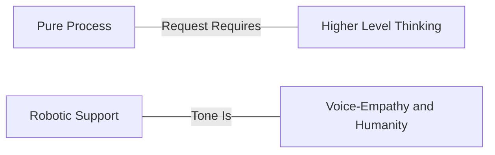

## How to respond to a ticket

### Smart Humans Provide Smart Support

私たちは賢い人々を採用し、その賢さを発揮してもらうことを目指しています。これは、役立つ理にかなったガイドラインを提供しようとする一方で、「スクリプト」や硬直性を避けることを意味します。カンファレンスで同僚に話すように、あなた自身の自然な声で話してください。当然、プロフェッショナルでない言葉遣いは避けますが、顧客のトーンに合わせたいものです。全員がロボットのようなトーンで話すことで「統一」したいという欲求がしばしばあります。

> 「サポートにお問い合わせいただきありがとうございます。この件についてお手伝いできます。パスワードのリセットに関するヘルプをお求めのようですね…」

これは私たちを非人間化し、私たちの最良の資産である*人間によるサポート*を失わせます。あなたがより自然に話すと、私たちもまた本物の人間であり、「サービスとしてのサポートマインド」ではないことを印象づけます。

> 「ああ、パスワードを紛失されたとのこと、お気の毒です。パスワードのリセットを行いましたので、もう問題なくお使いいただけます。今後は、こちらのリンクをご利用いただけます。
>
> <link>
>
> 他にお手伝いできることがあればお知らせください。」

### We Aren't a Cannery (but we sometimes use canned goods)

GitLab では、応答の要素を慎重に検討します。定型応答を使いたくなったり、同じことを繰り返し言っていることに気づいたりした場合、それはおそらく私たちのプロセスを改善する機会です。つまり、ログを求めるテキストエキスパンダーを作成する代わりに、一歩下がってみましょう。サポートチケットを開く体験のもっと前の段階で、繰り返しのテキストの必要性を減らすためにできることがあるでしょうか。フォーマルな言葉遣いや定型応答が適切な場合もありますが、それはまれです。可能な限り、私たちは共感と人間味を推し進め、プロセスを自動化して事前に準備します。

次のスペクトラムを考えてみてください。

権限を与えられてください。GitLab Support では、エージェント（代行者）ではなく、主体性を持つ人間を求めています。何かが壊れているように感じたら、尋ねてください。何かが非効率に感じたら、修正してください。誰もが貢献*できる、そしてすべき*なのです。

### The Sandwich Method

実際にチケットに答えるとなると、サンドイッチメソッドは応答を高めるのに役立つ素晴らしい 3 つのガイドラインです。優れた顧客への返信には、以下の 3 つが含まれます。

- 相手から必要としているもの。
- 求めた項目がなぜ役立つかについてのあなたの考えを説明する前提または仮説の提示。
- 引き続き支援する旨の申し出。

たとえば、顧客が次のように尋ねるかもしれません。

> 「私の GitLab サーバーが遅くなっているようです。お手伝いいただけますか?」

*まあまあ*の応答はこうです。

> 「本番ログをお送りいただければ、それを使ってさらにトラブルシューティングできます。」

私たちは必要なものを求め、お手伝いできることがわかります。サンドイッチメソッドを使って、これを素晴らしいものにしましょう。

> 「問題を切り分けるために、遅延中のログをできるだけ多く取得できると助かります。ログは /var/log/gitlab にあります（これが私たちの依頼です）
>
> 通常、遅延が見られる場合、それはアプリケーションの特定の部分に限定されています。どのようなときに遅くなるかを概説して、問題の絞り込みを手伝っていただけますか?（これは、私たちの専門性を補強してもらうための前提です。）
>
> これらをお送りいただき、どのように遅い状態に至るかを理解できれば、喜んでさらに詳しく調べるお手伝いをします。」（これは私たちが支援する旨の安心を伝えるものです。）

私たちは必要なものを早い段階で求めました。依頼を*早く*強調することで、相手はそれについて考え始められますし、そこで読むのをやめてしまっても依頼を見逃すことはありません。私たちは、相手が咀嚼して私たちの視点を理解できる仮説を提示しました。私たちは顧客に*サービスを提供する*のではなく、顧客と*パートナーになる*ことを望んでいます。これは、相手が私たちを「サービスとしてのサポートマインド」ではなく対等な存在として見てもらう 1 つの方法です。

そして私たちは、*私たちはまだここにいる*こと、そして相手が戻ってきたときもここにいることを必ず伝えます。

もっと付け加えたり、何かについて謝罪したりする必要がある場合もありますが、このメソッドは大多数のチケットに適用でき、卓越性を提供するのに役立つはずです。

### Two modes of operation: the Characterization Mode and the Hypothesis testing mode

チケットへの取り組みは、2 つの操作モード、すなわち Characterization Mode（CM）と Hypothesis Testing mode（HT）を交互に行うものと考えることができます。

Characterization Mode では、ユーザーが何をしようとしているのか、実際に何が起こっているのか、関連する可能性のあるコンテキストや状態に関する情報について、基本的な事実を確立する作業を行います。チケットをパズルとして捉えるのは有用なメタファーであり、その矛盾点を詳しく解明しようとします。これはまた、再現手順や潜在的なバグレポートのベースラインとしても役立ちます。

ユーザーの問題を特徴づける作業をしていることは、透明性を持って示すことができます。この操作モードにある場合、以下を尋ねることができます。

- ユーザーが何をしようとしているのか
- なぜユーザーがそれをしようとしているのか
- システムが実際にどのように振る舞っているのか
- システムがどのように振る舞うべきだとユーザーが考えているのか
- 私たちが目にしている振る舞いに影響を与えている可能性のある状態とコンテキストの情報

2 つ目の操作モードは Hypothesis Testing mode です。これは創造的なステップであり、科学者のように振る舞い、ユーザー側で何が起こっている可能性があるかを理論立てることができます。

Hypothesis Testing mode にあることも、透明性を持って示すことができます。その際、以下を明確にできます。

- 仮説が何であるか
- それがどのように振る舞いを説明するか
- それが既に確立された他の事実をどのように説明するか
- それがどのように一部の事実を説明しないか
- それをどのようにテストできるか
- そのテストにリスクが伴うかどうか

興味深いことに、仮説テストは Characterization Mode にフィードバックされます。テストによってユーザーのシナリオに関する新しい事実を確立するためです。

1 つの応答の中で複数の理論とそれに対応するテストを思いつくことができます。実際、そうすることで、上記の操作モードの構造を明示的にするのに役立つかもしれません。Characterization ステップで確立された事実は、すべての理論に共通です。ただし、1 つの理論で説明される可能性は他の理論には当てはまらない場合があるため、それらを別々に保つことが重要です。

このアイデアは [Jeff Anderson's talk](https://www.youtube.com/watch?v=DK1ew1HpmeY&t=127s) から得たものです。

### Improving the Customer Experience Through Ticket Deflection

「チケットディフレクション」は、作業をうまく回避する方法のように聞こえるかもしれませんが、実際には顧客体験の向上に関するものです。
顧客はサポートに連絡したい*わけではありません*。そもそも問題を抱えたくないのです。
それが叶わなければ、自分で問題を解決したいと思います。それもできなければ、**そのとき**初めて、技術的に熟練した個人に問題解決を手伝ってほしいと思うのです。

チケットディフレクションには 4 つの主要なツールがあります。

- 優れたプロダクト
- Statement of Support
- ドキュメント
- 技術的卓越性

要するに、すべてのチケットの最後には、ドキュメント、Issue、マージリクエスト、または Statement of Support へのリンクがあるべきです。

#### Excellent Product

優れたプロダクトを持つことは、ディフレクションの第一の防衛線です。欠陥がなく、期待どおりに動作するプロダクトは、サポートケースの数を自然に減らします。

Support は、ユーザーが GitLab を使用中に遭遇する問題を以下によって表面化させる重要な役割を果たします。

- [バグの報告](/handbook/support/workflows/working-with-issues/#creating-issues)
- [Issue へのタグ付け](/handbook/support/workflows/working-with-issues/#adding-labels)
- [Issue への参加](/handbook/support/workflows/working-with-issues/#adding-comments-on-existing-issues)
- [フィードバックの表面化](/handbook/support/workflows/feedbacks_and_complaints/#product-feedback)
- [MR の送信による Issue の修正](https://about.gitlab.com/community/contribute/)

#### Statement of Support

[Statement of Support](https://about.gitlab.com/support/statement-of-support/) は、Support がカバーする領域と、カバーを約束できない領域を記載しています。これは、顧客に期待事項を設定するためのツールであると同時に、サポートチームが私たちの専門領域をサポートしていることを確認するのに役立ちます。その背景にある哲学については、[Statement of Support を紹介したブログ記事](https://about.gitlab.com/blog/2018/12/20/introducing-our-statement-of-support/)で詳しく読むことができます。

GitLab の Support チームの一員として、あなたは以下であるべきです。

- Statement of Support の内容に精通している
- 何かが範囲外である場合に顧客に説明することに抵抗がない
- 意図的に範囲外に出ているときにそれを認識し、「ご厚意として」行っていることを顧客に明確に伝えることを意識している

##### Is it in scope?

**Greg の [razor（剃刀）](https://en.wikipedia.org/wiki/Philosophical_razor)** は、何がサポートの範囲内かを判断するのに役立つシンプルな問いです。

> それは[ドキュメント](https://docs.gitlab.com)に載っていますか?

載っていれば、私たちはそれをサポートします。

ドキュメントに載っていない場合、顧客が本番環境でそれを使用する前の最初のステップは、それをドキュメントに載せることであるべきです。

#### Documentation

回答に [docs-first](https://docs.gitlab.com/development/documentation/styleguide/#docs-first-methodology) のアプローチを取ることで、ドキュメントが非常に役立つ[信頼できる唯一の情報源](https://docs.gitlab.com/development/documentation/styleguide/#documentation-is-the-single-source-of-truth-ssot)であり続けることを保証できます。実世界の問題に基づくドキュメントの集積を構築することで、GitLab 顧客がキューに入る前に必要な答えや解決策を見つけられるよう支援します。私たちの **Knowledge base** は成長し、活況を呈しています。現在 300 を超えるナレッジ記事が公開され、一貫して高い閲覧数を維持しており、ドキュメント努力の実際の影響が見られています。これらの記事は、顧客とチームメンバーの双方にとって頼りになるリソースになりつつあります。

**常にドキュメントまたは関連するナレッジ記事へのリンクを添えて応答してください。ドキュメントのコンテンツが欠けている場合は、それを作成し、顧客に MR へのリンクを提供してください。ナレッジ記事が一般的な質問に対応できる場合は、それを作成してください。breach 寸前のチケットに取り組んでいる場合は、応答によって breach を解消し、その後 MR またはナレッジ記事でフォローアップしてください。覚えておいてください: 急がば回れ。**

#### Technical Excellence

顧客体験を向上させる最良の方法は、私たちのプロダクトについて知識を深めることです。
あなたは、自分の強みを伸ばす、または知識を広げる意図的な学習計画を策定するために、マネージャーと連携すべきです。
また、自由に質問し、他者とペアリングし、他者が後に続きたくなるような弱さを見せる姿勢を示すべきです。

何を学んだとしても、それを絶えず湧き上がらせて広めるようにしてください。

- 学習時: ドキュメントを（再）執筆し、ナレッジ記事を作成する
- トラブルシューティング時: ドキュメントや既存のナレッジ記事を使用する
- 何かが欠けている場合: ドキュメントを更新し、ナレッジ記事を執筆または修正する
- パターンを見つけた場合: 他者が恩恵を受けられるよう、それをナレッジ記事として文書化する

**メリット:** ドキュメントに加えてナレッジを追加することで、ドキュメントとナレッジの両方が GitLab の重要な成功要因であることへの認識を高めます。

#### Highlighting docs and handbook links on our support portal

時には、サポートポータルページで GitLab のドキュメントやハンドブックの記事を強調したい場合があります。私たちには、Zendesk でリダイレクト記事を作成し、特定のキーワードをこのリンクに関連付ける（同時に関連するドキュメントやハンドブックのリンクを指す）機能があります。サポートチケットの作成中、チケットの件名に上記のキーワードが使用されていると、この記事がポップアップ表示され、顧客がサポートチケットを送信する前に質問への答えを見ることができます。

現在、記事とリダイレクトのリストをキュレーションしているため、記事（のリスト）をイテレーションするには Support-Ops またはマネージャーに連絡する必要があります。

### Openly share your mistakes and learn from them

私たちは皆人間であり、顧客とのやり取りが 100% 正確であるよう努めている一方で、実際には時々間違いを犯すものです。たとえば、顧客に誤ったアドバイスを提供してしまった場合や、後で指摘されるまでチケットの特定の側面に気づいていなかった場合、これはストレスや不安を生む状況を作り出すことがあります。

状況がどうであれ、間違いを犯したら、それを自分のものとして引き受け、そこから学んでください。私たちの[透明性](/handbook/values/#transparency)のバリューを思い出してください。
目の前の状況は望ましくないかもしれませんが、状況を解決すると、それは非常に力を与えてくれるものになり得ます。状況をどう解決すればよいか分からない場合は、遠慮なく助けを求めてください。誰もが支援するためにここにいます。顧客にフォローアップする際は、誠実に、間違いを犯したことを説明し、正しい情報を提供してください。

状況が解決したら、自分の行動と、次回その状況の再発を緩和するためにできることを振り返る時間を取ってください。

それがより広いサポートチームが学べることだと感じたら、地域のサポートチームミーティングや [Support Week in Review (SWIR)](/handbook/support/#support-week-in-review) であなたの経験を共有してください。
適切な場合は、私たちの Support ドキュメントへのマージリクエストも忘れずに行ってください。
あなたの経験を共有することで、他者はあなたの状況にどう対処したかについて他の方法を提供して貢献でき、また彼らに認識をもたらすため、彼ら自身が同じ間違いを繰り返す可能性が低くなります。
