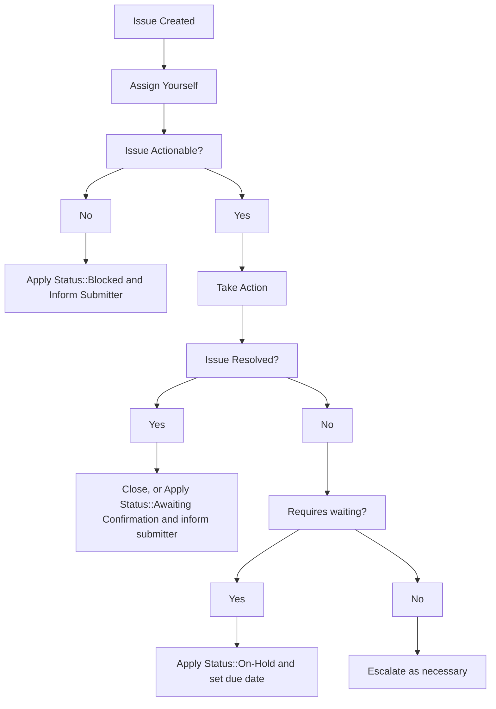

**NOTE:** 内部リクエストを起票したい GitLab チームメンバーの方は、[Support Internal Requests のハンドブックページ](/handbook/support/internal-support/) を参照してください。

**NOTE:** ライセンスやサブスクリプションに関連する内部リクエストについては、[該当する license and subscription ワークフロー](/handbook/support/license-and-renewals/workflows/working_internal_requests/)、または [CustomersDot コンソールワークフロー](/handbook/support/license-and-renewals/workflows/customersdot/customer_console/) を参照してください。

## 概要

このドキュメントは、Support が [internal-requests](https://gitlab.com/gitlab-com/support/internal-requests/-/issues) Issue トラッカーで受け取る GitLab.com 関連リクエストを適切に処理するために従うべき各種テンプレートとワークフローを詳しく説明します。

内部リクエストは、リクエストを解決できる GitLab Support チームメンバーであれば誰でも対応でき、また対応すべきものです。

少なくとも 50% は SaaS にフォーカスしており、GitLab.com 管理者アカウントを持っているメンバーは、[Admin Escalation](https://gitlab.com/gitlab-com/support/internal-requests/-/labels?subscribed=&search=admin+escalation) であるすべての Issue を購読し、対応する必要があります。

内部リクエストは通常、Support 組織外の他のチームメンバーによって作成されますが、特にリクエストが社内で発生し（追跡用の ZenDesk チケットがない）場合などは、進めている作業を追跡するために自分で内部リクエストを作成することもできます。

少なくとも、以下のラベルを購読しておく必要があります:

- [Admin Escalation](https://gitlab.com/gitlab-com/support/internal-requests/-/labels?subscribed=&search=admin+escalation)
- [Dotcom Escalation Weekly Report](https://gitlab.com/gitlab-com/support/internal-requests/-/labels?subscribed=&search=dewr)

[Platform::SaaS](https://gitlab.com/gitlab-com/support/internal-requests/-/labels?subscribed=&search=platform+saas) の購読を検討することもできますが、通知が多くなる点に注意してください。

ラベルを購読することで、リクエストが作成された際に通知を受け取れます。通常のワークフローに組み込み、対応すると判断したらお客様チケットと同じように自分にアサインしてください。

コンソールアクセスが必要な内部リクエストへの対応に関心がある場合は、マネージャーと [GitLab.com Console モジュール](https://gitlab.com/gitlab-com/support/support-training/-/blob/main/.gitlab/issue_templates/GitLab-com%20Console.md) の完了について相談することを検討してください。

## 一般的なワークフロー



## トライアル Runner の有効化

セールス支援トライアルでは、Namespace に対するクレジットカード検証要件を上書きできるのは私たちだけです。このタスクの実行方法については、[Internal Requests > SaaS Trial Related > Change an existing SaaS trial plan](/handbook/support/internal-support/#internal-requests) を参照してください。

## GitLab.com トライアル変更リクエスト

セールスチームメンバーは通常、見込み客のためにアクティブなトライアルを延長する目的でこれを開きます。[L&R のトライアル延長ワークフロー](/handbook/support/license-and-renewals/workflows/saas/trials_and_plan_change#extending-trials) に従うことができます。

## Solution Architect としてのサポート要請

このプロセスは [Requesting Support for Customers](/handbook/support/internal-support/#requesting-support-for-customers) で詳しく説明されています。一般的に、Solution Architect は明確かつ効率的なコミュニケーションのため、お客様自身でサポートチケットを開くようアドバイスすべきです。

## 非アクティブな Namespace のリクエスト

GitLab チームメンバーは、自分用の非アクティブな Namespace ／ namesquatting リクエストを送信できなくなりました。参照: [support-team-meta#5170](https://gitlab.com/gitlab-com/support/support-team-meta/-/issues/5170)

お客様はサポートチケットを送信できます。[Name Squatting Policy](/handbook/support/workflows/namesquatting_policy/) を参照してください。

## コンタクトリクエスト

GitLab チームメンバーは、自分の代わりにユーザーへの連絡を Support に依頼するために [Contact Request テンプレート](https://gitlab.com/gitlab-com/support/internal-requests/-/issues/new?issuable_template=Contact%20Request) を使用してください。

通常、これらは [CMOC](/handbook/support/internal-support/#regarding-gitlab-support-plans-and-namespaces) にアサインされますが、GitLab.com への管理者レベルアクセスを持つ誰でも完了できます。`Admin Escalation` ラベルが付与され、管理者アクセス権を持つ全員が購読し、そのような Issue に取り組むことが期待されています。

ユーザーへの連絡方法の詳しい手順については、[通知送信のワークフロー](/handbook/support/workflows/sending_notices) を参照してください。

## リポジトリサイズ上限の引き上げ

時には、バグ Issue の回避策として、または意図せず上限に達したために、リポジトリサイズの上限引き上げを必要とするユーザーがいます。2 種類の上限があり、無料は 10GiB、有料 Namespace は 500GiB です。どちらの場合も、できるだけ早く使用量を削減できるよう、お客様と協力する必要があります。無料ユーザーには追加のストレージパックの購入を勧めるべきであり、有料のお客様には次のステップについてアカウントマネージャーと相談するよう案内すべきです。

どちらの場合も、上限を一時的に引き上げることができます:

1. **[internal-requests](https://gitlab.com/gitlab-com/support/internal-requests/issues)** Issue トラッカーで `Repo Size Limit` Issue テンプレートを使用して Issue を開きます。
    - GitLab.com の管理者アクセスを持っていない場合は、`Admin escalation` ラベルを追加してください。必要に応じて、`#support_gitlab-com` Slack チャンネルに投稿して注意を引きます。
1. リクエストが無料ユーザー Namespace 用、またはバグ Issue の回避策のためである場合:
    - 無料ユーザーには、これは非常に時間限定であり、使用量の削減または追加ストレージパックの購入を可能にする程度のものであることを期待値として伝えます
      - 元に戻す期日を設定: 無料ユーザーは 1〜2 日
      - バグに遭遇している場合は現在から最大 1 週間
    - 例外時間がより長く必要な場合は、`Manager Approval::Required` を追加し、`#support_leadership` チャンネルに投稿して承認を求めます。
    - 例外サイズには、現在のサイズ + 小さなバッファ（2〜5 GB）を使用します。
    - 将来のユーザーを助け、さらなるチケットを防ぐため、バグ Issue にコメント（または作成）することを忘れないでください。
1. リクエストが有料 Namespace のものの場合:
    - システムの安定性のため、できるだけ早く使用量を削減するよう促すべきです
      - 現時点では、[固定プロジェクト上限](https://docs.gitlab.com/user/storage_usage_quotas/#fixed-project-limit) を超える追加ストレージは購入できません
    - アカウントマネジメントチームがまだ関与していない場合は通知し、アカウントマネージャーの特定や連絡に支援が必要な場合は `#support_licensing-subscription` に連絡します
    - 元に戻す期日を、現在から最大 1 週間で設定し、それより長く必要な場合は `#support_leadership` に相談します
1. `Status::On Hold` ラベルを適用し、元に戻す予定日を期日として設定します。
1. GitLab.com 管理者アカウントを使用して、対象プロジェクトに対し URL に **/edit** を付加してアクセスします。例えば、対象プロジェクトが `https://gitlab.com/group/subgroup/project/` にある場合、`https://gitlab.com/group/subgroup/project/edit` にアクセスします。
1. **Repository size limit (MB)** フィールドに新しい値を入力します。
1. **Save changes** をクリックします。
1. 指定した期日に、値を削除してサイズ上限をデフォルトに戻します。

## パイプラインクォータのリセット

[内部 Wiki ページ](https://gitlab.com/gitlab-com/support/internal-requests/-/wikis/Procedures/Pipeline-Quota-Reset) を参照してください。

## GitLab.com 管理者エスカレーション

GitLab.com コンソールアクセスを持つエンジニアにアクションを依頼するために利用可能なテンプレート:

1. [Project Admin Import](https://gitlab.com/gitlab-com/support/internal-requests/-/blob/master/.gitlab/issue_templates/project_admin_import.md?ref_type=heads)
2. [GitLab.com Admin Escalation](https://gitlab.com/gitlab-com/support/internal-requests/-/blob/master/.gitlab/issue_templates/GitLab.com%20Admin%20Escalation.md?ref_type=heads)

### 各テンプレートの使い分け

**Project Admin Import を使う場合**

- お客様がプロジェクトインポートで詰まっている
- 遅延がお客様のビジネスに影響を与えている
- 既に Import チームに RFH を作成し、アクションが承認され、お客様の Issue を適時に修正できないことが確認されている場合

**GitLab.com Admin Escalation を使う場合**

- API 経由で実行できるバルクまたは単一のアップデートアクション
- アクションがマネージャーによって承認されている
- 実行されるスクリプト／コマンドが関連する製品またはセキュリティチームによって承認されている

### アカウント所有権の確認

両テンプレートとも [アカウント所有権の確認](/handbook/support/workflows/account_verification) が必要です。アクションが多数のグループメンバーに影響する場合、彼らはエンタープライズユーザーの定義に一致する必要があります。

## GitLab.com コンソールエスカレーション

API 経由で簡単に実行できないことを確認した後で、GitLab.com コンソールアクセスを持つエンジニアにアクションを依頼するために利用可能なテンプレート:

1. [Console Export Request](https://gitlab.com/gitlab-com/support/internal-requests/-/issues/new?description_template=GitLab.com%20Console%20Export%20Request) - プロジェクトエクスポートを作成する場合。
1. [Console Escalation (Read-only)](https://gitlab.com/gitlab-com/support/internal-requests/-/issues/new?description_template=GitLab.com%20Console%20Escalation%20(Read-only)) - 調査やデータ収集のような安全な操作の場合。
1. [GitLab.com Console Escalation (Read/write)](https://gitlab.com/gitlab-com/support/internal-requests/-/issues/new?description_template=GitLab.com%20Console%20Escalation%20(Read-write)) - 本番データを変更する操作の場合。

### 適切なテンプレートの選択

**Read-only テンプレートを使う場合:**

- 潜在的なバグの調査やオブジェクト状態の理解
- API では不十分な大規模データセットの収集
- 本番データを変更しないあらゆる操作

**Read/write テンプレートを使う場合:**

- 本番データを変更する操作
- 失敗したプロジェクト、グループ、ユーザーの削除
- 一回限りのスクリプトやコマンドの実行
- 本番に潜在的リスクのあるあらゆる操作

### アカウント検証

コンソールエスカレーションリクエストを送信する前に、以下のタイプのお客様リクエストに対して [アカウント所有権の確認](/handbook/support/workflows/account_verification) ワークフローを実施することを確認してください:

1. 情報の抽出と公開。
1. アカウントへの変更の実施。

これにより、リクエストが認可された連絡先からのものであることが保証されます。社内調査のためのコンソールエスカレーションリクエストはアカウント検証を必要としません。議論については Support Team Meta [#5276](https://gitlab.com/gitlab-com/support/support-team-meta/-/issues/5276#reasoning) を参照してください。

### コンソールエスカレーションのベストプラクティスと一般ガイドライン

通常、UI や API で情報を取得したり Issue を修正したりできない場合に rails コンソールが使用されます。UI および API メソッドが利用できない場合の一般的な Issue には以下が含まれます:

- プロジェクト、グループ、コンテナレジストリイメージなどの削除に失敗した場合
- ユーザーアカウントの問題
- データの不整合およびデータ状態の理解
- UI/API では利用できないバルクアクション
- 再現できない問題のデバッグ

まれに、お客様にとって利用できない、または時間のかかりすぎる作業を Support が完了できる、機能不足の回避策としてコンソールエスカレーションを使用することがあります。UI や API でアクションを実行できない場合、エンジニアは製品にこれを取り入れるためのフィーチャーリクエストが存在することを確認すべきです。優先順位付けのため、適切な Product Manager にタグを付けることを検討してください。

私たちは、手動で潜在的にリスキーなコンソール介入よりも、バグ修正と製品改善を常に優先すべきです。

問題の根本原因を理解するために（UI や API では得られない）追加情報が必要な場合、コンソールエスカレーションリクエストは目的を果たすこともあります。これは、Kibana/Sentry で十分にロギングしていない、Issue を再現できない、または Issue の作成がお客様の問題を解決するために必要な適切なアクションでない場合などです。コンソール対応エンジニアおよび製品チームと協力して、これらのタイプの問題を解決してください。

すべての read-write リクエストには、Issue に以下が必要です:

- 対象分野の専門家によるレビュー、または Request for Help (RFH) Issue
- 明確な正当性を伴う一回限りの修正に対する開発者／PM／EM の支持
- お客様要請のアクションに対するアカウント所有権の確認

インフラストラクチャチームの支援が必要なリクエストについては、[SaaS Platforms Request for Help](https://gitlab.com/gitlab-com/saas-platforms/saas-platforms-request-for-help) Issue トラッカーおよび [SaaS Platforms Getting Assistance](../../engineering/infrastructure-platforms/getting-assistance/) ページを参照してください。

### 応答時間とリクエストのエスカレーション

コンソールトレーニングおよびアクセスを持つ Support エンジニアは "Console Escalation::GitLab.com" ラベルを購読しており、そのうちの 1 人が 1 営業日以内に応答する必要があります。
グループに連絡する必要がある場合は、[コンソールグループへのメンション](https://gitlab.com/groups/gitlab-com/support/dotcom/console/-/group_members?with_inherited_permissions=exclude) を行えます。
書き込みアクセスを必要とするリクエスト用の [read-write グループ](https://gitlab.com/groups/gitlab-com/support/dotcom/console/write/-/group_members?with_inherited_permissions=exclude) があることに注意してください。
緊急の場合は、`#support_gitlab-com` Slack チャンネルでタイムゾーンに基づいて作業中の特定のチームメンバーに ping してください。
誰も対応できない場合は、infra SRE on-call にエンゲージし、認識のため Support Manager on-call に通知してください。

### コンソールリクエストの履行

コンソールアクセス権を持つエンジニアは、過去の類似リクエストを検索し、コードで関連する関数を探すか、別のエンジニアと協力して各リクエストを解決すべきです。
リクエストは "Read::Only" または "Read::Write" ラベルでフィルタリングできます。
共通またはカスタム関数は [support runbooks](https://gitlab.com/gitlab-com/support/runbooks/) で見つけられます。

更新、作成、削除アクションでは、リクエストを慎重にレビューし、これらのアクションの影響を考えることが不可欠です。更新および削除アクションはリスキーである可能性があることを覚えておいてください。カスタムコマンドやスクリプトを書く際は、潜在的リスクと状況の詳細に基づいてキャリブレーションすることが重要です。達成したいことを確認するため、常に別の人にコードを見てもらうべきです。お客様のデータ損失は迅速さのために許容されるトレードオフではありません。

スクリプトやコマンドの詳細について完全に確信が持てない場合は、まずテストインスタンスで試してください。必要に応じて、本番コンソールで使用する前に、そのコードベース領域を知っている開発者からフィードバックを得ます。このアプローチは、本番でコンソールタスクを実行する際のリスクを減らすのに役立ちます。Support チームから発生し、まだ runbook にないか開発チームによって承認されていないスクリプトについては、レビューと承認のためマネージャーまたはスタッフサポートエンジニアに連絡してください。

## CI Catalog Badge リクエスト

[CI Catalog Badge リクエスト](https://gitlab.com/gitlab-com/support/internal-requests/-/issues/new?issuable_template=CI%20Catalog%20Badge%20Request) は、Pipeline Authoring の Support Stable Counterpart によって対応される必要があります。これらのリクエストは、特定の組織に GitLab.com 上の CI catalog で「Partner badge」を付与するために使用されます。これらは [verifiedNamespaceCreate](https://docs.gitlab.com/api/graphql/reference/#mutationverifiednamespacecreate) GraphQL ミューテーションを実行するために GitLab.com 管理者アカウントを必要とします。

1. [GraphiQL](https://gitlab.com/-/graphql-explorer) を GitLab.com 管理者アカウントで開きます
1. 以下のクエリで、`root-level-group` を内部リクエストで提供された Namespace と検証レベル（`GITLAB_PARTNER_MAINTAINED`、`VERIFIED_CREATOR_MAINTAINED`）に置き換えます:

   ```graphql
   mutation {
     verifiedNamespaceCreate(input: { namespacePath: "root-level-group",
       verificationLevel: GITLAB_PARTNER_MAINTAINED
       }) {
       errors
     }
   }
   ```

1. GraphiQL 経由でクエリを実行します
   - エラーが発生した場合は、[#g_pipeline-authoring](https://gitlab.enterprise.slack.com/archives/C019R5JD44E) で支援を求めてください
1. 内部リクエストを対応済みとしてクローズする際、バッジが適用されたことを依頼者に ping して知らせます
