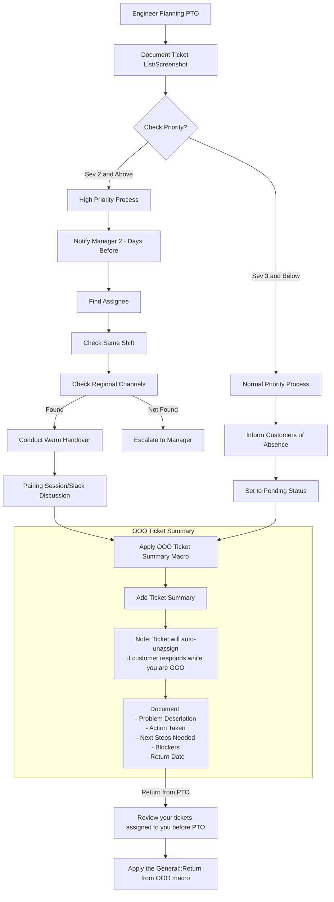

## 概要

これらのワークフローでは、Support エンジニアが PTO に入る前に、Zendesk で進行中の割り当て済みチケットを非同期で管理および要約する方法について説明します。

### OOO Ticket Summary マクロの使用

このワークフローの一環として、休暇に入る Support エンジニアは、現在 Open、Pending、On-Hold のチケットにマクロを使ってメモを残します。このマクロはチケットのサマリーを提供し、Support エンジニアをチケットの CC リストに追加します。すべての高優先度チケット、または 3 日以上の PTO を取る場合に、このワークフローに従うことを推奨します。Pending チケットは手動で割り当てを解除する必要はありません。OOO マクロにより、顧客が応答した際に自動的に割り当てが解除されます。

### チケット優先順位付けワークフロー

### PTO に入る前に

- 任意: 説明と ID 番号を含むリストやスクリーンショットを作成して、チケットを文書化することもできます。これは便利なバックアップ参照として機能します。
- 自動化を理解する：担当者が OOO マクロを使用し、Out of Office アプリで不在とマークされている状態で顧客がチケットに応答すると、チケットは自動的に割り当て解除され、Global Queue に配置されます。

#### Severity 2 以上のチケットについて

優先度の高いチケットがキューにある状態で PTO を計画する場合:

1. 以下の流れで適切な担当者を見つけます。
   - 同じシフトの同僚をチェックします。
   - シフトに誰もいない場合、地域のサポートチャンネルをチェックします。
   - 担当者が見つからない場合、マネージャーにエスカレーションします。
1. 新しい担当者と warm handover（円滑な引き継ぎ）を行います。
   - ペアリングセッションをスケジュールするか、Slack で詳細な議論を行います。
   - チケットの詳細、顧客のコンテキスト、現在のステータスを通して説明します。
   - 以下のフローチャートワークフローを使用して `General::OOO Ticket Summary` マクロを適用します。
   - 新しい担当者がチケットを引き受けます。

#### Severity 3 以下のチケットについて

優先度が低いチケットの場合:

1. 顧客に近日中の不在を通知します。
2. チケットを Pending ステータスに設定します。
3. すべてのチケットに `General::OOO Ticket Summary` マクロを適用します。

#### 解決済みチケットについて

解決済みチケットは、顧客が返信すると再オープンする可能性があります。これらにも OOO マクロを適用する必要があります。

1. Zendesk の右上のプロフィールアイコンをクリックし、「View profile」をクリックします
2. 「status: solved」の下で、チェックボックスを追加してチケットを選択します
3. 右上の黒い「Edit X ticket(s)」ボタンをクリックします
4. 「OOO Solved」マクロを適用します

これにより、不在中に顧客が応答した場合、これらのチケットは適切に割り当て解除され、キューに戻されます。

### ワークフロー

Zendesk の My Assigned Tickets ビューに移動します。継続的な作業が必要だと予想されるため要約したい各チケットについて、以下を行います。

1. `General::OOO Ticket Summary` マクロを使用します。
2. 内部ノートのセクションに、同僚向けの詳細を記入します。以下を要約することが重要です。
   - 解決すべき問題は何か？
   - 行ったアクションは？
   - 必要な次のステップは？ あるいは、次のステップが不明な場合はそのことを明確にします。
   - ブロッカーは？
   - 復帰日。
3. Slack など他のコミュニケーション手段で他地域の同僚にチケットを引き継いでもらえるか尋ねるのも自由ですが、他のチームメンバーの注意が必要なチケットについては、Zendesk が単一の信頼できる情報源であり続けるべきです。

#### チケット引き継ぎプロセス

PTO 中の同僚からチケットを引き継ぐ場合：

1. Global Support Ticket View から、自分の地域の未割り当てチケットをレビューします。
1. `take it` をクリックしてチケットを引き受けます。作業を文書化するため、内部ノートの追加や顧客への更新の送信などの更新も必ず実行してください。
1. Zendesk フィールド `Handover Status` を `Handover Completed` に設定します。
1. マクロで指定された復帰日以降、元のエンジニアと連携してチケットを引き戻すことができます。必要に応じて、復帰したエンジニアと知識移転セッションをスケジュールします。

#### PTO からの復帰プロセス

1. 任意: PTO 前に自分に割り当てられていたチケットのステータスを確認します。所有権を取り戻すのが理にかなっている場合は、新しいオーナーと調整できます。これは、顧客との既存のラポールがある場合、その問題に対する強い技術的専門知識がある場合、または復帰時に調査を継続することに以前合意していた場合に有益となる可能性があります。
1. アクティブなすべてのチケットに `General::Return from OOO` マクロを適用します。復帰後に自動割り当て解除の動作を無効にするため、この操作が重要です。

ヒント：[Zendesk の一括編集機能](https://support.zendesk.com/hc/en-us/articles/4408886890906-Managing-tickets-in-bulk)を使用して、複数のチケットに一度にマクロを適用できます。この機能を使用する際は注意して操作してください。

**マクロに関する重要事項：**

1. PTO に入る際に OOO マクロを実行**しない**場合、顧客が応答してもチケットは自動的に割り当て解除**されません**。
1. 復帰時に Return from OOO マクロを実行**しない**場合、顧客が応答するとチケットは引き続き自動的に割り当て解除**されます**。

#### PTO フローチャート

```mermaid
flowchart TD
    Start[Engineer Planning PTO] --> DocumentTickets[Document Ticket List/Screenshot]
    DocumentTickets --> TicketPriority{Check Priority?}

    TicketPriority -->|Sev 2 and Above| HighPriority[High Priority Process]
    TicketPriority -->|Sev 3 and Below| NormalPriority[Normal Priority Process]

    HighPriority --> NotifyManager[Notify Manager 2+ Days Before]
    NotifyManager --> FindAssignee[Find Assignee]

    FindAssignee --> SameShift[Check Same Shift]
    SameShift --> OtherRegions[Check Regional Channels]
    OtherRegions -->|Found| WarmHandover[Conduct Warm Handover]
    OtherRegions -->|Not Found| EscalateManager[Escalate to Manager]

    WarmHandover --> PairingSession[Pairing Session/Slack Discussion]
    PairingSession --> ApplyMacro[Apply OOO Ticket Summary Macro]

    NormalPriority --> InformCustomer[Inform Customers of Absence]
    InformCustomer --> SetPending[Set to Pending Status]
    SetPending --> ApplyMacro[Apply OOO Ticket Summary Macro]


    subgraph MacroDetails [OOO Ticket Summary]
        ApplyMacro --> Summary[Add Ticket Summary]
        Summary --> AutoUnassign["Note: Ticket will auto-unassign<br/>if customer responds while you are OOO"]
        AutoUnassign --> DocumentDetails[Document:
        - Problem Description
        - Action Taken
        - Next Steps Needed
        - Blockers
        - Return Date]
    end

    DocumentDetails --> |Return from PTO| ReviewPrePtoTickets[Review your tickets assigned to you before PTO]
    ReviewPrePtoTickets --> ApplyReturnPtoMacro[Apply the General::Return from OOO macro]
```
