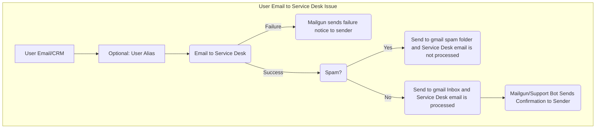

## 概要

ユーザーは [Service Desk](https://docs.gitlab.com/user/project/service_desk/) を利用する際に、さまざまな問題に遭遇することがあります。このガイドでは、メールが Service Desk Issue を生成しない場合のトラブルシューティングについて説明します。

[Service Desk Runbook ドキュメント](https://gitlab.com/gitlab-com/runbooks/-/tree/master/docs/service_desk)も併せて参照してください。

## トラブルシューティング手順

1. Service Desk に関する問題を受領した場合、お客様と一緒に以下のよくあるケースに該当しないか確認します:
    1. [添付ファイルは 100MiB を超えてはならない](https://docs.gitlab.com/user/gitlab_com/#account-and-limit-settings)
    1. [ヘッダーに `Auto-Submitted` または `X-Autoreply` を含むメールは無視される](https://docs.gitlab.com/administration/incoming_email/#rejected-headers)
    1. 既知の制約については [Participants in Service Desk](https://gitlab.com/groups/gitlab-org/-/epics/3758) エピックを参照

1. 上記の既知の問題が原因でない場合、ユーザーに以下を要求します:
    1. Issue を作成しなかった Service Desk 宛ての例となるメールのソース（ヘッダーを含む）。可能であれば、メールヘッダーを保持するため `.eml` ファイルとして提供してもらうよう依頼します。
    1. メール送信先となっている GitLab.com プロジェクトへのリンク。
    1. 送信者は返信（失敗通知）を受け取りましたか？ **受け取った場合**:
        1. 失敗メッセージのスクリーンショットを要求します。
        1. [Kibana](https://log.gprd.gitlab.net/app/kibana#/) で以下のいずれかで検索します:
           1. Rails: 送信者の IP アドレス（`json.remote_ip`）
           1. Sidekiq: Service Desk のメール（`json.to_address`）
           1. Sidekiq: Message ID（`json.mail_uid`）
        1. [Mailgun](https://app.mailgun.com/app/sending/domains/mg.gitlab.com/) で `mg.gitlab.com` のメールログを suppression について検索します
        1. 見つかったすべての情報を提供して、[GitLab Issue トラッカー](https://gitlab.com/gitlab-org/gitlab/-/issues)に Issue を作成します
    1. 送信者は返信（失敗通知）を受け取りましたか？ **受け取っていない場合**:
        1. [#production](https://gitlab.enterprise.slack.com/archives/C101F3796) に Slack メッセージを送り、Service Desk のターゲットメール宛ての `incoming` Gmail ボックスのスパムフォルダの確認を依頼します

## メールから Service Desk へのメールフロー



Mermaid ソース:

```text
    ```mermaid
        graph TD;
          subgraph "User Email to Service Desk Issue"
          SubGraph1Flow(Email to Service Desk)
          SubGraph2Flow(Spam?)
          SubGraph3Flow(Mailgun/Support Bot Sends Confirmation to Sender)
          Node1[User Email/CRM] --> Node2[Optional: User Alias]
          Node2[Optional: User Alias] --> SubGraph1Flow
          DoChoice1(Mailgun sends failure notice to sender)
          SubGraph1Flow -- Failure --> DoChoice1
          SubGraph1Flow -- Success  --> SubGraph2Flow
          DoChoice3(Send to gmail spam folder and Service Desk email is not processed)
          DoChoice4(Send to gmail Inbox and Service Desk email is processed)
          SubGraph2Flow -- Yes --> DoChoice3
          SubGraph2Flow -- No  --> DoChoice4 --> SubGraph3Flow
        end
    ```
```
