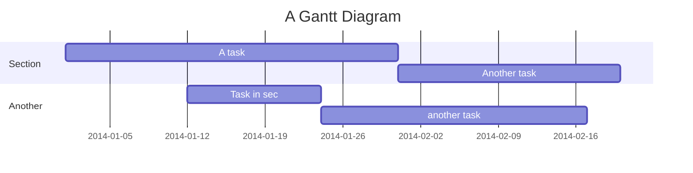
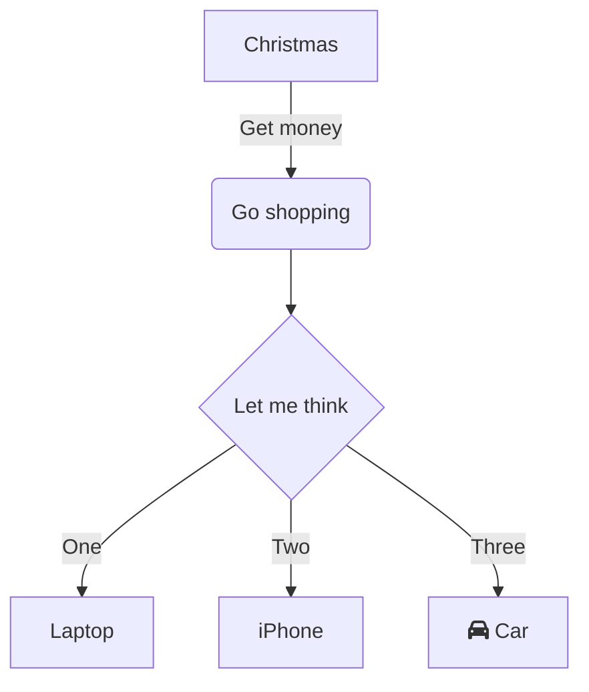
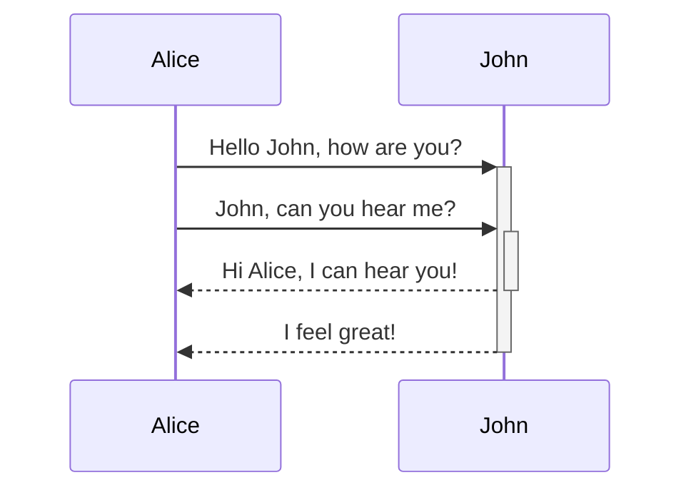

## Mermaid 図

Mermaid のメインドキュメントについては、[Tools and Tips ページ](/handbook/tools-and-tips/#using-mermaid) を参照してください。

このページは、ハンドブックのメインコンテンツエリアより幅広な図など、Mermaid 図の高度なレイアウトオプションについての参考になることを意図しています。

### ガント

<details>
<summary markdown="span">コード</summary>

```md
gantt
    title A Gantt Diagram
    dateFormat  YYYY-MM-DD
    section Section
    A task           :a1, 2014-01-01, 30d
    Another task     :after a1  , 20d
    section Another
    Task in sec      :2014-01-12  , 12d
    another task      : 24d
```

</details>



### フローチャート（中央揃え）

<details>
<summary markdown="span">コード</summary>

```md
graph TD
    A[Christmas] -->|Get money| B(Go shopping)
    B --> C{Let me think}
    C -->|One| D[Laptop]
    C -->|Two| E[iPhone]
    C -->|Three| F[fa:fa-car Car]
```

</details>



### シーケンス図（右揃え）

<details>
<summary markdown="span">コード</summary>

```md
sequenceDiagram
    Alice->>+John: Hello John, how are you?
    Alice->>+John: John, can you hear me?
    John-->>-Alice: Hi Alice, I can hear you!
    John-->>-Alice: I feel great!
```

</details>



### ガント（横スクロール）

<details>
<summary markdown="span">コード</summary>

```md
gantt
    title A Gantt Diagram
    dateFormat  YYYY-MM-DD
    section Section
    A task           :a1, 2014-01-01, 30d
    Another task     :after a1  , 20d
    section Another
    Task in sec      :2014-01-12  , 12d
    another task      : 24d
```

</details>


