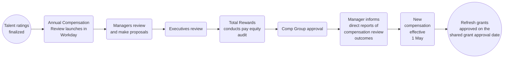

_**以下の情報は、年次報酬レビュー（Annual Compensation Review、ACR）に関する一般的な情報です。最新情報については Loop をご参照ください。**_

## はじめに

年次報酬レビューに関するフィードバックや質問がある場合は、[HelpLab](/handbook/business-technology/enterprise-applications/guides/helplab-guide) までお問い合わせください。

## 年次報酬レビュー

年次報酬レビューの目的は、マネージャーがチームメンバーの達成内容を振り返り、目標に対する成果を測定し、実証されたパフォーマンスと成長ポテンシャルに対して報酬を提供する機会を提供することです。

報酬の決定は以下に基づきます。

1. 役割におけるパフォーマンスと成長ポテンシャルを示すタレントアセスメントなどの個別要因
1. チームや部門内における役割と報酬の内部評価
1. その他の要因（会社の業績と利用可能な予算、現地の給与慣行と規制、後述の対象資格など）

### プロセス概要

### 対象資格

年次報酬レビューの対象となるチームメンバーの入社日は以下の通りです。

- メリット（功績）レビュープログラムへの参加対象は、1月31日までに入社していること
- エクイティリフレッシュプログラムへの参加対象は、10月5日までに入社していること

休暇中のチームメンバーは、GitLab が給与を支払っている期間中であれば、年次報酬および/または昇進に伴う昇給を受け取る対象となります。GitLab から給与を受け取っていないチームメンバーは、復職した時点で昇給を受け取る対象となります。

加えて、FY26 昇進サイクルの一環として昇進したチームメンバーは、年次報酬レビュープロセス（メリットおよびエクイティを含む）の対象となります。

レビュー対象であることが昇給を保証するものではありません。報酬は、タレントアセスメントで評価されたチームメンバーの組織への貢献度に応じて推奨され、私たちのペイ・フォー・パフォーマンスの哲学に沿うものです。

### 予算

FY27 の年次キャッシュ報酬レビュー予算は、すべての国において TTC（Total Target Cash）の3.5%を予算として確保しています。ただしインドのみ、市場により合わせるため7%が確保されています。

#### メリット

メリット予算は、すべての報酬計画マネージャーに割り当てられます。各部門のリーダーは、自分のグループが予算内に収まるよう責任を持ちます。

他のマネージャーがレポートとなっているマネージャーであれば、Organization Summary 画面で、自分以下にロールアップされる予算を含む全体予算を確認できます。全体予算は、レポート先のマネージャーの計画グリッドをレビューする際にも反映されます。自分自身の計画グリッドを編集するときは、直属のレポート分の予算のみ表示されます。

#### エクイティ

エクイティリフレッシュ予算は通常、ディレクター以上のレベルで保持されますが、チームメンバーが少ないグループでは、予算をより効率的に配分するためにシニアディレクター以上がエクイティ計画担当となる場合もあります。ディレクターレベル未満のマネージャーには、エクイティ予算は付与されず、Workday の Stock タブでエクイティを計画することはできません。ただし、適切な推奨につなげるため、マネージャーは引き続きディレクターとエクイティ付与の推奨について議論する必要があります。

### 年次報酬レビューのタイムライン

**最新のタイムラインとガイダンスについては、The Loop を参照してください。**
