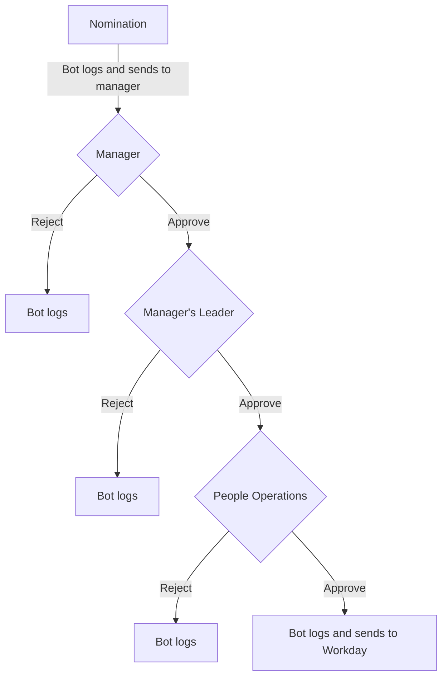

お探しのものが見つかりませんか？ メインの [People Operations ページ](/handbook/people-group/) をお試しください。

以下のインセンティブが GitLab チームメンバーに提供されます。GitLab チームメンバーが利用できる [福利厚生](/handbook/total-rewards/benefits/) については、別ページをご覧ください。

## 代行および暫定役職に対する報酬

FY 2021 の Q2 から、代行または暫定マネジメント役職に就くよう依頼されたチームメンバーに対する一時ボーナス支払いプロセスを確立しました。代行または暫定マネジメント役職にあるチームメンバーは、 [マネジメントグループの個人に対する期待](/handbook/company/structure/#management-group) を確認する必要があります。

### 対象資格基準

* 暫定役職が考慮されるためには、カバレッジの必要性が30日を超える期間である必要があります。
* 暫定役職は、チームメンバーの現在の役職よりも高いレベルである必要があります。
  * チームメンバーが、 **永続的なフルタイム役職に加えて、** 同レベル役職の業務を100%、60日以上引き受ける場合、暫定ボーナスは [People Business Partner](/handbook/people-group/people-business-partners/#people-business-partner-alignments) とグループのリーダーによって考慮される場合があります。
  * 2023-02-01 から、Go-to-Market 役職 (CRO Organization、Sales Development) における暫定ボーナスは、 **永続的なフルタイム役職に加えて、** 同レベルまたはより高位のマネジメント役職を一時的に占めるピープルマネージャーに対して利用可能となります。
* 暫定役職が別のジョブファミリー内にある場合、チームメンバーは同レベルでの暫定報酬の対象となります。

**代行役職は通常昇進で終了しないため、代行役職が対象基準を満たすかどうかの判断は、Hiring Manager と部門長にあります。**

### 暫定ボーナスの計算

ボーナスの計算式は、チームメンバーが暫定役職を演じている期間の長さを認識します。一時ボーナスの支払いは、暫定役職の完了時に発生します。ボーナスは以下の計算式を使用して計算されます:

標準的な裁量ボーナス額 ($1,000、現在の為替レートで) または以下の計算のいずれか大きい方の値:

基本給報酬プランのチームメンバーの場合、ボーナスは暫定役職期間中、給与の追加10%となります。計算は以下の通りです:

* `(現地通貨建て年間基本給/365) x .10 (10%) x 暫定役職の暦日数`

Go-to-Market 役職の OTE (On Target Earnings) 報酬プランのチームメンバーの場合、暫定報酬は通常、暫定期間中に暫定チームが達成した結果に基づきます:

* 暫定リーダーは、新しいチームを点線で管理します。つまり、Workday でチームの直接管理を引き受けるのではなく、一時的なリーダーとして行動することを意味します。したがって、暫定期間中はクォータは変更されません。
* 同レベルチームを暫定的に管理する場合:
  * 暫定ボーナスは、リーダーの OTI と暫定役職の年間クォータに基づいて計算された代表的な BCR (基本コミッション率) x 暫定期間中にクローズされた Net ARR に基づいて計算されます
* より高位のリーダーシップポジションを暫定的にカバーする場合:
  * 暫定ボーナスは、より高位のリーダーシップポジションの代表的な BCR (基本コミッション率) x 暫定期間中にクローズされた Net ARR に基づいて計算されます
* 標準的なコミッション支払いは、暫定役職期間中続きます
* In-plan (OTI 内) のすべての構成要素は、GTM 役職の暫定ボーナス計算に含めることができます。例: Net ARR、New Logo、Professional Services Bookings など。
* プールド報酬プランで測定されるチーム (例: SA および CSM) の場合、暫定ボーナスはパフォーマンスではなく、シート中の暫定役職の OTE に基づきます: (現地通貨建て年間 OTE/365) / x .10 (10%) x 暫定役職の暦日数
* GTM 役職のすべてのピープルマネージャーは、CRO または CMO リーダーシップチームのメンバー、すなわち CRO または CMO の直属を除き、暫定マネジメント割り当ての候補です
* 暫定マネジメント役職にある GTM チームメンバーの合計ボーナス支払いは、単一の暫定リーダーシップ割り当てに対して50,000 USD を超えてはなりません

**暫定ボーナスは、暫定期間後の給与ではなく、暫定期間中のチームメンバーの給与に基づいて計算されます。** 暫定期間中に報酬が変更された場合 (例えば、転居、国の変換など)、各暦日の給与レートに基づいて暫定ボーナスを計算します。

### 暫定ボーナスの追跡と提出

#### 追跡

暫定/代行役職は、Workday で追跡される必要があります。場合によっては、プロセスは Greenhouse で開始されるか、マネージャーがチームメンバーの代行役職の提出 [フォーム](https://forms.gle/KdB4TBtfuHxgGLzE8) を完了することによっても追跡される場合があります。

異なるプロセスのガイダンスは以下にあります:

| Greenhouse | 代行/暫定追跡 |
| -------- | ---------------------- |
| Greenhouse 面接プロセスを通過したすべての暫定役職 | 同じジョブファミリー内の同レベル代行役職 |
| 同じジョブファミリー内のより上級の代行/暫定役職 | 異なるジョブファミリー内の同レベル代行役職 |

Greenhouse - 代行/暫定追跡の例:

* Engineering Manager が Product Designer として代行役職を引き受ける
* Engineering Manager が、別のグループで Engineering Manager 役職を同時に引き受ける

Workday の例:

* Engineering Manager が Senior Engineering Manager として暫定役職を引き受ける
* Product Manager が Senior Backend Engineer として暫定役職を引き受ける (面接プロセスを経た後)

暫定/代行役職を追跡するプロセスは以下の通りです:

1. **(代行の場合)**、マネージャーはマネージャーと People Business Partner と整合し、以下について整合します:
   * 役職が暫定か代行か
   * 役職が新しいジョブファミリーか同じジョブファミリーか
   * 暫定/代行役職が同レベルかより高位か
   * 暫定/代行期間の有効開始日
   * 合意され承認された後、マネージャーは [チームメンバーの代行役職の提出フォーム](https://docs.google.com/forms/d/e/1FAIpQLSd5CkHvcDYx6oaNzrAm8QqFZpCVLcoDrcTpaAl-cuKCUERc2A/viewform) を提出します。
1. **(暫定の場合)** People Business Partner は、Workday で [Job Change - Change Job Details](https://docs.google.com/document/d/1hpPikG0STncYKamaY8XlfMTwYdoszP-0Xogvpp5hyZ4/edit?usp=sharing) リクエストを提出します。職位は変更すべきではありません。報酬とジョブファミリーは暫定/代行プロセスの一環として変更されないからです。チームメンバーの `Business Title` のみ変更する必要があります。代行ポジションは Workday で追跡されないため、このステップは暫定ポジションのみで行われます。

#### 提出

暫定/代行期間が終了したら、暫定ボーナスリクエストを提出するために以下のプロセスに従う必要があります:

* **(代行ボーナスの場合)** マネージャーは、ボーナス計算のために代行フォームを通じて当初提出された代行期間の開始/終了日を参照します。
* **(暫定ボーナスの場合)** マネージャーは、Workday の `Job` タブを参照し、`Job History` をクリックして 'Business Title' 列をレビューし、暫定期間の開始日を確認します
* 確認後、マネージャーは Workday でボーナスを提出します。OTP を提出するには、 [Request a One-Time Payment job-aid](https://docs.google.com/document/d/15_cqMAIoqkxNhoCTL42X3XUpr0E9fNZXFmY3Yitk2LQ/edit?usp=sharing) に従います。マネージャーは、Workday の **Additional Information** セクションに、Workday での暫定期間の開始日と終了日も提供する必要があります

**注:** チームメンバーは、ボーナス支払いを受け取る対象となるためには、暫定役職期間の終了時点で GitLab のアクティブなチームメンバーである必要があります。チームメンバーが暫定役職期間中に GitLab を離れた場合、按分支払いの対象とはなりません。

### 暫定ボーナス計算の例

* Senior Engineer は基本給125,000ドル。彼女は、合計90日間の3ヶ月 (1月-3月) の Engineering Mgr の暫定役職を引き受けました。この暫定役職のボーナスは `($125,000/365) x .10 x 90 = $3,082.19` となります
* Finance Business Partner は基本給100,000ドル。彼は、同僚が4.5週間 (合計31日) 休暇中に複数チームをカバーする暫定役職を引き受けました。この暫定役職のボーナスは `($100,000/365) x .10 x 31 = $849.32` となるので、このボーナスは切り上げて、裁量アワードとして処理します。
* Area Sales Manager は、ピア ASM が昇進した後、同レベルチームを暫定的に管理します。ASM は Net ARR の基本コミッション率1% と New Logo あたり3,000.00ドル。 暫定カバレッジ中、Area は1,000,000.00ドルの nARR と2件の First Order new logo をクローズしました。 ボーナス計算は ($1,000,000.00 x .01) + (2 x $3,000.00) = $16,000.00 となります。
* Area Sales Manager は、AVP が GitLab を離れた後、Region 全体を暫定的に管理します。AVP の基本コミッション率は Net ARR で0.3% と New Logo あたり800ドル。暫定カバレッジ期間中、チームは5M ドルの Net ARR と4件の New Logo をクローズしました。ボーナス計算は ($5,000,000.00 x 0.003) + (4 x $800.00) = $18,200.00 となります。

## 裁量ボーナス

### 個人向け裁量ボーナス

#### 目的

裁量ボーナスは、GitLab の [CREDIT](/handbook/values/#credit) 価値観 — :handshake: Collaboration、📈 Results for Customers、:stopwatch: Efficiency、:globe_with_meridians: Diversity, Inclusion & Belonging、:footprints: Iteration、:eye: Transparency — を体現しながら、 **役割の期待を超える** 例外的な仕事に対する **ピアツーピア** の認識アワードです。

良い仕事と素晴らしい仕事は私たちのベースラインです — ボーナスは、その高い基準でも際立つ真に例外的な貢献を称えるものです。

**アワード金額:** 1,000 USD (固定、 [現在の為替レート](/handbook/total-rewards/compensation/#exchange-rates) で)

#### 対象資格

##### 推薦できる人

good standing の任意の GitLab [チームメンバー](/handbook/people-group/employment-solutions/#team-member-types-at-gitlab) が、自分のチーム外の人を含む、誰でも推薦できます。自己推薦は許可されていません。

##### 推薦される対象

任意の GitLab チームメンバー、ただし **以下を除く**:

* 直属のマネージャーまたはマネジメントチェーンの誰か
* 一時的な契約者
* 現在パフォーマンス改善中のチームメンバー
* good standing にないか、GitLab を離れたチームメンバー

#### 対象となるもの

有効な推薦は、 **以下の3つすべて** を満たす必要があります:

1. **通常の役割スコープ外** — このワークは通常、より高いレベルの誰かまたは異なる職務の誰かが行うものか？
1. **例外的な実行** — 素晴らしいワークのベースラインに対しても際立つか？
1. **CREDIT 価値観の実証** — 具体的にどの価値観をどのように実証したか？

##### 価値観別の例

| **価値観** | **「期待を超える」の意味** |
|---|---|
| :handshake: Collaboration | 重要な成果物のブロックを解除するため、別の職務に踏み込む |
| 📈 Results for Customers | 自分の役割を完全に超えて、重要な顧客 Issue を解決する |
| :stopwatch: Efficiency | チーム横断的にプロセスを劇的に改善するソリューションを実装する |
| :globe_with_meridians: DIB | 組織全体の帰属感を測定可能に向上させるイニシアティブを作成する |
| :footprints: Iteration | 他の人が完璧を待つ場面で、漸進的な価値を出荷する |
| :eye: Transparency | 組織全体で情報をアクセス可能で可視化する |

##### &cross; 無効な基準

* ルーチンの職務責任またはコアプロジェクト
* 営業ターゲットの達成 (営業報酬でカバー)
* 長時間労働 (時間ではなく、インパクトを測定します)
* 他のチームとのパートナーシップ (期待されるコラボレーション)
* 「素晴らしい」ワーク (それは私たちのベースラインであり、ボーナスのバーではない)

#### 推薦プロセス

[Nominator Bot](/handbook/total-rewards/incentives/#nominator-bot-process) で以下を含めて提出します:

* どの CREDIT 価値観が実証されたか — 具体的な例とともに
* そのワークがどのように通常の役割を超えていたか
* ワークを示す具体的なリンクまたはアーティファクト
* より広い組織への測定可能なインパクト

**レビューステップ:**

1. **マネージャー** — 価値観が明確に表現されていること、ワークが真に例外的で通常の役割の外であること、ボーナスがチーム全体で思慮深く分配されていることを確認します
1. **Compensation** — レビューと承認
1. **People Operations** — 最終レビューと承認、支払いを処理します
1. **認識** — #thanks で実証された価値観を強調して共有されます

90日以上アイドル状態の推薦は自動的にキャンセルされます。

### 分配ガイダンス

おおまかなガイドライン: 約10人に1人のチームメンバーが、ある月にボーナスを受け取る可能性があります — ただし、これはクォータではありません。ボーナスは、同じ個人に繰り返し集中するのではなく、チーム全体で思慮深く分配する必要があります。

#### 有効な推薦の例

**Documentation Engineer としての Technical Writer**

「X は重要な空席期間中、ライターの役割をはるかに超えて、パートタイムの documentation engineer として行動しました。 Global Navigation を実装し、MVC でコードベースを近代化し、組織全体のインパクトのためにチーム横断的に協働しました。」 (_価値観: Results、Efficiency、Collaboration_)

**チーム横断的な重要サポート**

「バックエンドチームが利用できなかったとき、X (異なるチームから) が踏み込んで重要なデプロイのブロックを解除し、顧客アクセスをブロックしている複雑な Issue をデバッグし、他の機能全体で同様の問題を先回りして特定しました。」 (_価値観: Results、Efficiency、Collaboration_)

**組織全体のツーリングの構築**

「X は Nominator Bot を構築し、承認時間を半分に短縮し、継続的な改善を先回りして管理し、プロセス全体を組織に可視化しました。」 (_価値観: Efficiency、Transparency_)

#### 無効な推薦の例

❌ _「X は私のオンボーディングを助け、すべての質問に答えました。」_ — 期待されるコラボレーションであり、例外的でも役割の外でもありません。

❌ _「X は3ヶ月間営業クォータを達成しました。」_ — 役割のコアであり、営業報酬でカバーされています。

❌ _「X はいつも最後の瞬間にチームメイトを助けます。」_ — 特定の例外的貢献のない、期待されるコラボレーションです。

質問は？ People Operations にお問い合わせいただくか、 **#people-connect** に投稿してください。

### 裁量ボーナスのチームメンバー推薦プロセス

**注:** 裁量ボーナスリクエストには、Workday の代わりに Nominator Bot を使用してください。

#### Nominator Bot プロセス

##### 任意の GitLab チームメンバー

1. Slack で `Nominator` を検索バーに入力し、Nominator アプリを選択します
1. 'Nominate!' ボタンをクリックして、推薦の詳細を追加します。テキストフィールドを使用して、GitLab チームメンバーが自分のワークで特定の GitLab 価値観をどのように実証したかを説明する数文を書きます。 上記の有効・無効基準を確認したことを必ず確認してください。推薦リクエストは私たちの価値観と関連付けられ、推薦が基準を満たしていることを保証するために十分に詳細でなければならないことを忘れないでください。適用される価値観を選択できます。
1. 該当する場合は、推薦をサポートする関連 Issue またはマージリクエストを必ず含めてください。
1. 提出されると、ボットはマネージャーに送信して承認フローを開始します。
1. 承認フローのいずれかの時点で、マネージャーまたはマネージャーのマネージャーがボーナス承認について質問がある場合、彼らはマネージャーおよび/または推薦者に追加のコンテキストを求めることができます。プロセスとロジスティクスに関する残りの質問 (例えば、ボーナスは承認チェーンのどこにあるか?) がある場合、この [FAQ ガイド](https://theloop.gitlab.com/site/4455aa7f-24d9-41f2-b940-467b54962e4d/page/0fa19bf4-fd6a-41b9-9316-c2dcf3add854) が明確化に役立つ可能性があります。あるいは、 [HelpLab](https://helplab.gitlab.systems/esc?id=emp_taxonomy_topic&topic_id=e7b7f30d474c069067429ee0026d431f) を通じて People Operations チームに連絡することができます。推薦を承認するかどうかのガイダンスに関する残りの質問については、整合した [People Business Partner](/handbook/people-group/people-business-partners/#people-business-partner-alignments) に連絡できます。
1. マネージャーまたは2レベル目の承認者が長期休暇中で、合理的な時間枠 (2週間以上) で推薦に応答できない場合、推薦が誰のためであるかを記載した [HelpLab](https://helplab.gitlab.systems/esc?id=sc_cat_item&sys_id=ff7a26094784069067429ee0026d4337) で People Operations チームのケースを作成し、処理のために次のレベルのマネージャーに手動で移動できるようにしてください。
1. 全員が承認すると、ボットは良いニュースとともに報告を返します。拒否された場合は、拒否した人にあなたに連絡してもらうように依頼します。それはボットによって行われません。

##### マネージャープロセス

1. Nominator ボットは、推薦の承認または拒否を求める Slack DM をあなたに送信します。
1. 承認することを決定したら、必要なのは承認ボタンをクリックするだけです。ボットが次のステップ (2レベル目のマネージャーと People Operations チームへの送信) を処理します。
1. 拒否することを決定したら、拒否ボタンをクリックします。推薦は `rejected_by_manager` として更新されます。ボットは推薦者に連絡して、推薦が承認されなかった理由を確実に理解してもらうように依頼します。
1. 次のレベルの承認者が長期休暇中で、合理的な時間枠 (2週間以上) で推薦に応答できない場合、推薦が誰のためであるかを記載した [HelpLab](https://helplab.gitlab.systems/esc?id=sc_cat_item&sys_id=ff7a26094784069067429ee0026d4337) で People Operations チームのケースを作成し、処理のために次のレベルのマネージャーに手動で移動できるようにしてください。
1. 他の全員が承認すると、ボットはあなたに連絡し、 [#thanks](https://gitlab.slack.com/archives/C038E3Q6L) Slack チャンネルでチームメンバーと共有し、チームメンバーの直接のピアが簡単に見えるようにできます:
    * 例えば、チームメンバーのグループチャンネルにクロスポストする
    * Support の場合、 [Support Week in Review](/handbook/support/#support-week-in-review) に「Team Member Update」項目として追加する

##### 承認フロー



### Working Group ボーナス

1. 時には [working group](/handbook/company/structure/#working-groups) が、ある期間、プロジェクト、または状況で GitLab 価値観を強く示すことがあります。このケースには、Working Group ボーナスを使用します。
1. 個人と同様に、 `#thanks` チャンネルを通じて、また時には Working Group ボーナスを通じてグループを構成する人々を認識します。
1. 誰でも、関係する個人のマネージャーを通じて、 [Working Group ボーナスの推薦](#process-for-recommending-working-group-bonus-in-workday) ができます。1人あたり100ドル ([為替レート](/handbook/total-rewards/compensation/#exchange-rates) で)。

### Workday での Working Group ボーナス推薦プロセス {#process-for-recommending-working-group-bonus-in-workday}

**任意の GitLab チームメンバー**

1. ワーキンググループが自分のワークで特定の GitLab 価値観をどのように示したかの説明を書きます。
1. その文を関係する個人のマネージャーにメールし、Working Group ボーナスを提案し、すべてのマネージャーと15分間の Zoom ミーティングをセットアップして提案について議論します。 **注: マネージャーとの整合は、プライベート Slack チャンネルで非同期に行うこともできます。**
1. マネージャーは同意するかしないかもしれず、レポートがボーナスを取得するかどうかについて (マネージャーの承認とともに) 完全な裁量を持っていることを忘れないでください。 また、 `#thanks` チャンネルを使用して人々を認識することもできることを忘れないでください。

**Sales Development Focus ボーナス (Sales Development 固有のワーキングボーナス)**

1. 時にはワーキンググループが、ある期間、プロジェクト、または状況で GitLab 価値観を強く示します。このケースには、Working Group ボーナスがあります。営業開発チームの要件は月ごとに変動する可能性があるため、特定のタスクを完了するために1人または複数の個人グループからの特別なフォーカスが必要になる場合があります。 例: 新しいプロセスの採用、新しい行動の推進、または営業チームからの特定のプロスペクティングタスクへの特別なフォーカス。このボーナスは、収入補完またはチームが現在の仕事をするためのインセンティブではなく、追加の努力に報いるためのものです。
1. Focus Working Group ボーナスは、自分のチーム内の個人または個人グループに対してのみ、Sales Development Manager によって推薦されます。Focus ボーナスの予算は、任意の Sales Dev Team で月額500ドルを超えてはならず、通常はチームメンバー間で分割されます。

**マネージャープロセス**

1. Workday で [One Time Payment](https://docs.google.com/document/d/15_cqMAIoqkxNhoCTL42X3XUpr0E9fNZXFmY3Yitk2LQ/edit) として提出してください。 ワーキンググループボーナスが何のためであるかを `Additional Information` ボックスに必ず書いてください。

**承認プロセス:**

1. 次のレベルのマネージャーは Workday からアラートを受け取り、承認または拒否できます。
1. 次のレベルのマネージャーによって承認されると、リクエストはレビューと最終承認のために People Operations に送信されます。
1. 完全に承認されると、Payroll にボーナスが通知され、処理を開始できます。
1. これにより、マネージャーはチームメンバーにボーナスを通知し、GitLab Slack チャンネル `[#thanks](https://gitlab.slack.com/archives/C038E3Q6L)` で発表できます。発表には、ボーナスの「誰」と「なぜ」を含めるべきです。

### 裁量ボーナスの伝達

一般的なルールとして、推薦されたチームメンバーの直属のマネージャーが、裁量ボーナスを伝達する唯一の人物であるべきです。マネージャーは Nominator ボットを通じて最終通知を受け取り、推薦がすべてのレベルの承認を通過したことを知ります。

このルールの例外は、1人がグループを推薦した場合のワーキンググループボーナスである可能性があります。推薦者がグループを代表して発表したい場合、以下を行う必要があります:

* **すべてのボーナスがすべてのレイヤーの承認を通過したことを確認する**
* 各被推薦者の直属のマネージャーと、グループを代表して発表することが OK であることを確認する

### 裁量ボーナスのレポーティング

四半期ベースで裁量ボーナスデータのレビューがあります。これには以下が含まれます: マネージャーごとの承認数、マネージャーごとの拒否数、拒否理由のトレンド。これにより、トレンドに対応し、組織全体で効率的かつ一貫したプロセスを保証できます。

## GitLab Awards プログラム

各会計年度、GitLab Awards プログラムは、私たちの [価値観](/handbook/values/#credit) を示すことで大きなインパクトをもたらしたチームメンバーを認識します。GitLab Awards プログラムは、2種類の異なるアワードで構成されています: DZ Award と Values Awards です。

### The DZ Award

私たちの大切な共同創設者である [Dmitriy Zaporozhets「DZ」](https://university.gitlab.com/learn/video/dz-video)、彼の貢献、そして GitLab に10年を捧げた彼を称え、GitLab は毎会計年度、 [boring solution](/handbook/values/#boring-solutions) を使用して困難な問題を解決することで大きなインパクトをもたらしたチームメンバーを認識します。

DZ アワードの詳細:

* DZ アワードの受賞者は、現地の為替レートで 10,000 USD 相当の一時現金ボーナスを受け取ります。これは、DZ の GitLab への10年の貢献と、DZ のレガシーを継承する受賞者の役割を称えるためのものです。
* 特別にデザインされた GitLab Award とヘッドフォンスタンド

#### DZ Award の基準

潜在的な被推薦者は、ポジティブで深い影響をもたらした [boring solution](/handbook/values/#boring-solutions) を作成し実装することで、困難な問題を解決したチームメンバーである必要があります。

**カリブレーションに使用される基準:**

* OKR の結果と成果
* 今会計年度の boring solution からの重要なビジネス結果/インパクト。
* 役割の一般的なスコープ外の貢献 (例: このアワードは、通常業務の boring solution には付与されません)

**カリブレーションに使用されない基準:**

* チームメンバーが技術的な役割にあること、または技術的な問題に対するソリューションを作成することは、このアワードに推薦される要件ではありません。
* ビジネスのレベル - このアワードはリーダーのみに付与されることを意図したものではなく、すべてのチームメンバーが利用可能です。
* [Talent Assessment](/handbook/people-group/talent-assessment) - 私たちはペイ・フォー・パフォーマンス報酬哲学を継続したいですが、最後のレビューサイクルの結果に関係なく、チームメンバーはこのアワードの対象となる可能性があります。
* 唯一の基準は、チームメンバーが good standing にあることです (例: PIP/最近書面警告を受けていないこと)。

### Values Award

Values Award は、誰もが活躍できる環境を育む GitLab 価値観を体現し採用する人々を称えます。これらのアワードは、特に思考と視点の多様性において、すべてのチームメンバーに対して包括的なチームメンバーを認識します。これらのアワードの対象となるチームメンバーは、職場でのエゴなし、Single Source of Truth の使用、何ではなくなぜを言うこと、不快なアイデアと会話を受け入れることを実証します。GitLab 価値観の貢献または表示は、チームメンバーの直接のチーム、顧客、ユーザー、投資家を超えて見える必要があります。

Values Award の詳細:

* 6つのアワードがあり、それぞれは: Collaboration、Results、Efficiency、Diversity, Inclusion and Belonging、Iteration、Transparency 用です。
* 各価値観アワードの受賞者は、為替レートで 5,000 USD 相当の一時現金ボーナスを受け取ります。
* 特別にデザインされた GitLab Awards メダル。

#### Values Award の説明

##### Collaboration Award

結果を達成するためには、チームメンバーは効果的に協働しなければなりません。 [Collaboration](/handbook/values/#collaboration) の価値観アワードは、他者を助けることを優先順位とし、具体的な結果につながるように期待を超える形で行ったチームメンバーに付与されます。これは、例えば: 効果的にフィードバックを与える、共有する、会社部門間で手を伸ばす、または short toes などの形で来ることがあります。

##### Results Award

私たちは、お互い、お客様、ユーザー、投資家に約束したことを実行します。 [Results](/handbook/values/#results) の価値観アワードは、会社全体のインパクトのために重要な結果を得るために期待を超えたチームメンバーに付与されます。これは、例えば: オーナーシップ、忍耐、ドッグフーディング、または disagree, commit, and disagree などの異なる形で来ることがあります。

##### Efficiency Award

最も重要なビジネスイニシアティブで効率的に働くことで、私たちは速い進歩を遂げることができ、これは私たちのワークをより充実させます。 [Efficiency](/handbook/values/#efficiency) の価値観アワードは、例えば、書き留めることのチャンピオン、変化を受け入れること、または manager of one であることなどを通じて、速い進歩をサポートしたチームメンバーに付与されます。

##### Diversity, Inclusion & Belonging Award

私たちは、誰もが活躍できる環境を育む努力で大きなインパクトをもたらすことを目指しています。 [Diversity, Inclusion and Belonging](/handbook/values/#diversity-inclusion) の価値観アワードは、例えば: 非同期コミュニケーションへのバイアス、多様な視点の追求、神経多様性の受容などを通じて、あらゆる背景と状況の人々が帰属し貢献できると感じる環境を作るのに貢献したチームメンバーに付与されます。

##### Iteration Award

私たちは可能な限り最小限のことを行い、可能な限り速くそれを世に出します。 [Iteration](/handbook/values/#iteration) の価値観アワードは、例えば: 期日の設定、最小限の価値ある変更 (MVC)、または低レベルの恥などを通じて、より速い結果につながったイテレーションを貢献または示したチームメンバーに付与されます。

##### Transparency Award

情報を公開することで、貢献の閾値を下げ、コラボレーションを容易にすることができます。 [Transparency](/handbook/values/#transparency) の価値観アワードは、例えば: 公開でないものの決定、Single Source of Truth の使用、何ではなくなぜを言うことなどを通じて、透明性を貢献または示したチームメンバーに付与されます。

#### 価値観アワードの基準

* 今会計年度における GitLab 価値観の重要な貢献または表示。
* GitLab 価値観の貢献または表示が具体的な結果につながった。
* 貢献または表示は、直接のチーム、顧客、ユーザー、投資家以外のチームメンバーから見える。
* 貢献または表示は、役割/ジョブファミリー責任の一般的なスコープ外であった
* ​​真に例外的なワーク。良いと素晴らしいはチームメンバーのワークとパフォーマンスにすでに期待されている
* チームメンバーが会社で good standing にある (例: PIP/最近書面警告を受けていない)。

### アワードの推薦プロセス

すべてのチームメンバーが、DZ Award と Values Award の両方の推薦を行うことができます。推薦を提出すると、People Communications & Engagement DRI が、あなたのマネージャーと部門長を含むドキュメントを作成します。最終的に、各部門長は DZ Award について1つの推薦と、価値観ごとに1つの推薦を提出できます。部門長は、最終推薦をレビューするために People Business Partner を含めるべきです。People Communications and Engagement DRI は、両方のアワードの推薦を調整し、最終的に推薦は E-Group レベルでカリブレーションされます。

#### 推薦プロセスの概要

* 推薦ウィンドウが開くと、すべてのチームメンバーは、 [このフォーム](https://forms.gle/euX4hSmcpcwvfCPR8) を通じて Values Award と DZ Award の推薦を提出できます。
* People Communications and Engagement DRI は、推薦をレビューするために、推薦者のマネージャーと部門長を含むドキュメントを作成します。
* 推薦ウィンドウが閉じると、People Communications and Engagement DRI はカリブレーション前にすべての推薦ドキュメントが完成していることを確認します。
* People Communications and Engagement DRI と People Business Partner は、その後、E-group リーダーと部門推薦間でカリブレーションを行い、DZ Award に対して1つのチームメンバー推薦と、Values Award に対して価値観ごとに最大1つのチームメンバーを選択します。
* Engineering と Sales は、DZ Award に対して2つのチームメンバーを推薦できます。
* 推薦は最終確定され、E-group は各グループの被推薦者について議論し、アワード受賞者を選択します。
* アワード受賞者が発表されます。

## CTO DevSecOps Innovation Award

DevSecOps Innovation Award は、当社のプラットフォームとその機能を活用して、日常業務へのアプローチの生産性と効果を向上させている GitLab チームメンバーのための認識プログラムです。 製品を **ドッグフーディング** することは、自分自身だけでなく、お客様にとっても製品を改善する方法を学ぶために重要です。製品の社内利用を理解することで、生産性と、プラットフォームを他の人に売り込み、宣伝する能力の両方を向上させることができます。

このアワードの詳細は [internal handbook page](https://internal.gitlab.com/handbook/engineering/cto-programs/cto-devsecops-innovation-award/) で確認できます。

## 紹介ボーナス

GitLab で働いているなら、私たちの [Team](/handbook/company/team/) に素晴らしい追加となり、参加に興味がある可能性のある素晴らしい友人やピアがいる可能性があります。例外的な人々と成長するために、以下のように機能する [紹介ボーナス](/handbook/hiring/referral-process/) があります:

* 新しいチームメンバーが会社で3ヶ月間雇用されると、紹介ボーナスを提供します。
* 過去には、紹介ボーナスの段階システムがありましたが、フラットなボーナス額を追加するように構造を簡素化しました。
* 新規採用に対して [1,500ドル](/handbook/total-rewards/compensation/#exchange-rates) のベース紹介ボーナス。

### Q4 Account Executive 紹介インセンティブ (2025年12月8日 - 2026年2月23日)

この限定期間中、Account Executive ポジションの紹介ボーナスは以下に増額されます:

* Commercial または New Business Account Executive 役職に採用された紹介に対して7,000ドル
* Strategic または Major Account Executive 役職に採用された紹介に対して10,000ドル
これらの強化されたボーナスは、 **2025年12月8日から2026年2月23日の間** に採用日のある Account Executive 紹介に適用され、すべての会社の紹介と支払いポリシーに従います。

私たちは、私たちのチームと採用慣行における [diversity](/handbook/values/#diversity-inclusion) を奨励しサポートし、チームメンバーがネットワーク内に technology における代表されていないグループのメンバーとして認識する潜在的な候補者がいるかどうかを検討することを奨励します。

チームメンバーが **2025-12-07 より前** の採用日を持つ場合は、 [以前の](/handbook/hiring/referral-operations/#adding-a-referral-to-workday-people-operations-team) で言及された紹介ボーナス額が適用されることをご注意ください。

### 紹介の方法

プログラムの詳細とチームメンバーの対象資格と理解については、 [GitLab のハンドブックの Hiring セクションのガイド](/handbook/hiring/referral-process/) を参照してください。

### 例外

* 直属のレポートまたは直接のレポーティングチェーンの人々を採用することに対するボーナスはありません、
* 現在のチームメンバーを紹介する場合のボーナスはありません、
* Boomerang Team Member (戻ってきたチームメンバー) を紹介することに対するボーナスはありません、
* 紹介するチームメンバーが Talent Acquisition チームの一部である場合のボーナスはありません - 彼らはポジションの性質上、候補者と関わるため、対象となりません。
* 利益相反が認識される場合のボーナスはありません。
* VP レベルまたは [Executive Group](/handbook/company/structure/#executives) のボーナスはありません。
* 紹介がインターンの場合のボーナスはありません。紹介 (インターン) がフルタイム、中級レベルのチームメンバーに変換された場合、紹介ボーナスが支払われます。
* 紹介ボーナス支払い日より前にチームメンバーの雇用が終了した場合、紹介チームメンバーに対するボーナスは適用されません。アクティブなチームメンバーである必要があります。
* 複数の GitLab 従業員が同じ役割で同じチームメンバーを紹介した場合、People Ops チームは新しいチームメンバーに、誰が紹介したかを確認するように依頼します (誰がクレジットを取得すべきか)。 2人以上に言及した場合、ボーナスはそれらの間で分割されます。
* GitLab に別の候補者を紹介したい人が、開始する前である場合、紹介者は新しい候補者の応募時に署名された契約を持っていなければなりません。
* GitLab のソーサーが GreenHouse に候補者を追加し、リクルーターが候補者をスクリーニングする場合、紹介者は後でプロファイルに追加することができません。候補者ソースは、GitLab ソーサーによる Prospecting となります。

### 紹介ボーナス処理 {#referral-bonus-processing}

1. People Operations チームは、GitLab Referral Bonus Audit Workday レポートから毎週紹介ボーナスを処理します
1. すべての資格が満たされていることを確認するためにレポートをレビューした後、One Time Payment が Workday に追加されます
1. Payroll に完了したボーナスが通知され、処理を開始できます

### 一時的なアドオンキャンペーン支払いの追加追跡

1. Talent Acquisition Manager は、アドオンキャンペーン期間中に採用に設定されたすべての紹介を追跡します。
1. Talent Acquisition Manager は、紹介された新規採用者の GitLab での3ヶ月雇用に整合する月の最初に、HelpLab またはメールで People Operations に通知します。
1. People Operations は、 [上記のステップ](#referral-bonus-processing) に従います

### GitLab 記念日

毎週木曜日の 10:00 UTC に、 `PeopleOps Bot` slack ボットが、その週に採用記念日を祝うすべてのチームメンバーに祝福する shout out を `#team-member-updates` チャンネルに送信します。
ギフトに関する詳細情報については、 [GitLab Anniversary Gift](/handbook/people-group/celebrations/#anniversary-gifts) セクションをご覧ください。

## GitLab Ultimate と Duo Enterprise

すべての GitLab チームメンバーは、GitLab.com の [Ultimate](https://about.gitlab.com/pricing/#gitlab-com) tier をリクエストできます。
チームメンバーが GitLab.com で個別のプライベートおよびワークアカウントを持っている場合、両方にリクエストできます。このインセンティブは、GitLab チームメンバーが所有するグループには **適用されません** (例えば、epics などのグループレベルの Ultimate 機能は、Ultimate GitLab チームメンバー個人アカウントでは利用できません)。

Ultimate をリクエストするには、 [このフォームを提出](https://docs.google.com/forms/d/e/1FAIpQLSddexI8VZTCiyxme1_7QtbQZ6WoIJRlHdaI2Gi6PD8Eti-DLQ/viewform) してください。あなたのアカウントは、提出から2時間以内に Ultimate tier にアップグレードされます。

{}

GitLab プロファイルやアカウント情報ページから Ultimate プランにあることを確認する簡単な方法はありません。特定のアカウントで Ultimate Plan を持っていることを確認するには:

* あなたのアカウントで Gitlab.com にサインインします
* https://gitlab.com/api/v4/namespaces/{username} に移動します ( `{username}` を実際の GitLab ユーザー名に置き換えます)
* ページコンテンツに、アカウントが Ultimate プランにある場合、以下のテキストが表示されるはずです:

  ```json
  "plan": "ultimate",
  ```

{}

このプロセスについて質問がある場合、または上記の手順を使用して確認した後で2時間後にこのアップグレードが見られない場合は、 [`#it_help` GitLab slack チャンネル](https://gitlab.slack.com/archives/CK4EQH50E) でご連絡ください。

加えて、GitLab チームメンバーは、 [`GitlabCom_Licensed_Demo_Group_Request` issue テンプレート](https://gitlab.com/gitlab-com/team-member-epics/access-requests/-/issues/new?type=ISSUE&description_template=GitlabCom_Licensed_Demo_Group_Request) を使用して、個人アカウント (上記の Ultimate tier リクエストに使用された同じアカウント) の単一グループ向けに、 [Duo Enterprise](https://about.gitlab.com/gitlab-duo/#addons) 付きのシングルシート Ultimate プラングループをリクエストできます。

これらのオプションは、当社の製品を [ドッグフーディング](/handbook/values/#dogfooding) する一環として、可能な限りすべての機能を使用することを奨励するために提供されています。

Ultimate と Duo Enterprise は、オフボーディングの一環として、すべての関連する名前空間から削除されます。

GitLab チームメンバーとしての時間中に作成された知的財産 (IP) の所有権は、雇用契約によって規定されます。このインセンティブの恩恵を受ける個人 GitLab アカウントでこの IP を開発しホストすることを選択しても、IP が雇用契約の発明譲渡条項の対象となるかどうかは決定されません。
