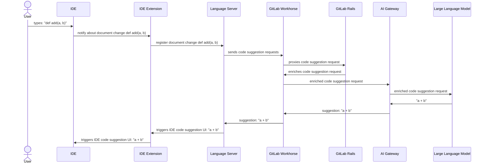
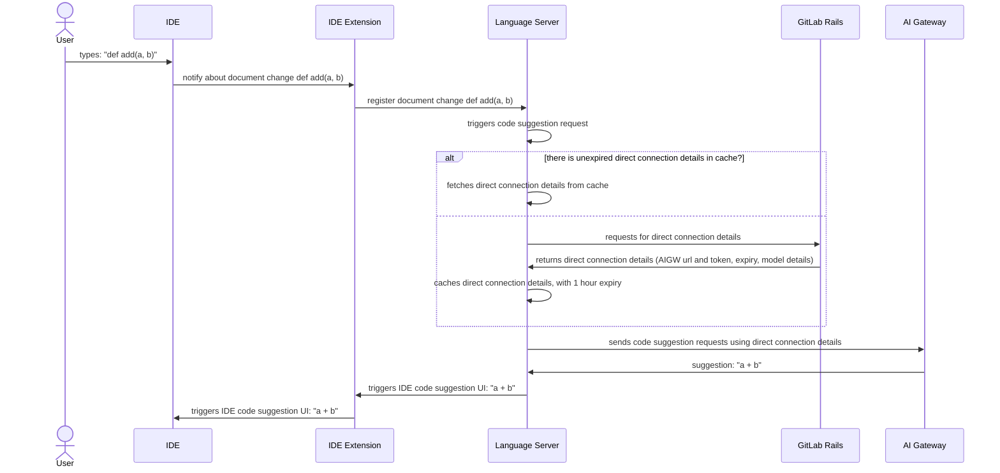
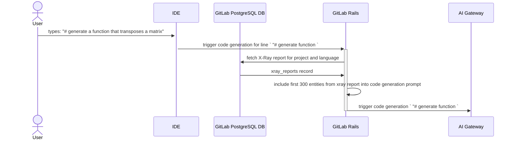

## はじめに

GitLab の Code Suggestions の技術概要へようこそ。これは、開発環境内に高度な AI 技術を直接統合することでコーディング体験を向上させるために設計された機能です。このページは、インテリジェントな補完と生成的なコーディング機能を通じてコーディングプロセスを大幅に効率化する、革新的な Code Suggestions 機能の背後にあるアーキテクチャと相互作用を理解するためのガイドです。

その中心では、Code Suggestions は、IDE 拡張機能、Language Server、GitLab Workhorse、そして AI Gateway などの複数のコンポーネントを含む洗練されたワークフローを通じて動作し、最終的にリアルタイムでコンテキストを認識したコーディング提案を提供します。タイピングタスクを高速化するシンプルなコード補完から、コードブロック全体を作り上げる複雑なコード生成まで、私たちのシステムは幅広いコーディングアクティビティをサポートし、生産性を向上させるように設計されています。

以下では、このエコシステム内の各コンポーネントの役割を詳述し、システムを通るデータの流れを説明し、迅速な提案と詳細なコード生成の両方を提供するために、さまざまなタイプのコーディングインタラクションがどのように処理されるかを説明します。

## Code Suggestions 技術概要

Code Suggestions は通常、以下の図に示すシーケンスに従います。

図に示されているコンポーネントは以下の通りです。

1. IDE 拡張機能：GitLab はいくつかの IDE 拡張機能（別名プラグイン）を提供しており、その他の機能の中でも Language Server との統合を提供します
   1. VSCode 拡張機能：https://gitlab.com/gitlab-org/gitlab-vscode-extension/
   1. JetBrains 拡張機能：https://gitlab.com/gitlab-org/editor-extensions/gitlab-jetbrains-plugin
   1. NeoVim 拡張機能：https://gitlab.com/gitlab-org/editor-extensions/gitlab.vim
1. [Language Server](https://gitlab.com/gitlab-org/editor-extensions/gitlab-lsp)：これは、異なる IDE 間で共有できる機能を提供する統一された方法であり、重複を削減します。Language Server は、IDE 拡張機能との通信に [LSP プロトコル](https://microsoft.github.io/language-server-protocol/)を使用するコンポーネントです。
1. [GitLab Workhorse](https://docs.gitlab.com/ee/development/workhorse/) - GitLab Workhorse は、リソース集約的で長時間実行されるリクエストを処理するための GitLab 用のスマートなリバースプロキシです。
1. [GitLab Rails](https://gitlab.com/gitlab-org/gitlab) - 機能の大部分を提供する GitLab のメインコンポーネント。
1. [AI Gateway](https://gitlab.com/gitlab-org/modelops/applied-ml/code-suggestions/ai-assist) - GitLab のすべてのユーザーに対して、利用しているインスタンス（セルフマネージド、Dedicated、GitLab.com）にかかわらず AI 機能へのアクセスを提供するスタンドアロンサービスです。コンセプトに関する詳細は[アーキテクチャブループリント](https://docs.gitlab.com/ee/architecture/blueprints/ai_gateway/index.html)を参照してください
1. Large Language Model - コード生成機能を提供する AI モデル

Code Suggestions には 2 種類のインタラクションがあります。

- **[Code Completion](#code-completion)**：既存の行またはコードブロックを完成させることを目的とした、短い AI 生成の提案
- **[Code Generation](#code-generation)**：関数、クラス、コードブロック全体などを作成することを目的とした、より長い AI 生成の提案

各 Code Suggestions リクエストは単一のカテゴリに分類されます。リクエストの分類は、リクエストが GitLab Workhorse に送信される前に Language Server によって実行されます。Language Server で分類が行われていない場合、この分類は GitLab Rails によって実行されます。

## Code Completion

Code Completion インタラクションは、IDE によってトリガーできる 2 種類の Code Suggestions リクエストの 1 つです。その目的は、より小さな提案サイズと、周辺のソースコードやリポジトリファイルに対するコンテキスト認識の少なさと引き換えに、非常に高速なレスポンス（< 1 秒）を提供することです。

デフォルトでは、code completion リクエストは [後述のシーケンス](#code-completion-direct-connection-diagram)に示すように、GitLab Rails モノリスから取得した直接接続の詳細を使用して、AI Gateway に直接送信されます。
あるいは、リクエストは [Code Suggestions 技術概要の図](#code-suggestions-技術概要)に示すように、GitLab Rails モノリスからルーティングすることもできます。

Language Server によって準備されたリクエストは、追加のコンテキストを付加せず、ほぼ修正されていない形式でプロキシされます。この機能における GitLab Rails の役割は、ほとんど認可エンティティとして、特定のユーザーが Code Suggestions 機能を使用することを許可されていることを保証することに限定されます。

### Code Completion 直接接続の図 {#code-completion-direct-connection-diagram}

図に描かれているコンポーネントは [技術概要](#code-suggestions-技術概要)セクションで説明されています。

## Code Generation

Code Generation インタラクションは、IDE によってトリガーできるもう 1 つのタイプの Code Suggestions リクエストです。その目的は、関数やクラスのような完全なコードブロックを生成する、長くて広範なレスポンスを提供することです。これは、code completion よりもはるかに長い応答時間を持ちます（最大 30 秒）。このタイプの Code Suggestions リクエストは、ユーザータスクを解決する際に、拡張されたコンテキストを考慮します。このコンテキストは、IDE 内の現在のファイルだけでなく、[Repository X-Ray](https://docs.gitlab.com/ee/user/project/repository/code_suggestions/repository_xray.html) のレポートからも来ます。

上記の図では、簡潔さのためいくつかのコンポーネント（GitLab Workhorse や Language Server を含む）が省略されています。しかし、[技術概要](#code-suggestions-技術概要)セクションに示されているリクエストの高レベルなフローは変わりません。

## API リファレンス

Rails モノリスと AI Gateway プロジェクトの両方で使用される Code Suggestions API エンドポイントの完全な概要については、以下を参照してください。

- [Rails アプリケーション Code Suggestions API リファレンス](https://docs.gitlab.com/api/code_suggestions/)
- [AI Gateway API リファレンス](https://gitlab.com/gitlab-org/modelops/applied-ml/code-suggestions/ai-assist/-/blob/main/docs/api.md?ref_type=heads)
