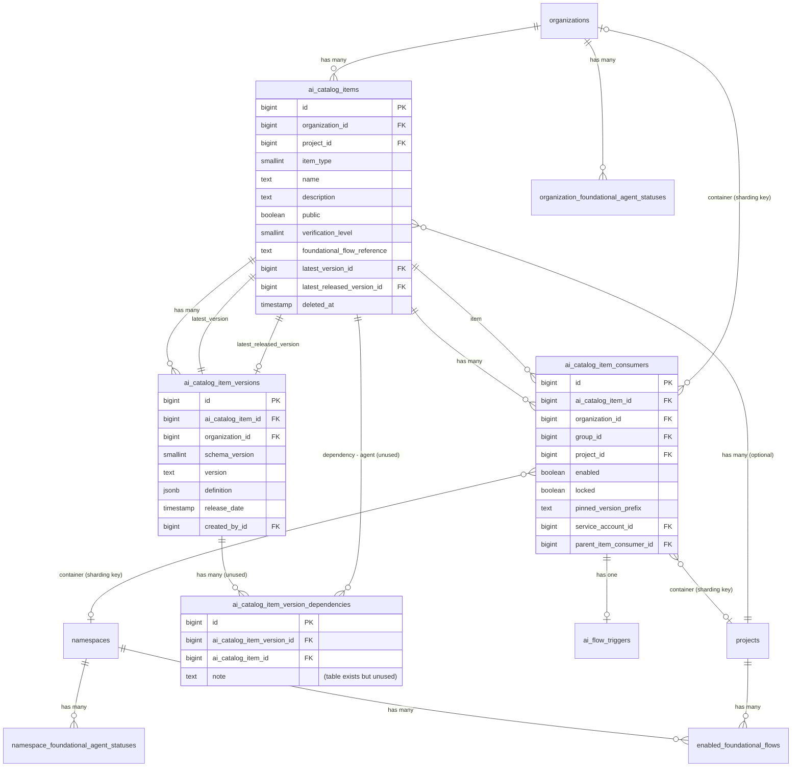
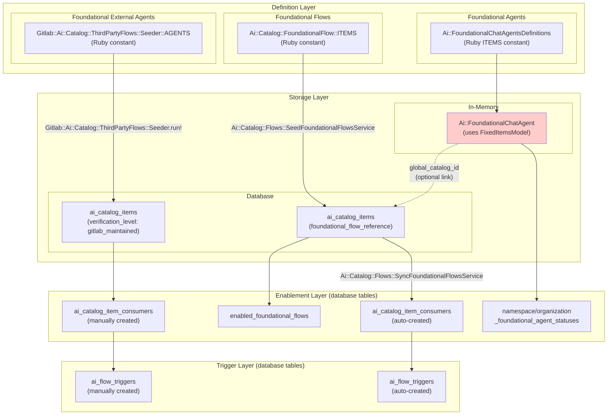
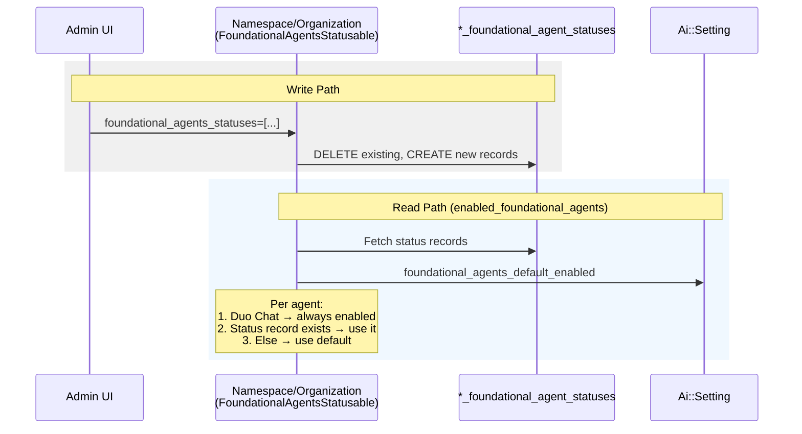
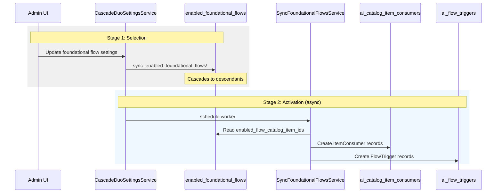
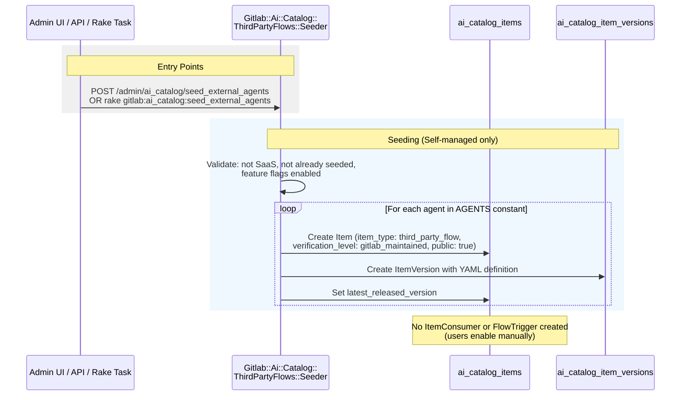
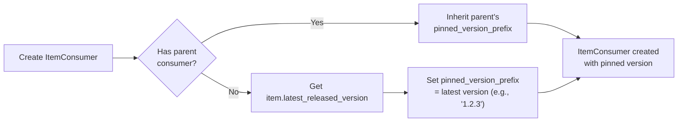
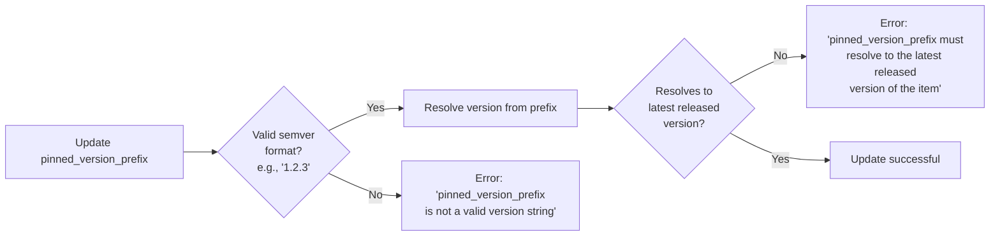
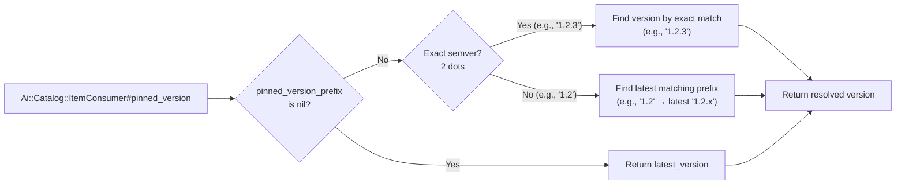
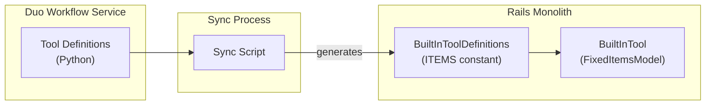
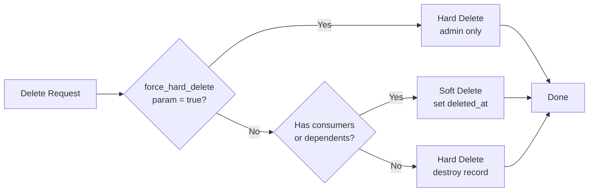

---

title: AI Catalog バックエンドアーキテクチャ
status: implemented
creation-date: "2026-02-12"
authors: [ "@.luke"]
coaches: []
dris: []
owning-stage: "~devops::ai_powered"
participating-stages: []
toc_hide: true
upstream_path: /handbook/engineering/architecture/design-documents/ai_catalog/
upstream_sha: b4eeb07f0d5f46e2fc5f8572be1a2547261aed89
translated_at: "2026-04-26T03:00:00Z"
translator: claude
stale: false
---


<div class="my-3 border-l-4 border-blue-500 bg-blue-50 px-4 py-3 rounded-r text-sm text-blue-800">
このページには今後予定されている製品・機能・機能性に関する情報が含まれています。ここに示す情報は参考目的のみです。購入・計画の決定にこの情報を使用しないでください。製品・機能・機能性の開発、リリース、タイミングは変更または延期される可能性があり、GitLab Inc. の独自の判断に委ねられています。
</div>

<div class="overflow-x-auto my-4">
<table class="w-full text-sm border-collapse">
<thead>
<tr class="bg-gray-100 text-left">
<th class="px-3 py-2 border border-gray-300">Status</th>
<th class="px-3 py-2 border border-gray-300">Authors</th>
<th class="px-3 py-2 border border-gray-300">Coach</th>
<th class="px-3 py-2 border border-gray-300">DRIs</th>
<th class="px-3 py-2 border border-gray-300">Owning Stage</th>
<th class="px-3 py-2 border border-gray-300">Created</th>
</tr>
</thead>
<tbody>
<tr>
<td class="px-3 py-2 border border-gray-300"><span class="inline-block rounded px-2 py-0.5 text-xs font-medium bg-gray-100 text-gray-700">implemented</span></td>
<td class="px-3 py-2 border border-gray-300"><a href="https://gitlab.com/.luke" class="text-blue-600 hover:underline">@.luke</a></td>
<td class="px-3 py-2 border border-gray-300"></td>
<td class="px-3 py-2 border border-gray-300"></td>
<td class="px-3 py-2 border border-gray-300"><span class="inline-block rounded px-2 py-0.5 text-xs font-medium bg-gray-100 text-gray-700">~devops::ai_powered</span></td>
<td class="px-3 py-2 border border-gray-300">2026-02-12</td>
</tr>
</tbody>
</table>
</div>


## Summary

このドキュメントでは、GitLab Rails モノリス内の AI Catalog バックエンドの現在のアーキテクチャを記録します。データモデル、基盤的（foundational）アイテムとカスタムアイテムの異なる実装パターンを記録し、システムが進化する過程で生じたアーキテクチャの不整合を特定します。

このドキュメンテーションにより、以下が可能になります:

- アーキテクチャレビュー
- パターン統一のための改善ロードマップの作成
- カタログに取り組むエンジニアのオンボーディングの改善

## 問題の声明

ワークフローカタログのバックエンドアーキテクチャは、以下をサポートするため段階的に進化してきました（[用語集](https://docs.gitlab.com/development/ai_features/glossary/#agent-types) 参照）:

- カスタムエージェント
- カスタムフロー
- カスタム外部エージェント（third-party フロー）
- 基盤エージェント
- 基盤フロー
- 基盤外部エージェント
- MCP サーバー（近日中）

この進化は統一されたアーキテクチャパターンなしで行われ、類似の概念に対して異なる実装アプローチが生まれました。このドキュメントは現在の状況を捉えることを目指します。

## コアデータモデル

### データベーステーブル

| テーブル | 目的 |
| ----- | ------- |
| `ai_catalog_items` | コアカタログアイテム（エージェント、フロー、外部エージェント） |
| `ai_catalog_item_versions` | アイテムのバージョン付き定義（定義は jsonb の `definition` カラムに格納） |
| `ai_catalog_item_consumers` | アイテムを使用するグループ / プロジェクトへリンク |
| `ai_catalog_item_version_dependencies` | フローバージョンが依存するエージェントを追跡（未使用） |
| `enabled_foundational_flows` | 名前空間 / プロジェクトごとに選択された基盤フローを追跡 |
| `namespace_foundational_agent_statuses` | 基盤エージェントのエージェントごとの有効化オーバーライド（名前空間レベル） |
| `organization_foundational_agent_statuses` | 基盤エージェントのエージェントごとの有効化オーバーライド（組織レベル） |
| `ai_flow_triggers` | フローと外部エージェント向けのイベントベーストリガー（assign、mention、pipeline hook） |

### インメモリモデル（`FixedItemsModel`）

これらは `FixedItemsModel` パターンを使用する Ruby クラスで、**データベースには格納されません**:

| モデル | 目的 | 定義場所 |
| ----- | ------- | ------------------- |
| `Ai::Catalog::FoundationalFlow` | GitLab 提供のフロー（Code Review、Developer など） | `ee/app/models/ai/catalog/foundational_flow.rb` |
| `Ai::Catalog::BuiltInTool` | エージェントが利用可能な事前定義ツール | `ee/lib/ai/catalog/built_in_tool_definitions.rb` |
| `Ai::FoundationalChatAgent` | GitLab 提供のチャットエージェント（Duo Chat など） | `ee/lib/ai/foundational_chat_agents_definitions.rb` |

### エンティティ関連図



### アイテムタイプ

`ai_catalog_items.item_type` enum は 3 つのタイプを定義します:

| 値 | タイプ | 説明 |
| ----- | ---- | ----------- |
| 1 | `:agent` | システム / ユーザープロンプトとツール選択を持つカスタムエージェント。ユーザープロンプトは未使用。 |
| 2 | `:flow` | エージェントから構成される多段階ワークフロー（エージェントはフロー内にインラインで定義される） |
| 3 | `:third_party_flow` | CI/CD を通じて実行される外部エージェント（Docker イメージ + コマンド） |

### 定義スキーマ

アイテム定義は `ai_catalog_item_versions.definition` に JSONB として格納され、JSON スキーマに対して検証されます:

| スキーマ | アイテムタイプ | 主要フィールド |
| ------ | --------- | ---------- |
| `agent_v1.json` | エージェント | `system_prompt`、`user_prompt`（未使用）、`tools`（BuiltInTool ID の配列） |
| `flow_v1.json` | フロー（レガシー） | `agent_id` 参照を持つ `steps` |
| `flow_v2.json` | フロー（現行） | `components`、`routers`、`flow`、`prompts`、`yaml_definition` |
| `third_party_flow_v1.json` | 外部エージェント | `image`、`commands`、`variables`、`yaml_definition` |

---

## 基盤アイテム vs カスタムアイテム

### 概要

カタログは、ユーザー作成（カスタム）アイテムと GitLab 保守（基盤）アイテムの両方をサポートします。ただし、実装パターンは基盤エージェント、フロー、外部エージェント間で大きく異なります。

### 比較表

| 観点 | 基盤エージェント | 基盤フロー | 基盤外部エージェント |
| ------ | ------------------- | ----------------- | ---------------------------- |
| **定義場所** | `Ai::FoundationalChatAgentsDefinitions::ITEMS` | `Ai::Catalog::FoundationalFlow::ITEMS` | `Gitlab::Ai::Catalog::ThirdPartyFlows::Seeder::AGENTS` |
| **格納パターン** | `Ai::FoundationalChatAgent`（インメモリ、`FixedItemsModel` 使用） | `ai_catalog_items` テーブル（`foundational_flow_reference`） | `ai_catalog_items` テーブル（`verification_level: gitlab_maintained`） |
| **シーディングメカニズム** | なし（純粋なフィクスチャ） | `Ai::Catalog::Flows::SeedFoundationalFlowsService` | `Gitlab::Ai::Catalog::ThirdPartyFlows::Seeder.run!` |
| **Consumer レコード** | **なし** | `Ai::Catalog::Flows::SyncFoundationalFlowsService` により自動作成 | 手動作成 |
| **有効化追跡** | `namespace_foundational_agent_statuses` / `organization_foundational_agent_statuses` テーブル | `enabled_foundational_flows` + `ai_catalog_item_consumers` | `ai_catalog_item_consumers` のみ |
| **トリガーサポート** | N/A（チャットベース） | `ai_flow_triggers`（自動作成） | `ai_flow_triggers`（手動作成） |

注: 基盤エージェントは [オプションで `ai_catalog_items` テーブルに表現可能](https://docs.gitlab.com/development/ai_features/foundational_chat_agents/#using-the-ai-catalog) であり、カタログで可視となり複製も可能です。ただし機能的には、基盤エージェントのデータソースは常に `Ai::FoundationalChatAgent` です。

### アーキテクチャ図



## 有効化メカニズム

### 基盤エージェント

基盤エージェントは、標準の `ItemConsumer` パターンとは別の専用ステータステーブルシステムを使用します。

**テーブル:**

- `namespace_foundational_agent_statuses`
- `organization_foundational_agent_statuses`

**スキーマ:**

```plaintext
├── namespace_id / organization_id (FK)
├── reference (string) - 例: "duo_planner", "security_analyst_agent"
├── enabled (boolean)
└── timestamps
```

**ロジック**（`Ai::FoundationalAgentsStatusable` concern 内）:

1. Duo Chat（`reference: 'chat'`）は **常に有効**（ハードコードされた例外）
2. 明示的なステータスレコードが存在する場合 -> その `enabled` 値を使用
3. それ以外 -> `foundational_agents_default_enabled` 設定にフォールバック

**主な特徴:**

- `ItemConsumer` レコードを作成しない

#### フロー図



### 基盤フロー

基盤フローは 2 つのテーブルアプローチを使用します:

#### Stage 1: 選択（`enabled_foundational_flows`）

どのフローを有効化するかという管理者の **選択** を記録します。

**スキーマ:**

```plaintext
├── namespace_id OR project_id (どちらか 1 つ)
├── catalog_item_id (ai_catalog_items への FK)
└── timestamps
```

**書き込み元:** `CascadeDuoSettingsService` による `sync_enabled_foundational_flows!`

**カスケード:** 階層を下に伝播（グループ -> サブグループ -> プロジェクト）

#### Stage 2: アクティベーション（`ai_catalog_item_consumers`）

実行のための **運用上の構成** を記録します。

**書き込み元:** `SyncFoundationalFlowsService`（worker を通じて非同期）

**含まれるもの:** サービスアカウントセットアップ、トリガー作成、バージョンピン留め

**主な特徴:**

- グループ階層内のすべてのプロジェクトに対して `ItemConsumer` レコードを自動作成
- [プロジェクト作成](https://gitlab.com/gitlab-org/gitlab/-/blob/5c2913e148da0d7054d03949e21ac5b9bc796bc6/ee/app/services/ee/projects/create_service.rb#L229) 後と、有効な基盤フローオプションへの変更後のフックを通じて `ItemConsumer` レコードを同期し続ける必要がある

#### フロー図



### 基盤外部エージェント

標準の `ItemConsumer` パターンを直接使用します。

基盤外部エージェントは **一回限りのシーディング** アプローチを使用します。

**定義場所:** `Gitlab::Ai::Catalog::ThirdPartyFlows::Seeder::AGENTS` 定数

**書き込み元:** `Gitlab::Ai::Catalog::ThirdPartyFlows::Seeder.run!`

**トリガー:** Admin API（`POST /admin/ai_catalog/seed_external_agents`）、Rake タスク、または Admin UI

**主な特徴:**

- `ItemConsumer` レコードを自動作成しない、手動有効化が必要

#### フロー図



## バージョンピン留め

### 概要

バージョンピン留めにより、消費者は常に最新を使用するのではなく、カタログアイテムの特定のバージョンにロックできます。

### 主な特徴

1. ピン留めは semver 形式に従う - `MAJOR.MINOR.PATCH`（例: 1.2.3）
1. ピン留めルールは保守的 - コードはプレフィックスマッチングを使った `"1"` または `"1.2"` ピンの解決と、最新リリース版に解決する `nil` をサポートしているが、現在の作成・更新の検証は厳密な semver 形式へのピン留めを要求している
1. ピンからバージョンを解決するコードは `Ai::Catalog::ItemConsumer#pinned_version` と `Ai::Catalog::Item#resolve_version` にある

### 格納

カラム: `ai_catalog_item_consumers.pinned_version_prefix`。

### 作成

作成は `aiCatalogItemConsumerCreate` GraphQL ミューテーションと `Ai::Catalog::ItemConsumers::CreateService` サービスクラスを通じて行われます。



### 更新

更新は `aiCatalogItemConsumerUpdate` GraphQL ミューテーションと `Ai::Catalog::ItemConsumers::UpdateService` サービスクラスを通じて行われます。



### ピンからアイテムバージョンを解決する

この図は、バージョンピン留めがどのバージョンを使用するかをどう解決するかを示しています。

解決ロジックは 3 つのモードすべてをサポートしますが、現在の作成・更新検証ルールは厳密な semver 形式のみを許可することに注意してください。nil とプレフィックスマッチングのパスは通常の `ItemConsumer` フローでは到達できません。



---

## ビルトインツール

### 概要

ビルトインツールは、カスタムエージェントに割り当てられる事前定義された能力です。Duo Workflow Service が実行できるアクションを表します。

### 真実の情報源

Duo Workflow Service、Rails に同期されます。

### 格納

`FixedItemsModel` パターン（データベースには無い）。`Ai::Catalog::BuiltInToolDefinitions::ITEMS` 内のフィクスチャとして定義されます。

```ruby
{
  id: 1,                      # Stable ID (referenced in agent definitions)
  name: "gitlab_blob_search", # Machine-readable name
  title: "Gitlab Blob Search", # Human-readable title
  description: "..."          # Description for UI
}
```

### ツールデータの同期

スクリプトが Duo Workflow Service の定義から `ee/lib/ai/catalog/built_in_tool_definitions.rb` を生成します。

**同期フロー**



### 制限

- データソースは同期を通じて手動で更新する必要がある。
- 現在、ツールを削除するプロセスはありません（issue: [!584050](https://gitlab.com/gitlab-org/gitlab/-/work_items/584050)）。

### エージェントとの関連付け

ツールはエージェント定義（jsonb の `ai_catalog_items.definition`）を通じてエージェントに関連付けられます。

エージェント定義は、`Ai::Catalog::BuiltInToolDefinitions::ITEMS` で定義されたツール ID を保存します。

```json
{
  "tools": [1, 3, 10, 39],
  "system_prompt": "...",
  "user_prompt": "..."
}
```

### Duo Workflow Service へのマッピング

ツールは Duo Workflow Service に渡される時、Duo Workflow Service の名前にマッピングし直されます。

## Flow トリガー

Flow トリガーにより、GitLab イベントに基づいてカタログフローの自動実行が可能になります。

### モデル: `Ai::FlowTrigger`

`ai_flow_triggers` テーブルに格納されます。プロジェクトを以下のいずれかにリンクします:

- カタログアイテム消費者（`ai_catalog_item_consumer_id`）、または
- 設定ファイルパス（`config_path`）

**イベントタイプ:**

| 値 | タイプ | 説明 |
| ----- | ---- | ----------- |
| 0 | `mention` | ユーザーがサービスアカウントをメンション |
| 1 | `assign` | Issue/MR がサービスアカウントにアサインされる |
| 2 | `assign_reviewer` | サービスアカウントがレビュアーとして追加される |
| 3 | `pipeline_hooks` | パイプラインイベント |

**主な検証:**

- `config_path` または `ai_catalog_item_consumer` のうち厳密に 1 つを持つ必要がある
- ユーザーはサービスアカウントである必要がある
- 消費者にリンクされている場合、消費者のアイテムはフローまたは third-party フローである必要がある
- 消費者のプロジェクトはトリガーのプロジェクトと一致する必要がある

### 実行: `Ai::FlowTriggers::RunService`

アイテムタイプに基づいて実行をルーティング:

| アイテムタイプ | 実行パス |
| --------- | -------------- |
| `flow`（基盤 / カスタム） | `Ai::Catalog::Flows::ExecuteService` → Duo Workflow Service |
| `third_party_flow` | `Ci::Workloads::RunWorkloadService` → Docker イメージで CI パイプライン |

カタログフローの場合、サービスは:

1. 消費者からピン留めバージョンを解決
2. 入力とリソースコンテキストからユーザープロンプトを構築
3. `Flows::ExecuteService` に委譲

外部エージェント（third-party フロー）の場合、サービスは:

1. アイテムバージョンからフロー定義を取得
2. `Ai::DuoWorkflows::Workflow` レコードを作成
3. 定義のイメージ / コマンドで CI ワークロードを実行
4. `AI_FLOW_*` 環境変数を通じてコンテキストを渡す

## 実行と統合ポイント

### 実行コンテキスト

実行はアイテムタイプによって異なります。エージェントはインタラクティブで、チャットインターフェースを通じてユーザーによって起動されます。フローと外部エージェントはイベント駆動で、設定された GitLab イベントが発生した時に自動的にトリガーされます。一部の基盤フローは GitLab Web UI から直接起動することもできます。

| アイテムタイプ | 起動元 | 実行場所 |
| --------- | ------------- | ----------- |
| エージェント | Web UI（Agentic Chat）、IDE、Duo CLI | Duo Workflow Service |
| フロー | Flow Triggers、Web UI（基盤フローのみ） | Duo Workflow Service |
| 外部エージェント | Flow Triggers | CI パイプライン（Docker ワークロード） |

### Duo Workflow Service とのエージェントおよびフローの統合

Duo Workflow Service は、エージェントとフローの実行エンジンです。LangGraph 上に構築された Python ベースのサービスで、gRPC API を持ちます。

**Rails からの統合パス:**

1. **Web UI（Agentic Chat）**: [Workhorse 経由の](../duo_workflow/_index.md#from-the-gitlab-web-ui-without-a-separate-executor) WebSocket 接続が gRPC を使って Duo Workflow Service にプロキシされます。`aiCatalogAgentFlowConfig` GraphQL クエリがフロー設定を提供します。

2. **IDE**: [GitLab Language Server](https://gitlab.com/gitlab-org/editor-extensions/gitlab-lsp) には Duo Agent Platform クライアント（別名 executor）が含まれており、Workhorse プロキシを通じて Duo Workflow Service に接続し、ワークフローアクションをローカルで実行します。

3. **Flow Triggers**: `Ai::FlowTriggers::RunService` が `Ai::Catalog::Flows::ExecuteService` に委譲し、それが `Ai::DuoWorkflows::StartWorkflowService` を使って CI パイプラインを通じて実行をオーケストレーションします。

詳細なアーキテクチャ図については、[Duo Workflow Architecture ドキュメンテーション](../duo_workflow/_index.md#gitlabcom-architecture) を参照してください。

### 外部エージェントの実行

外部エージェント（third-party フロー）は Duo Workflow Service を **使用しません**。CI ワークロードとして直接実行されます:

1. `Ai::FlowTriggers::RunService` がトリガーイベントを受信
2. フロー定義（Docker イメージ、コマンド）が `ItemVersion#definition` から読み取られる
3. `Ci::Workloads::RunWorkloadService` が CI ジョブを作成
4. コンテキストが `AI_FLOW_*` 環境変数で渡される

## エージェントアイデンティティ

フローと外部エージェントが [Flow Triggers](#flow-) を通じてランナー上で実行される時、エージェントの権限は [複合アイデンティティ](https://docs.gitlab.com/user/duo_agent_platform/composite_identity/) を通じて付与されます。

複合アイデンティティ（Composite Identity）は、サービスアカウント（アクションを実行するマシンユーザー）と人間のユーザー（リクエストを開始した人）を 1 つの OAuth トークンに結合する認証メカニズムです。これにより、アクションがサービスアカウントに帰属させられつつ、権限昇格を防ぎます - トークンはサービスアカウントと人間のユーザーの両方がアクセスできるリソースへのアクセスのみを付与します。

フローと外部エージェントに使用されるサービスアカウントは、`Ai::Catalog::ItemConsumer#service_account` のユーザーレコードです（関連する [flow trigger](#flow-) レコード `Ai::FlowTrigger#user` 内で複製されます）。

さらなる読み物:

- [複合アイデンティティ開発者ドキュメンテーション](https://docs.gitlab.com/development/ai_features/composite_identity/)
- [複合アイデンティティ顧客ドキュメンテーション](https://docs.gitlab.com/user/duo_agent_platform/composite_identity/)

## サービスアカウント管理

サービスアカウントは、フローまたは外部エージェントが **グループレベル** で有効化された時に自動的に作成されます。これらは [複合アイデンティティ](#) 認証のためのマシンアイデンティティを提供します。

### 作成

`Ai::Catalog::ItemConsumers::CreateService` がフローまたは外部エージェントのグループレベル消費者を作成すると:

1. **ユーザー名生成**: `"{prefix}-{item_name}-{group_name}".parameterize`
   - 基盤フロー: prefix は `duo`（例: `duo-code-review-my-group`）
   - カスタムフロー / 外部エージェント: prefix は `ai`（例: `ai-my-flow-my-group`）

2. **名前生成**: アイテム名。基盤フローの場合は "Duo " のプレフィックス付き

3. **`Namespaces::ServiceAccounts::CreateService` を通じたサービスアカウント作成**:
   - `namespace_id`: グループ ID
   - `composite_identity_enforced: true`（複合アイデンティティに必要）
   - `organization_id`: グループから継承

4. **再利用ロジック**: 同じユーザー名のサービスアカウントが存在し、まだ `ItemConsumer` にリンクされていない場合は、新規作成ではなく再利用される。

### 階層

- **グループレベル消費者**（`group_id` を持つ `ItemConsumer`）: サービスアカウントを所有（`service_account_id` カラム）
- **プロジェクトレベル消費者**（`project_id` を持つ `ItemConsumer`）: `parent_item_consumer_id` を通じて親グループ消費者を参照し、そのサービスアカウントを継承

プロジェクトレベル消費者が作成される時:

- 親のサービスアカウントが **Developer** ロールでプロジェクトに追加される
- `FlowTrigger` レコードもサービスアカウントを `user` カラムに保存する

### クリーンアップ

`ItemConsumer` が破棄される時:

- プロジェクト消費者: サービスアカウントがプロジェクトメンバーシップから削除される
- グループ消費者: サービスアカウントがグループ階層内のすべてのプロジェクトから削除される

## ソフト削除

アイテムは消費者が存在する場合にソフト削除をサポートします。これにより、アイテムが公開されている時に消費者の有効化を保持します。

### ソフト削除の動作

ソフト削除されたアイテム:

- デフォルトで finder の結果から除外される
- `showSoftDeleted: true` で直接クエリ可能
- 消費者とバージョンレコードを保持
- 組織管理者以外は管理できない（`ItemPolicy` により防止）

### モデルサポート

**スコープ:** `not_deleted` は `deleted_at` が null のアイテムにフィルタする。

### 削除ロジック

すべてのアイテムタイプを破棄する時に使用される基底サービスクラスである `Ai::Catalog::Items::BaseDestroyService` は、ソフト削除とハード削除の間で選択します:



### 認可

- `delete_ai_catalog_item`: 任意の削除に必須（maintainer+ が必須）
- `force_hard_delete_ai_catalog_item`: 強制ハード削除に必須（admin が必須）

### GraphQL 公開

- アイテムは `soft_deleted` フィールド（`deleted?` メソッドにマップ）を持つ
- `aiCatalogItem` クエリは `showSoftDeleted` 引数を受け付ける（デフォルトは `false`）
- `Ai::Catalog::ItemsFinder` はデフォルトで `not_deleted` スコープを使用する

## GraphQL API

AI Catalog バックエンドのデータは GitLab の GraphQL API を通じて公開されます。

| タイプ | ディレクトリ |
| ---- | --------- |
| Queries | `ee/app/graphql/resolvers/ai/catalog/` |
| Mutations | `ee/app/graphql/mutations/ai/catalog/` |
| Types | `ee/app/graphql/types/ai/catalog/` |

## 認可

### 認可が行われる場所

認可は **3 つの層** で強制されます:

| 層 | 場所 | メカニズム |
| ----- | -------- | --------- |
| **GraphQL** | Mutations | `authorize :permission` + `authorized_find!` |
| **GraphQL** | Resolvers（finder 経由） | 通常 finder を通じて `Ability.allowed?` チェック |
| **Services** | すべてのサービス | `authorized?` メソッド内で `Ability.allowed?` |
| **Model** | `Item` スコープ | `public_or_visible_to_user` スコープがプロジェクトメンバーシップでフィルタ |

### Policy クラス

- `Ai::Catalog::ItemPolicy` カタログアイテム自体へのアクセスを制御。
- `Ai::Catalog::ItemVersionPolicy` — 未使用のバージョン実行権限を含む（代わりに `ItemConsumerPolicy` の類似権限が使用される）。基底権限は `ItemPolicy` に委譲。
- `Ai::Catalog::ItemConsumerPolicy` — アイテム消費者の実行を制御。プロジェクトアイテム消費者には `ProjectPolicy`、グループアイテム消費者には `GroupPolicy` の両方に委譲。
- `ProjectPolicy` と `GroupPolicy` - アイテムと消費者作成のためのコンテナレベル権限。

## 特定された不整合

### 1. ストレージモデルの不一致

基盤エージェントは `FixedItemsModel`（インメモリのみ）を使うが、基盤フローと外部エージェントはデータベースレコードを使う。

### 2. 有効化の断片化

3 つの異なる有効化メカニズム:

- **基盤エージェント:** 専用ステータステーブル（`*_foundational_agent_statuses`）
- **基盤フロー:** 2 段階プロセス（`enabled_foundational_flows` -> `ItemConsumer`）
- **その他すべて:** 直接 `ItemConsumer` レコード

### 3. Consumer レコードの不整合

基盤エージェントは `ItemConsumer` レコードを作成しないが、基盤フローはそれらを自動作成する。

### 4. カタログアイテムリンケージのばらつき

- **エージェント:** `Ai::FoundationalChatAgent#global_catalog_id` フィールド
- **フロー:** `Ai::Catalog::Item#foundational_flow_reference` カラム
- **外部エージェント:** `verification_level: :gitlab_maintained` を持つ標準アイテム

### 5. シーディングメカニズムの違い

- **エージェント:** シーディングなし（純粋なフィクスチャ）
- **フロー:** サービスベースのシーディング
- **外部エージェント:** Admin UI ボタン
