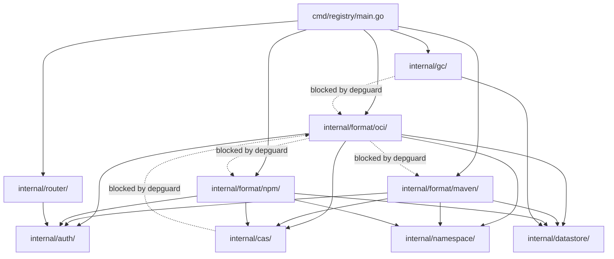

<!-- Design Documents often contain forward-looking statements -->
<!-- vale gitlab.FutureTense = NO -->

## ステータス

**提案中。**

## コンテキスト

Artifact Registry は、20 人以上のエンジニアによって開発される 15 以上のパッケージフォーマット（OCI、Maven、npm、PyPI、NuGet など）をサポートします。AI エージェントがフォーマット実装を書き、エンジニアは仕様を書き、アーキテクチャを操舵し、出力をレビューします。コードベースは、フォーマット数に応じてスケールする構造を必要とします。新しい貢献者を素早くオンボードでき、エンジニアがインシデント中にツールの支援なしに関連コードに移動できる必要があります。アーキテクチャ境界は、コードレビューだけでなく機械的に強制される必要があります。

いくつかの先行 ADR が設計空間を制約しています:

- [ADR-006](006_technology_stack.md) は実装言語として Go を確立し、技術スタックを定義しています。
- ADR-007 はフォーマット固有のテーブルを持つデータベーススキーマを定義します。
- [ADR-008](008_content_addressable_storage.md) はネームスペーススコープの重複排除を伴う SHA256 ベースのコンテンツアドレッサブルストレージを規定します。
- [ADR-009](009_api_design.md) は管理 API（REST/GraphQL）とフォーマット固有のクライアント API の両方を規定します。
- [ADR-022](022_namespace_decoupling.md) はレジストリを Rails 識別子から切り離す内部 namespaces エンティティを導入します。

フォーマット拡張メカニズム（Service Provider Interface と Capability Interfaces を持つ Module Pattern）は、拡張作業からの固定されたアーキテクチャ入力です。本 ADR はこれを再評価しません。プロジェクトディレクトリレイアウトとそれを強制するツーリングを扱います。

確立された 3 つのアーキテクチャパターンを、デモプロジェクトを通じて評価しました。それぞれ 5 つのパッケージフォーマット（OCI、Maven、npm、Debian、Generic）と 1 つの横断機能（アップロードプロベナンス）およびフォーマット削除エクササイズを実装しています。評価では、オープンな設計空間を探求するのではなく、既知のパターンを文書化された失敗モードと比較しました。AI 生成のハイブリッドレイアウトはより良い局所最適を見つける可能性がありますが、確立されたパターンが持つ本番経験とコミュニティ知識の集合体に欠けます。

- [ar-guardrails-clean-arch](https://gitlab.com/gitlab-org/ci-cd/package-stage/ar-guardrails-clean-arch):
  Clean Architecture (レイヤファースト)
- [ar-guardrails-ddd-hex](https://gitlab.com/gitlab-org/ci-cd/package-stage/ar-guardrails-ddd-hex):
  DDD + Hexagonal Architecture (境界づけられたコンテキストファースト)
- [ar-guardrails-go-native](https://gitlab.com/gitlab-org/ci-cd/package-stage/ar-guardrails-go-native):
  Go Native (`cmd/` + `internal/` でパッケージごとの機能編成)

各デモは、クライアント向け API（OCI distribution、Maven レイアウト、npm レジストリ、Debian リポジトリ、Generic blob）と管理 API（リポジトリ、パッケージ、バージョンの CRUD）の両方を実装しました。デモは部分的な実装を生成しました（完全なエラーハンドリング、メトリクス計装、構造化ログなし）。既存の [Container Registry](https://gitlab.com/gitlab-org/container-registry) コードベースは、ファイルサイズを推定するための本番リファレンスポイントです。

## 決定

`cmd/` + `internal/` プロジェクトレイアウトをパッケージごとの機能編成で使用します。これらの規約は本番 Go プロジェクト（[Container Registry](https://gitlab.com/gitlab-org/container-registry) を含む）で広く採用されており、Go 自身のツールチェーンに根ざしています: `internal/` は [コンパイラで強制される可視性](https://go.dev/doc/go1.4#internalpackages) を持ち、`cmd/` は慣例的なエントリーポイントディレクトリです。

この構造は、`cmd/` の下に単一のエントリーポイントを配置し、すべてのアプリケーションコードを `internal/` の下に配置します。各パッケージフォーマットは `internal/format/` の下に独自のパッケージとして存在します。横断的なインフラ（ストレージ、認証、ネームスペース解決、ガベージコレクション、データアクセス）は `internal/` 直下の共有パッケージに存在します。

本 ADR は 2 つのことをロックインします: 強制メカニズム（後述）と、それらが参照するパッケージパスです。ロックされたパス: `cmd/`、`internal/`、`internal/format/<name>/`、および depguard の `no-reverse-dependency` ルール（`internal/cas/`、`internal/auth/`、`internal/datastore/`、`internal/gc/`）に名前付けされた共有パッケージ。ロックされたパスのリネームには depguard 設定の対応する更新が必要です。フォーマットごとのファイルレイアウト（フォーマットパッケージ内にどのファイルが存在し、どう名前付けされるか）はデモ実装に基づく出発点です。最初のフォーマット実装と完全なテストスイートが、フォーマットごとの正規構造を確立します。テストの圧力がファイルレイアウトを再形成する場合、それは予期されたものであり、本 ADR の改訂は不要です。

2 つのメカニズムがアーキテクチャ境界を強制します（詳細は [強制ツーリング](#enforcement-tooling) を参照）:

1. **Go の `internal/` パッケージ可視性:** コンパイラで強制、設定なし。
2. **[depguard](https://github.com/OpenPeeDeeP/depguard):** クロスフォーマット分離、生 SQL ブロッキング、逆依存防止をカバーする YAML 約 45 行。

### ディレクトリレイアウト

以下のツリーはデモ実装から取った初期レイアウトであり、義務ではありません。上記の決定によりロックされたパス: `cmd/`、`internal/`、`internal/format/<name>/`、および depguard 設定で名前付けされた共有パッケージ（`internal/cas/`、`internal/auth/`、`internal/datastore/`、`internal/gc/`）。フォーマットパッケージ内のすべて、共有パッケージ内のファイル編成、他の共有パッケージの命名は出発点です。エンジニアと AI エージェントは、最初のフォーマット実装（完全なテストスイート付き）がより良い適合を明らかにしたとき、または規定されたレイアウトが進行中の作業で摩擦を生むときにレイアウトの変更を提案すべきです。フォーマットごとのレイアウトの改訂は本 ADR の改訂を必要としません。

ツリーは 5 つのフォーマットでのレイアウトを示しています。各フォーマットはフォーマットの複雑さに応じて 2-6 ファイルを追加します（datastore 実装を含む）。Generic のような単純なフォーマットは 2 ファイル程度しか必要としません。OCI のような複雑なフォーマットは 6 ファイル必要です。共有インフラパッケージはフォーマット数に応じて成長しません。

```text
artifact-registry/
  cmd/
    registry/
      main.go                     # エントリーポイント、依存性配線（15 フォーマットで約 135 行）
  internal/
    cas/
      cas.go                      # CAS インターフェースと BlobInfo 型
      client.go                   # SHA256 2 段階アップロードクライアント
    auth/
      auth.go                     # 認証インターフェース: ValidateToken、CheckScope
      middleware.go               # HTTP 認証ミドルウェア
      jwt.go                      # Rails との JWT トークン交換
    namespace/
      namespace.go                # ネームスペースリゾルバインターフェース
      resolver.go                 # スラッグからネームスペース ID への解決
    format/
      format.go                   # FormatHandler インターフェース、FormatID enum
      oci/
        handler.go                # OCI /v2/ クライアント API ハンドラ
        delete.go                 # OCI マニフェストと blob 削除
        discovery.go               # タグリスト、カタログエンドポイント
        metadata.go               # OCI マニフェストとレイヤ型
        store.go                  # OCI アーティファクトストレージ（CAS インターフェースを呼ぶ）
        version.go                # タグ解決
      maven/
        handler.go                # Maven レイアウト HTTP ハンドラ
        metadata.go               # POM メタデータ型
        store.go                  # Maven アーティファクトストレージ
        version.go                # Maven バージョン順序
      npm/
        handler.go                # npm レジストリ API ハンドラ
        metadata.go               # package.json 型
        store.go                  # npm アーティファクトストレージ
        version.go                # Semver 処理
      pypi/
        handler.go                # PyPI API ハンドラ
        metadata.go               # 配布メタデータ型
        store.go                  # PyPI アーティファクトストレージ
        version.go                # PEP 440 バージョン解析
      generic/
        handler.go                # Generic blob ハンドラ
        store.go                  # Generic blob ストレージ
    gc/
      gc.go                       # GC オーケストレータ
      collector.go                # FormatCollector インターフェース
      worker.go                   # バックグラウンド GC ワーカー
    retention/
      retention.go                # 保持ポリシーエンジン
      policy.go                   # ポリシー型
    datastore/
      datastore.go                # データベースインターフェース
      postgres.go                 # PostgreSQL 実装
      migrations/                 # スキーマ移行
    repository/
      repository.go               # リポジトリエンティティ（アーティファクトコンテナ）。DB アクセスは datastore/ 経由
    router/
      router.go                   # HTTP ルーター、フォーマットディスパッチ
    middleware/
      ratelimit.go                # レート制限
      logging.go                  # リクエストロギング
      correlation.go              # 相関 ID 伝播
    config/
      config.go                   # 設定読み込み
    testutil/
      testutil.go                 # 共有テストヘルパー
```

### 強制ツーリング

2 つのツールが強制可能なすべてのアーキテクチャ境界をカバーします。

**Go `internal/`（コンパイラで強制）:** Go コンパイラは、許可されたツリー外のコードからの `internal/` パッケージのインポートを拒否します。これは設定なしで 3 つのルールを強制します:

- 外部コードはレジストリの内部パッケージをインポートできません。
- フォーマットパッケージは `internal/` 外のコードからは見えませんが、互いには見えます（クロスフォーマット分離は depguard が処理）。
- パッケージ間の循環依存はコンパイルエラーを引き起こします。

**depguard（CI で強制）:** YAML 約 45 行の 3 つのルールが、`internal/` だけでは扱えないものを処理します。次の抜粋は本質的な deny ルールを示しています（[完全な設定](https://gitlab.com/gitlab-org/ci-cd/package-stage/ar-guardrails-go-native/-/blob/0f6a822/.golangci.yml#L23-71) はテストファイル除外とコメントを含みます）:

```yaml
linters-settings:
  depguard:
    rules:
      format-isolation:
        files:
          - "**/internal/format/**/*.go"
        deny:
          - pkg: "github.com/gitlab-org/artifact-registry/internal/format/"
            desc: "Format packages must not import sibling format packages"
      no-direct-db:
        files:
          - "**/internal/format/**/*.go"
        deny:
          - pkg: "database/sql"
            desc: "Format packages must use the datastore interface"
      no-reverse-dependency:
        files:
          - "**/internal/cas/**/*.go"
          - "**/internal/auth/**/*.go"
          - "**/internal/datastore/**/*.go"
          - "**/internal/gc/**/*.go"
        deny:
          - pkg: "github.com/gitlab-org/artifact-registry/internal/format/"
            desc: "Shared infrastructure must not import format packages"
```

`format-isolation` の deny ルールはプレフィックスマッチング（`strings.HasPrefix`）を使用します。これは、フォーマットパッケージがサブパッケージ（例: `oci/internal/distribution/`）を含むことができないことを意味します。なぜなら、deny プレフィックスはフォーマットが自身のサブパッケージをインポートすることもブロックするからです。規定されたレイアウトはフォーマットコードをすべてフォーマットパッケージ内でフラットに保ちます。後でフォーマットがサブパッケージを保証するほど複雑になった場合、depguard 設定はそのフォーマット用のターゲット allow ルールを必要とします。

次の表は、各強制メカニズムが何をキャッチするかを示します:

| 違反 | 強制 |
|---|---|
| フォーマット A がフォーマット B をインポート | depguard (CI) |
| フォーマットが生 SQL ドライバをインポート | depguard (CI) |
| 共有インフラがフォーマットコードをインポート | depguard (CI) |
| 外部コードが内部パッケージをインポート | `internal/`（コンパイラ） |
| 循環依存 | Go コンパイラ |

却下された候補は、新しいフォーマットごとに更新する必要がある [go-arch-lint](https://github.com/fe3dback/go-arch-lint) の設定 140-160 行以上を必要としました。go-arch-lint はインポートグラフ上で動作し、コールグラフ違反をキャッチできません。これは Clean Architecture デモが暴露しました（管理 API エンドポイントがすべてのフォーマットでユースケースレイヤをバイパスしていました）。

### 依存関係フロー



`cmd/registry/main.go` は、フォーマットパッケージ、共有インフラ、ルーターを配線します。フォーマットパッケージは共有インフラ（CAS、認証、ネームスペース、datastore）をインポートします。共有インフラ（CAS、認証、datastore、GC）はフォーマットパッケージを決してインポートしません（depguard で強制）。GC パッケージは `gc/collector.go` で `FormatCollector` インターフェースを定義します。各フォーマットはこのインターフェースを実装し、`main.go` は起動時にコレクタを `[]FormatCollector` スライスとして GC に注入します。これにより GC はフォーマット非依存に保たれ、フォーマットが追加されるにつれて GC のインポートが線形に増えることを避けます。フォーマット固有のバックグラウンド処理（例: バージョン公開によってトリガーされる npm メタデータの事前計算）は同じ原則に従います: ロジックはフォーマットパッケージに存在します。フォーマットは未実装であるため、バックグラウンドジョブパターンの多様性（イベント起動、定期、ワンショット）は不明です。共有スケジューリングインフラを今設計するのは時期尚早です。その構造はバックグラウンド処理を必要とする最初のフォーマットから現れます。バックグラウンドジョブツーリング自体の選択は、[Artifact Registry バックグラウンドジョブ処理ツーリング評価](https://gitlab.com/gitlab-org/gitlab/-/work_items/594600) で追跡されています。フォーマットパッケージは互いに決してインポートしません（depguard で強制）。Go コンパイラがすべての `internal/` 可視性境界を強制します。

### 比較分析

3 つのデモプロジェクトは、ファイル数、行ボリューム、強制設定、構造的オーバーヘッドにわたって測定可能な違いを生み出しました。以下のすべての数字はデモ実装（5 フォーマットそれぞれ）から得たものです。

#### 5 フォーマットでの測定メトリクス

| メトリクス | Go Native | Clean Arch | DDD + Hex |
|---|---|---|---|
| 総 .go ファイル | 36 | 65 | 約 81 |
| フォーマットごとのファイル（範囲） | 2-6 | 10-13 | 13（固定） |
| コンポジションルート (main.go) | 92 行 | 約 205 行 | 約 120 行 |
| 強制設定 | 約 45 行 (depguard) | 約 140 行 (go-arch-lint) | 約 158 行 (go-arch-lint) |
| 共有インターフェースファイル | 12 | 約 21 | 約 28 |
| 横断的変更（プロベナンス） | 9 ファイル / 7 パッケージ | 10 ファイル / 8 パッケージ | 10 ファイル / 7 パッケージ |
| フォーマット削除（Generic） | 4 ファイル削除、2 共有変更 | 10 ファイル削除、2 共有変更 | 10 ファイル削除、3 共有変更 |
| 並列開発のマージ衝突 | 2 ファイル、約 16 行 | 2 ファイル、機械的 | 2 ファイル、約 49 行 |
| 共有インターフェースの修正 | 5 フォーマット全体で 0 | 5 フォーマット全体で 0 | 5 フォーマット全体で 0 |

ハンドラファイルサイズはアーキテクチャではなくフォーマットの複雑さによって変化しました。基礎となる HTTP ロジックは、プロジェクト構造に関係なく同じです。フォーマットごとの測定デモハンドラサイズ:

| フォーマットの複雑さ | ハンドラ | デモ行数 |
|---|---|---|
| 単純 (Generic) | 10 | 300-350 |
| 中程度 (Debian) | 14 | 480-530 |
| 中程度 (Maven) | 17 | 570-725 |
| 中-高 (npm) | 21-27 | 580-920 |
| 複雑 (OCI) | 26 | 700-800 |

範囲はアーキテクチャ間の変動を反映しています。Go Native レイアウトは、すべてのハンドラロジックを単一ファイルに同居させるため、最大のハンドラファイル（OCI 797 行、npm 916 行）を持ちました。Clean Architecture と DDD はハンドラ隣接ロジック（エラー型、discovery メソッド）の一部を別ファイルに分割し、より小さいハンドラファイルを生み出しましたが、総ファイル数は多くなりました。

#### 単純なフォーマットへの構造的税

最も明らかになるメトリクスは、最も単純なフォーマット（Generic、10 ハンドラの blob アップロード/ダウンロード API）に課されたオーバーヘッドです:

| アーキテクチャ | ファイル | 総行数 | Go Native との比較 |
|---|---|---|---|
| Go Native | 4 | 約 450 | ベースライン |
| Clean Arch | 10 | 628 | +40% 行、+150% ファイル |
| DDD + Hex | 10 | 760 | +69% 行、+150% ファイル |

DDD + Hexagonal は、同じ機能のために Go Native よりも 310 行多くのコードを課しました。そのオーバーヘッドは、フォーマットの複雑さに関係なくアーキテクチャが必要とするドメインエラーセンチネル、ポートインターフェース定義、アプリケーションサービスラッパー、アダプタストアボイラープレートで構成されています。

#### 15 フォーマットでの本番推定

デモは完全なエラーハンドリング、メトリクス計装、構造化ログ、エッジケースカバレッジなしの部分実装を生み出しました。既存の Container Registry コードベースは本番リファレンスを提供します: その `manifests.go` ハンドラは 1,848 行で、デモ OCI ハンドラ 700-800 行と比較して 2.3-2.6 倍の倍率です。`repositories.go` ハンドラは 1,484 行です。完全なハンドラディレクトリは単一フォーマットで 7,956 非テスト行になります。ハンドラディレクトリ単独のテストコードは 18,084 行（テスト対コードの比率 2.3 倍）です。

本番実装で控えめな 2-2.5 倍の倍率を使用し、中程度の複雑さ（Maven/Debian 類）の 15 フォーマットを仮定します:

| メトリクス | Go Native | Clean Arch | DDD + Hex |
|---|---|---|---|
| 総 .go ファイル（フォーマット + 共有） | 約 98 | 約 180 | 約 223 |
| フォーマットごとのハンドラ（本番推定） | 1,200-1,800 行 | 1,200-1,800 行 | 1,200-1,800 行 |
| コンポジションルート | 約 135 行 | 約 505 行 | 約 400-450 行 |
| 強制設定 | 約 45 行 | 約 320 行 | 約 278 行 |
| フォーマットごとの設定コスト | 0 行 | 約 18 行 | 約 12 行 |
| フォーマット追加: 作成ファイル | 2-6 | 10-13 | 13 |
| フォーマット追加: 修正される共有ファイル | 1 (main.go、3-5 行) | 2 (main.go 約 30 行、設定約 18 行) | 2 (main.go 約 14 行、設定約 12 行) |

Clean Architecture のコンポジションルートは、各フォーマットがマルチステップの配線ブロック（ストア作成、ユースケース作成、ハンドラ作成、プロバイダ登録）を必要とするため、フォーマットごとに約 30 行成長します。15 フォーマットでは、コンポジションルートは 500 行を超えてマージ衝突のボトルネックになります: すべてのフォーマット追加とすべての配線変更が同じファイルを変更します。Go Native のコンポジションルートはフォーマットごとに約 4 行（1 つの登録呼び出し）成長し、150 行未満に保たれます。

強制設定の違いはプロジェクトのライフタイムにわたって複合的に増加します。Go Native の depguard 設定は汎用的（`**/internal/format/**/*.go` にマッチ）で、フォーマットが追加されても変わりません。両方の却下された候補は、フォーマットごとに人間が go-arch-lint 設定を更新する必要があります。このステップを忘れたエンジニアは、リンタがチェックしないフォーマットを追加します。20 人以上のエンジニアと 15 フォーマットでは、忘れる人もいるでしょう。

#### コンテキストウィンドウコスト

新しいフォーマットを追加する AI エージェントは、コントラクトを理解し、リファレンス実装を学習し、フォーマットをアプリケーションに配線するために、コードベースを十分に読み込む必要があります。ファイル数と構造的コンテキストのトークン量は、エージェントの正確性とバックトラックの確率に直接影響します。

エージェントが読み込む必要があるファイル（共有インターフェース、コンポジションルート、強制設定、1 つのリファレンスフォーマット）と文字数を数え、文字あたり約 4 文字でトークンに変換することで、入力コンテキストを推定しました:

| メトリクス | Go Native | Clean Arch | DDD + Hex |
|---|---|---|---|
| 読み込むファイル | 9 | 13 | 22 |
| 総行数 | 約 1,095 | 約 1,317 | 約 1,430 |
| 推定入力トークン | 約 8,900 | 約 9,500 | 約 11,700 |
| 作成するファイル | 2-6 | 10-13 | 13 |
| 修正する共有ファイル | 1 | 2 | 2 |

入力トークン数はファイル数が示唆するよりもアーキテクチャ間で近いです。これは基礎となるフォーマットロジック（リファレンスハンドラ）が 3 つすべてでトークン予算を支配するためです。アーキテクチャ固有の構造的オーバーヘッド（インターフェース、設定、コンポジションルート）は、Go Native で約 2,800 トークン、Clean Architecture で約 4,900 トークン、DDD + Hexagonal で約 5,700 トークンを占めます。

作成コストはより鋭く分岐します。フラットなパッケージで 2-6 ファイルを作成することは、レイヤ固有の命名規約を持つ 4 ディレクトリにわたって 10-13 ファイルを作成するよりも単純なタスクです。DDD デモは 3 つのエージェントバックトラック（すべての候補で最も高い）を記録し、より高いファイル数とディレクトリにまたがる作成要件と相関しています。

ゼロ共有インターフェース修正記録は最も強力なシグナルです: 3 つすべてのデモで、フォーマットを追加するエージェントはコントラクトサーフェスを変更する必要がありませんでした。共有インターフェース（ContentStore、RepositoryStore、BlobReferenceStore、BlobReviewQueue、Authenticator、Authorizer、NamespaceResolver、Limits、Metrics、FormatProvider）は、修正なしですべてのフォーマットを吸収しました。

#### ファイルサイズ、ファイル数、コンテキスト圧

ファイルサイズとファイル数は AI エージェントのコンテキストに異なる方法で影響し、3 つのアーキテクチャはそれらの間で異なるトレードオフをします。

Go Native レイアウトは、より少なく、より大きなファイルを生み出します。フォーマットパッケージは 2-6 ファイルを持ち、ハンドラファイルはデモで 800-900 行に達し、本番スケールで 1,200-1,800 行と推定されます。単一フォーマットで作業するエージェントは、より少ないファイルを読み込みますが、各ファイルはより多くのコンテキストウィンドウを消費します。利点は局所性です: フォーマットのすべてのハンドラロジックは 1 つの場所に存在し、エージェントはディレクトリとレイヤをまたいで関係をトレースする必要がありません。

Clean Architecture と DDD は、より多く、より小さなファイルを生み出します。フォーマットは 4 ディレクトリにわたって 10-13 ファイルにまたがり、個々のファイルは平均 60-120 行です。エージェントはより多くのファイルを読み込み、レイヤ関係（どのファイルがどれを呼び、どのレイヤがどの責任を所有するか）をコンテキストに保持する必要があります。ファイルあたりのトークンコストは低いですが、ナビゲーションコストと関係追跡コストはより高くなります。

本番スケールでは、Go Native レイアウトの大きなハンドラファイルは分割が必要になります（後述の「帰結」、「ネガティブ」を参照）。分割後、ファイルあたりサイズはアーキテクチャ間で同等になりますが、Go Native はより少ない総ファイル数とディレクトリ間レイヤナビゲーションのないフラットなパッケージ構造の利点を保持します。OCI のような複雑なフォーマットがハンドラをクライアント API と管理 API ファイルに分割すると、パッケージに 1-2 ファイルが追加されますが、それでも代替案のフォーマットあたり 10-13 ファイルを大きく下回ります。

本番推定はエージェントが学習する必要があるリファレンスフォーマットにも影響します。デモスケールでは、リファレンスハンドラを読むことはアーキテクチャに関係なく約 6,000 トークンです。1,200-1,800 行のハンドラの本番スケールでは、これは約 12,000-18,000 トークンに成長します。構造的オーバーヘッド（約 2,800 から約 5,700 トークン）は、本番ファイルが大きくなるにつれて総コンテキストの小さい割合になり、これはアーキテクチャのエージェントコンテキストコストへの影響がフォーマットの複雑さと比較して縮小することを意味します。アーキテクチャのエージェント作成コスト（作成するファイル数とナビゲートするディレクトリ）への影響は縮小しません。

#### 横断的変更の増幅

デモは 1 つの横断的変更を含みました: すべてのフォーマットのアップロードパスにアップロードプロベナンス追跡を追加することです。以下のファイル数は最終コードベースの遡及分析から来ており、孤立したコミットからではありません。実際の差分は、ここで捕捉されない追加ファイル（テストヘルパー、設定変更）を表面化する可能性があります。

| アーキテクチャ | 共有ファイル変更 | フォーマットごとのファイル変更 | 5 での合計 | 15 での予測 |
|---|---|---|---|---|
| Go Native | 4（インターフェース + 3 ストレージ実装） | フォーマットごとに 1 | 9 | 約 19 |
| Clean Arch | 4 | フォーマットごとに 2（ユースケース + アダプタ） | 14 | 約 34 |
| DDD + Hex | 4 | フォーマットごとに 1 | 9 | 約 19 |

分解された合計は、上記の測定デモ数（Clean Arch 10、DDD + Hex 10）と異なります。なぜなら、プロベナンス変更はすべての Clean Architecture フォーマットでユースケースレイヤの変更を必要とせず、DDD カウントには共有/フォーマットごとの分解外の 1 つのファイルが含まれていたからです。予測はスケーリング係数として完全なフォーマットごとのコストを使用します。

Clean Architecture は、各横断的変更がユースケースレイヤとアダプタレイヤの両方を通じて伝播する必要があるため、フォーマットごとのコストを倍にします。15 フォーマットでは、単一の共有インターフェース変更は他の 2 つのアーキテクチャの 19 ファイルと比較して 34 ファイルの修正を必要とします。

各横断的関心はコードベースを通じてユニークな伝播パターンを持つため、単一のデモ例は完全な範囲を表すことができません。アップロードプロベナンスは CAS インターフェースに触れます。新しいメトリクスの追加はミドルウェアに触れます。認証フローの変更はすべてのハンドラの認証情報抽出に触れます。デモが確立するのはフォーマットごとの定数です: Go Native と DDD はフォーマットごとに 1 ファイル、Clean Architecture はフォーマットごとに 2 ファイル。その定数は、どの横断的関心が変更をトリガーするかに関係なく適用されます。支配的な項は N（フォーマット数）であり、どのアーキテクチャも削減できません。アーキテクチャの選択は定数係数を膨らませることを避けるだけです。Clean Architecture はそれに失敗します。

### スケールでのリスク

Go Native レイアウトの主要な失敗モードは、フォーマットパッケージ間の不一致です。内部構造を規定するアーキテクチャリンタなしでは、各フォーマットパッケージはファイルを異なる方法で編成できます。フォーマット A はすべてのハンドラを 1 ファイルに置く一方、フォーマット B は 3 ファイルに分割するかもしれません。

これはスタイルと DRY の問題であり、正確性の問題ではありません。コンパイラと depguard は依然としてすべてのクロス境界違反を防ぎます。リスクは美的ドリフトであり、アーキテクチャドリフトではありません。

3 つの緩和策がこのリスクを削減します:

- **リファレンス実装:** 1 つのフォーマットパッケージ（最も複雑な OCI）が正規の例です。新しいフォーマットはその構造をコピーします。
- **コントリビューションガイド:** フォーマットパッケージ内の期待されるファイルレイアウト、命名規約、各フォーマットが実装する必要がある共有インターフェースを文書化します。
- **適合性テストスイート:** 機械的なテストは、各フォーマットが必要なインターフェースを実装し、期待されるルートを登録し、動作コントラクトに合格することを検証します。[先行研究](https://gitlab.com/gitlab-org/ci-cd/package-stage/ar-guardrails-go-native) は、適合性テストが動作の一貫性に対してコードレビューよりもよくスケールすることを発見しました。

却下された候補はスケールでより悪い失敗モードを持ちます。Clean Architecture の主要な失敗モードはユースケースレイヤの侵食です: 管理 API エンドポイントは、ロジックを追加しないためユースケースレイヤをバイパスし、go-arch-lint はコールグラフレベルでこれを検出できません。デモはこれをすべてのフォーマットで独立して確認しました。これは人間と AI の作者の両方が同じギャップに当たることを意味します。20 人以上のエンジニアと 15 以上のフォーマットでは、ユースケースレイヤは実ロジックとパススルースタブの混合に劣化します。DDD + Hexagonal の主要な失敗モードは強制されたコード重複です: デモのすべてのフォーマットアダプタは、アーキテクチャがフォーマットアダプタが共有アダプタをインポートすることを防ぐため、`extractCredentials` を再実装しました。15 フォーマットでは、すべての共有アダプタパターンが 15 回重複し、バグ修正はすべてのコピーを見つけて更新する必要があります。

**テストオーバーヘッドギャップ。** 3 つのデモのいずれもテストファイルを含まなかったため、測定データからアーキテクチャ間でテストボイラープレートを比較できません。DDD デモの摩擦ノートはテストごとに 6-9 のモックインターフェースに言及しており、他の 2 つの候補よりも高いテストセットアップコストを示唆しています。Container Registry の本番ハンドラのテスト対コード比率（2.3 倍）は、テストボリュームが実装ボリュームを超えることを示します。テストはデモが行わなかった構造変更（パッケージ分割、インターフェース再配置、ヘルパー抽出）を定期的に推進します。アーキテクチャのテストボイラープレートへの影響は、本評価が測定しなかった実コストです。

## 代替案

### Clean Architecture（レイヤファースト）

Clean Architecture は、コードを同心レイヤ（domain、usecase、adapter）に編成し、内部レイヤが外部レイヤをインポートしないという厳格な依存ルールを持ちます。go-arch-lint はレイヤ間のインポート方向を CI で強制します。

[デモプロジェクト](https://gitlab.com/gitlab-org/ci-cd/package-stage/ar-guardrails-clean-arch) は 5 つのフォーマットすべてを実装しました。各フォーマットは domain、usecase、adapter レイヤをまたぐ 10-13 ファイル（平均 10.6）と、コンポジションルートと go-arch-lint 設定の修正を必要としました。5 フォーマット全体のフォーマットコード総量は 53 ファイルで 5,607 行でした。コンポジションルートは 5 フォーマットで 205 行に達しました。横断的変更（アップロードプロベナンス）は 8 パッケージにわたって 10 ファイルに触れました。

デモは構造的強制ギャップを暴露しました。管理 API エンドポイントはサービス構造体を直接参照する（`h.Services.Deploy.Packages.ListPackages`）ことでユースケースレイヤをバイパスしました。これはすべてのフォーマットで独立して発生し、人間と AI の作者の両方が同じギャップに当たることを意味します。go-arch-lint はインポートグラフ上で動作し、コールグラフ上では動作しません。adapter レイヤが usecase パッケージをインポートすることは検証しますが、adapter が実際に usecase メソッドを呼び出すことは検証しません。本番で使用されている Go リンタで「正しいパッケージをインポートしたが、間違ったメソッドを呼び出した」をキャッチするものはありません。摩擦ノートには次のように記載されています: 「アーキテクチャのレイヤリングはクエリパスをショートカットする実際のインセンティブを生み出す」。

15 フォーマットでは、コンポジションルートはフォーマットあたり約 30 行の配線で約 505 行と推定されます。go-arch-lint 設定は、フォーマットあたり約 18 行（4 つのコンポーネントパスマッピングと 4 つの `mayDependOn` ブロック、それぞれ 2-3 行にまたがる）で約 320 行と推定されます。両ファイルは新しいフォーマットごとに人間が更新する必要があります。横断的変更は、各変更が usecase と adapter の両方のレイヤをフォーマットごとに伝播する必要があるため、約 34 ファイル（他の 2 つの候補の 2 倍）と推定されます。

**却下した理由:** ユースケースレイヤは現在の Go ツーリングが閉じることができない強制ギャップを生み出します。レイヤは約束する分離保証を提供せずにオーバーヘッド（フォーマットあたり 10-13 ファイル、15 フォーマットで 505 行のコンポジションルート、320 行の arch-lint 設定）を追加します。2 倍の横断的変更増幅は、プロジェクトのライフタイムにわたってこのコストを複合的に増加させます。

### DDD + Hexagonal Architecture（境界づけられたコンテキストファースト）

DDD + Hexagonal Architecture は、コードを境界づけられたコンテキスト（フォーマットごとに 1 つ）に編成し、それぞれにドメインエンティティ、アプリケーションサービス、ポート（インターフェース）、アダプタ（実装）を含みます。go-arch-lint はコンテキスト間とコンテキスト内のレイヤ間の境界を強制します。

[デモプロジェクト](https://gitlab.com/gitlab-org/ci-cd/package-stage/ar-guardrails-ddd-hex) は 5 つのフォーマットすべてを実装しました。各フォーマットは複雑さに関係なく正確に 13 ファイルを必要としました。OCI 境界づけられたコンテキスト（最も複雑）は合計 1,550 行でした。Generic 境界づけられたコンテキスト（最もシンプル）は合計 760 行で、同等の Go Native パッケージ（約 450 行）より 69% 多くなりました。このフラットな 13 ファイルコストは、単純なフォーマットが複雑なものと同じ構造的税を支払うことを意味します。

デモは強制されたコード重複を暴露しました。すべてのフォーマットアダプタは、go-arch-lint がある境界づけられたコンテキストのアダプタが別のもののアダプタをインポートすることを防ぐため、`extractCredentials`（HTTP リクエストから認証情報を抽出する 6 行の認証情報抽出）を再実装しました。共有アダプタレイヤ（`internal/adapter/http/auth.go`）に正規のコピーが存在しましたが、フォーマットアダプタは使用できませんでした。アーキテクチャ内に修正は存在しません: アダプタを共有することは境界づけられたコンテキスト分離に違反し、ドメインレイヤに移動することはインフラロジックを誤配置します。15 フォーマットでは、すべての共有アダプタパターンが 15 回重複します。

OCI ハンドラファイルはデモで 830 行以上に達しました（プロベナンス横断的変更後の最初の 696 行から成長）。go-arch-lint 設定は 5 フォーマットで 158 行以上に達し、フォーマットあたり約 12 行（4 つのコンポーネントパスマッピングと 4 つの `mayDependOn` ブロック、それぞれ 1-2 行）追加されて 15 で約 278 行と推定されます。

DDD 戦術パターン（集約、値オブジェクト、リポジトリ）は Go によくマッピングされません。Go にはアノテーション、エクスポート/非エクスポートを超えるアクセス修飾子、集約ベース型の継承がありません。集約不変条件の強制は完全に開発者の規律に依存します。学習曲線は 3 つの候補すべてで最も急です: 境界づけられたコンテキスト、集約、値オブジェクト、リポジトリ、ポート、アダプタ、アプリケーションサービス、ドメインイベント。デモは摩擦ノートでテストごとに 6-9 のモックインターフェースを必要とし、テストコードのメンテナンス負担を増加させました。

**却下した理由:** 厳格な 13 ファイル/フォーマット構造はフォーマットの複雑さに関係なく均一なオーバーヘッドを課し、アーキテクチャが解決できないコード重複を強制します。DDD 戦術パターンは Go の型システムにマッピングされず、学習曲線は 20 人以上のエンジニアと AI エージェントのチームと互換性がありません。

## 帰結

### ポジティブ

- **コンパイラで強制された分離:** Go の `internal/` 可視性ルールはコンパイル時にクロス境界インポートを防ぎます。設定なし、偽陰性なし。
- **複雑さに比例するフォーマットごとのコスト:** フォーマットあたり 2-6 ファイル、複雑さに応じてスケール。単純なフォーマット（Generic: 2 ファイル、約 450 行）は複雑なフォーマット（OCI: 6 ファイル、約 1,300 行）よりも少ない支払いをします。Clean Architecture は 10-13 ファイル、DDD は複雑さに関係なく正確に 13 ファイルを課しました。
- **スケールで最小フットプリント:** 15 フォーマットで約 98 .go ファイル、Clean Architecture の約 180 と DDD + Hexagonal の約 223 と比較。約 135 行のコンポジションルートと約 505 と約 450 と比較。
- **AI エージェントの最低作成コスト:** フォーマットごとに作成するファイルは 2-6、両代替案は 10-13。ゼロ共有インターフェース修正記録は、エージェントが決してコントラクトサーフェスを変更しないことを意味します。
- **最小強制設定:** 約 45 行の depguard YAML はフォーマットが追加されても変わりません。両代替案はフォーマットごとに 12-18 行が追加され、270-320 行の go-arch-lint 設定を必要とします。各フォーマット追加は人間が設定を更新する必要があります。
- **1 倍の横断的増幅:** 横断的変更はフォーマットごとに 1 ファイル（ハンドラ）に触れます。Clean Architecture はフォーマットごとに 2 つ（usecase + adapter）に触れ、15 フォーマットで 19 と比較して 34 ファイルになると推定されます。

### ネガティブ

- **フォーマットパッケージ内の規定された内部構造なし。** フォーマットパッケージ間の一貫性は、コードレビュー、リファレンス実装、コントリビューションガイドに依存します。他の候補はレイヤ/コンテキストルールを通じて内部構造を規定しますが、より高いオーバーヘッドと強制ギャップを犠牲にします。
- **レイアウトは出発点でありコントラクトではない。** ディレクトリレイアウトのツリーはデモ検証済みの開始構造を文書化します。摩擦を生む場合（例: パッケージ境界を押すテスト、または形状がデフォルトのファイル分割に抵抗するフォーマット）、期待される反応はレイアウト変更を提案することであり、回避策ではありません。AI エージェントは特にツリーをガイダンスとして扱い、自然な家ではないパッケージにコードを強制するのではなく、より良い編成を表面化すべきです。レイアウト変更は機能やバグ修正作業とバンドルされず、独自の PR で着地し、トレードオフはメリットでレビューされます。
- **大きなハンドラファイルは計画された分割を必要とする。** すべてのハンドラロジックをフォーマットごとに単一ファイルに同居させると、デモで単純なフォーマットで 300-350 行、中程度のフォーマットで 500-900 行、複雑なフォーマットで 800 行以上のファイルが生成されました。完全なエラーハンドリング、メトリクス、ロギングを伴う本番スケールでは、これらは約 800-1,200 行（単純）、1,200-1,800（中程度）、1,800 行以上（複雑）に成長します。OCI のような複雑なフォーマットは本番に到達する前にハンドラファイルを分割する必要があります（Container Registry の本番 `manifests.go` は 1,848 行）。中程度のフォーマットは、エッジケース、ロギング、メトリクスが時間とともに蓄積するにつれて同様の分割が必要になる場合があります。分割は機械的（例: クライアント API ハンドラと管理 API ハンドラを分離する、またはリソースタイプでグループ化する）であり、結果のファイルは同じパッケージ内に留まります。これはチームが圧力下で発見するのではなく計画すべき既知のメンテナンスコストです。代替案は、より高いファイル数とディレクトリナビゲーションオーバーヘッドを犠牲にして、最初からより多くのファイルにコードを分散することでこの特定の問題を回避します。
- **未測定のテストオーバーヘッド。** デモはテストファイルを含みませんでした。テストは本番コードの大部分（Container Registry のハンドラのテスト対コード比率は 2.3 倍）であり、構造を定期的に再形成します: パッケージ境界、インターフェース配置、ファイル分割は、コードを効率的にテスト可能にするためにしばしば変更されます。アーキテクチャのテストボイラープレート（モック数、フィクスチャの複雑さ、セットアップ儀式）への影響は、本評価が定量化しなかった実コストです。DDD 摩擦ノートはテストごとに 6-9 のモックインターフェースを示します。上記で規定されたフォーマットごとのファイルレイアウトは、最初のフォーマット実装が完全なテストスイートを含むときに改訂が必要になる場合があります。
- **depguard はコード重複をキャッチできない。** これは 3 つの候補すべてが共有する制限です。フォーマットパッケージ内および間の DRY 違反は、プロジェクト構造に関係なくコードレビューを必要とします。デモは `actionFromMethod` が 5 つすべてのフォーマットハンドラで重複していることを発見しました。

## 参考文献

- [ADR-006: 技術スタック](006_technology_stack.md)
- ADR-007: データベーススキーマ（未公開）
- [ADR-008: コンテンツアドレッサブルストレージ](008_content_addressable_storage.md)
- [ADR-009: API 設計](009_api_design.md)
- [ADR-022: ネームスペースデカップリング](022_namespace_decoupling.md)
- [Go 1.4 `internal/` パッケージ](https://go.dev/doc/go1.4#internalpackages)
- [depguard](https://github.com/OpenPeeDeeP/depguard)
- [go-arch-lint](https://github.com/fe3dback/go-arch-lint)（代替案で参照）
- デモ: [ar-guardrails-clean-arch](https://gitlab.com/gitlab-org/ci-cd/package-stage/ar-guardrails-clean-arch)
- デモ: [ar-guardrails-ddd-hex](https://gitlab.com/gitlab-org/ci-cd/package-stage/ar-guardrails-ddd-hex)
- デモ: [ar-guardrails-go-native](https://gitlab.com/gitlab-org/ci-cd/package-stage/ar-guardrails-go-native)
- 本番リファレンス: [container-registry](https://gitlab.com/gitlab-org/container-registry)（ファイルサイズ較正）
