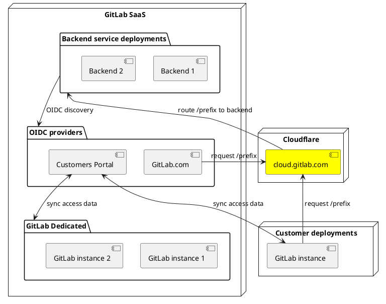
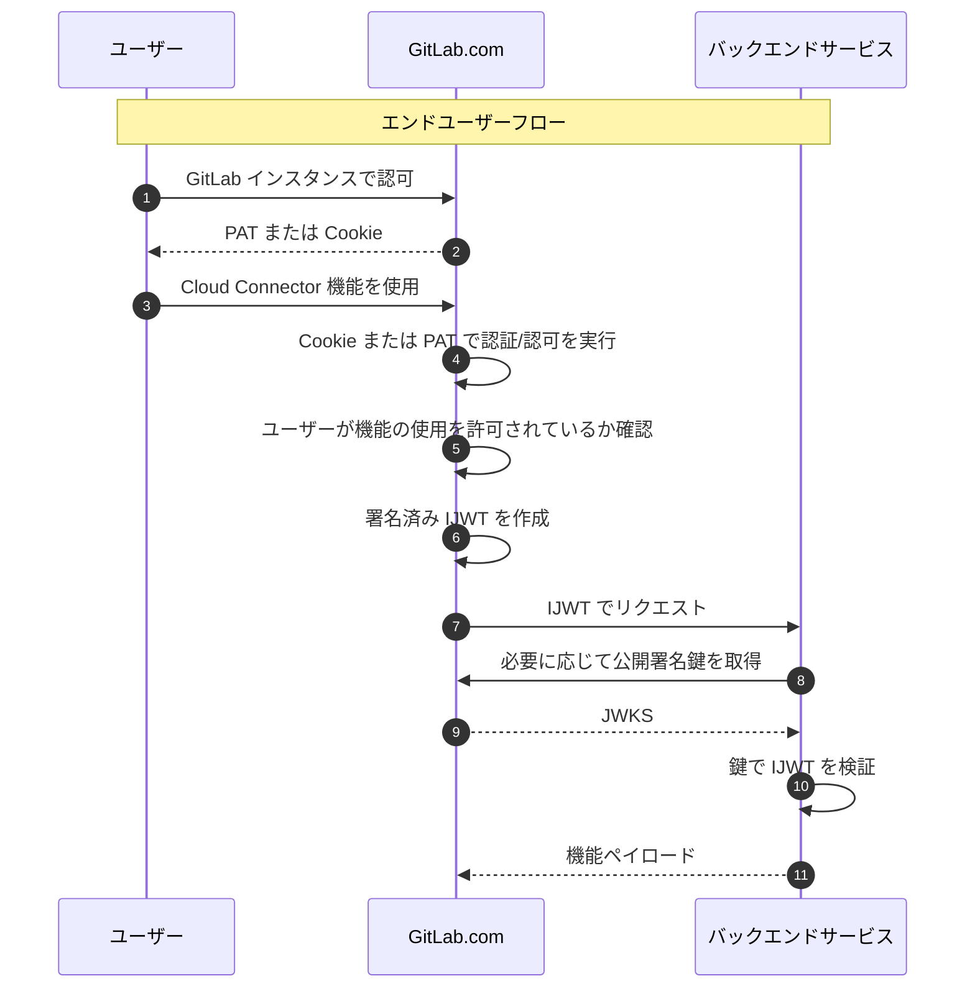
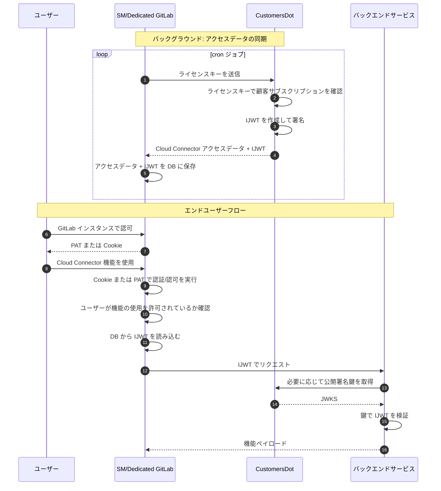
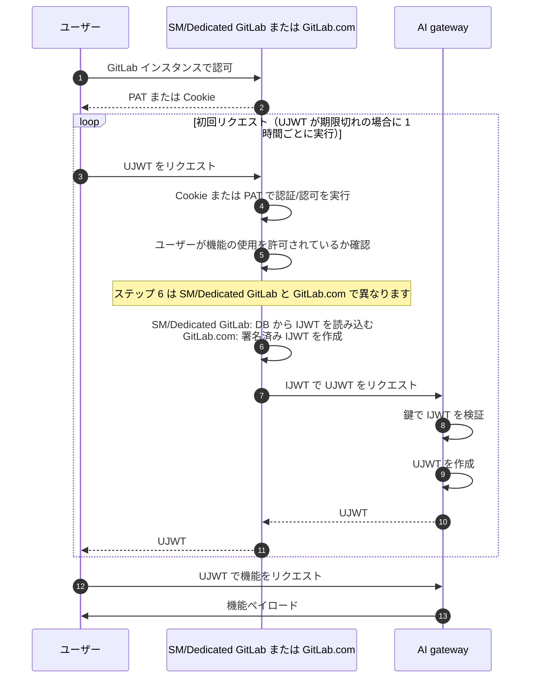

このページは Cloud Connector の最新の状態における一般的なアーキテクチャをカバーしています。
過去および将来の段階的な変更は [ADR](_index.md#decisions) として文書化されています。

## 用語

Cloud Connector の構成要素と仕組みについて説明する際に、以下の用語を使用します：

- **GitLab Rails**: メインの GitLab アプリケーション。
- **GitLab.com**: GitLab Inc. が運営するマルチテナントの GitLab SaaS デプロイメント。
- **GitLab Dedicated**: GitLab Inc. が運営するシングルテナントの GitLab SaaS デプロイメント。
- **GitLab Self-Managed**: 顧客が運営する GitLab インスタンス（プライベートクラウドへのデプロイも含む）。
- **GitLab インスタンス**: 上記のいずれか。
- **バックエンドサービス**: Cloud Connector の機能セットの一部として GitLab インスタンスが呼び出す、GitLab が運営するウェブサービス。主なバックエンドサービスは AI Gateway です。
- **CustomersDot**: [GitLab Customers Portal](https://gitlab.com/gitlab-org/customers-gitlab-com)。顧客が GitLab のサブスクリプションを管理するために使用します。
- **OIDC**: [OpenID Connect](https://auth0.com/docs/authenticate/protocols/openid-connect-protocol)。アイデンティティプロバイダーと認証/認可を実装するためのオープン標準。JWT 発行者は JWT バリデーターにキーを公開するために OIDC 準拠のディスカバリエンドポイントを提供します。
- **JWT**: [JSON Web Token](https://auth0.com/docs/secure/tokens/json-web-tokens)。暗号的に署名されたトークンの形式でアイデンティティデータをエンコード・送信するためのオープン標準。このトークンは、GitLab インスタンスまたはユーザーとバックエンドサービス間のリクエストを認可するために使用されます。GitLab インスタンスまたはユーザーのいずれかにスコープできます。
- **JWT 発行者**: JWT を発行するためのエンドポイントを提供する、GitLab が運営するウェブサービス。OAuth 仕様ではこれを `Authorization Server` と呼びます。また、そのようなトークンを検証するために必要な公開鍵を提供するエンドポイントも含まれます。GitLab.com、CustomersDot、AI gateway はすべて JWT 発行者です。
- **JWT バリデーター**: JWT 発行者から取得した公開鍵を使用して、JWT を持つ GitLab インスタンスのリクエストを検証するバックエンドサービス。OAuth 仕様ではこれを `Resource Server` と呼びます。AI gateway はその一例です。
- **IJWT**: インスタンス JSON Web Token。GitLab インスタンス向けに作成された JWT。
- **UJWT**: ユーザー JSON Web Token。IJWT よりも短い有効期間と少ない権限で GitLab ユーザー向けに作成された JWT。
- **JWKS**: [JSON Web Key Set](https://auth0.com/docs/secure/tokens/json-web-tokens/json-web-key-sets)。JWT を検証するための暗号鍵をエンコードするためのオープン標準。
- **ユニットプリミティブ**: 権限/アクセススコープが管理できる論理的な機能。
- **アドオン**: まとめてバンドルして販売されるユニットプリミティブのグループ。例: `code_suggestions` と `duo_chat` は `DUO_PRO` アドオンでまとめて販売される 2 つの UP です。

## 解決すべき問題

ほとんどの GitLab 機能は、デプロイ場所に関係なく GitLab インスタンスから直接提供できます。しかし一部の機能は、サードパーティベンダーとの統合が必要であったり、GitLab.com 外では運営が困難だったりします。これは、GitLab Self-Managed および GitLab Dedicated の顧客にとって、これらの機能に簡単にアクセスできないという問題をもたらします。

Cloud Connector はこの問題を以下の方法で解決します：

- 機能を GitLab Rails から GitLab が運営するサービスに移動させ、顧客が手動で設定・運営する手間を省く。
- `cloud.gitlab.com` でバックエンドサービスにアクセスするための Cloud Connector 機能への単一のグローバルエントリポイントを提供する。
- インスタンスのライセンスと課金データをアクセス許可に結びつけ、GitLab インスタンスが GitLab Inc. によって運営されるバックエンドサービスでホストされている機能を利用できるようにする。

## Cloud Connector コンポーネント

技術的に、Cloud Connector は以下の要素で構成されています：

1. **グローバルロードバランサー。** Cloudflare を通じて `cloud.gitlab.com` でホストされており、AI などの Cloud Connector 機能へのすべてのインバウンドトラフィックはこのホストを通過する必要があります。ロードバランサーはパスプレフィックスに基づいてルーティングの決定を行います。例えば：
   1. ロードバランサーが `/prefix` をバックエンドサービスにマッピングする。
   1. クライアントが `cloud.gitlab.com/prefix/path` をリクエストする。
   1. ロードバランサーが `/prefix` を取り除き、`/path` をバックエンドサービスにルーティングする。
1. **GitLab.com と CustomersDot を IJWT 発行者として指定。** これらのデプロイメントを GitLab Inc. だけがアクセスできる秘密鍵で設定します。これらの鍵を使用して、GitLab Rails インスタンスが接続されたサービスバックエンドへのアップストリームリクエストに使用できる暗号的に署名された IJWT を発行します。公開検証鍵は OIDC ディスカバリ API エンドポイントを使用して公開されます。
1. **AI gateway を UJWT 発行者およびバリデーターとして指定。** 上記の IJWT 発行者と同様ですが、ユーザー専用のトークンを発行する目的で使用します。AI gateway は独自のバリデーターであるため、検証鍵は OIDC ディスカバリ API エンドポイントに公開されません。
1. **バックエンドサービスを IJWT バリデーターとして指定。** バックエンドサービスは GitLab.com または CustomersDot と定期的に同期して、リクエストに添付されたサービストークンの署名を検証するために使用する公開鍵を取得します。バックエンドサービスはその後、署名の有効性とトークンの本文に含まれるクレームの両方に基づいてリクエストを受け入れるか拒否するかを決定できます。
1. **上記と統合するための API のプログラミング。** GitLab Rails アプリケーションとバックエンドサービス間の通信をより簡単に実装するために、Ruby で必要なインターフェースを提供することを目指しています。

以下の図はこれらのコンポーネントがどのように相互作用するかを概説しています：

## アクセス制御

バックエンドサービスへのリクエストを行う際には、2 つのレベルのアクセス制御があります：

1. **インスタンスアクセス。** 特定の SM/Dedicated インスタンスにアクセスを付与するには、顧客のクラウドライセンス請求ステータスにバインドされた IJWT を発行します。このトークンは CustomersDot から GitLab インスタンスに毎日同期され、インスタンスのローカルデータベースに保存されます。GitLab.com については、このステップは必要ありません。代わりに、各リクエストに対して短命のトークンを発行します。これらのトークンは JWT として実装され、発行者によって暗号的に署名されます。
1. **ユーザーアクセス。** 現在、すべてのエンドユーザーリクエストは少なくとも一度は対応する GitLab インスタンスを経由することを期待しています。特定のリクエスト（例えばコード補完）については、バックエンドスコープの UJWT を使用してユーザーがバックエンドサービスに直接リクエストすることを許可しています。このトークンはインスタンストークンよりも限定的な有効期間とアクセス権を持ちます。ユーザートークンを取得するには、まずユーザーはトークンをリクエストするために対応する GitLab インスタンスを経由する必要があります。したがって、ユーザーレベルの認証と認可は、OAuth または個人アクセストークンを使用した通常の REST または GraphQL API リクエストと同様に処理されます。

インスタンスアクセス用に発行された JWT は以下のクレームを持ちます（網羅的ではなく、変更の可能性があります）：

- `aud`: オーディエンス。バックエンドサービスの名前（例: `gitlab-ai-gateway`）。
- `sub`: サブジェクト。トークンが発行された GitLab インスタンスの UUID（例: `8f6e4253-58ce-42b9-869c-97f5c2287ad2`）。
- `iss`: 発行者の URL。`https://gitlab.com` または `https://customers.gitlab.com` のいずれか。
- `exp`: トークンの有効期限（UNIX タイムスタンプ）。現在 GitLab.com では 1 時間、SM/Dedicated では 3 日間。
- `nbf`: このトークンを使用できない時間より前（UNIX タイムスタンプ）。トークンが発行された時間の 5 秒前に設定されます。
- `iat`: このトークンが発行された時間（UNIX タイムスタンプ）。トークンが発行された時間に設定されます。
- `jti`: JWT ID。ランダムに作成された UUID（例: `0099dd6c-b66e-4787-8ae2-c451d86025ae`）。
- `gitlab_realm`: GitLab Self-Managed と GitLab.com からのリクエストを区別する文字列。Customers Portal が発行した場合は `self-managed`、GitLab.com が発行した場合は `saas`。
- `scopes`: このトークンが有効な機能を定義するアクセススコープのリスト。これらは、有料機能が GitLab のティアおよびアドオンにどのようにバンドルされるかなどの決定に基づいて取得されます。

ユーザーアクセス用に発行された JWT は以下のクレームを持ちます（網羅的ではなく、変更の可能性があります）：

- `aud`: オーディエンス。バックエンドサービスの名前（`gitlab-ai-gateway`）。
- `sub`: サブジェクト。トークンが発行された GitLab ユーザーのグローバルに一意な匿名ユーザー ID ハッシュ（例: `W2HPShrOch8RMah8ZWsjrXtAXo+stqKsNX0exQ1rsQQ=`）。
- `iss`: 発行者（`gitlab-ai-gateway`）。
- `exp`: トークンの有効期限（UNIX タイムスタンプ）。現在、発行時から 1 時間後。
- `nbf`: このトークンを使用できない時間より前（UNIX タイムスタンプ）。トークンが発行された時間に設定されます。
- `iat`: このトークンが発行された時間（UNIX タイムスタンプ）。トークンが発行された時間に設定されます。
- `jti`: JWT ID。ランダムに作成された UUID（例: `0099dd6c-b66e-4787-8ae2-c451d86025ae`）。
- `gitlab_realm`: GitLab Self-Managed と GitLab.com からのリクエストを区別する文字列。`self-managed` または `saas` のいずれか。
- `scopes`: このトークンが有効な機能を定義するアクセススコープのリスト。これらは、有料機能が GitLab のティアおよびアドオンにどのようにバンドルされるか、またユーザートークンでアクセスできる機能に関する決定に基づいて取得されます。

JWKS には、トークンバリデーターがトークンの署名を検証するために使用する公開鍵が含まれています。現在すべてのバックエンドサービスに以下が必要です：

- GitLab.com および CustomersDot から JWKS を定期的に更新して、サービスを中断することなく鍵のローテーションが容易かつ定期的に行えるようにする。
- 各リクエストに対して JWT の署名検証とアクセススコープチェックを実行する。

以下のフローチャートは、GitLab.com と GitLab Dedicated/GitLab Self-Managed デプロイメントの両方において、ユーザーが AI チャットボットとの対話などの Cloud Connector 機能を使用するときに何が起こるかを理解するのに役立ちます。

### GitLab.com

GitLab.com デプロイメントは特別な信頼を享受しているため、Cloud Connector 機能へのすべてのリクエストに対して自己署名して IJWT を作成できるという利点があり、フローが大幅に簡略化されます：

### GitLab Dedicated/Self-Managed

Dedicated と GitLab Self-Managed インスタンスの場合、主要な問題はトラストの委任です：個々の GitLab Self-Managed インスタンスを信頼してトークンを発行させることはできませんが、インスタンスが定期的に CustomersDot（GitLab Inc. が管理）で認証することを許可することでトラストを委任できます。GitLab Dedicated インスタンスは管理していますが、簡略化のために現在 Cloud Connector の観点から「セルフマネージド」と見なしています。

GitLab.com との主な違いは CustomersDot アクターの追加であり、顧客インスタンスはこれと定期的に同期して GitLab バックエンドサービスにアクセスするために必要なデータを取得・永続化します。

Cloud Connector のアクセスデータは、インスタンスのローカルデータベースに格納される構造化 JSON データです。IJWT に加えて、機能が完全にリリース済みかベータ段階かなど、利用可能なサービスに関する追加情報が含まれています。この情報は特に、アップグレードサイクルを制御できない GitLab Self-Managed インスタンスに有用です。変更の対象となるデータを同期してリモートで一部の GitLab 機能へのアクセスを制御できるからです。

### AI gateway

AI gateway は UJWT を発行することができ、これはユーザーが GitLab インスタンスへの呼び出しを最初に経由することなく AI gateway と直接通信するためのものです。これは IJWT の使用に加えて行われます。GitLab インスタンスのみが UJWT をリクエストできますが、これは IJWT でリクエストを行うことで実行されます。AI gateway はその後、インスタンスがユーザーに渡すことができる短命の UJWT を返します。クライアントはこの UJWT を使用して AI gateway と直接通信できます。

