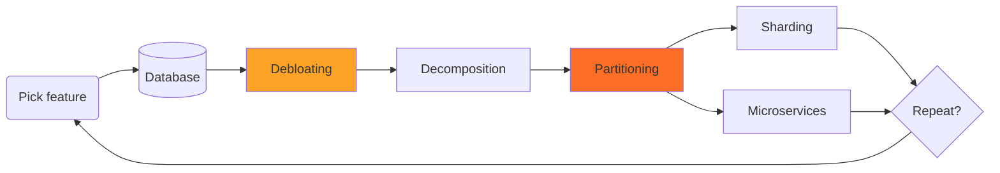

<!-- vale gitlab.FutureTense = NO -->

このページには今後予定されている製品・機能・機能性に関する情報が含まれています。ここに示す情報は参考目的のみです。購入・計画の決定にこの情報を使用しないでください。製品・機能・機能性の開発、リリース、タイミングは変更または延期される可能性があり、GitLab Inc. の独自の判断に委ねられています。

<table class="w-full text-sm border-collapse">
<thead>
<tr class="bg-gray-100 text-left">
<th class="px-3 py-2 border border-gray-300">Status</th>
<th class="px-3 py-2 border border-gray-300">Authors</th>
<th class="px-3 py-2 border border-gray-300">Coach</th>
<th class="px-3 py-2 border border-gray-300">DRIs</th>
<th class="px-3 py-2 border border-gray-300">Owning Stage</th>
<th class="px-3 py-2 border border-gray-300">Created</th>
</tr>
</thead>
<tbody>
<tr>
<td class="px-3 py-2 border border-gray-300">accepted</td>
<td class="px-3 py-2 border border-gray-300"><a href="https://gitlab.com/abrandl" class="text-blue-600 hover:underline">@abrandl</a>, <a href="https://gitlab.com/tkuah" class="text-blue-600 hover:underline">@tkuah</a></td>
<td class="px-3 py-2 border border-gray-300"></td>
<td class="px-3 py-2 border border-gray-300"><a href="https://gitlab.com/alexives" class="text-blue-600 hover:underline">@alexives</a></td>
<td class="px-3 py-2 border border-gray-300">~devops::data stores</td>
<td class="px-3 py-2 border border-gray-300">2021-06-23</td>
</tr>
</tbody>
</table>

このドキュメントは、GitLab.com のテーブルサイズを削減・制限するための提案です。テーブルサイズを特定の閾値（100 GB）に制限することで**測定可能な目標**を設定します。ただし、10 GB の時点で対策を講じるべきです。

サイズ制限はデータベースの焦点と意思決定を促進するための指標として使用されます。GitLab.com が成長するにつれて、違反を防止または修正するためにどのテーブルに対処する必要があるかを継続的に再評価します。これはハードルールではなく、テーブルを分割するか、またはその他の方法でサイズを削減するための作業が必要であることを示す強い指標です。

これは[データベースシャーディングのブループリント](https://gitlab.com/gitlab-org/gitlab/-/merge_requests/64115)との文脈で読まれることを意図しており、そちらがより大きな絵を描いています。この提案はストレージ要件の削減とデータモデリングの改善を目的として、以下の「デブロートステップ」の一部と考えられています。パーティショニングは標準的なツールの一部です。可能な場合はパーティショニングを使用して物理テーブルサイズを大幅に削減できます。どちらも、デコンポジション（データベースの使用がすでに最適化されている）やシャーディング（データベースがすでに特定のデータアクセス次元に沿ってパーティショニングされている）などの作業の準備に役立ちます。

## 動機：GitLab.com の安定性とパフォーマンス

GitLab.com の大きなテーブルは、運用と開発の両方において大きな問題です。さまざまな問題を引き起こします：

1. **クエリのタイミング**、そしてアプリケーションの全体的なパフォーマンスが低下する
1. **テーブルのメンテナンス**がはるかにコストが高くなる。バキューム処理は GitLab.com で重大な懸念になっています。大きなテーブルでは処理が低頻度（1 日 1 回）しか行われず、バキューム実行に何時間もかかります。これはさまざまな悪影響をもたらし、非常に大きなテーブルはデータベースの一見無関係な部分に影響を与え、アプリケーション全体のパフォーマンスが低下する可能性があります。
1. 大きなテーブルでの**データマイグレーション**は実装がはるかに複雑で、開発オーバーヘッドが発生します。GitLab.com で安定性の問題を引き起こす可能性があり、大きなデータセットでの実行に時間がかかります。
1. **インデックスのサイズ**が大きくなります。インデックスの一部のみがメモリに保持され、インデックスの維持がより困難になる（再パックを考えると）ため、パフォーマンスに直接影響します。
1. **インデックスの作成時間**が大幅に増加します。2021 年には、単一の B-Tree インデックスの作成に最大 6 時間かかる場合があります。これは頻繁なデプロイの能力に影響し、バキューム関連の問題（遅延クリーンアップ）を引き起こします。
1. 軽減策として**多くのインデックス**を追加しがちですが、これは最終的に大きなオーバーヘッドを引き起こし、クエリプランナーを混乱させる可能性があり、大量のインデックスは設計上の問題のにおいです。

## 目標：GitLab.com のすべての物理テーブルはインデックスを含めて 100 GB 未満

運用の安定性を維持・向上させ、開発の負担を軽減するために、**GitLab.com の物理テーブルサイズを 100 GB 未満**（インデックスを含む）とすることを目標とします。これにはさまざまな利点があります：

1. クエリパフォーマンスの向上とより安定したクエリプラン
1. バキューム実行時間を大幅に削減し、健全な状態を維持するためにバキュームの実行頻度を増やす — データベースプライマリのオーバーヘッドを削減
1. インデックスの作成時間が大幅に短縮（インデックスあたりの読み取りデータが大幅に少ない）
1. インデックスが小さくなり、より効率的に維持でき、メモリへの適合が改善
1. データマイグレーションが推論しやすくなり、実装と実行にかかる時間が短縮

<https://postgres.fm/episodes/partitioning/transcript>も参照してください（トランスクリプトで _hundred_ を検索）。

テーブルが小さい場合は問題を修正することがはるかに容易です。テーブルが 100 GB に近づくまで待たないでください。テーブルが約 10 GB の時点でテーブルサイズを削減するための対策を開始してください。

この目標は_実用的_です：テーブルサイズは機能の使用状況、コードの変更、その他の要素に依存していることを理解しています。これらはすべて時間とともに変化します。物理テーブルのサイズを一度で厳密に制限できる解決策を常に見つけられるわけではないかもしれません。それでも構いません。主に GitLab.com の状況をコントロール下に置くことを目標とします。GitLab.com の状況に合わせて取り組みを調整し、頻繁に再評価します。

時間の経過とともに一定の最大物理テーブルサイズにつながる変更を行えますが、必ずしもそうである必要はありません。たとえば、テーブルを静的な数のパーティションに分割するハッシュパーティショニングを考えてみましょう。時間の経過とともにデータが成長すると、個々のパーティションもサイズが大きくなり、最終的に閾値サイズに再び達する場合があります。定数テーブルサイズを目指しますが、この特性を持たないがかなりの期間状況を改善するより簡単な解決策を実装することも受け入れられます。

そのため、リファクタリング後の物理テーブルの目標サイズは状況によって異なり、ハードルールはありません。歴史的なデータの成長と物理テーブルが 100 GB の閾値に再び達する時期の予測を考慮することをお勧めします。これにより、特定の解決策がモデルを再検討する必要が生じるまでどのくらい持続するかを理解できます。

注意：
PostgreSQL のコンテキストでは、**物理テーブル**は通常のテーブルまたはパーティション化されたテーブルのパーティションのいずれかです。

### 例

最も顕著な例として、`ci_builds` テーブルは 2021 年 6 月時点で 1.5 TB のサイズで、関連するインデックスが 31 個あり、合計で 1 TB のサイズになっています。このテーブルの全体的なオンディスクサイズは 2.5 TB です。現在、1 か月に 300 GB ずつ増加しています。対策を講じなければ、年末までに約 5 TB になると考えられます。

次の例は、非常に大きなテーブルが GitLab.com でのインシデントの根本原因になることが多いことを示しています。

1. 低頻度で長時間にわたるバキューム処理が[CI キューイングのクエリパフォーマンスの繰り返し低下](https://gitlab.com/gitlab-com/gl-infra/production/-/issues?label_name%5B%5D=Service%3A%3ACI+Runners&label_name%5B%5D=incident&scope=all&search=shared_runner_queues&state=all)につながりました
1. `ci_builds` などの大きなテーブルでは、マイグレーションが同期的に実行されるため、ビジー時にインデックスの作成時間が 1.5〜6 時間かかります。これはデプロイをブロックし、頻繁にデプロイする能力を低下させます。
1. 大きなインデックスの作成はデータベースプライマリでの活動の急増につながる可能性があります：
   1. `merge_request_diff_commits` テーブル：[高いネットワーク飽和](https://gitlab.com/gitlab-com/gl-infra/production/-/issues/4823)を引き起こしました
   1. 週末の定期的な再インデックス処理：[増大する WAL キュー](https://gitlab.com/gitlab-com/gl-infra/production/-/issues/4767)を引き起こします（リカバリ目標に影響）
   1. `notes` テーブル：メンテナンスのためにGIN トリグラムインデックスを再作成することがほぼ不可能になり、他のバキューム操作をブロックしたため[最初の試みで 12 時間後に中断](https://gitlab.com/gitlab-com/gl-infra/production/-/issues/4633)しなければなりませんでした。

### GitLab.com の問題のあるテーブル

注意：最新のテーブルサイズについては https://gitlab-com.gitlab.io/gl-infra/platform/stage-groups-index/ を参照してください。

これは 2021 年 6 月中旬時点での GitLab.com における合計サイズ（インデックスサイズを含む）の上位 30 テーブルを示しています。`table_size, index_size` は実際のデータと関連インデックスのオンディスクサイズです。`percentage_of_total_database_size` は合計テーブルサイズのデータベースサイズに対する比率を表示します。

見てわかるように、現在 1 TB を超える非常に大きなテーブルがあり、非常に大きなインデックスを持つ傾向があります。

もう 1 つの観察は、大量のインデックスを持つテーブルもあり、インデックスの合計サイズが保存されたデータよりも大幅に大きくなる可能性があるということです。たとえば、`deployments` は 30 GB のサイズで、24 のインデックスにわたる追加の 123 GB のインデックスデータがあります。

<!--
select tablename,
       pg_size_pretty(pg_total_relation_size(t.schemaname || '.' || t.tablename)) as total_size,
       pg_size_pretty(pg_relation_size(t.schemaname || '.' || t.tablename)) as table_size,
       pg_size_pretty(pg_indexes_size(t.schemaname || '.' || t.tablename)) as index_size,
       count(*) as index_count,
       round(pg_total_relation_size(t.schemaname || '.' || t.tablename) / pg_database_size('gitlabhq_production')::numeric * 100, 1) as percentage_of_total_database_size
from pg_indexes i
join pg_tables t USING (tablename)
group by 1,
         2,
         3,
         t.schemaname,
         t.tablename
order by pg_total_relation_size(t.schemaname || '.' || t.tablename) desc
limit 30;
-->

| テーブル                        | 合計サイズ | テーブルサイズ | インデックスサイズ | インデックス数 | データベース全体に対する割合 |
|------------------------------|------------|------------|------------|-------------|-----------------------------------|
| `ci_builds`                  | 2975 GB    | 1551 GB    | 941 GB     | 30          | 22.7                              |
| `merge_request_diff_commits` | 1890 GB    | 1454 GB    | 414 GB     | 2           | 14.4                              |
| `ci_build_trace_sections`    | 1123 GB    | 542 GB     | 581 GB     | 3           | 8.6                               |
| `notes`                      | 748 GB     | 390 GB     | 332 GB     | 13          | 5.7                               |
| `merge_request_diff_files`   | 575 GB     | 481 GB     | 88 GB      | 1           | 4.4                               |
| `events`                     | 441 GB     | 95 GB      | 346 GB     | 12          | 3.4                               |
| `ci_job_artifacts`           | 397 GB     | 187 GB     | 210 GB     | 10          | 3.0                               |
| `ci_pipelines`               | 266 GB     | 66 GB      | 200 GB     | 23          | 2.0                               |
| `taggings`                   | 238 GB     | 60 GB      | 179 GB     | 5           | 1.8                               |
| `ci_builds_metadata`         | 237 GB     | 88 GB      | 149 GB     | 5           | 1.8                               |
| `issues`                     | 219 GB     | 47 GB      | 150 GB     | 28          | 1.7                               |
| `web_hook_logs_202103`       | 186 GB     | 122 GB     | 8416 MB    | 3           | 1.4                               |
| `ci_stages`                  | 182 GB     | 58 GB      | 124 GB     | 6           | 1.4                               |
| `web_hook_logs_202105`       | 180 GB     | 115 GB     | 7868 MB    | 3           | 1.4                               |
| `merge_requests`             | 176 GB     | 44 GB      | 125 GB     | 36          | 1.3                               |
| `web_hook_logs_202104`       | 176 GB     | 115 GB     | 7472 MB    | 3           | 1.3                               |
| `web_hook_logs_202101`       | 169 GB     | 112 GB     | 7231 MB    | 3           | 1.3                               |
| `web_hook_logs_202102`       | 167 GB     | 111 GB     | 7106 MB    | 3           | 1.3                               |
| `sent_notifications`         | 166 GB     | 88 GB      | 79 GB      | 3           | 1.3                               |
| `web_hook_logs_202011`       | 163 GB     | 113 GB     | 7125 MB    | 3           | 1.2                               |
| `push_event_payloads`        | 162 GB     | 114 GB     | 48 GB      | 1           | 1.2                               |
| `web_hook_logs_202012`       | 159 GB     | 106 GB     | 6771 MB    | 3           | 1.2                               |
| `web_hook_logs_202106`       | 156 GB     | 101 GB     | 6752 MB    | 3           | 1.2                               |
| `deployments`                | 155 GB     | 30 GB      | 125 GB     | 24          | 1.2                               |
| `web_hook_logs_202010`       | 136 GB     | 98 GB      | 6116 MB    | 3           | 1.0                               |
| `web_hook_logs_202009`       | 114 GB     | 82 GB      | 5168 MB    | 3           | 0.9                               |
| `security_findings`          | 109 GB     | 21 GB      | 88 GB      | 8           | 0.8                               |
| `web_hook_logs_202008`       | 92 GB      | 66 GB      | 3983 MB    | 3           | 0.7                               |
| `resource_label_events`      | 66 GB      | 47 GB      | 19 GB      | 6           | 0.5                               |
| `merge_request_diffs`        | 63 GB      | 39 GB      | 22 GB      | 5           | 0.5                               |

## 解決策

テーブルサイズを削減するための標準的な解決策はありません。多くの解決策があります！

1. **保持**: 不要なデータを削除します。たとえば、古い不要なレコードを期限切れにします。
1. **STI の削除**: 私たちはまだいくつかの場所で[単一テーブル継承](https://docs.gitlab.com/ee/development/database/single_table_inheritance.html)を使用していますが、これはアンチパターンと見なされています。これを再設計することで、データを複数のテーブルに分割できます。
1. **インデックスの最適化**: 不要なインデックスを削除し、重複するインデックスを可能な場合は統合します。
1. **データ型の最適化**: データ型の決定を見直し、可能な場合はデータ型を最適化します（例：列挙型列にテキストの代わりに整数を使用）
1. **パーティショニング**: 共通のアクセス次元がある場合はパーティショニングスキームを適用します。
1. **正規化**: リレーショナルモデリングを見直し、重複データを削除するための正規化技術を適用します。
1. **垂直テーブル分割**: 列の使用状況を見直し、テーブルを垂直方向に分割します。
1. **外部化**: 大きなデータ型をデータベースから完全に移動します。たとえば、フィルタリングに使用されない JSON ドキュメントは、オブジェクトストレージなどデータベース外に保存した方が良い場合があります。

注意：
物理テーブルサイズの制限を目標としていますが、パフォーマンスの維持または改善も目標とします。

正規化などの解決策の場合、これはトレードオフです：非正規化されたモデルは、適切に使用されるとクエリを高速化できますが、テーブルサイズが犠牲になります。モデルを正規化する場合、テーブルを分割する場合、またはデータを外部化する場合は、パフォーマンスへの影響を理解し、パフォーマンスに大きな影響を与えずにテーブルサイズを削減する解決策を見つけるよう努めます。

### 取り組みの例

いくつかの例を以下に示します。より多くの例はエピック[データベースの効率](https://gitlab.com/groups/gitlab-org/-/epics/5585)の下に整理されています。

1. [`ci_builds` のインデックス数の削減](https://gitlab.com/groups/gitlab-org/-/epics/6203)
1. [`merge_request_diff_commits` のコミッターと著者の詳細の正規化と重複排除](https://gitlab.com/gitlab-org/gitlab/-/issues/331823)
1. [`ci_build_trace_sections` の保持戦略](https://gitlab.com/gitlab-org/gitlab/-/issues/32565#note_603138100)
1. [古い CI ジョブメタデータをハード削除するワーカーの実装](https://gitlab.com/gitlab-org/gitlab/-/issues/215646)
1. [`merge_request_diff_files` が 100 GB 未満の目標に違反している](https://gitlab.com/groups/gitlab-org/-/epics/6215)（エピック）

## 実行

[`~group::database` のエピック](https://gitlab.com/groups/gitlab-org/-/epics/6211)は、目標を確立・伝達し、それを達成するために必要な変更を特定・提案するための意思決定を推進します。これらの変更は主に `~group::database` のサポートを受けながら、データ（およびそれを使用する機能）を所有する各ステージグループによって推進される必要があります。

## 担当者

<!-- vale gitlab.Spelling = NO -->

問題のあるテーブルの解決策の特定は、[GitLab データベースチーム](../../../data-engineering/database-excellence/database-frameworks/_index.md)と各ステージグループによって推進されます。

| 役割               | 担当者 |
|--------------------|-----|
| 著者             | Andreas Brandl |
| エンジニアリングリーダー | Alex Ives |
| プリンシパルエンジニア | Thong Kuah |
| シニアエンジニア    | Maxime Orefice |

## 決定ログ

- [ADR-001: テーブルの分類](decisions/001_table_classification.md)
- [ADR-002: 100 GB を超えるテーブルへの新規カラムの制限](decisions/002_limit_new_columns.md)
- [ADR-003: 50 GB を超えるテーブルへの新規インデックスの制限](decisions/003_limit_new_indexes.md)

<!-- vale gitlab.Spelling = YES -->
