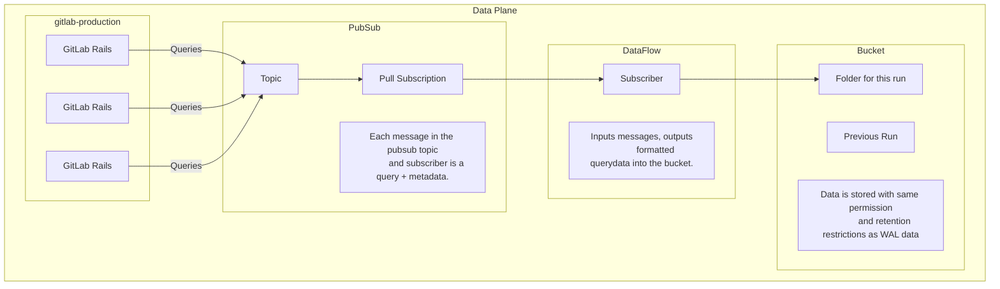

<!-- Design Documents often contain forward-looking statements -->
<!-- vale gitlab.FutureTense = NO -->

<!-- This renders the design document header on the detail page, so don't remove it-->

このページには今後予定されている製品・機能・機能性に関する情報が含まれています。ここに示す情報は参考目的のみです。購入・計画の決定にこの情報を使用しないでください。製品・機能・機能性の開発、リリース、タイミングは変更または延期される可能性があり、GitLab Inc. の独自の判断に委ねられています。

<table class="w-full text-sm border-collapse">
<thead>
<tr class="bg-gray-100 text-left">
<th class="px-3 py-2 border border-gray-300">Status</th>
<th class="px-3 py-2 border border-gray-300">Authors</th>
<th class="px-3 py-2 border border-gray-300">Coach</th>
<th class="px-3 py-2 border border-gray-300">DRIs</th>
<th class="px-3 py-2 border border-gray-300">Owning Stage</th>
<th class="px-3 py-2 border border-gray-300">Created</th>
</tr>
</thead>
<tbody>
<tr>
<td class="px-3 py-2 border border-gray-300">proposed</td>
<td class="px-3 py-2 border border-gray-300"><a href="https://gitlab.com/mattkasa" class="text-blue-600 hover:underline">@mattkasa</a>, <a href="https://gitlab.com/stomlinson" class="text-blue-600 hover:underline">@stomlinson</a>, <a href="https://gitlab.com/zbraddock" class="text-blue-600 hover:underline">@zbraddock</a></td>
<td class="px-3 py-2 border border-gray-300"><a href="https://gitlab.com/tkuah" class="text-blue-600 hover:underline">@tkuah</a></td>
<td class="px-3 py-2 border border-gray-300"><a href="https://gitlab.com/alexives" class="text-blue-600 hover:underline">@alexives</a>, <a href="https://gitlab.com/rmar1" class="text-blue-600 hover:underline">@rmar1</a></td>
<td class="px-3 py-2 border border-gray-300">~devops::data access</td>
<td class="px-3 py-2 border border-gray-300">2025-05-07</td>
</tr>
</tbody>
</table>

## サマリー

GitLab.com から SQL クエリトラフィックをキャプチャ、保存、リプレイするための包括的なツールを開発します。このソリューションは、Rails および Sidekiq プロセスへのパフォーマンス影響を最小限に抑えながら、GitLab 内に軽量なクエリ転送メカニズムを実装し、SQL クエリを外部サービスに送信します。専用のリプレイユーティリティと組み合わせることで、このシステムはパフォーマンステスト、キャパシティプランニング、データベースアーキテクチャ評価を可能にし、可変速度での本番負荷シミュレーション、飽和点と競合点の特定、潜在的なデータベース設定変更の評価、および本番システムに悪影響を与えることなくシャーディング戦略の検証を実現します。

## モチベーション

このツールにより、データベースのキャパシティを収集・測定できるようになります。現在のセットアップのキャパシティだけでなく、本番データベースインフラへの変更などの他の緩和策の有効性についても、実質的に解決できるようになります。

### 目標

1. 本番の Rails/Sidekiq プロセスへの無視できるほどのパフォーマンス影響。
2. データベーススケーリングの決定と設定変更に対する信頼度の向上。
3. パフォーマンスボトルネックを予防的に特定し緩和する能力の強化。
4. 本番リスクなしのデータベースアーキテクチャテスト能力の向上。

### 非目標

1. これはバックアップツールではありません。
2. データ分析用ではなく、継続的に実行せず、他の用途に対して責任を負いません。
3. 本番で発生したものと全く同じデータベース状態に収束することは期待していません。特に、正確性やデータの整合性ではなく、負荷下でのデータベースパフォーマンスに関心があります。
4. キャプチャは完全に一貫しているとは限りません。リプレイ中に一部のクエリは実行に失敗することがあります。

## 提案

gitlab アプリケーションからのすべてのクエリトラフィックをキャプチャし、ベンチマーク環境に対してリプレイします。これは一般的に1時間を超えない一定期間行い、データベースホストの設定変更を検証するために使用します。

また、アプリケーションが将来見込まれる高い本番負荷をシミュレートするために、トラフィックリプレイを短い期間に圧縮することもサポートします。

## 設計と実装の詳細

Rails ノードからクエリデータをキャプチャし、pubsub トピックに発行して、クエリデータを集約してバケットに永続化します。

リプレイを行うには、バケットからクエリデータを読み込み、キャプチャ時点の本番から復元されたベンチマークデータベースに対して、元の本番で使用されたものと同じ接続数でリプレイします。

```mermaid
flowchart TD
    subgraph DataPlane2["Data Plane"]
        subgraph Benchmark["gitlab-db-benchmarking"]
            MachineCreation["Machines Created
            GPRD Snapshot used for machine creation is calculated on
            timestamp of folder of query data being replayed.
            WAL is replayed up until start LSN of the query data capture, then stopped."]
        end

        subgraph PipelineStageA["Trigger Pipeline Stage A"]
            StageAVars["input variables include:
            - foldername of querydata we want to replay
            - how many replay nodes we want to create
            - primary database instance only or also replicas
            - if we want database replicas, how many?
            - if we want to override default machine sizes, machine types etc"]
        end

        PauseA["Pause until next step manually triggered
        A good time for engineers to make any other manual changes to environment"]

        subgraph PipelineStageB["Trigger Pipeline Stage B"]
            StageBVars["input variables include:
            - replay speed (1x, 1.2x, 2x, etc)
            - write only or read & write

            Engineers can choose not to run Stage B if they just wanted
            an environment created and do not need a querydata replay"]
        end

        subgraph ReplayPerformed["Replay Performed"]
            ReplayProcess["Query Data will be gathered from GPRD bucket then replayed"]
        end

        PauseB["Pause until next step manually triggered
        A good time for engineers to make any other checks on the environment"]

        subgraph PipelineStageC["Trigger Pipeline Stage C"]
            StageCNote["- Pipeline C needs to be able to be run even if Pipelines A and B either a) were not run or b) failed"]
        end

        subgraph MachinesDeleted["Machines Deleted"]
            DeleteNote["Query Data will NOT be deleted from GPRD bucket"]
        end
    end

    PipelineStageA -->|"Creates"| MachineCreation
    MachineCreation --> PauseA
    PauseA --> PipelineStageB
    PipelineStageB -->|"Executes"| ReplayPerformed
    ReplayPerformed --> PauseB
    PauseB --> PipelineStageC
    PipelineStageC -->|"Cleans up"| MachinesDeleted

    %% Styling
    classDef sectionHeader fill:#f9f,stroke:#333,stroke-width:2px
    classDef pauseStep fill:#ffe6cc,stroke:#d79b00,stroke-width:1px
    classDef pipelineStep fill:#d5e8d4,stroke:#82b366,stroke-width:1px

    class QueryCapture,QueryReplay sectionHeader
    class PauseA,PauseB pauseStep
    class PipelineStageA,PipelineStageB,PipelineStageC,MachineCreation,ReplayPerformed,MachinesDeleted pipelineStep
```

### セキュリティと保持期間

記録されたトラフィックキャプチャには RED データが含まれることに注意してください。
このデータは、バックアップ/復元検証のために既にストレージしている WAL アーカイブと同様に扱う予定です（WAL アーカイブには異なる形式で同等のデータが含まれており、クエリのテキストではなくクエリの結果が含まれています）。具体的には、クエリテキストを本番環境の WAL データに類似したトラフィックキャプチャバケットに保存し、db-benchmarking 環境でリプレイテストを実行します。現在他のテストを実行しているのと同様の方法です。
キャプチャデータは14日間のみ保持され、その後はトラフィックキャプチャバケットのライフサイクルルールによって削除されます。
トラフィックキャプチャバケットは、gitlab-production GCP プロジェクトルールまたは gitlab.com GCP 組織ルールからほとんどのアクセス許可を継承します。ただし、トラフィックキャプチャの実行に必要な roles/storage.objectUser 権限を持つトラフィックキャプチャサービスアカウント、およびトラフィックリプレイの実行に必要な roles/storage.objectUser 権限を持つトラフィックリプレイサービスアカウントからもアクセス可能です。

GCP のネイティブ PubSub を使用しているため、メッセージの暗号化はデフォルトで処理され、認証にはサービスアカウントが使用されます。
GitLab の Rails ノードを表すサービスアカウントは、pubsub キューにメッセージを追加できるよう、トラフィックキャプチャの pub/sub トピックに対して roles/pubsub.publisher ロールを受け取ります。

トラフィックキャプチャサービスアカウントは以下のロールを受け取ります：

- トラフィックキャプチャの pubsub サブスクリプションとトラフィックキャプチャの pubsub トピックに対する roles/pubsub.subscriber
- トラフィックキャプチャの pubsub トピックに対する roles/pubsub.viewer
- プロジェクト全体に対する roles/dataflow.worker。残念ながら、この必要なロールは[プロジェクト全体にのみ割り当て可能](https://cloud.google.com/dataflow/docs/concepts/access-control#:~:text=Dataflow%20Worker-,(roles/dataflow.worker),-Provides%20the%20permissions)です。幸いなことに、gitlab-production でDataflowを使用する機能はトラフィックキャプチャのみです。

## 代替ソリューション

1. pgcat や pgdog などを使用して、接続プーラーレベルでクエリトラフィックをキャプチャすることができます。
   - 現時点では本番環境でこのようなプーラーを実行していません（現在は pgbouncer を使用しています）。このツールは接続プーラーの変更を評価するのに役立ちます。

2. https://github.com/gocardless/pgreplay-go のような既成のツールを使用することができます。
   - pgreplay-go や類似ツールは postgres ログファイルからデータをキャプチャしますが、私たちのスケールでは機能しません。クエリテキストの量がすぐにディスクの容量を超えてしまいます。
