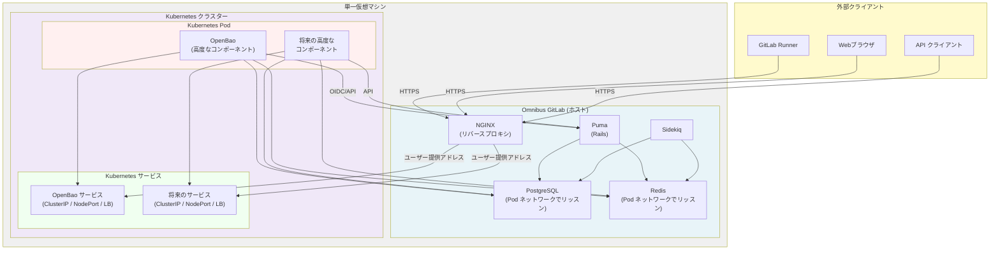

<!--
Document statuses you can use:

- "proposed"
- "accepted"
- "ongoing"
- "implemented"
- "postponed"
- "rejected"

-->

<!-- Design Documents often contain forward-looking statements -->
<!-- vale gitlab.FutureTense = NO -->

このページには今後予定されている製品・機能・機能性に関する情報が含まれています。ここに示す情報は参考目的のみです。購入・計画の決定にこの情報を使用しないでください。製品・機能・機能性の開発、リリース、タイミングは変更または延期される可能性があり、GitLab Inc. の独自の判断に委ねられています。

<table class="w-full text-sm border-collapse">
<thead>
<tr class="bg-gray-100 text-left">
<th class="px-3 py-2 border border-gray-300">Status</th>
<th class="px-3 py-2 border border-gray-300">Authors</th>
<th class="px-3 py-2 border border-gray-300">Coach</th>
<th class="px-3 py-2 border border-gray-300">DRIs</th>
<th class="px-3 py-2 border border-gray-300">Owning Stage</th>
<th class="px-3 py-2 border border-gray-300">Created</th>
</tr>
</thead>
<tbody>
<tr>
<td class="px-3 py-2 border border-gray-300">proposed</td>
<td class="px-3 py-2 border border-gray-300"><a href="https://gitlab.com/Alexand" class="text-blue-600 hover:underline">@Alexand</a></td>
<td class="px-3 py-2 border border-gray-300"><a href="https://gitlab.com/WarheadsSE" class="text-blue-600 hover:underline">@WarheadsSE</a></td>
<td class="px-3 py-2 border border-gray-300"><a href="https://gitlab.com/Alexand" class="text-blue-600 hover:underline">@Alexand</a>, <a href="https://gitlab.com/cjwilburn" class="text-blue-600 hover:underline">@cjwilburn</a>, <a href="https://gitlab.com/mbruemmer" class="text-blue-600 hover:underline">@mbruemmer</a>, <a href="https://gitlab.com/mbursi" class="text-blue-600 hover:underline">@mbursi</a></td>
<td class="px-3 py-2 border border-gray-300">~devops::gitlab delivery</td>
<td class="px-3 py-2 border border-gray-300">2026-02-09</td>
</tr>
</tbody>
</table>

## 概要

Omnibus-Adjacent Kubernetes（OAK）は、従来の Omnibus GitLab デプロイメントとクラウドネイティブ GitLab の間のギャップを埋めるための移行アーキテクチャです。セルフマネージドのお客様が、同一の仮想マシン上で GitLab Omnibus と軽量な Kubernetes ディストリビューションを並行して実行できるようにし、フルクラウドネイティブデプロイメントを必要とせずにクラウドネイティブコンポーネント（シークレット管理のための OpenBao など）を活用できるようにします。

このデザインドキュメントは、ディスカバリーフェーズからの発見をまとめています。そのフェーズでは、3つの軽量 Kubernetes ディストリビューション（k3s、k0s、microk8s）が単一ノードで Omnibus GitLab と統合できることを正常に検証しました。Kubernetes 上に OpenBao（シークレット管理ソリューション）をデプロイし、Omnibus GitLab のシークレットマネージャー機能と統合することで、エンドツーエンドの機能を実証しました。

OAK は [セグメンテーション提案](../selfmanaged_segmentation/_index.md) のための足がかりとして機能し、Early Self-Managed のお客様が Omnibus の運用上のシンプルさを維持しながら、クラウドネイティブコンポーネントを必要とする高度な機能を採用できるようにします。

## 動機

### 問題の定義

GitLab の製品ロードマップには、クラウドネイティブデプロイメント向けに設計された高度な機能（ネイティブシークレット管理など）が含まれています。しかし、多くのセルフマネージドのお客様は、運用の複雑さ、コスト、またはインフラの制約により、フルクラウドネイティブ環境への移行の準備が整っていません。これにより、完全なアーキテクチャの刷新なしにはこれらの高度な機能にアクセスできないというギャップが生じています。

さらに、セグメンテーション提案では、Early Self-Managed Advanced コンポーネント層のお客様向けの移行オファリングが必要です。OAK は、お客様が同一インフラ上で Omnibus と Kubernetes の両方を実行し、クラウドネイティブコンポーネントを段階的に採用できるようにすることで、この移行パスを提供します。

### ゴール

- **セルフマネージドのお客様のための高度な機能の有効化**: フルクラウドネイティブデプロイメントを必要とせずに、クラウドネイティブ GitLab 機能（シークレット管理など）を使用できるようにします。
- **明確な移行パスの提供**: 最終的なクラウドネイティブ採用への足がかりとして OAK を確立し、移行を検討しているお客様の摩擦を軽減します。Omnibus コアコンポーネントも、クラウドプロバイダーへの最終移行前に OAK 上で実行できます。
- **運用パターンの確立**: サービス相互接続、ネットワーク構成、デプロイ手順の実証済みパターンを文書化し、将来の実装を導きます。
- **セグメンテーション提案のサポート**: フルクラウドネイティブデプロイメントを望まない Omnibus ユーザー向けの実行可能なデプロイアーキテクチャを提供することで、Early Self-Managed Advanced 層のオファリングを実現します。

## 決定事項

- [ADR-001: Kubernetes ディストリビューションをパッケージ化または承認しない](./decisions/001_dont_package_or_bless_kubernetes_distros.md)
- [ADR-002: OAK テストと統合オーナーシップ](./decisions/002_oak_testing_and_integration_ownership.md)
- [ADR-003: Omnibus は Kubernetes サービス公開方法に依存しない](./decisions/003_omnibus_agnostic_k8s_service_exposure.md)
- [ADR-004: OAK でのマルチノード Omnibus サポート](decisions/004_multi_node_omnibus_support.md)
- [ADR-005: ゼロダウンタイムアップグレード](decisions/005_zero_downtime_upgrades.md)

## 提案

### アーキテクチャ概要

OAK は以下のコンポーネントで構成されます:

1. **Omnibus GitLab**: ホスト VM 上で実行され、コア GitLab アプリケーション、PostgreSQL、Redis、その他のサービスを提供します。
2. **軽量 Kubernetes ディストリビューション**: 同じ VM 上で実行され、クラウドネイティブコンポーネントのためのコンテナオーケストレーションプラットフォームを提供します。
    - ユーザーがデプロイします。
3. **クラウドネイティブコンポーネント**: Kubernetes 上にデプロイされた OpenBao などのサービスで、明確に定義された API を通じて Omnibus と統合されます。
4. **ネットワーク分離**: Kubernetes サービスがホスト（localhost）からのみアクセス可能であり、外部アクセスを防ぐためのネットワークポリシーと kube-proxy 設定。

### 検証済み Kubernetes ディストリビューション

ディスカバリーの作業に基づき、この目的で機能する 3 つの小型 Kubernetes ディストリビューション（`k0s`、`k3s`、`microk8s`）を検証しました。

各ディストリビューションの詳細については、[OAK マイルストーン 1 エピック](https://gitlab.com/groups/gitlab-com/gl-infra/software-delivery/-/work_items/30)をご参照ください。

### サービス相互接続パターン

ディスカバリーの作業では、Kubernetes サービスを Omnibus と統合するための実証済みパターンが確立されました。Omnibus オートメーションを追加する際は、これらのパターンを考慮する必要があります:

1. **PostgreSQL の公開**: Omnibus PostgreSQL を Kubernetes Pod ネットワークインターフェース（CNI ブリッジ IP など）でリッスンするように設定し、Kubernetes Pod が認証情報を使用して接続できるようにします。
   - Kubernetes ディストリビューションによって異なるネットワークインターフェースが提供されます。`microK8s` は VXLAN をサポートし、`k3s` と `k0s` はブリッジをデプロイします。異なる IP を使用するため、ユーザーは Omnibus にそれらを通知する必要があります。
2. **サービスアクセス**: Omnibus は Kubernetes サービスの公開方法に依存しません。ユーザーは、サービスに到達できる場所を指すアドレス（IP、ホスト名、または `IP:port`）を提供します。これは ClusterIP（同一 VM デプロイメント）、NodePort、または LoadBalancer である可能性があります。[ADR-003](./decisions/003_omnibus_agnostic_k8s_service_exposure.md) を参照してください。
3. **NGINX リバースプロキシ**: Omnibus NGINX はリバースプロキシとして機能し、ユーザーが提供したアドレスを使用して外部リクエストを Kubernetes サービスに転送します。
4. **認証**: OpenBao などのサービスは、GitLab をアイデンティティプロバイダーとして OIDC/JWT 認証を使用します。

### ネットワークセキュリティモデル

- **Kubernetes サービスは外部に直接公開されません**: Omnibus NGINX が Kubernetes サービスへのトラフィックの唯一の外部エントリポイントです。それらのサービスが内部でどのように公開されるか（ClusterIP、NodePort、LoadBalancer）はユーザーの選択であり、Omnibus の設定には影響しません。
- **Omnibus がゲートウェイとして機能**: Kubernetes サービスへのすべての外部トラフィックは Omnibus NGINX を経由し、追加のセキュリティ制御を適用できます。自動的な NGINX 設定を提供するために Omnibus オートメーションを実装する必要があります。
- **Pod からホストへの通信**: Kubernetes Pod は Pod ネットワークインターフェースを通じて Omnibus サービス（PostgreSQL、Redis）と通信できます。
- **外部への Kubernetes API 公開なし**: Kubernetes API サーバーは外部に公開されず、管理は VM 上でローカルに行われます。
- **TLS**: 高度なコンポーネントへの外部通信をサポートするため（例えば、OpenBao と直接通信しようとするランナー）、ある程度の TLS をサポートする必要があります。これは Omnibus NGINX SSL オフロードを設定することで実現できます。[コアコンポーネントに対して実施されているのと同様の方法で](https://docs.gitlab.com/omnibus/settings/ssl) Let's Encrypt 証明書生成も考慮する必要があります。

### マルチノード Omnibus サポート

OAK はマルチノード Omnibus デプロイメントをサポートします。ネットワーク設定とサービス公開はお客様の責任です。ベータフェーズで計画されているオートメーションと既存の Omnibus 設定の組み合わせにより、お客様が起動・実行するために必要なものをカバーします。それ以外はスコープ外です。Omnibus は自身のノードのみを管理し、デプロイメント内の他のノードについての知識や制御を持ちません。

マルチノード Omnibus デプロイメントは、既存の Omnibus ZDU 手順に従ったゼロダウンタイムアップグレードを可能にします。OAK の ZDU 戦略の詳細については、[ADR-005: ゼロダウンタイムアップグレード](decisions/005_zero_downtime_upgrades.md)を参照してください。

マルチノード Omnibus サポートの詳細については、[ADR-004: OAK でのマルチノード Omnibus サポート](decisions/004_multi_node_omnibus_support.md)を参照してください。

## ベータ実装の提案

チームとの議論に基づき、以下が OAK の提案されたベータ実装を表します。このベータフェーズは、単一ノードのお客様が高度なコンポーネントを採用できるようにしながら、最終的なクラウドネイティブアーキテクチャへの移行を促すためにある程度の摩擦を意図的に導入した、最小限の実用的な製品を確立することに焦点を当てています。

### ベータゴール

- **高度なコンポーネント採用の有効化**: 単一ノードの Omnibus のお客様が高度なクラウドネイティブコンポーネント（シークレット管理のための OpenBao など）をデプロイして使用できるようにします。
- **運用パターンの確立**: サービス相互接続パターンとデプロイワークフローを実際のお客様で検証します。
- **お客様フィードバックの収集**: オートメーションレベルに関するお客様の問題点と好みを理解します。

### ベータスコープ: 含まれるもの

#### 1. Omnibus オートメーション

Omnibus は OAK セットアップのための**限定的で焦点を絞ったオートメーション**を提供します:

- **NGINX 設定の生成**: Omnibus は、公開された Kubernetes サービス（OpenBao など）に対して NGINX リバースプロキシ設定を自動的に生成します。これは、最も一般的な設定エラーの原因を最も削減する最高価値のオートメーションです。
- **PostgreSQL ネットワーク公開**: OAK が有効になると、Omnibus は自動的に PostgreSQL を Kubernetes Pod ネットワークインターフェース（ユーザーが提供したネットワーク IP によって決定）でリッスンするように設定します。これにより、Kubernetes コンポーネントが手動設定なしにデータベースにアクセスできるようになります。
- **Helm values の生成**: Omnibus は高度なコンポーネント用に事前設定された Helm values ファイルを生成します。以下を含みます:
  - データベース接続の詳細（ホスト、ポート、認証情報）
  - サービス NodePort の割り当て
  - GitLab 統合エンドポイント（双方向通信のため）
  - ネットワーク設定の詳細

#### 2. デプロイワークフロー（順序立てられたステップ）

ベータ実装は、懸念事項の明確な分離を維持しながら最小限の摩擦を導入する意図的な 3 ステップのワークフローに従います:

**ステップ 1: ユーザーが Kubernetes をインストール**

- ユーザーは Omnibus と同じ VM に軽量 Kubernetes ディストリビューション（k3s、k0s、または microk8s）を選択してインストールします。
- ユーザーは Kubernetes Pod ネットワーク IP/CIDR を Omnibus に提供します（例: k3s の場合 `10.42.0.0/16`）。
- このステップは、ADR 001 が Kubernetes ディストリビューターにならないことを規定しているため、意図的に手動です。

**ステップ 2: ユーザーが Omnibus を再設定**

- ユーザーは OAK を有効にして Kubernetes ネットワーク情報を指定し、`omnibus-ctl reconfigure` を実行します。
- Omnibus は以下を自動的に実行します:
  - PostgreSQL を Kubernetes Pod ネットワークインターフェースでリッスンするように設定
  - Redis を Kubernetes Pod ネットワークインターフェースでリッスンするように設定（高度なコンポーネントが必要な場合）
  - 各高度なコンポーネントの NGINX 設定ファイルを生成
  - 各高度なコンポーネントの Helm values ファイルを生成
- Omnibus は生成された Helm values ファイルを既知の場所（例: `/etc/gitlab/oak/helm-values/`）に出力します。

**ステップ 3: ユーザーが手動で Helm チャートをインストール**

- ユーザーは生成された values ファイルを使用して Helm チャートを手動でインストールします。
- 例: `helm install openbao gitlab/openbao -f /etc/gitlab/oak/helm-values/openbao.yaml`
- このステップは意図的に手動です:
  - ユーザーが Helm の基礎を習得できるようにする（最終的なクラウドネイティブ移行に必要）
  - Omnibus と Kubernetes 管理の明確な分離を維持する
  - 当初は、Helm オートメーションに対する暗黙のサポート契約を避ける。将来のオートメーション化の検討事項とする。

#### 3. ベータでのサービス相互接続

ベータでは、サービス相互接続は以下のパターンに従います:

- **PostgreSQL アクセス**: Kubernetes Pod は Pod ネットワーク IP と標準の PostgreSQL 認証情報を使用して Omnibus PostgreSQL にアクセスします。OAK が有効になると、Omnibus は Pod ネットワークインターフェースで PostgreSQL を公開します。
- **Redis アクセス**: PostgreSQL と同様に、必要に応じて Redis が Pod ネットワークインターフェースで公開されます。
- **外部サービスアクセス**: Omnibus NGINX は Kubernetes サービスへの外部トラフィックのリバースプロキシとして機能し、ユーザーが `gitlab.rb` で提供したアドレスを使用します。Omnibus は Kubernetes でサービスがどのように公開されているか（ClusterIP、NodePort、または LoadBalancer）には依存しません。
- **双方向通信**: GitLab に通信する必要のある OpenBao のようなコンポーネント（OIDC など）のために、Omnibus は生成された Helm values に GitLab エンドポイント URL を提供します。

##### アーキテクチャ図

**主要なアーキテクチャのポイント:**

- **単一 VM**: Omnibus と Kubernetes は同じ仮想マシン上で実行される
- **NGINX が単一の外部ゲートウェイ**: Kubernetes サービスへのすべての外部トラフィックが Omnibus NGINX を経由する
- **NGINX ゲートウェイ**: Kubernetes サービスへのすべての外部トラフィックが Omnibus NGINX を経由する
- **Pod ネットワークアクセス**: Kubernetes Pod は Pod ネットワークインターフェースを介して Omnibus の PostgreSQL と Redis にアクセスできる
- **双方向通信**: 高度なコンポーネントは認証と API 呼び出しのために GitLab（Puma）と通信できる

#### 4. NGINX 設定

Omnibus は以下を行う NGINX 設定ファイルを生成します:

- 特定のポートまたはサブドメイン上で Kubernetes サービスを公開する（例: `openbao.gitlab.example.com` または `gitlab.example.com:8200`）。
- ユーザーが提供したアドレス（`oak['address']` または `oak['components']['<name>']['address']` によるコンポーネントごとのオーバーライド）を使用して Kubernetes サービスにトラフィックを転送する。
- 既存の Omnibus SSL 証明書管理を使用した TLS 終端をサポートする。
- 管理を容易にするために専用ディレクトリ（例: `/etc/gitlab/nginx/conf.d/oak-services.conf`）に配置される。

ユーザーは必要に応じてこれらの設定をカスタマイズできますが、Omnibus は適切なデフォルトを提供します。

#### 5. Helm Values の生成

Omnibus は以下を含む Helm values ファイルを生成します:

- **データベース設定**: PostgreSQL/Redis アクセスのホスト、ポート、ユーザー名、パスワード。
- **サービス設定**: NodePort の割り当て、サービスタイプ（NodePort）、および必要なノードセレクター。
- **GitLab 統合**: GitLab エンドポイント URL、認証トークン、その他の統合の詳細。
- **ネットワーク設定**: Pod ネットワーク CIDR、必要なネットワークポリシー。

これらの values ファイルは以下に基づいて生成されます:

- ユーザーが提供した Kubernetes ネットワーク情報
- 高度なコンポーネントの要件（コンポーネントチームによって決定）
- Omnibus の設定とシークレット

#### 6. ドキュメントとサポート

ベータドキュメントには以下が含まれます:

- **ステップバイステップガイド**: OAK を使用した各高度なコンポーネントの有効化方法。
- **トラブルシューティングガイド**: 一般的な問題とデバッグ方法。
- **アーキテクチャ図**: サービス相互接続パターンを示す図。
- **Helm チャートドキュメント**: 各高度なコンポーネントの公式 Helm チャートドキュメントへのリンク。

#### 7. オブジェクトストレージ要件

OAK にデプロイされた高度なコンポーネントは、異なるストレージ要件を持つ場合があります:

- **ステートレスコンポーネント**（例: OpenBao）: これらのコンポーネントは、Omnibus が提供する外部データベース（PostgreSQL、Redis）に状態を保存します。追加のオブジェクトストレージは必要ありません。
- **ディスクを必要とするステートフルコンポーネント**: ローカルディスクストレージ（PostgreSQL/Redis に保存できるものを超えて）を必要とする高度なコンポーネントは、オブジェクトストレージを使用する必要があります。そのようなコンポーネントをデプロイする Omnibus 管理者は、ローカルディスクに保存されるすべてのデータをオブジェクトストレージに移行する必要があります。

**主要な原則**: Kubernetes コンポーネントはローカルディスクストレージに依存すべきではありません。代わりに、以下のいずれかを実施する必要があります:

1. Omnibus が提供する PostgreSQL または Redis に状態を保存する
2. ファイルベースのデータにはオブジェクトストレージ（S3 互換、GCS、Azure Blob Storage など）を使用する

これにより、コンポーネントが将来的に適切にスケール、バックアップ、移行できるようになります。Omnibus 管理者は、データベースを超えた永続データストレージを必要とする高度なコンポーネントをデプロイする際に、オブジェクトストレージの採用を計画する必要があります。

### ベータスコープ: 含まれないもの

以下はベータから明示的に除外され、将来のフェーズで対応されます:

- **自動 Helm インストール**: Omnibus は `helm install` コマンドを自動的に実行しません。ユーザーが手動で実行する必要があります。
- **エアギャップデプロイメント**: ベータではサポート/検証されません。インターネットアクセスが必要です。
- **自動サービスディスカバリー**: サービスアドレスは `gitlab.rb` の値で静的に設定されます。
- **別 VM サポート**: ベータでは Kubernetes は Omnibus と同じ VM 上で実行する必要があります。将来的に、Kubernetes が別の VM で実行されるシナリオを検証します。これにはネットワーク管理者によるネットワーク設定が必要です。
- **相互 TLS**: ベータでは実装されません。コンポーネントは mTLS なしで localhost を介して通信します。Kubernetes が別のノードにある場合は必要になります。
- **Kubernetes ツール配布**: ユーザーが Helm、kubectl、その他のツールを自分でインストールする必要があります。

### ベータ成功基準

ベータフェーズは以下の場合に成功とみなされます:

1. **機能性**: 単一ノードのお客様が OAK で少なくとも 1 つの高度なコンポーネント（OpenBao）を正常にデプロイして使用できる。
2. **ドキュメント**: 以下のドキュメント成果物が作成・公開される:
   - **ランブック**: OAK と OpenBao のステップバイステップデプロイガイド（k3s、k0s、microk8s をカバー）
   - **トラブルシューティングガイド**: 一般的な問題、エラーメッセージ、解決手順
   - **録画デモ**: エンドツーエンドのインストール（Kubernetes ディストリビューション → Omnibus → OpenBao）を示すビデオウォークスルー
3. **お客様フィードバック**: セットアップ体験とオートメーションレベルについて、少なくとも 2〜5 名のベータお客様からフィードバックを収集。
4. **運用パターン**: サービス相互接続パターンが検証・文書化されている。
5. **サポート準備**: サポートチームが以下にアクセスできる:
   - ランブックとトラブルシューティングガイド
   - 参照用の録画デモ
   - ベータ中にお客様の質問に対応するための AMA（Ask Me Anything）セッションを 2 回予定。オンデマンドでの追加 AMA にも対応する。
6. **セキュリティレビュー**: AppSec がアーキテクチャと実装をレビュー済み。

### ベータから GA への移行

ベータから GA への移行には以下が含まれます:

- **オートメーションの拡張**: お客様のフィードバックに基づき、Omnibus オートメーションを拡張する可能性があります（例: 自動 Helm インストール）。
- **エアギャップサポート**: 包括的なエアギャップデプロイメントサポートを実装します。サポートしたい内容・方法の定義が必要です。
- **ツール配布**: Kubernetes 関連ツールの配布を決定・実装します。
- **FIPS 準拠**: 必要に応じて FIPS 準拠を評価・実装します。

### ベータアプローチの根拠

ベータアプローチは、いくつかの競合する懸念事項のバランスを取っています:

- **お客様体験**: NGINX と Helm values 生成のための Omnibus オートメーションにより、完全な手動設定と比較してセットアップの複雑さが大幅に軽減されます。
- **メンテナンス負担**: Helm インストールを手動のままにすることで、継続的なメンテナンスが必要な複雑なオートメーションシステムの作成を回避します。
- **学習の機会**: 手動の Helm インストールを必須とすることで、お客様が Kubernetes の基礎を学べるようになり、最終的なクラウドネイティブ移行への準備が整います。
- **明確な境界**: Omnibus と Kubernetes 管理を分離することで、明確な運用境界を維持し、サポートの対象範囲を縮小します。
- **フィードバック収集**: 手動ステップは、お客様がどのオートメーションが最も価値があるかについてフィードバックを提供できる自然なポイントを提供します。

## 次のステップ

### 即時アクション（デザインドキュメントフェーズ）

1. **ステークホルダーの合意**: テクニカルリーダー、プロダクトマネージャー、エンジニアリングマネージャーにこのデザインドキュメントを提示し、未解決の質問について合意を得ます。
2. **決定事項の文書化**: 各未解決の質問に対する新しい ADR で決定事項を文書化し、それに応じてこのデザインドキュメントを更新します。後続のフォローアップ MR で実施できます。これにより、作業を分割し、各トピックに焦点を絞ったクリーンな議論が可能になります。
3. **詳細要件**: 決定事項に基づいて、実装フェーズの詳細要件を作成します。
4. **アーキテクチャの改良**: ステークホルダーのフィードバックと決定事項に基づいてアーキテクチャを改良します。

### 実装フェーズ（デザインドキュメント承認後）

1. **Omnibus オートメーション**: ベータ提案で説明した OAK セットアップのための Omnibus 設定とオートメーションを実装します。
2. **Helm values 生成**: 高度なコンポーネントのための Helm values 生成システムを実装します。
3. **NGINX 設定**: 自動 NGINX 設定生成を実装します。
4. **ドキュメント**: OAK でのデプロイ方法をガイドするための OpenBao ドキュメントを拡張します。
5. **テストと検証**: CI パイプラインの自動テストを用意します。
6. **セキュリティレビュー**: アーキテクチャと実装の AppSec レビューを実施します。
7. **ベータリリース**: 早期採用者向けのベータ機能として OAK をリリースします。

### 将来のイテレーションに向けた未解決の質問とデザイン決定が必要な事項

これらはステークホルダーとの技術的な議論を通じて対処し、このデザインドキュメントの後続イテレーションで文書化する必要があります。

#### 1. エアギャップデプロイメントサポート

**質問**: VM がインターネットアクセスを持たないエアギャップデプロイメントをサポートすべきか？

**オプション**:

- **エアギャップサポートなし**: コンテナイメージと Helm チャートのプルにインターネットアクセスを必要とする。
- **部分的なエアギャップサポート**: アーティファクトを事前ダウンロードしてバンドルするためのツールを提供するが、手動セットアップが必要。
- **完全なエアギャップサポート**: 完全にエアギャップされたデプロイメントのための包括的なツールとドキュメントを提供する。

**影響**: エアギャップサポートは複雑さを大幅に増加させ、追加のツール（skopeo、アーティファクトバンドリングなど）が必要になります。

**関連する発見**: 3 つのディストリビューションすべてにエアギャップインストール手順が文書化されていますが、ディスカバリーフェーズではテストしていません。

**追加の考慮事項**: エアギャップデプロイメントでは、コンテナイメージ、Helm チャート、Kubernetes ツールを配布するための配信パターンの慎重な設計が必要です。これには、OCI バンドルをシステムパッケージに埋め込むアプローチの評価も含まれ、お客様が外部インターネットアクセスなしに高度なコンポーネントをデプロイできるようになります。この設計作業は将来のフェーズに延期されます。

#### 2. FIPS 準拠

**質問**: OAK デプロイメントにはどのレベルの FIPS 準拠が必要か？

**オプション**:

- **FIPS 要件なし**: OAK デプロイメントは FIPS 準拠である必要はない。
- **部分的 FIPS**: Omnibus コンポーネントは FIPS 準拠だが、Kubernetes コンポーネントは不要。
- **完全 FIPS**: すべてのコンポーネント（Omnibus と Kubernetes）が FIPS 準拠である必要がある。

**影響**: FIPS 準拠には特定の Kubernetes ディストリビューションまたは設定が必要な場合があり、利用可能なオプションを制限する可能性があります。

**関連する発見**: ディスカバリーフェーズでは、3 つのディストリビューションのいずれについても FIPS 準拠を評価していません。

#### 3. ツールとアーティファクトの配布

**質問**: Kubernetes ツール（kubectl、helm、skopeo、cosign）とコンテナイメージをどのように配布すべきか？

**オプション**:

- **配布なし**: お客様が自分でツールをインストールする。
- **Omnibus パッケージ**: ツールを Omnibus パッケージに直接含める。
- **OCI バンドル**: ツールとイメージを OCI アーティファクトとして補足パッケージと共に配布する。
- **ハイブリッドアプローチ**: 一部のツールを Omnibus で、他のツールを OCI バンドルで配布する。

**影響**: この決定はパッケージサイズ、更新頻度、お客様体験に影響します。Build グループとの調整が必要です。

**関連する発見**: ディスカバリーの作業では外部インストールツール（helm、kubectl）を使用しました。バンドルアプローチはテストしていません。

#### 4. Helm オートメーションを実装すべきか

**質問**: Omnibus はチャートを自動的にインストールすべきか？

**オプション**:

- **いいえ**: Omnibus はドキュメントと例を提供し、お客様が手動でチャートをデプロイする。
- **Helm を使用してはい**: Omnibus が Helm を使って自動的にチャートをデプロイする。
- **Helmfile を使用してはい**: Helmfile を使ってチャートとチャートの依存関係のインストールを自動化する。

**影響**: 高いオートメーションはユーザー体験を向上させますが、Omnibus の複雑さとメンテナンス負担が増加します。

#### 5. モニタリングとロギング

**質問**: お客様は OAK で実行されている高度なコンポーネントをどのようにモニタリングし、ログを収集すべきか？

**現状**: Omnibus はコア GitLab コンポーネントのために Prometheus メトリクスとロギング機能を提供しています。Omnibus と Kubernetes の両方が同じ VM で実行されるため、既存の Omnibus Prometheus インスタンスが localhost または Pod ネットワーク上で実行されている Kubernetes コンポーネントからメトリクスをスクレイプできる可能性があります。

**考慮事項**:

- **メトリクスのエクスポート**: Kubernetes で実行されている高度なコンポーネントが localhost ポートまたは Pod ネットワークで Prometheus メトリクスを公開する場合があります。Omnibus Prometheus インスタンスをこれらのメトリクスを直接スクレイプするように設定し、統合されたメトリクス収集を提供できます。
- **Omnibus Prometheus をアグリゲーターとして**: 既存の Omnibus Prometheus インフラを活用することで、お客様が別のモニタリングソリューションを設定する必要が減ります。
- **ログ集約**: Kubernetes コンポーネントは、Omnibus ログと並行して収集・集約する必要があるログを生成します。お客様は ELK、Loki、その他のログ集約ツールを使用する場合があります。
- **オブザーバビリティのギャップ**: 現在、お客様が OAK コンポーネントをモニタリングし、ログを記録するための文書化・サポートされたアプローチはありません。これにより、お客様体験とトラブルシューティングに影響するオブザーバビリティのギャップが生じています。

**オプション**:

- **モニタリングサポートなし**: モニタリングとロギングはお客様の責任。Kubernetes コンポーネントのモニタリングソリューションを自分で実装する必要があることを文書化する。
- **基本的なモニタリングガイダンス**: localhost/Pod ネットワーク上の Kubernetes コンポーネントからメトリクスをスクレイプするために Omnibus Prometheus を設定する方法のドキュメントを提供する。これにより、新しいオートメーションを必要とせずに既存のインフラを活用する。
- **Omnibus Prometheus 統合**: Omnibus Prometheus を自動的に高度なコンポーネントを検出してメトリクスをスクレイプするように設定するオートメーションを実装する。Omnibus は各デプロイ済みコンポーネントの Prometheus スクレイプ設定を生成します。
- **完全なモニタリング統合**: Kubernetes コンポーネントからのメトリクスとログを Omnibus モニタリングインフラに自動的にエクスポートするためのツールを実装する（ログ集約を含む）。

**影響**:

- **サポートなし**: お客様が自分でモニタリングを実装する必要があり、運用上のオーバーヘッドが発生します。
- **基本的なガイダンス**: 既存の Omnibus Prometheus を活用することで摩擦を軽減しますが、手動設定が必要です。
- **Omnibus Prometheus 統合**: 最小限のお客様の手間で統合されたメトリクス収集を提供しますが、スクレイプターゲットを検出・設定するための Omnibus オートメーションが必要です。
- **完全な統合**: 最もユーザーフレンドリーですが、複雑さとメンテナンス負担が大幅に増加します。

**ベータへの推奨**: ベータフェーズ中は、モニタリングオプションを実験します。

#### 6. リソース要件とサイジング

**質問**: 何らかのリファレンスアーキテクチャまたは最小要件ガイドラインを提供すべきか？

このような推奨事項を提供することは、かなりのメンテナンス負担をもたらす可能性があります。いくつかの Kubernetes ディストリビューションは他のものとは非常に異なるパフォーマンスを示しました。例えば、`microk8s` は Omnibus に接続された OpenBao を使用した 16 GB RAM マシンで問題が発生した唯一のディストリビューションでした。

## 参考資料

- [親エピック: Omnibus Adjacent Kubernetes (OAK) - 運用実装](https://gitlab.com/groups/gitlab-com/gl-infra/software-delivery/-/work_items/22)
- [完了したディスカバリーフェーズ: マイルストーン 1](https://gitlab.com/groups/gitlab-com/gl-infra/software-delivery/-/work_items/30)
  - [k3s ディスカバリー Issue](https://gitlab.com/gitlab-org/omnibus-gitlab/-/work_items/9525)
    - [k3s ドキュメント](https://docs.k3s.io/)
  - [k0s ディスカバリー Issue](https://gitlab.com/gitlab-org/omnibus-gitlab/-/work_items/9526)
    - [k0s ドキュメント](https://docs.k0sproject.io/)
  - [microk8s ディスカバリー Issue](https://gitlab.com/gitlab-org/omnibus-gitlab/-/work_items/9527)
    - [microk8s ドキュメント](https://canonical.com/microk8s)
- [デザインドキュメントフェーズエピック](https://gitlab.com/groups/gitlab-com/gl-infra/software-delivery/-/work_items/33)
- [GitLab セグメンテーション提案](../selfmanaged_segmentation/_index.md)
