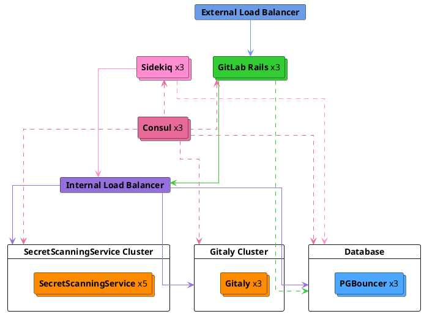

## 背景

シークレットプッシュ保護の[フェーズ2](../_index.md#phase-2---standalone-secret-detection-service)において、目標は与えられた入力ブロブに対してシークレット検出スキャンを実行する責任を持つ専用サービスを持つことです。これは主にスケーラビリティの観点から行われます。シークレット検出スキャンの正規表現処理は高リソース[消費](https://gitlab.com/gitlab-org/gitlab/-/issues/422574#note_1582015771)するため、RailsやGitalyインスタンス内でスキャンを実行すると他の操作のリソース可用性に影響します。分離してスキャンを実行することで、リソース割り当てとサービスの独立したスケーリングに対する より高い制御が可能になります。

## 提案されたソリューション

シークレット検出スキャンの実行を担当するスタンドアロンのシークレット検出サービスを構築します。

シークレットプッシュ保護のワークフローにおける主な変更は、GitLab SaaS向けにスキャン責任を[シークレット検出Gem](https://gitlab.com/gitlab-org/gitlab/-/tree/master/gems/gitlab-secret_detection)からRPCサービスに委譲することです。すなわち、[Secrets Push Check](https://gitlab.com/gitlab-org/gitlab/-/blob/master/ee/lib/gitlab/checks/secrets_check.rb)はシークレットをスキャンするブロブの配列でRPCサービスを呼び出します。なお、プロジェクトの適格性チェックは引き続き[Rails側](https://gitlab.com/gitlab-org/gitlab/-/blob/1a6db446abce0aa02f41d060511d7e085e3c7571/ee/lib/gitlab/checks/secrets_check.rb#L49-51)で実行されます。

### 高レベルアーキテクチャ

サービスアーキテクチャはシークレット検出ロジックをスタンドアロンサービスに抽出し、そのサービスがRailsアプリケーションとGitalyの両方と直接通信します。これにより、シークレット検出ノードを独立してスケーリングし、Railsアプリケーションのリソース使用オーバーヘッドを削減できます。

スキャンは（潜在的に）ブロッキングなpre-receiveトランザクションとして同期的に実行されます。ブロブサイズは引き続き1MBに制限されます。

ノード数は純粋に例示的なものですが、スキャンサービスの独立したスケーリング要件を強調しています。

#### サービスレベルインジケーター（SLI）

[GitLabアプリケーション](https://docs.gitlab.com/ee/development/application_slis/index.html)で採用されているSLI、すなわち**Apdexスコア**、**エラー率**、およびサービス固有の2つの追加メトリクス - **リクエストレイテンシ**と**メモリ飽和率**を採用します。

#### サービスレベル目標（SLO）

_RPCサービスからベンチマークスコアを取得した後、閾値の制限を定義します。_

### サービスの実装

RPCを通信インターフェースとして、与えられた入力ブロブ内のシークレットを検出することを主な責任とするRPCサービスを構築します。このサービスは当初、Gitプッシュイベントの変更アクセスチェックを実行する際にRailsモノリスから呼び出され、最終的に他のユースケースにも拡張されます。

スキャンのビジネスロジックを再利用するため、RPCサービスとして機能を提供することに加えて、同じプロジェクトでRubyGemとして機能を配布するためのプロビジョニングも含めます。

#### 言語/ツール/フレームワーク

- Ruby `3.2+`
- RPCリクエスト処理のためのgRPCフレームワーク
- [Protobufサービス定義](https://gitlab.com/gitlab-org/security-products/secret-detection/secret-detection-service/-/raw/main/rpc/secret_detection.proto)ファイル

### 補足

- RPCサービスはサービスの可用性を確保するための[ヘルスチェック](https://github.com/grpc/grpc/blob/master/doc/health-checking.md)RPCエンドポイントも公開する必要があります。

- Gemベースのアプローチとは異なり、RPCサーバーではサブプロセスのフォーキングの[サポートが削除されている](https://github.com/grpc/grpc/blob/master/doc/fork_support.md)ため、[サブプロセス内でのスキャン](003_run_scan_within_subprocess.md)アプローチを使用することはできません。ただし、RPCクライアント側からバッチリクエストを並行して処理するような最適化を検討できます。

### 参考リンク

- [スタンドアロンサービスのコンセプト](https://docs.gitlab.com/ee/architecture/blueprints/gitlab_ml_experiments/index.html)
- [Runway: サービスデプロイとドキュメント](https://gitlab.com/gitlab-com/gl-infra/platform/runway)
