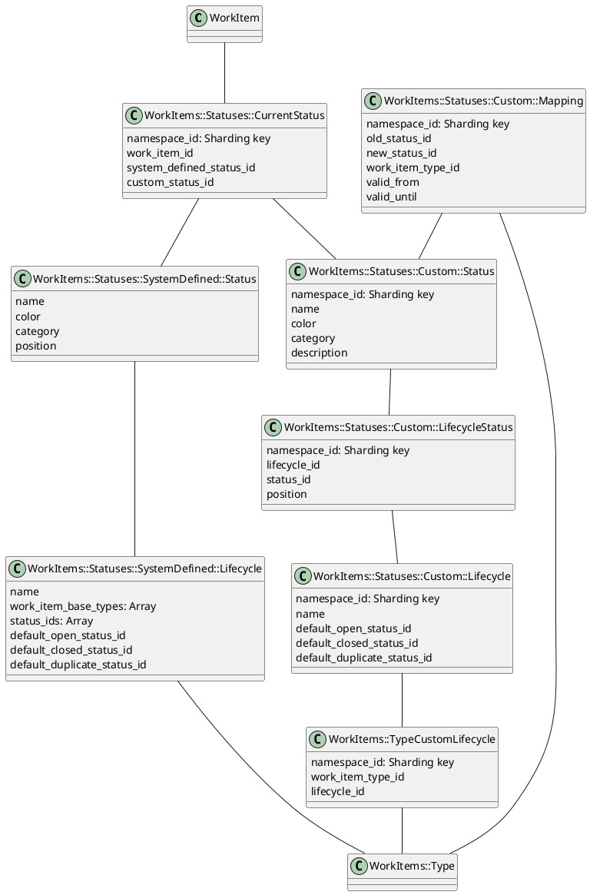

<!-- Design Documents often contain forward-looking statements -->
<!-- vale gitlab.FutureTense = NO -->

<!-- This renders the design document header on the detail page, so don't remove it-->

<div class="my-3 border-l-4 border-blue-500 bg-blue-50 px-4 py-3 rounded-r text-sm text-blue-800">
このページには今後予定されている製品・機能・機能性に関する情報が含まれています。ここに示す情報は参考目的のみです。購入・計画の決定にこの情報を使用しないでください。製品・機能・機能性の開発、リリース、タイミングは変更または延期される可能性があり、GitLab Inc. の独自の判断に委ねられています。
</div>

<div class="overflow-x-auto my-4">
<table class="w-full text-sm border-collapse">
<thead>
<tr class="bg-gray-100 text-left">
<th class="px-3 py-2 border border-gray-300">Status</th>
<th class="px-3 py-2 border border-gray-300">Authors</th>
<th class="px-3 py-2 border border-gray-300">Coach</th>
<th class="px-3 py-2 border border-gray-300">DRIs</th>
<th class="px-3 py-2 border border-gray-300">Owning Stage</th>
<th class="px-3 py-2 border border-gray-300">Created</th>
</tr>
</thead>
<tbody>
<tr>
<td class="px-3 py-2 border border-gray-300"><span class="inline-block rounded px-2 py-0.5 text-xs font-medium bg-gray-100 text-gray-700">ongoing</span></td>
<td class="px-3 py-2 border border-gray-300"><a href="https://gitlab.com/msaleiko" class="text-blue-600 hover:underline">@msaleiko</a></td>
<td class="px-3 py-2 border border-gray-300"><a href="https://gitlab.com/ntepluhina" class="text-blue-600 hover:underline">@ntepluhina</a></td>
<td class="px-3 py-2 border border-gray-300"><a href="https://gitlab.com/acroitor" class="text-blue-600 hover:underline">@acroitor</a>, <a href="https://gitlab.com/gweaver" class="text-blue-600 hover:underline">@gweaver</a></td>
<td class="px-3 py-2 border border-gray-300"><span class="inline-block rounded px-2 py-0.5 text-xs font-medium bg-gray-100 text-gray-700">~devops::plan</span></td>
<td class="px-3 py-2 border border-gray-300">2025-02-25</td>
</tr>
</tbody>
</table>
</div>


## 概要

このドキュメントでは、GitLab のワークアイテムに対して[柔軟なステータスシステム](https://gitlab.com/groups/gitlab-org/-/epics/5099)を実装するアプローチを説明します。
バイナリのオープン/クローズ状態とラベルベースのステータス追跡を超えて、カスタマイズ機能を持つ適切なステータスフィールドを導入します。

このソリューションでは、Premium および Ultimate ユーザーの基盤としてシステム定義のステータスを導入し、ユーザーがステータスを追加、ステータス名や色を変更、ステータスの順序を変更できるようにします。
無料ユーザーは引き続きバイナリのオープン/クローズ状態システムを使用しながら、最初にタスクを対象として Issue、エピック、その他のワークアイテムタイプに拡張する予定です。

このイニシアティブは、ユーザーがワークアイテムのライフサイクルをより効果的に管理するための基盤を築き、ステータス管理にラベルを必要とすることによる問題に対処します。

## タイムラインとステータス更新

1. カスタムステータスは FY26Q2 の Plan ステージの最高優先事項であり、`18.2` マイルストーンで一般提供（GA）リリースを正常に提供しました。
1. チームは現在 `18.5` マイルストーン向けにスケジュールされている MVC2 リリースに取り組んでいます。
1. ステータス更新は[カスタムステータスエピック](https://gitlab.com/groups/gitlab-org/-/epics/5099)と子イテレーションエピックから取得できます。

## 用語集

### 既存の概念と用語

1. **ワークアイテムタイプ:** 関連するウィジェットを通じてワークアイテムの利用可能な機能と動作を決定する分類。
1. **ウィジェット:** ワークアイテムタイプに特定の機能を提供する機能コンポーネント（例: 「担当者」や「ラベル」）。
1. **状態:** ワークアイテムを「オープン」または「クローズ」として分類する基本的なバイナリ分類。

### 新しい概念と用語

1. **ステータス:** ワークアイテムのワークフローにおける特定のステップ（「進行中」、「完了」、「対応しない」）で、カテゴリに属し、バイナリ状態（オープン/クローズ）にマッピングされます。
1. **ステータスカテゴリ:** ステータスの論理グループ（トリアージ、to_do、in_progress）で、ワークアイテムの状態（およびアイコン）に対する効果を決定します。
1. **システム定義ステータス:** 変更できず、ワークアイテムステータスの使い始めに利用可能なシステム提供のステータス。
1. **カスタムステータス:** その名前空間内のすべてのグループとプロジェクトのシステム定義ステータスを置き換える、名前空間定義のステータス。
1. **ライフサイクル:** ワークアイテムタイプに適用できるステータスのコレクション。ステータスをタイプと名前空間全体で一貫して再利用できる意味のあるワークフローにグループ化できます。
1. **ステータスウィジェット:** リスト、ボード、詳細ビューでステータスを表示し、ユーザーがワークアイテムのステータスを変更できるコンポーネント。

## 動機

GitLab は現在、ラベルと 2 つの正式な状態（オープン/クローズ）の組み合わせでワークアイテムのステータスを表しています。
このアプローチは、複雑なワークフローを管理するチームにとって大きな制限があります。
バイナリのオープン/クローズシステムはプロセスのどこにアイテムがあるかについての十分なコンテキストを提供せず、ステータス追跡のためのラベルの過剰使用が一貫性のなさと管理の負担を引き起こします。

### 目標

1. バイナリのオープン/クローズシステムを超えてより多くのワークフロー段階を表すようにワークアイテムのステータスを拡張する
1. ワークアイテムのステータスに関するコンテキストを改善する
1. Issue のクローズ理由（完了対重複/移動/対応しない）に関するより良い報告を可能にする
1. 待機時間からアクティブな時間を区別することでリード/サイクル時間の計算を強化する
1. ワークアイテムシステムの上に構築してすべてのワークアイテムタイプにステータスを活用する
1. ステータス追跡のためのラベルへの依存を減らす

### 非目標

1. ワークアイテムフレームワーク以外でステータスを使用可能にする（例: フレームワーク外の他のエンティティ）。
1. すべてのステータスのような機能をワークアイテムステータスに強制する（例: インシデントのページングステータスと要件の検証ステータス）

## 提案

GitLab のワークアイテムに柔軟なステータスシステムを実装することを提案します。以下のコアコンセプトを中心に構築されています:

1. ステータスは Premium および Ultimate のお客様に提供されます。
1. 無料のお客様は引き続き状態（オープン/クローズ）とラベルを使用します。
1. ワークアイテムタイプに適用できるライフサイクルによるカスタマイズ可能なワークフロー（ステータスを保持します）。
1. 出発点としてのシステム定義ステータス。
1. ユーザーがカスタムステータスとカスタムライフサイクルとしてステータスとライフサイクルを作成・変更できるようにする。
1. 一貫性と互換性を確保するためにワークフローに沿って状態とステータスを同期する。
1. ワークアイテムフレームワークとウィジェットの概念および GraphQL API を使用する。
1. ワークフローラベルから新しいステータスシステムへのユーザーの移行を支援する移行ツール。

## 設計と実装の詳細

このセクションでは、GitLab の新しいワークアイテムステータスシステムのコアコンセプト、実装アーキテクチャ、ロールアウト計画を説明します。
柔軟でスケーラブルなステータス管理ソリューションを作成するためにどのように相互作用するかを詳述します。

### コアコンセプト

#### ライフサイクル

ライフサイクルはステータスのホルダーとして機能し、ワークアイテムタイプに適用できます。
特定のワークアイテムタイプのアイテムに利用可能なステータスを定義します。

**例えば:** 顧客のルートグループでは、Issue は「エンジニアリング」ライフサイクルを使用し、タスクは「カンバン」を使用し、エピック、目標、キーリザルトは「戦略」ライフサイクルを使用するべきです。
すべてのライフサイクルは「完了」と「対応しない」ステータスを再利用しますが、全体的なステータスの数とその位置は異なります。

タスク、Issue、エピック、目標、キーリザルトなどのワークアイテムタイプに対して 1 つのデフォルトライフサイクルから始めます。

Service Desk のチケットは `waiting for first response`（最初のレスポンスを待っている）、`waiting for customer`（顧客を待っている）、`waiting for next response`（次のレスポンスを待っている）などの異なるステータスを持つ異なるライフサイクルを使用するかもしれません。ただし、それは定義される予定です。
詳細については[このディスカッション](https://gitlab.com/gitlab-org/gitlab/-/issues/498393#note_2314175535)を参照してください。

名前空間あたりのライフサイクルの上限は `50` です。

#### ステータス

ステータスは複数のライフサイクルで使用でき、ワークアイテムタイプと名前空間の利用可能なライフサイクルに基づいてワークアイテムに付与できます。デフォルトのライフサイクルには以下のステータスが含まれます:

- `To do`
- `In progress`
- `Done`
- `Won't do`
- `Duplicate`

名前空間あたりの最大ステータス数は `70` です。ライフサイクルには最大 `30` のステータスを付与できます。

#### ステータスカテゴリ

ステータスは動作を決定するユーザーが設定できないカテゴリに整理されます:

```ruby
CATEGORIES = {
  triage: 1, # Exists but without system-defined status
  to_do: 2,
  in_progress: 3,
  done: 4,
  canceled: 5
}.freeze
```

カテゴリはステータス管理エリアでのみ表示され、リスト、詳細、ボードビューには表示されません。
カテゴリはステータスのアイコンを定義します。

#### ステータスと状態の関係と遷移

ステータスは既存の状態システム（オープンとクローズ）の上に構築されます。
次のルールに従って、状態またはステータスが変更されたときにワークアイテムを自動的に遷移させる必要があります:

- `done` および `canceled` カテゴリのステータスはワークアイテムを自動的に `closed` 状態に設定します
- その他のすべてのカテゴリはワークアイテムを `open` 状態に維持します
- ライフサイクルはデフォルトの遷移ステータスを定義します（これはシステム定義とカスタムライフサイクルの両方に当てはまります）:
  - デフォルトオープンステータス: アイテムを作成および再オープンするときに適用されます
  - デフォルトクローズステータス: アイテムをクローズするときに適用されます
  - デフォルト重複ステータス: アイテムを重複としてマークするときに適用されます（または移動、プロモーション TBD）

### 実装アーキテクチャ

#### システム定義とカスタムエンティティの区別

各ルート名前空間のステータスをプリポピュレートしないことを決定しました。このアプローチではステータスの変更や拡張がより困難になり、データベーステーブルのサイズが大幅に増加するためです。かわりに、システム定義のステータスとライフサイクルをデフォルトとして導入し、カスタムステータスとライフサイクルにカスタマイズできるようにします。

[Cells イニシアティブ](../cells/_index.md)は私たちのプラットフォームを水平スケーラブルで弾力的にすることを目指しています。
これを達成するために、すべてのデータベーステーブルにシャーディングキーが必要です。
シャーディングキーは `null` にできず、カスタムシーケンスの使用は推奨されません（例: システム定義ステータスやライフサイクルに `-1` を使用したり、最初の `1,000` ID をシステム定義エンティティ用に予約したりすること）。

システム定義データは名前空間に属さず、グローバルと見なせるため、個別に処理する必要があります。
その他のすべてのテーブルでは、`namespace_id` をシャーディングキーとして使用します。

システム定義エンティティを管理するための 3 つのオプションを検討しました:

1. コード内でシステム定義エンティティを定義する（選択されたアプローチ）
2. システム定義データを別のテーブルに保存する
3. 単一テーブルを使用してカスタム `CHECK` 制約で最初の `1_000` ID を予約する

最初のオプションを実装することを選択しました: コード内でシステム定義エンティティを定義します。このアプローチはシステムにとって簡単さ、スケーラビリティ、保守性の最良のバランスを提供します。

#### 固定アイテムモデルと関連付け

システム定義データは定義上静的なのでハードコードでき、データベースにアクセスしないという利点があります。
課題は結合を行えず、ActiveRecord メソッドを使用できないことです。

`ITEMS` と呼ばれるハッシュの配列に ActiveRecord のようなメソッドを追加し、静的データを定義するモジュールを含む固定アイテムモデルの概念を導入します。

- [抽象モジュールを導入する MR](https://gitlab.com/gitlab-org/gitlab/-/merge_requests/179547)
- [具体的なモデルと関連付けを導入する MR](https://gitlab.com/gitlab-org/gitlab/-/merge_requests/181962)

例えば:

```ruby
class StaticModel
  include ActiveRecord::FixedItemsModel::Model

  ITEMS = [
    {
      id: 1,
      name: 'To do'
    }
  ]

  attribute :name, :string
end
```

ActiveRecord のようなメソッドは次のように使用できます:

```ruby
StaticModel.find(1)
StaticModel.where(name: 'To do')
StaticModel.find_by(name: 'To do')
StaticModel.all
```

関連付けを可能にするために、固定アイテムモデルへの関連付けを次のように解決するカスタム関連付け `belongs_to_fixed_items` を導入します（`*_id` カラムが必要）:

```ruby
class MyModel < ApplicationRecord
  include ActiveRecord::FixedItemsModel::HasOne

  belongs_to_fixed_items :static_model, fixed_items_class: StaticModel
end
```

関連付けは次のように使用できます:

```ruby
m = MyModel.last
m.static_model # Returns fixed items model instance
m.static_model = StaticModel.find(1)
m.static_model_id = 1 # still possible
m.static_model? # Bool
m.save! # Saves association
```

#### クラスの概要



ステータスに関連するすべてをカプセル化するために `WorkItems::Statuses` 名前空間を使用します。

`WorkItem` から始めて、ワークアイテムのステータス関連付けを保持する `WorkItems::Statuses::CurrentStatus` という結合モデルを作成します。`system_defined_status_id` と `custom_status_id` という別々のカラムがあり、これらはシステム定義データとカスタムデータの保存方法の異なる概念にマッピングされます。
モデル自体がそれを抽象化し、単純にステータスを設定・取得します（`#status` と `#status=` を使用）。

ルート名前空間レベルで、そのルート名前空間のすべての子孫がシステム定義ステータスまたはカスタムステータスを使用するかを決定できます。

さまざまなルート名前空間からワークアイテムを収集するリストでは、使用するステータスを確認するのではなく、結合モデルのデータの可用性を確認します。
`custom_status_id` が設定されている場合は、カスタムステータスを使用します。設定されていない場合はシステム定義ステータスを使用します。
ワークアイテムリストでこのデータを効率的に取得するために、[ステータスリゾルバー](https://gitlab.com/gitlab-org/gitlab/-/blob/master/ee/app/graphql/resolvers/work_items/statuses_resolver.rb)を使用します。これにより、追加のクエリは 2 つだけです。1 つは結合モデルを読み込み、もう 1 つはカスタムステータスを読み込みます。

`default_open_status_id`、`default_closed_status_id`、`default_duplicate_status_id` フィールドを使用して、自動的な状態/ステータスの遷移を可能にします。
これらのいずれかに割り当てられたステータスが変更された場合、既存のワークアイテムのステータスは変更されません。
かわりに、[新しく割り当てられたステータスを新しい遷移や新しいアイテムにのみ使用](https://gitlab.com/gitlab-org/gitlab/-/issues/498394#note_2450687886)します。

#### 名前空間の設定

各ルート名前空間はシステム定義ステータスまたはカスタムステータスのいずれかを排他的に使用します。
最初にステータスを編集するとき、システムはすべてのシステム定義ステータスのコピーをカスタムステータスとして作成します。
この名前空間とその子孫のすべてのワークアイテムを古いステータスから新しいステータスに移行する必要があります（バックグラウンドで行われます）。その後、この名前空間でシステム定義ステータスに戻ることはできません。

ライフサイクルとステータスは、最初のイテレーションではルート名前空間レベルでのみ設定できます。
より低いレベルで設定するメカニズムがどのように機能し、どのような制限が適用されるかは定義される予定です。

異なるルート名前空間からのアイテムをレンダリングするダッシュボードとリストでは:
異なる名前空間間で同じ名前を持つステータスはフロントエンドフィルターでグループ化されます（例: ダッシュボードで）。
API コールは `OR` 条件でグループ化されたステータスを含むフィルターを含みます。

例: 2 つのルート名前空間（`A` と `B`）で利用可能なステータス `Done` でフィルタリングします。
フロントエンドフィルターは `Done` のみを表示しますが、API コールは `A::Done OR B::Done` でフィルタリングします。

#### API 設計

既存のワークアイテム GraphQL API を使用し、ワークアイテムウィジェットの概念の上に構築します。

API は `STATUS` ウィジェットでワークアイテムのステータス関連データを返します。
ウィジェット定義をクエリすることで、名前空間内の特定のワークアイテムタイプに利用可能なステータスのリストを取得できます。

ウィジェット API が確定した後に具体的なクエリを追加します。

##### 権限

###### ワークアイテムステータス

ワークアイテムステータスに新しい権限を導入しないことを決定しました。かわりに、`read_work_item` や `update_work_item` などの既存のワークアイテム権限によって認可が処理されます。

このアプローチは、認可に GraphQL の高レベルクエリ実行を活用することで冗長な権限チェックを避け、権限チェックの数を減らすことでクエリのパフォーマンスを向上させます。

さらに、`StatusesResolver` や `AllowedStatusesResolver` などのワークアイテムステータス固有のリゾルバーは、ライセンス機能が利用可能でフィーチャーフラグが有効になっていることを確認してから処理を進めます。

###### カスタムライフサイクルとステータス

`admin_work_item_lifecycle` 権限により、Maintainer のみがカスタムライフサイクルとその関連ステータスを更新できます。

`read_work_item_lifecycle` と `read_work_item_status` 権限により、特定の名前空間に属するカスタムライフサイクルとカスタムステータスの詳細へのアクセスが許可されます。

#### ステータスウィジェット

`STATUS` ウィジェットを使用します。

`CUSTOM_STATUS` というウィジェット名を使用するモック API をすでに導入しました。`STATUS` がすでに使用されていたためです。このレガシーウィジェットは要件の検証ステータスを表しており、`VERIFICATION_STATUS` に名前変更する必要があります。
両方のウィジェットとフィールドは `17.9` で実験としてマークしたため、次のように名前変更できます:

1. `STATUS` --> `VERIFICATION_STATUS` ([MR を参照](https://gitlab.com/gitlab-org/gitlab/-/merge_requests/182520))
1. `CUSTOM_STATUS` --> `STATUS` ([MR を参照](https://gitlab.com/gitlab-org/gitlab/-/merge_requests/183026))

#### 既存のワークアイテムのステータスデータをバックフィルする

##### システム定義ステータスのバックフィル

ステータスをサポートするワークアイテムタイプの各ワークアイテムには、ステータスが割り当てられている必要があります。
ワークアイテムタイプにステータスサポートを追加する前に、`work_item_current_statuses` テーブルの `system_defined_status_id` をバックフィルします。

データベースストレージを節約するために、`open` のワークアイテムのみをバックフィルします。

カスタムステータスはライセンス機能ですが、ライセンスに関係なく、特定のワークアイテムタイプのすべてのワークアイテムのステータスデータをバックフィルします。
オープン、クローズ、重複とマークされたすべてのアイテムに対して自動的なステータス遷移も実行します。

例えば、新しく作成されたワークアイテムはデフォルトのオープンステータスを受け取り、クローズされると、デフォルトのクローズステータスに遷移します。また、ステータスがないクローズされたワークアイテムが再オープンされた場合、デフォルトのオープンステータスに遷移します。

[このトピックに関するこの Issue のディスカッションを参照してください](https://gitlab.com/gitlab-org/gitlab/-/work_items/517342)。

このアプローチにより、以下が確保されます:

1. 名前空間がライセンスを追加したときにステータスが即座に利用可能になります。
1. 名前空間がティアを変更したときにワークアイテムが正しいステータス割り当てを維持します。

これにより、名前空間ティア変更時の追加のデータ移行の必要性を排除することで複雑さを大幅に削減します。

##### カスタムステータスのバックフィル（バックアップオプション） {#backfill-custom-statuses-backup-option}

別の選択肢として、バックアップとして、システム定義の値でカスタムステータスレコードをバックフィルするオプションについて議論しました。
この場合、`work_item_current_statuses` だけでなく、各ルートレベルグループに対してデータを以下にも入力する必要があります:

- `work_item_custom_statuses` - ルートグループあたり 5 レコード
- `work_item_custom_lifecycles` - ルートグループあたり 1 レコード
- `work_item_custom_lifecycle_statuses` - 各 `work_item_custom_lifecycles` レコードあたり 5 レコード
- `work_item_type_custom_lifecycles` - 各 `work_item_custom_lifecycles` レコードあたり 2 レコード（Issue とタスク）初期。

これにより、最初からより多くのデータベースストレージが使用されます。

利点は、[ステータス移行と移行ウィザード](#status-migration-and-migration-wizard)セクションのオプション 1 を参照すると、システム定義ステータスからカスタムステータスへのオンデマンドステータス移行が不要になることです。

#### ステータス移行と移行ウィザード {#status-migration-and-migration-wizard}

以下のケースでワークアイテムのステータスを移行する必要があります:

1. 名前空間がシステム定義ステータスからカスタムステータスに移行する
1. ユーザーがワークアイテムタイプに異なるライフサイクルを適用する
1. [ユーザーがラベルまたはスコープ付きラベルからステータスを作成する](https://gitlab.com/gitlab-org/gitlab/-/issues/463083)
1. ステータスが削除され、割り当てられたワークアイテムを新しいステータスに移行する必要がある

これらの移行を処理するために[ステータスマッピングシステム](#status-mapping-system-for-data-migrations)を使用し、データの整合性を維持しながら即座のユーザーフィードバックを提供します。

イテレーション 2 では、以下によってステータス移行を避けます:

1. カスタムステータス遷移中のステータスマッピングを維持する
1. 単一のライフサイクルのみを許可し、それが適用されるワークアイテムタイプを変更できないようにする
1. 使用されていないステータスの削除のみを許可する

#### システム定義ライフサイクルとステータスをカスタムに変換する

システム定義のライフサイクルをカスタムライフサイクルに移行する際、カスタムステータスを作成して、変換元のシステム定義ステータスを保存します。これは `work_item_custom_statuses.converted_from_system_defined_status_identifier` カラムに保存されます。

`WorkItems::Statuses::CurrentStatus#status` はこれらのマッピングを考慮し、DB のレコードに依然としてシステム定義ステータスの識別子が含まれている場合でも、カスタムステータスを返します。

さらに、ワークアイテムが `CurrentStatus` レコードを持たないケースがあります。フィーチャーフラグが有効になる前のすべての既存ワークアイテムはこの状態にあります。名前空間が適切なライセンスを取得する前に作成されたワークアイテムも同様です。

`WorkItem#status_with_fallback` はこれを処理し、ワークアイテムの状態に基づいてデフォルトのステータスを返します。`CurrentStatus` レコードを持つワークアイテムに対しても `WorkItems::Statuses::CurrentStatus#status` を呼び出し、システム定義ステータスのマッピングも処理します。

`WorkItem.with_status` と `WorkItem.not_in_statuses` スコープは、マッピングとフォールバックステータスの処理を含めてステータスに基づいてワークアイテムをフィルタリングするために使用できます。

#### データ移行のためのステータスマッピングシステム {#status-mapping-system-for-data-migrations}

ステータス関連のデータ移行（ワークアイテムタイプのライフサイクルへの割り当て、ステータスの削除）を実行するとき、データの整合性を維持しながら即座のユーザーフィードバックを提供するステータスマッピングシステムを使用します。
このシステムは、将来のデータ移行がミスマッチした現在のステータスをクリーンアップすることでパフォーマンスを最適化することが計画されているなか、即座のユーザーフィードバックのための永続レイヤーとしてランタイム解決を通じて動作します。

##### マッピングテーブル構造

`work_item_custom_status_mappings` テーブルは古いステータスと新しいステータス間のマッピングを保存します:

```sql
CREATE TABLE work_item_custom_status_mappings (
  id bigint PRIMARY KEY,
  namespace_id bigint NOT NULL,
  old_status_id bigint NOT NULL,
  new_status_id bigint NOT NULL,
  work_item_type_id bigint NOT NULL,
  valid_from timestamp with time zone,
  valid_until timestamp with time zone,
  created_at timestamp NOT NULL,
  updated_at timestamp NOT NULL
);
```

主要な設計の決定事項:

- 効率的なキャッシュのために名前空間レベルにスコープ
- 詳細な制御のためにワークアイテムタイプ固有
- 時間ベースの有効範囲（`valid_from`/`valid_until`）による時間的マッピングサポート
- カスタムからカスタムへのマッピングのみを処理

##### ランタイムステータス解決

強化された `CurrentStatus#status` メソッドはランタイムでマッピングを解決します:

1. **カスタムステータス解決**: カスタムステータスを返す前にアクティブなマッピングを確認します
2. **システム定義ステータス解決**: システム定義からカスタムステータスへのレガシーマッピングを処理します
3. **時間認識の解決**: `valid_from` と `valid_until` の制約を尊重します

##### 効率的なキャッシュ戦略

名前空間レベルでのリクエストスコープキャッシュにより、以下が提供されます:

- リクエストごとに名前空間あたり 1 つのデータベースクエリ
- 後続のステータス解決に対する O(1) ハッシュルックアップ
- リクエスト完了後の自動クリーンアップ

##### 強化されたフィルタリング

`StatusFilter` はマッピングされたステータスを検索結果に含めます:

- 「進行中」を検索すると「進行中」と「進行中」にマッピングされたステータスの両方を持つワークアイテムが見つかります
- 既存フィルターとの後方互換性を維持
- 過去の正確性のための時間ベースのフィルタリングサポート

##### チェーン防止

マッピングの整合性を確保するためのマッピング作成時の自動チェーン防止:

```text
Before: A → B, then adding B → C
After:  A → C, B → C (no chains)
```

### 無料ティアへの名前空間のダウングレード

カスタムステータスの使用からシステム定義ステータスへの[ダウンティアリングの影響について議論しました](https://gitlab.com/gitlab-org/gitlab/-/issues/498393#note_2294814031)。
主な結論は、既存のカスタムステータスを以前のシステム定義ステータスにマッピングするための相当量の複雑さが導入されることです。

そのため、[ステータスは Premium および Ultimate ティアでのみ利用可能にすることを決定しました](https://gitlab.com/gitlab-org/gitlab/-/issues/498393#note_2312781591)。
顧客が無料ティアに移行すると、ステータスが表示されなくなります。
ただし、すべてのステータス関連データと関連付けを保持し、状態/ステータスの遷移を引き続き行います。
再びアップティアを決定した場合、カスタムステータスが再び表示され、すべてのワークアイテムは正しいステータスになります。

### その他のステータスのような機能

GitLab にはワークアイテムステータスに匹敵する機能を持つエンティティがありますが、異なるものを表しているか、特定の目的のための高度にカスタマイズされた統合です。これらをワークアイテムステータスに組み込むアイデアがありますが、近い将来はそうしないようにします。具体的に評価したのは:

1. **インシデントのページングステータス。** UI でこれを「ステータス」から別のものに再ラベル付けする予定です。インシデントをワークアイテムに移行する際、当面は別のウィジェットとして導入します。[詳細はこのディスカッションを参照してください](https://gitlab.com/gitlab-org/gitlab/-/merge_requests/181962#note_2365911203)
1. **要件の検証ステータス。** 既存の `STATUS` ウィジェットを `VERIFICATION_STATUS` に名前変更し、機能を分離して維持します。

### 課題

1. インシデント詳細ビューは短期的にワークアイテム詳細ビューに移行されないため、このワークアイテムタイプでステータスが利用できません。
   中間ソリューションに取り組むか、移行が完了するまでインシデントへのステータス追加を延期するかは定義される予定です。
   [詳細はこのディスカッションを参照してください](https://gitlab.com/gitlab-org/gitlab/-/merge_requests/181962#note_2356993383)

### フィーチャーフラグとライセンス機能

MVC1 では、フィーチャーフラグ `work_item_status_feature_flag` を使用しました。これは `18.2` でデフォルトで有効化され、`18.4` で削除されました。

MVC2 では、フィーチャーフラグ `work_item_status_mvc2` を使用しました。これは `18.5` でデフォルトで有効化され、`18.6` で削除されました。

アクターは常にルートグループである必要があります。

テスト目的で、すべてのフィーチャーフラグは、Plan ステージのテストグループ [gl-demo-premium-plan-stage](https://gitlab.com/gl-demo-premium-plan-stage) と [gl-demo-ultimate-plan-stage](https://gitlab.com/gl-demo-ultimate-plan-stage) の本番環境で有効化されています。

以下のロールアウト Issue を使用しています:

1. `work_item_status_feature_flag` [ロールアウト Issue](https://gitlab.com/gitlab-org/gitlab/-/issues/521286)。
1. `work_item_status_mvc2` [ロールアウト Issue](https://gitlab.com/gitlab-org/gitlab/-/issues/555531)。

その他のワークストリーム（例: ワークアイテムリストの機能パリティ）に属するすべての作業は、ワークストリーム固有のフィーチャーフラグの後ろに隠されます。
小さな機能と一般的な改善は直接リリースされます。

機能は Premium および Ultimate ティアでのみ利用可能なため、ライセンス機能と見なします。
機能名は `work_item_status` です。
フィーチャーフラグとライセンス機能の名前を同じにすることはできません。

レガシー Issue ボードのステータスリストは `board_status_lists` と呼ばれる別のライセンス機能の下で管理されます。

### 実装とリリース計画

これらのリリースを特定しました。ここでは必須要件のみをリストします。添付されたすべてのサブエピックと Issue のリストはエピックを参照してください。

#### MVC1 (GA)

MVC1 を `18.2` で["Issue とタスクのカスタムワークフローステータス"](https://about.gitlab.com/releases/2025/07/17/gitlab-18-2-released/#custom-workflow-statuses-for-issues-and-tasks)としてリリースしました。
内部の `gitlab-org` と `gitlab-com` トップレベルグループで短いドッグフーディング期間がありました。

1. [イテレーション 1（システム定義ステータス）](https://gitlab.com/groups/gitlab-org/-/epics/14793)
   - システム定義ステータスと結合モデルを実装する
   - タスクのみにステータスウィジェットを表示する
   - ステータスの設定と表示機能を実装する
   - 状態/ステータスの遷移を実装する
   - `/status` クイックアクションを追加する
2. [イテレーション 2（カスタムステータス）](https://gitlab.com/groups/gitlab-org/-/epics/14794)
   - カスタムステータスを実装する
   - Issue へのサポートを拡張する
   - ボードの統合（Issue のみ）
   - レガシー Issue リストビューの単一ステータスでのフィルタリング
   - ステータス管理（作成、更新、並び替え、削除）

#### MVC2

MVC2 を `18.5` で["Issue とタスクのステータスライフサイクルの設定"](https://about.gitlab.com/releases/2025/10/16/gitlab-18-5-released/#configure-status-lifecycles-for-issues-and-tasks)としてリリースしました。

1. [イテレーション 3（ワークアイテムリスト、QoL 改善）](https://gitlab.com/groups/gitlab-org/-/epics/17798)
   - ワークアイテムリストでのステータスサポート（ステータスバッジ、フィルタリング、一括編集を含む）
   - `/status` クイックアクションのオートコンプリート

2. [イテレーション 4（複数のライフサイクル）](https://gitlab.com/groups/gitlab-org/-/epics/14795)
   - ライフサイクル管理（作成、更新、ワークアイテムタイプの割り当て、削除）

#### 将来のイテレーション

将来のイテレーションのために特定したトピックの選択です。
[添付された全 Issue のエピックを参照してください](https://gitlab.com/groups/gitlab-org/-/epics/16448)。

- `gitlab-triage` gem と内部の `triage-ops` 自動化ツールでのステータスサポート
- ダッシュボードでのステータスフィルタリング（異なるルート名前空間から供給される可能性があるため、より複雑）
- グローバル検索、マイルストーン詳細、イテレーション詳細ページでのステータス表示
- ワークアイテムリストでの高速フィルタリングのための高度な検索サポート
- ステータスによるグローバル検索フィルタリング
- エピックへのサポートを拡張: エピック詳細ビュー、エピックリストビュー、レガシーエピックボードビュー。
  実装時に新しいボードエクスペリエンスが利用可能になった場合、レガシーボードビューの実装をスキップして新しいエクスペリエンスに集中します。
- BBO（バッチバックグラウンドオペレーション）フレームワークが確定したとき、マッピングの代わりにステータスデータの実際のデータ移行を実装する。
- 任意の階層レベル（グループ、サブグループ、プロジェクト）でライフサイクル/ステータスをカスタマイズする
- マイルストーンとイテレーションのバーンダウン計算

## 国際化

[システム定義ステータスは英語名のみを使用します](https://gitlab.com/groups/gitlab-org/-/epics/14793#note_2359390868)。
顧客は好みの言語に合わせてステータスをカスタマイズできます。

## テレメトリ

以下の内部イベントは、グループ設定でカスタムステータスが更新されたとき、またはワークアイテムのステータスが変更されたときに、ステータスへの変更を追跡するために利用可能です。

- `create_custom_status_in_group_settings`
- `update_custom_status_in_group_settings`
- `delete_custom_status_in_group_settings`
- `change_work_item_status_value`
- `create_custom_lifecycle`
- `update_custom_lifecycle`
- `delete_custom_lifecycle`
- `attach_work_item_type_to_custom_lifecycle`

[こちらが Snowflake のワークアイテムステータスダッシュボードです](https://app.snowflake.com/ys68254/gitlab/#/custom-statuses-d8Wd9wmn7)。

## 代替ソリューション

### 何もせず状態とラベルの使用を続ける

**メリット:**

- 既存のワークフローへの変更なし
- 開発コストがない

**デメリット:**

- ラベルの過剰使用に関する顧客のフィードバックに対応していない
- 製品へのファーストクラスのステータス統合を提供しない
- 報告機能を制限する

## 意思決定レジストリ

このセクションでは、この機能の開発中に行われた主要なアーキテクチャおよび実装の決定事項を文書化します。

1. コード内でシステム定義エンティティをデータベーステーブルではなく定義する。
1. [ステータスは Premium および Ultimate ティアでのみ利用可能にする](https://gitlab.com/gitlab-org/gitlab/-/issues/498393#note_2312781591)。
1. [ワークアイテムステータスに新しい権限を使用しない](https://gitlab.com/gitlab-org/gitlab/-/merge_requests/184128#note_2402077740)。`read_work_item` と `update_work_item` を再利用する。
1. カスタムステータスに `STATUS` ウィジェット名を使用する。既存の `STATUS` ウィジェットを `VERIFICATION_STATUS` に名前変更し、`CUSTOM_STATUS` ウィジェットを `STATUS` に名前変更する。
1. [ステータスは名前空間全体でユニークであり、ライフサイクルに付与される](https://gitlab.com/gitlab-org/gitlab/-/work_items/517342#note_2359312888)。各ライフサイクルのために新しいステータスを作成しません。そのため、ステータス `done` は複数のライフサイクルに付与されることがあります。
1. [システム定義ステータスは国際化されません](https://gitlab.com/groups/gitlab-org/-/epics/14793#note_2359390868)。英語名のみを使用します。
1. [イテレーション 1 を内部でドッグフードします](https://gitlab.com/gitlab-org/gitlab/-/issues/527255#note_2423284340)。このドキュメントで説明したリリース計画を使用します。
1. デフォルトのオープンステータスを使用して[オープンのワークアイテムのみをバックフィルします](https://gitlab.com/gitlab-org/gitlab/-/issues/498395#note_2388702770)。
1. ティア変更時の追加データ移行の必要性を排除するために、ライセンスに関係なく常にステータスデータを追加します。
1. 名前空間がカスタムステータスを使用すると、[システム定義ステータスに戻ることはできません](https://gitlab.com/gitlab-org/gitlab/-/merge_requests/187267#note_2451249170)。
1. ライフサイクルのデフォルトのオープン/クローズ/重複ステータスが変更された場合、[新しい遷移と新しいアイテムの作成にのみ影響します](https://gitlab.com/gitlab-org/gitlab/-/issues/498394#note_2450687886)。
1. [制限を決定しました](https://gitlab.com/groups/gitlab-org/-/epics/17321#note_2451571648): 名前空間あたり最大 `70` ステータスと `50` ライフサイクル、ライフサイクルあたり `30` ステータス。
1. フィーチャーフラグの状態とライセンスが有効な場合のみ、サポートされているワークアイテムタイプのすべてのアイテムにステータスを設定します。
1. ワークアイテム作成フォームで[デフォルトのオープンステータスを事前選択された値として表示します](https://gitlab.com/gitlab-org/gitlab/-/issues/526531#note_2457132393)。
1. [レガシー Issue リストにワークアイテムのステータスバッジとフィルターを実装します](https://gitlab.com/gitlab-org/gitlab/-/work_items/508015#note_2461199237)。
1. エピックの詳細ビュー、エピックリストビュー、レガシーエピックボードビューを含む[エピックへのサポートの拡張](https://gitlab.com/gitlab-com/content-sites/handbook/-/merge_requests/13402#note_2491127675)は、イテレーション 3（ファストフォロー）に含まれます。実装時に新しいボードエクスペリエンスが利用可能であれば、レガシーボードビューをスキップして新しいエクスペリエンスに集中します。
1. [カスタムステータスのバックフィル](#backfill-custom-statuses-backup-option)は、後でシステム定義ステータスからカスタムステータスへの移行が当初予想よりも多くの課題をもたらすことが判明した場合のバックアップオプションとして追加されています。
1. イテレーション 2 の一部として、[使用されていないカスタムステータスの削除のみを許可します](https://gitlab.com/gitlab-org/gitlab/-/issues/535964#note_2558275085)。ワークアイテムにすでに割り当てられているステータス、関連するステータスマッピングを持つステータス、またはライフサイクルのデフォルトステータス（オープン、クローズ、重複）として設定されているステータスは、引き続き更新できますが、削除はできません。
1. イテレーション 2 では、必須停止後のリリースを待つ必要があるためバックフィルを行いません。かわりに、システム定義のライフサイクルがカスタムライフサイクルに変換されるときに[データベースにステータスマッピングを保存します](https://gitlab.com/gitlab-org/gitlab/-/merge_requests/191822#note_2512770051)。`work_item_current_statuses` テーブルをバックフィルすることもできないため、関連する `CurrentStatus` レコードが欠落している場合に状態に基づいてデフォルトのステータスを返すバックエンドのフォールバックロジックを持ちます。
1. MVC2 リリースではエピックとエピックボードのサポートを追加しません。
1. MVC2 リリースではラベルからステータスへの移行ウィザードを追加しません。
1. MVC2 リリースの一部として[グローバル検索とワークアイテムリストフィルタリングの Elastic Search サポートのステータスを追加しません](https://gitlab.com/groups/gitlab-org/-/epics/17575#note_2712401620)。
1. ステータス移行中の即座のユーザーフィードバックのための[永続的な追加としてのランタイムマッピング解決](https://gitlab.com/gitlab-org/gitlab/-/issues/556439)、ミスマッチした現在のステータスをクリーンアップすることでパフォーマンスを最適化するための将来のデータ移行が計画されています。
1. `valid_from` と `valid_until` カラムを使用した[時間ベースの有効性を持つステータスマッピングシステム](https://gitlab.com/gitlab-org/gitlab/-/merge_requests/204229)で、時間的マッピングシナリオとフィルタリングの過去の正確性をサポートします。

## リソース

1. [このイニシアティブのトップレベルエピック](https://gitlab.com/groups/gitlab-org/-/epics/5099)
1. [リスト/詳細/ボード](https://gitlab.com/gitlab-org/gitlab/-/issues/383125)のデザイン
1. [ステータス管理](https://gitlab.com/gitlab-org/gitlab/-/issues/431600)のデザイン
1. [ステータス移行ウィザード](https://gitlab.com/gitlab-org/gitlab/-/issues/463083)のデザイン
1. [最初のイテレーションのスパイク作業](https://gitlab.com/gitlab-org/gitlab/-/issues/477863)
1. [システム定義とカスタムステータスの概念実証（POC）](https://gitlab.com/gitlab-org/gitlab/-/merge_requests/178180)
1. [ステータス管理 API の概念実証（POC）](https://gitlab.com/gitlab-org/gitlab/-/merge_requests/188316)
1. [効率的なデータ移行のためのステータスマッピングの概念実証（POC）](https://gitlab.com/gitlab-org/gitlab/-/merge_requests/199448)

## チーム

このドキュメントに関連するすべての MR で現在のチームに言及してください。
全員に承認を求めるわけではありません。

```text
@gweaver @nickleonard @acroitor @ntepluhina @msaleiko @aslota @deepika.guliani @cngo
```

自由に以下の人々にも言及して広めてください:

```text
@johnhope @amandarueda
```
