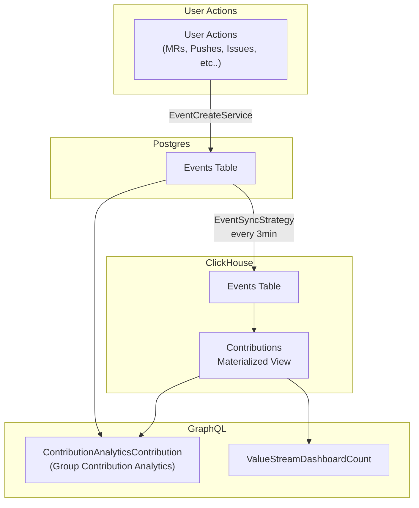
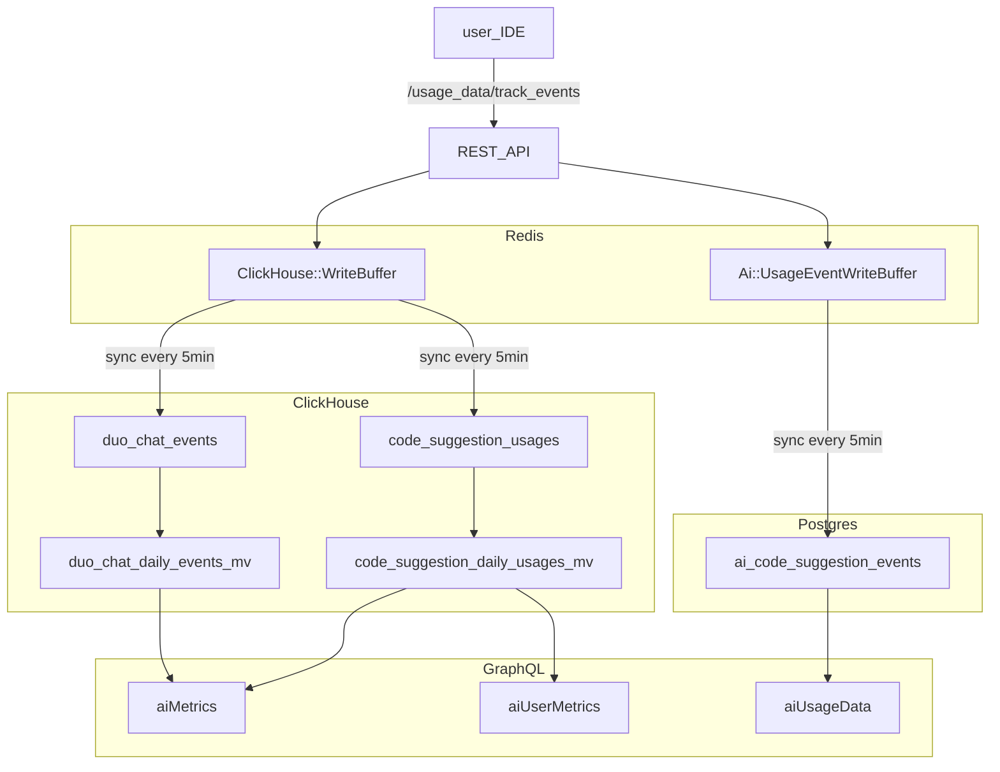

## Analytics:Optimize

**[Optimize FY26 の方向性と目標](https://gitlab.com/gitlab-org/gitlab/-/issues/512065)**

### 働き方

- [GitLab バリュー](/handbook/values/)に従います。
- 透明性を持って：ほぼすべてを公開し、可能な限りミーティングを録画・ライブストリーミングします。
- 取り組みたいことに取り組む機会を得ます。
- 誰もが貢献できる；サイロを作らない。
  - 目標は、プロダクトがエンジニアリングとデザインを最初から方向性と Issue の定義に関与させる機会を与えることです。
- グループのスタンドアップチャンネルで非同期の日次スタンドアップを行います:
  - [#g-optimize-engineers-standup](https://gitlab.enterprise.slack.com/archives/C07QLHAS02Z)
- Slack でチームに連絡するには: [#g_plan_optimize](https://gitlab.enterprise.slack.com/archives/CJZR6KPB4)
  - すべての Optimize チームメンバーは、質問の性質に関わらず、チームの Slack チャンネルへのリクエストのトリアージと回答を奨励されています。

#### 優先順位付け

私たちの優先順位は[プロダクト全体のガイダンス](/handbook/product/product-processes/)に従うべきです。これはスケジュールされた Issue の優先度ラベルに反映されるべきです:

| 優先度 | 説明 | マイルストーンでの出荷確率 |
| ------ | ------ | ------ |
| priority::1 | **緊急**: 特定のマイルストーンで達成するための最優先事項。これらの Issue はリリースにとって最も重要な目標であり、最初に取り組むべきです；一部は時間的に重要だったり他の依存関係をブロックしていたりします。 | ~100% |
| priority::2 | **高**: ビジネスまたは技術的負債に大きな好影響を与える重要な Issue。重要ですが、時間的に重要ではなく他をブロックしていません。 | ~75% |
| priority::3 | **通常**: 既存機能への段階的な改善。これらは重要なイテレーションですが、重要度が低いと見なされています。 | ~50% |
| priority::4 | **低**: 将来のリリースへの先送りが許容されるストレッチ Issue。 | ~25% |

一般的なガイドラインとして、各リリースを次のように計画することを目指しています:

- **バグ**: 25%
- **機能**: 50%
- **メンテナンス**: 25%

これらの目標は、[レトロスペクティブ](https://gitlab.com/gl-retrospectives/manage-stage/optimize/-/issues)で各リリース後に[月次でレビュー](/handbook/product/product-processes/)されます。

#### Optimize 機能全体のデータフローの SSoT

##### Contribution Analytics のデータフロー

**[グループ Contribution Analytics](https://docs.gitlab.com/ee/user/group/contribution_analytics) と [グループ Value Stream Dashboard コントリビューション](https://docs.gitlab.com/ee/user/analytics/value_streams_dashboard.html)のデータフロー**



##### AI Impact Analytics のデータフロー

**[グループ/プロジェクト AI Impact Analytics](https://docs.gitlab.com/ee/user/analytics/ai_impact_analytics.html) のデータフロー**



#### 作業の整理

私たちは一般的に [Product Development Flow](/handbook/product-development/how-we-work/product-development-flow/#workflow-summary) に従います:

1. `workflow::problem validation` - 解決すべき問題が明確でない
1. `workflow::design` - 明確な提案が必要（視覚的側面のモックアップも）
1. `workflow::solution validation` - エンジニアリングからの改善と承認が必要
1. `workflow::planning breakdown` - ウェイトの見積もりが必要
1. `workflow::scheduling` - マイルストーンの割り当てが必要
1. `workflow::ready for development`
1. `workflow::in dev`
1. `workflow::in review`
1. `workflow::verification` - コードは本番環境にあり、DRI エンジニアによる検証を保留中
1. `workflow::complete` - コードが検証され作業が完了しており、Issue はクローズされるべき

一般的に、Issue は 2つの状態のどちらかにあります:

- 発見/改善: 開発を開始できない質問にまだ答えている段階、
- 実装: Issue がエンジニアの対応を待っているか、または積極的に構築されている段階。

Basecamp はこれらの段階を[丘の登りと降り](https://basecamp.com/#features)として考えています。

個々のグループは [Product Development Flow](/handbook/product-development/how-we-work/product-development-flow/#workflow-summary) ワークフロー内で有用と思われる多くのステージを自由に使用できますが、Issue が発見/改善から実装に移行する方法についてはある程度規定的であるべきです。

##### チームの成果物の価値測定

顧客への価値フローを視覚化するため、計画から本番までの時間を測定するために [Value Stream Analytics](https://gitlab.com/groups/gitlab-org/-/analytics/value_stream_analytics?value_stream_id=1022&project_ids[]=278964&label_name[]=group%3A%3Aoptimize) を[ドッグフーディング](/handbook/engineering/development/principles/#dogfooding)しています。

##### バックログ管理

バックログ管理は非常に困難ですが、ラベルとマイルストーンを使用してそれを実施しようとしています。

###### 改善

**最終目標が定義されており**、すべての直接関係者が「はい、これは開発に向けて準備ができている」と言う状態です。Issue によっては素早く到達できるものもあれば、数回のやり取りが必要なものもあります。

目標は、エンジニアがロードマップに関与感を持つことです。エンジニアリングをより早い段階から含めることで、プロセスははるかに自然でスムーズになります。

そのため、エンジニアリングマネージャー、エンジニア、デザイナーは Issue から直接 ping を受けることができます。現在、グループメンバーにより簡単に ping できるようにするために [Manage プロジェクトをグループに変換する](https://gitlab.com/gitlab-org/manage/-/issues/16983)ことを検討しています。

改善が必要な Issue を見つけるには、[Next Up](#next-up) ラベルとその目的を参照してください。

###### Next Up

- 改善が必要な Issue を特定するには、"Next Up" ラベルを使用します。
  - "Next Up" ラベルの目的は、`workflow::ready for development` より前の_任意の_ワークフローステージにある Issue を特定することです。このワークフローラベルに加えて "Next Up" ラベルを使用することで、改善中のもの（例：問題、デザイン、ソリューション）を正確に確認できます。これにより、スケジュールに向けてどの Issue が準備に近づいているかを特定できます。
- Issue は、プロダクトとエンジニアリングの両方から 👍 を受けるまで、特定のリリース（例：13.0）のマイルストーンを受け取るべきではありません。これはまた、Issue に `workflow::ready for development` のラベルを付けるべきではないことも意味します。
  - プロダクトの承認は、Issue が `workflow::planning breakdown` に移行することで表されます。
  - エンジニアリングの承認は、その複雑さを測定する Issue ウェイトで表されます。

##### Issue の分解またはプロモーション

Issue の複雑さに応じて、Issue を分解またはプロモートする必要がある場合があります。いくつかのサンプルシナリオを示します:

- 他のことを行う前に、デザインの発見を行う必要があります。"Discovery:" Issue は、デザインの思考と議論をそこに含め、最終結果を "Implementation:" Issue に引き渡すのに最適です。これらのプレフィックスは、親 Issue やエピックにリンクされている場合に Issue の種類を整理するのにも役立ちます。
- 作業のスコープが予想より大きく、さらに分解する必要があります（例：現在のウェイトが 5 を超えている）。その Issue をエピックにプロモートし、提案された機能全体を提供するために必要な異なるイテレーションまたはフェーズを列挙するより小さな Issue に分解することが適切かもしれません。
- 作業のスコープは明確ですが、1つの Issue では少し扱いにくいです。すべての人に会話とアクティビティを見えるようにするために現在の Issue をそのまま保持しつつ、特定の Issue のより細かい進捗を追跡するために別の子デザイン、バックエンド、またはフロントエンド Issue を作成することが意味をなす場合があります。

上記のいずれも該当しない場合、Issue はおそらく現状のままで問題ありません！その場合、この Issue のウェイトはおそらく低く（例：1〜2）なっています。

##### Issue における議論、情報、決定、アクションアイテムの管理

[Issue の分解またはプロモーション](#breaking-down-or-promoting-issues)の一部として、特定の Issue には大量のスレッドやコメントがあることに気づくかもしれません。

Issue に参加するすべての関係者にとって、提案の詳細、保留中のアクションアイテム、決定が容易に見えるようにすることは非常に重要です。したがって、Issue の説明を最新の状態に保つか、上記のセクションに従って分解またはプロモートすることが最優先事項です。

#### 見積もり

Issue の作業を開始する前に、予備調査の後に見積もりを行うべきです。

特定の Issue の作業範囲が複数の分野（ドキュメント、デザイン、フロントエンド、バックエンドなど）に及び、それらにわたる大きな複雑さがある場合は、各分野の別々の Issue を作成することを検討してください（[例](https://gitlab.com/gitlab-org/gitlab-ee/issues/9288)参照）。

ウェイトのない Issue には "workflow::planning breakdown" ラベルを割り当てるべきです。

開発作業を見積もる際は、Issue に適切なウェイトを割り当ててください:

| ウェイト | 説明（エンジニアリング） |
| ------ | ------ |
| 1 | 最もシンプルな変更。副作用がないと確信できます。 |
| 2 | シンプルな変更（コード変更が最小限）で、すべての要件を理解しています。 |
| 3 | シンプルな変更ですが、コードの範囲が広い（例：多くの異なるファイルやテストが影響を受ける）。要件は明確です。 |
| 5 | コードベースの複数の領域に影響するより複雑な変更で、リファクタリングも含まれる場合があります。要件は理解されていますが、途中でギャップが生じる可能性があります。この Issue をより小さな部分に分解することを自らに課すべきです。 |
| 8 | コードベースの多くに影響するか、要件を決定するために他者からの多くのインプットが必要な複雑な変更。これらの Issue は多くの場合、`~workflow::ready for development` になる前にさらなる調査や発見が必要で、複数の小さな Issue から恩恵を受けることが多いです。 |
| 13 | 依存関係（他チームまたはサードパーティ）がある可能性があり、すべての要件をまだ理解していない重要な変更。マイルストーンにコミットすることはなく、要件をさらに明確化するか、より小さな Issue に分解することが望ましいです。 |

見積もりの一部として、エンジニアが取り組み始めるのに適切な状態だと感じる場合は、~"workflow::ready for development" ラベルを追加してください。あるいは、まだ定義すべき要件や回答すべき質問があってエンジニアが容易に解決できないと感じる場合は、~"workflow::blocked" ラベルを追加してください。`workflow::blocked` ラベルの Issue は計画ボードの独自の列に表示され、さらなる注意が必要であることが明確になります。`workflow::blocked` ラベルを適用する場合は、コメントを残し、ブロックされた Issue の DRI と担当者を ping して/ブロッキング Issue をリンクして可視性を高めてください。

##### 実装アプローチ

エンジニアは、Issue を `~workflow::planning breakdown` から移動させる際に実装アプローチを作成することができます。提案された実装アプローチは必ずしも従う必要はありませんが、記録されたウェイトを正当化するのに役立ちます。

`workflow::planning breakdown` の DRI として、監視の終わりと Issue がスケジューリングに移行する準備ができていることを示すために以下の例に従うことを検討してください。すでに分解されているより簡単な Issue はより短い形式を使用するかもしれませんが、計画は少なくとも常に見積もりの背後にある「なぜ」を正当化するべきです。

以下は [https://gitlab.com/gitlab-org/gitlab/-/issues/247900#implementation-plan](https://gitlab.com/gitlab-org/gitlab/-/issues/247900#implementation-plan) からの実装アプローチの例です。これは Issue を作業の各部分のより小さな Sub-Issue に分解すべき可能性が高いことを示しています:

```md
### Implementation approach

~database

1. Add new `merge_requests_author_approval` column to `namespace_settings` table (The final table is TBD)

~"feature flag"

1. Create new `group_merge_request_approvers_rules` flag for everything to live behind

~backend

1. Add new field to `ee/app/services/ee/groups/update_service.rb:117`
1. Update `ee/app/services/ee/namespace_settings/update_service.rb` to support more than just one setting
1. *(if feature flag enabled)* Update the `Projects::CreateService` and `Groups::CreateService` to update newly created projects and sub-groups with the main groups setting
1. *(if feature flag enabled)* Update the Groups API to show the settings value
1. Tests tests and more tests :muscle:
1. Create a seed script to generate data

~frontend

1. *(if feature flag enabled)* Add new `Merge request approvals` section to Groups general settings
1. Create new Vue app to render the contents of the section
1. Create new setting and submission process to save the value
1. Tests tests and more tests :muscle:
1. Update storybook stories for new and existing components
```

DRI が Issue を `workflow::scheduling` に移動させる前に、Issue が複数の分野（例：バックエンドとフロントエンド）にまたがる場合は、関連するカウンターパートまたはドメインエキスパートに ping することを**強く**推奨します。これにより、ドメインエキスパートが実装計画を承認したり、作業開始前に潜在的な落とし穴や懸念点を挙げる機会が得られます。

Issue が見積もられると、マイルストーンが割り当てられる `workflow::scheduling` に移動でき、最終的に `workflow::ready for development` になります。

#### 計画

私たちは[製品開発タイムライン](/handbook/engineering/workflow/#product-development-timeline)に従い月次サイクルで計画します。このタイムラインを守ることは個々のグループの裁量に委ねられています。典型的な Optimize の計画サイクルは次のようになります:

- 4日までに、プロダクトは次のリリースのために [Optimize Group Admin プロジェクト](https://gitlab.com/gitlab-org/analytics-section/optimize-group/admin/-/issues)にグループの計画 Issue を作成します。
  - この Issue には、リリースの暫定的な計画と、マイルストーンの提案作業を示すボードへのリンクを含める必要があります。
  - `Next 1 - 3 releases` マイルストーンでフィルタリングされたボードは、今後の Issue を把握するために使用されます。
  - ステージ戦略にとって特に重要な Issue は `direction` でマークされるべきです。
- 12日までに、次のリリースのために提案されたすべての Issue はエンジニアリングによってウェイトが割り当てられ（`workflow:ready for development`）見積もられるべきです。
  - キャパシティプランニングを支援するため、エンジニア 1人あたりのキャパシティを 10 ウェイトから始め、休暇、チームデー、オンコールスケジュール、その他の活動に基づいて削減します。EM は計画 Issue で予想されるキャパシティを記録します。
  - 前のリリースからスリップすることが判明している Issue は、残りの作業のために再ウェイト付けされ、次のリリースに再スケジュールされるべきです。
- 15日までに、プロダクトとエンジニアリングは `Next 1 - 3 releases` ボードの Issue リストを並べ替えます。
  - 利用可能かどうかに応じて、プロダクトまたはエンジニアリングがキャパシティを考慮し、各タイプカテゴリのトップ Issue を次のリリースに割り当てます。
  - エンジニアリングマネージャーは、コミットされた作業に ~Deliverable ラベルを割り当てます。
  - 計画プロセス全体は非同期で行われますが、プロダクトとエンジニアリングが追加の協力を必要とする場合、最終リリーススコープをレビューするための同期ミーティングはオプションです。

##### Deliverable と Stretch の Issue

`Deliverable` ラベルが付いた Issue は現在のマイルストーンにスケジュールされています。これらは最優先事項と見なされ、リリース時に完了することが期待されます。

`Stretch` ラベルが付いた Issue は、現在のマイルストーンでの提供のストレッチ目標です。これらの Issue が現在のリリースで完了しない場合、次のリリースで強く検討されます。

##### コミュニティコントリビューション

以前に合意され `Community contribution` のラベルが付けられた Issue は、以下のものが揃っているかどうかを確認するために[トリアージ](/handbook/product-development/how-we-work/issue-triage/)されるべきです:

- 明確な[実装計画](/handbook/engineering/devops/create/remote-development/community-contributions/#treat-wider-community-as-primary-audience)。
- 適切なウェイト見積もり。
- `Seeking community contributors` ラベルが割り当てられている。

トリアージが完了したら、Issue は `backlog` に追加して未割り当てのままにできます。Issue を割り当てることは、担当者が積極的にその Issue に取り組んでいることを示しますが、コミュニティメンバーが持つコードベースへの親しみやすさのレベルや時間的制約を考えると、MR が進行中になってから Issue を割り当てるのが最善です。

Issue をより早く処理する必要が明確な場合は、適切な優先度ラベルを割り当てて optimize チームメンバーが計画できるよう、マイルストーンに Issue をスケジュールすることを検討してください。

コミュニティメンバーが Issue を引き受けることに興味を示した場合、関連する Optimize チームメンバーは Issue の説明と実装計画が正確で最新の決定を反映していること、すべてのラベルが最新であることを確認し、コントリビューターが追加の支援を必要としているか続けることができなくなった場合に備えて進捗を監視すべきです。

##### セルフアサインメント

計画中、EM は意味があると感じた場合に個々のエンジニアに Issue を割り当てる場合がありますが、一般的に Issue は未割り当てのままにして、計画が確定したらエンジニアが自ら割り当てることができるようにします。

役割別の期待:

- EM: 計画 Issue が確定したらエンジニアに ping する。
- エンジニア: リリース開始前に Issue をセルフアサインする。
- EM: 週次チームコールで未割り当ての Issue を強調する。

#### リリース中

- キックオフ後にリリースに Issue が追加される場合、未計画の作業を考慮するために同量のウェイトを削除する必要があります。
- Issue が見積もられてウェイトが付けられる前に開発を開始すべきではありません。
- 15日までに、エンジニアリングのマージリクエストはマージされるべきです。言い換えると、15日以降にマージされたコードはリリースに含まれないと想定します。これにより、リリースを確定し、関連する[リリースポスト](/handbook/marketing/blog/release-posts/)を 17日までにマージする時間が確保されます。（これは [13.11 から始まる実験](https://gitlab.com/gitlab-org/manage/general-discussion/-/issues/17330)です。）

#### リリースポスト

より詳細に発表する必要がある Issue については、Issue を使用してリリースポストを自動的に作成できます。
Issue の計画中、またはデザインや開発中に、
[リリースポストアイテムジェネレーター](/handbook/marketing/blog/release-posts/#release-post-item-generator)を使用して、リリースポストを作成し、関連するすべての人に通知することができます。

Issue にリリースポストが必要ない場合は、Issue にリリースノートセクションがないこと、または `release post item::` ラベルを使用していることを確認してください。

#### 概念実証 MR

私たちは[イテレーション](/handbook/values/#iteration)と小さな単位で価値を提供することを強く信じています。イテレーションは難しい場合があります。特にプロダクトのコンテキストが不足していたり、コードベースの特にリスクが高く/複雑な部分で作業している場合はそうです。Issue を見積もるのが難しかったり、実現可能かどうか判断できない場合は、最初に概念実証 MR を作成することが適切かもしれません。概念実証 MR の目標は、計画中の主要な仮定を排除し、初期フィードバックを提供することで、将来の実装のリスクを軽減することです。

- `PoC:` というプレフィックスを付けた MR を作成します。
- MR の説明で PoC MR が解決しようとしている問題を説明します。
- タイムボックスを設定します。2〜3日以内に実現可能性または計画を決定できますか？
- この期間の終わりにフィードバックを提供するレビュアーを特定します。
- MR をクローズします。PoC から学んだこと（プロダクトとパフォーマンスへの影響を含む）の要約を元の Issue で提供します。
  - 実装を進めることができるかどうかを述べます。
  - Issue はクローズしないでください。

概念実証 MR の必要性は、コードベースやプロダクトの一部が過度に複雑になっているサインである可能性があります。将来この手順を回避する方法について議論できるよう、レトロスペクティブの一部として MR を必ず議論してください。

#### Issue トリアージ

私たちは一般的に[Issue トリアージ](/handbook/product-development/how-we-work/issue-triage)ガイドラインに従います。

役割別の期待:

- PM は `type::feature` の DRI
- EM は `type::bug` の DRI
- UX は `UX`、`Deferred UX`、`SUS` の Issue の重大度ラベルに関する決定をサポートします
  - UX の重大度と PM/EM の重大度が異なる場合、[二者のうちより高い重大度](/handbook/product-development/how-we-work/issue-triage/#examples-of-severity-levels)を採用します。
- エンジニアの参加を奨励します

週次で、できるだけ多くの Issue をトリアージすることを目指します。トリアージが必要な Issue に[完全なトリアージ](/handbook/product-development/how-we-work/issue-triage/#complete-triage)を実行するよう努めます。

### スケジュールされていない Issue への取り組み

GitLab の全員は、結果を測定し時間を測定しないため、自分の裁量で作業を管理する自由があります。その一部として、定期的な月次リリースの一部としてスケジュールされていないアイテムに取り組む機会があります。これはハンドブックの他の場所にある内容の繰り返しが多く、それらを明示するためにここに記載しています:

1. 私たちは人々が[自分自身のマネージャー](/handbook/values/#managers-of-one)であることを期待し、[自分たち自身で GitLab を使用します](/handbook/values/#dogfooding)。重要だと思うことを見つけた場合、スケジューリングを要求したり、[自分で提案に取り組む](/handbook/values/#dont-wait)ことができます。_ただし、他の優先事項を念頭に置いてください_。
1. 時々、[issue bash](https://about.gitlab.com/community/issue-bash/) などの GitLab チームメンバーが参加できるイベントがあります。誰でも参加できます。

何か取り組むものを選ぶ際は:

1. 標準的なワークフローに従い、自分に割り当てます。
2. [透明性](/handbook/values/#transparency)を促進するために `#g_plan_optimize` で共有します。

### その他の考慮事項

#### キャパシティプランニング

計画中、各マイルストーンで成果物の作業にチームのキャパシティの 100% を計画しません。代わりに、調査とスコープ作業のためにより多くの時間を確保するために、チームメンバー 1人あたり 15% のバッファを確保します。

#### ドキュメント

ドキュメントは[完了の定義](https://docs.gitlab.com/ee/development/contributing/merge_request_workflow.html#definition-of-done)の重要な部分です。テクニカルライティングが必要な変更については、documentation ラベルを追加します。documentation ラベルはバックエンド/フロントエンドラベルに加えて使用されるべきです。機能が別々のバックエンドとフロントエンドの Issue を正当化する場合、applicable であれば documentation ラベルをそれぞれの Issue に適用すべきです。Issue は、技術的な部分とドキュメントの変更の両方がマージされた場合にのみ解決されます。

#### データシードスクリプト

Optimize のスコープ内の機能は、機能を確認して開発中にテストするために適切なデータが必要です。データシードスクリプトは開発プロセスの一部として作成/更新されるべきです。

データシードスクリプトの考慮事項:

- 関連する場合にグループまたはプロジェクト ID を指定できるようスクリプトをパラメーター化する
- スクリプトが失敗せずに繰り返し実行できるようにする

#### フィーチャーフラグ

私たちは、顧客にエンタープライズレベルのユーザーエクスペリエンスを提供するために[必要に応じてフィーチャーフラグを使用します](/handbook/product-development/how-we-work/product-development-flow/feature-flag-lifecycle/)。不必要なフィーチャーフラグを避け、導入時にその目的が明確で、ロールアウトの依存関係とタイムラインが更新され続けることを確保します。可能な限り長期的なフィーチャーフラグを最小化し、変更を伝達するよう努めます。

私たちが所有するフィーチャーフラグに関連する以下の役割と責任があります:

- [DRI](/handbook/people-group/directly-responsible-individuals/) の割り当て
  - フィーチャーフラグを導入する作者がそのフィーチャーフラグのロールアウトの DRI です。
- 監査とクリーンアップ
  - EM はステージ内で所有するフィーチャーフラグの監査の DRI であり、フィーチャーフラグ DRI と協力してクリーンアップをスケジュールします。
- プロセス改善
  - 誰もがプロセス改善に貢献することが奨励されます。

## ミーティング

非同期コミュニケーションに傾倒していますが、同期ミーティングは必要であり、[コミュニケーションガイドライン](/handbook/communication/#video-calls)に従うべきです。Manage で定期的に行われるミーティングの一部を以下に示します:

| 頻度 | ミーティング | DRI | 可能なトピック |
|-----------|--------------------------------------|-------------|--------------------------------------------------------------------------------------------------------|
| 週次 | グループレベルミーティング | エンジニアリングマネージャー | ボードを確認して現在のリリースが順調かどうかを確認し、特定の Issue のブロックを解除します |
| 月次 | 計画ミーティング | プロダクトマネージャー | [計画](/handbook/engineering/devops/plan/)セクションを参照 |

一度限りのトピック固有のミーティングについては、常にこれらのコールを録画して共有することを検討してください（または[公開されているドキュメント](https://docs.google.com/document/d/1kE8udlwjAiMjZW4p1yARUPNmBgHYReK4Ks5xOJW6Tdw/edit)にメモを取ります）。

アジェンダドキュメントと録画は、唯一の情報源として[共有 Google ドライブ](https://drive.google.com/drive/u/0/folders/0ALpc3GhrDkKwUk9PVA)（内部のみ）に保存できます。

1対1や機密トピックをカバーするもの以外のミーティングは、Manage 共有カレンダーに追加されるべきです。

すべてのミーティングは、少なくとも 12時間前にアジェンダを準備する必要があります。そうでない場合は、ミーティングへの出席は義務付けられません。ミーティング開始時点でアジェンダがない場合は、ミーティングはキャンセルされたとみなします。

## グループメンバー

以下の方々がグループの常任メンバーです:


<p class="my-3 text-sm text-gray-600 italic">チームメンバー情報は <a href="https://handbook.gitlab.com/handbook/engineering/data-engineering/analytics/optimize/" rel="external noopener">原文 (英語)</a> を参照してください。</p>


## リンクとリソース {#links}

- [マイルストーンレトロスペクティブ](https://gitlab.com/gl-retrospectives/manage-stage/optimize/-/issues)
- Slack チャンネル
  - Plan:Optimize [#g_plan_optimize](https://gitlab.slack.com/messages/CJZR6KPB4)
  - 日次スタンドアップ [#g-optimize-engineers-standup](https://gitlab.enterprise.slack.com/archives/C07QLHAS02Z)
- Issue ボード
  - Optimize [build ボード](https://gitlab.com/groups/gitlab-org/-/boards/1401511) と [refinement ボード](https://gitlab.com/groups/gitlab-org/-/boards/1874426)ֿ
- Optimize グループの計画とビジョンについての詳細は[グループページ](/handbook/product/categories/)を参照してください。
