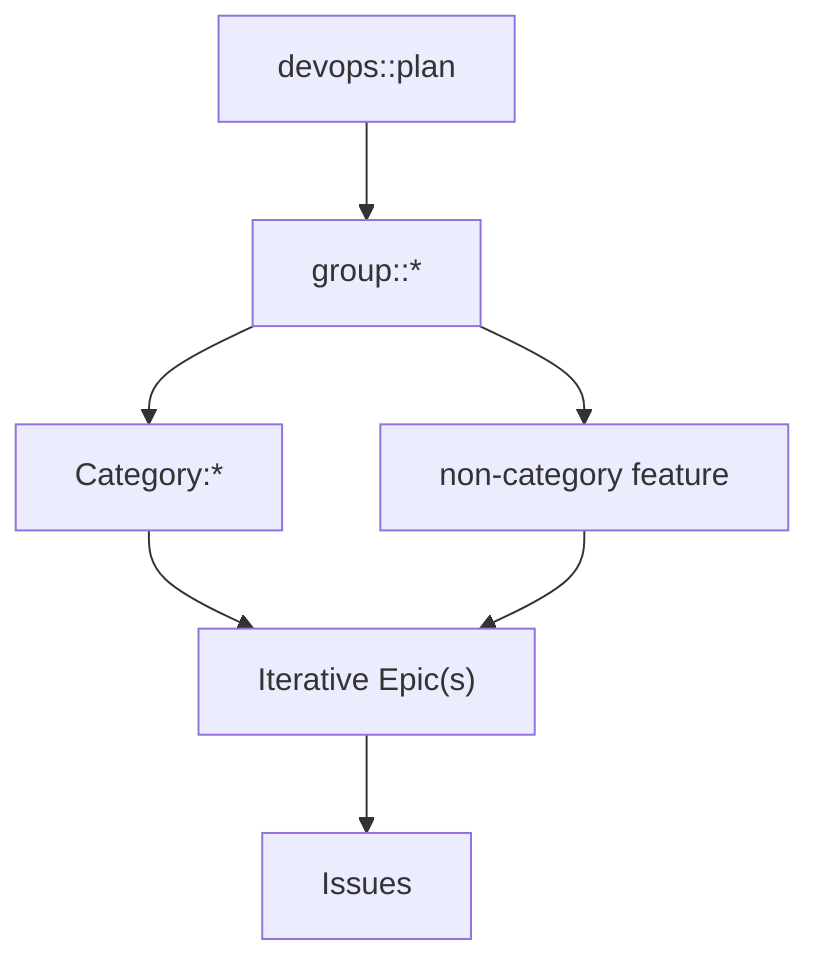
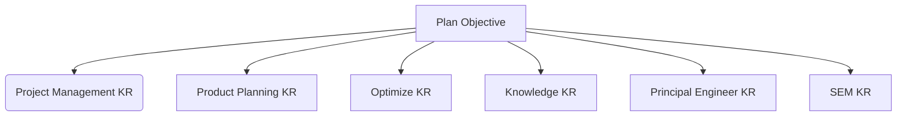

Plan チーム:

- [Plan:Project Management チーム](/handbook/engineering/devops/plan/project-management/)
- [Plan:Product Planning チーム](/handbook/engineering/devops/plan/product-planning/)
- [Plan:Knowledge チーム](/handbook/engineering/devops/plan/knowledge/)

このチームの責務は [Plan ステージ](/handbook/product/categories/#plan-stage) によって定義されています。具体的には、Issue、ボード、マイルストーン、Todo リスト、Issue リストとフィルタリング、ロードマップ、タイムトラッキング、要件管理、通知、バリューストリーム分析（VSA）、Wiki、Pages など、GitLab の機能について取り組んでいます。

- 質問があります。誰に聞けばいいですか？

GitLab の Issue では、まず [対応する Plan ステージグループ](/handbook/product/categories/#plan-stage) のプロダクトマネージャーを @ メンションすることから始めてください。GitLab チームメンバーは [#s_plan](https://gitlab.slack.com/messages/C72HPNV97) も利用できます。

UX に関する質問は、Plan ステージのプロダクトデザイナーを @ メンションしてください。Plan:Project Management は [Nick Leonard](https://gitlab.com/nickleonard)、Plan:Product Planning は [Nick Brandt](https://gitlab.com/nickbrandt)、Plan:Optimize は [Libor Vanc](https://gitlab.com/lvanc) です。Plan:Knowledge はデザイナーを持たないグループの[プロセス](/handbook/product/product-processes/)に従ってください。

### 私たちの働き方

- [GitLab バリュー](/handbook/values/) に従って働きます。
- 透明性を持って: ほぼすべてのことが公開されており、可能な限り会議を録画/ライブストリーミングしています。
- 取り組みたいことに取り組む機会があります。
- 誰でも貢献できます。サイロはありません。
- [#s_plan_standup](https://gitlab.slack.com/messages/CF6QWHRUJ) でオプションの非同期デイリースタンドアップを行っています。

### ワークフロー

マイルストーンと [GitLab のプロダクト開発フロー](/handbook/product-development/how-we-work/product-development-flow/) に合わせながら、継続的な Kanban 方式で作業しています。

#### キャパシティプランニング

将来のリリースのキャパシティを計画する際、以下の点を考慮します:

1. 次のリリース中のチームの稼働状況（メンバーが休暇を取るか、他の要求がある場合など）。
1. 現在開発中だが完了していない作業。
1. グループごとの過去の実績（ウェイト別）。

最初の項目は最大キャパシティとの比較を可能にします。例えば、チームに4人いて、そのうちの1人が月の半分を休暇にとる場合、チームの最大キャパシティの 87.5%（7/8）があると言えます。

2番目の項目は難しく、特にその Issue が他の Issue をブロックしている場合、一度着手した Issue に残っている作業量を過小評価しがちです。私たちは現在、キャリーオーバーした Issue のウェイトを再設定しない（元のウェイトを保持するため）ので、これは現時点では少し曖昧なままです。

3番目の項目はこれまでの進め方を示しています。傾向が下降している場合は、[回顧](#retrospectives) で話し合いましょう。

キャリーオーバーのウェイト（項目2）を期待されるキャパシティ（項目1と3の積）から差し引くと、次のリリースのキャパシティがわかります。

#### 工数の見積もり

Plan 内のグループは、今後の作業を見積もる際に同じ数値スケールを使用します。


<!-- include omitted: includes/engineering/plan/estimating-effort.md (no localized version under content/ja/) -->


#### Issue

Issue には以下のライフサイクルがあります。各ワークフロー段階の上にある色付きの丸は、Issue のライフサイクル全体にわたるコラボレーションを重視していることを示しています。また、Issue がプロセスのどの段階にあるかによって、各職能が必要とする作業量は自然に異なります。このイラストを改善する提案があれば、[whimsical ダイアグラム](https://whimsical.com/2KEwLADzCJdDfPAb2CULk4) に直接コメントを残すことができます。


誰もが、Issue が他の場所に属すると感じた場合は、別のワークフローに移動することを推奨しています。Issue を常に整理された状態に保つために、Issue を別のワークフロー段階に移動する際は、Issue 内の未解決の議論を確認し、決定事項を説明文に更新してください。これにより、説明が[明確に記載](/handbook/values/#say-why-not-just-what)され、透明性のバリューを維持できます。

#### Epic

Issue が `> 3 ウェイト` の場合は、Epic に昇格させ（クイックアクション）、複数の Issue に分割してください。新たに昇格した Epic に、各タスクが垂直フィーチャースライス（MVC）を表すタスクリストを追加すると便利です。これにより、タスクリストから新しい Issue を作成することで、下流に実装の余地ができた時点で「ジャストインタイムプランニング」を実践できます。Epic から新しい垂直フィーチャースライスを作成する際は、適切なラベル（`devops::plan`、`group::*`、`Category:*` またはフィーチャーラベル、および適切な `workflow stage label`）を追加し、より大きな Epic を表すすべてのストーリーを添付することを忘れないでください。これにより、ロードマップ上でより大きな取り組みを把握しやすくなり、スケジュールを組みやすくなります。

#### 設計ドキュメント

すべてのティア T1 および T2 のロードマップ項目と、複数のマイルストーンにまたがるイニシアチブに対して、[アーキテクチャ設計ワークフロー](../../architecture/workflow/) を使用して[設計ドキュメント](../../architecture/design-documents/)を作成することを推奨します。
このアプローチにはいくつかのメリットがあります:

1. **単一情報源（SSOT）**: 設計ドキュメントはイニシアチブに関連するすべての重要な情報の中心的な場所となり、様々な場所にある意思決定を検索する時間を削減します。
2. **可視性の向上**: 設計ドキュメントを作成することで、[ワークアイテムフレームワーク](../../architecture/design-documents/work_items/)、[設定可能なワークアイテムタイプ](../../architecture/design-documents/configurable_work_item_types/)、[カスタムフィールド](../../architecture/design-documents/work_items_custom_fields/)、[カスタムステータス](../../architecture/design-documents/work_items_custom_status/)、[GLQL](../../architecture/design-documents/glql/)、フロントエンド主導のビューなど、Plan ステージで行われた作業の認知度を高めます。
3. **発見可能性**: 設計ドキュメントは[公開ハンドブックを通じて](../../architecture/design-documents/)簡単にアクセスでき、エンジニアリングのベストプラクティスに沿っています。
4. **協働的な意思決定**: [変更と議論はマージリクエストを通じて行われます](../../architecture/workflow/#why-are-design-documents-tracked-in-merge-requests)。これにより、関係するすべてのチームメンバーに可視性が確保されます。
5. **包括的なエントリポイント**: 設計ドキュメントはイニシアチブの主要なエントリポイントとして機能し、以下が含まれます:
   - エグゼクティブサマリー
   - 関連する Epic、Issue、Wiki ページへのリンク
   - ステータス更新へのリンク
   - 実装の詳細
   - 意思決定ログまたはドキュメント内に埋め込まれた意思決定
   - 関連するボードやダッシュボードへのリンク

この包括的なアプローチにより、チームメンバーのオンボーディングが容易になり、ステークホルダーは必要なすべての情報を一か所で確認できます。

すべてのイニシアチブに推奨されるワークフローは次のとおりです:

1. `#f_[機能名]` の規約で Slack チャンネルを作成する。
2. アーキテクチャ進化ワークフローを使って設計ドキュメントを作成する。
   [このテンプレート](https://gitlab.com/gitlab-com/content-sites/handbook/-/blob/main/content/handbook/engineering/architecture/design-documents/_template.md?plain=1) を使って始めてください。
   すべてのセクションを埋める必要はありません。これは生きたドキュメントであり、時間とともに進化することが期待されます。
3. Epic 階層は、各マイルストーン内で達成可能なイテレーションにマッピングされたサブ Epic で作成されます。
4. イテレーションは独立して達成可能な複数の Issue に分割され、PM が通常通りにスケジュールします。
5. 定期的な「オフィスアワー」コールなど、他のアクションが確立される場合があります。

チームメンバーは、複雑さが明らかになるにつれてイテレーションを継続的に改善し、設計ドキュメントを更新するために協力する必要があります。このアプローチにより、すべてのステークホルダーがイニシアチブの進捗と実装の詳細を明確かつ最新の状態で把握できます。

### ロードマップ

GitLab のプロダクト開発において、プロダクトは **何を** および **なぜ** に責任を持ち、エンジニアリングは **どのように** および **いつ** に責任を持ちます [[1](https://docs.google.com/presentation/d/1xd2-G8i68dNOd-dsa78xzYectz68T2EETQz2wJye6EA/edit#slide=id.g30963720e56_3_516)]。信頼できるロードマップを維持することは、そのため両者からのインプットを必要とする共同作業です。

プロダクトロードマップは、チームが4〜6四半期のタイムラインで達成しようとすることを概説します。Go-to-Market 戦略との整合性を確保し、顧客への確実なコミットメントを可能にするために、組織全体で共有されます。

プロダクトマネージャーによる Plan プロダクトロードマップへの変更は、影響を受けるグループのエンジニアリングマネージャーによってレビューおよび承認されます。これは少なくとも月に1回行われ、[Wiki ページ](https://gitlab.com/gitlab-org/plan-stage/plan-engineering/-/wikis/Plan-Roadmap-Signoffs) に記録されます。

ロードマッププランニング中にレビューされるほとんどの項目は、エンジニアリングからの詳細な技術調査がまだ行われていません。この解像度でのプランニングは、思慮深くあることを意図しているものの、完璧である必要はありません。速度は[私たちの優先事項](/handbook/engineering/development/principles/#velocity) であり続けます。

#### ロードマップのレビュー

レビューを行うことで、エンジニアリングマネージャーはロードマップが達成可能かどうかを確認し、速度を最大化するための効果的なシーケンスを確保するという重要な役割を担います。思慮深いレビューをガイドするいくつかのベストプラクティスを以下に示します:

- 達成可能性の評価: チームの現在のキャパシティ、スキル、依存関係を考慮した場合、タイムラインは現実的ですか？
- 技術的準備の考慮: ロードマップはスパイクや調査などの必要な技術的準備のための時間を確保していますか？
- チームの活用の最適化: 作業のシーケンスはチームのスキルプロファイルと一致しており、活用不足やスキルミスマッチの時期を避けていますか？
- 冗長性の評価: 1つの項目が予想よりも長くかかった場合、ロードマップの残りの部分はどの程度堅牢ですか？
- 要件の明確化: 提案された変更のそれぞれを十分に理解していますか、または追加情報が必要ですか？
- 共有理解の確保: あなたとプロダクトおよび UX のカウンターパートは、使用されるすべての用語について共通の理解を持っていますか？
- 最適化の機会を探る: 作業の順序を調整することでイテレーションを行ったり速度を上げたりする機会を特定しましたか？
- 摩擦の軽減: 作業のシーケンスは、複数のエンジニアが同時にコードベースの同じ領域にコミットするなど、避けられる競合を引き起こしそうですか？
- プロセス主導の遅延の特定: キャパシティの制約ではなくプロセスの要件（マルチバージョン互換性など）のために時間がかかると予想される項目はありますか？
- クロスチームの依存関係の考慮: タイムラインの一部をリスクにさらす可能性のあるクロスチームの依存関係はありますか？
- バッファの組み込み: 予期せぬ休暇や重大度の高いインシデントなどの外部ショックに対して、一定のキャパシティが確保されていますか？
- 経験に頼る: ロードマップ全体を見て、最近の四半期について考えたとき、達成可能に見えますか？

#### ロードマップの構成



### ロードマップの実行

すべてのロードマップのコミットメントには、その成果に対して直接責任を負う個人（DRI）がいます。これは通常、スコープの明確化、依存関係の調整、進捗のコミュニケーションなどのプロジェクト管理活動をリードする [Tech Lead](/handbook/engineering/careers/ic-leadership/tech-lead/#the-tech-lead-role) です。グループ内のエンジニアが Tech Lead の役割を担うキャパシティを持たない場合、エンジニアリングマネージャー（EM）が代わりに担当することがあります。いずれの場合も、EM はロードマップ全体の実行とクロスチームの調整に最終的な責任を負います。

プロジェクトマネージャーはスコープを明確にし、依存する作業を特定し、ワークストリームの DRI を任命し、リスクとブロッカーが優先されることを確保します。

DRI はプロジェクトのタイムライン、プロジェクトのステータス、作業項目へのリンク、主要な参加者、[ドッグフーディング提案](#dogfooding)、および意思決定の記録を含む Wiki ページまたは設計ドキュメントを維持します。これはすべての重要なプロジェクト、特にティア1およびティア2のロードマップコミットメントに対して推奨されます。クロスファンクショナルなコラボレーションを大幅に改善し、行われた意思決定が確実に記録される単一情報源（SSoT）として機能します。以前の例を以下に示します:

- [設定可能なステータス](/handbook/engineering/architecture/design-documents/work_items_custom_status/)
- [カスタムフィールド](https://gitlab.com/gitlab-org/plan-stage/project-management-group/team-project/-/wikis/projects/Custom-Fields/Dashboard)
- [Issue ワークアイテムタイプ](https://gitlab.com/gitlab-org/plan-stage/project-management-group/team-project/-/wikis/projects/Issues%20to%20work%20items/issues-to-work-items)
- [Epic ワークアイテムタイプ](https://gitlab.com/gitlab-org/plan-stage/work-items-ga-epics/-/wikis/home)

#### 内部テスト

Plan Engineering は、顧客にリリースする前に定期的に新機能を内部でテストしています。顧客に提供する作業の品質を向上させるための取り組みの一環として、このプロセスは2つの部分に分かれています。

##### アルファテスト

継続的な開発中に行われるテスト。これは `gitlab-org`、`gitlab-com`、または `gitlab-org/gitlab` 以外の GitLab のサブグループやプロジェクトに限定されます。Plan ステージには、テスト用に利用可能な2つのグループがあります: [gl-demo-ultimate-plan-stage](https://gitlab.com/gl-demo-ultimate-plan-stage/) と [gitlab-org/plan-stage](https://gitlab.com/gitlab-org/plan-stage)。

##### エンドオブラインテスト

エンドオブライン（EOL）テストは、顧客へのリリース前の最終ステップです。完成したプロダクトはすべての GitLab チームメンバーに提供され、通常は `gitlab-com` および `gitlab-org` グループに対して有効化されます。これにはフィードバック Issue を使った内部フィードバックの収集が伴います。このテスト期間の最低期間はエンジニアリングマネージャーが決定します。

この時点では、重大な正当性がなく、テスト期間を再スタートしない限り、新しいスコープは受け付けられません。テスト中に特定された欠陥とフィット＆フィニッシュの問題のみが対応されます。

このプラクティスにより、同時に複数の項目がエンドオブラインテスト中にある場合でも、テスト対象のシステムが顧客に提供しようとしているものにできる限り近いものになることが確保されます。

#### ドッグフーディング {#dogfooding}

ドッグフーディングは機能の準備状況への信頼を構築し、顧客に届く前に欠点を特定するのに役立ちます。ほとんどの場合、改善が内部で有用なワークフローに採用できない場合、顧客にも届かないと予想されるべきです。ドッグフーディングの機会を事前に特定することで、最小限の価値ある変更に含めるべきものについてのコンセンサスに達するのに役立ちます。

ドッグフーディングの機会は仮定的ではなく、意味のあるものである必要があります。新しいワークフローが採用されるか、既存のワークフローが補完または改善されるか、あるいは不要になります。

プロジェクトリードは最終テストフェーズ中にドッグフーディングを実装するよう努め、ある程度の採用が見られることを期待します。

### 顧客との対話

私たちは、顧客とのすべての会話でクロスファンクショナルな代表者を持つことを目指しています。

#### 顧客との会話カレンダー

セールスを通じて顧客とのコールをスケジュールしている方、ユーザビリティリサーチを行っている方、または顧客や見込み客と話す時間を設定している方は、イベントに招待者として [Plan 顧客との会話カレンダー](https://calendar.google.com/calendar/u/0/embed?src=gitlab.com_5icpbg534ot25ujlo58hr05jd0@group.calendar.google.com) を追加することを推奨します。これにより、今後の顧客やユーザーとのやり取りが共有カレンダーに自動的に反映されます。すべてのチームメンバーは参加を歓迎されており、ただ聞いてコンテキストを得るだけでも参加が推奨されます。

カレンダーを購読し、スケジュールしている顧客ミーティングの参加者として招待するには、URL [gitlab.com_5icpbg534ot25ujlo58hr05jd0@group.calendar.google.com](mailto:gitlab.com_5icpbg534ot25ujlo58hr05jd0@group.calendar.google.com) を使用してください。

#### 顧客コールをシャドウする

すべてのチームメンバーは顧客コールへの参加を歓迎されており、ただ聞いてコンテキストを得るだけでも参加が推奨されます。

今後のコールがカレンダーに表示されるようにするには、Plan 顧客との会話カレンダーを購読してください。プロダクトマネージャーは今後の顧客インタビューをこのカレンダーに追加するので、どのコールにもシャドウとして参加できます。

1. GCal の左サイドバーで「その他のカレンダー」の横にある + をクリックする
1. 「カレンダーを購読」を選択する
1. 「カレンダーを追加」の入力フィールドに gitlab.com_5icpbg534ot25ujlo58hr05jd0@group.calendar.google.com を貼り付ける

今後の顧客コールは事前に #s_plan チャンネルでも宣伝されることが多いので、そちらも確認してください。

#### 過去のコールを確認する

顧客の同意を得た上で録画されたすべての顧客コールは、Dovetail の Plan チームメンバーが閲覧できます。

アクセスするには、Dovetail の [Plan 顧客コール](https://gitlab.dovetailapp.com/projects/3Smr4JOoU7a5pnWqazMfr2/readme) プロジェクトに移動し、Google SSO でログインするだけです。このプロジェクトの Readme に詳細情報が掲載されています。

アクセスできない場合は、Plan PM に連絡してビューワーとして追加してもらうよう依頼してください。

#### 過去の UX リサーチコールを確認する

UX リサーチコールは、バイアスを軽減し、ユーザーニーズおよび/またはプロダクトのユーザビリティに関連する特定の質問に対処するために設計されたスクリプト化されたコールです。UX リサーチコールの一部は、「UXR - Research and Validation」という列にある [Plan 顧客コール](https://gitlab.dovetailapp.com/projects/3Smr4JOoU7a5pnWqazMfr2/readme) Dovetail プロジェクトで閲覧できます。

### ボードリファインメント

私たちは、[Plan プロジェクト](https://gitlab.com/gitlab-org/plan) の GitLab Issue を使用して、非同期で多くのボードリファインメントタスクを実施しています。これらの Issue のポリシーは [triage-ops/policies/plan-stage](https://gitlab.com/gitlab-org/quality/triage-ops/tree/master/policies/plan-stage) で定義されています。[~"Plan stage refinement" ラベルでフィルタリング](https://gitlab.com/gitlab-org/plan/issues?label_name%5B%5D=Plan+stage+refinement)することで、リファインメント Issue の完全なリストが確認できます。

### 今後のリリースにおけるコミット済み作業の追跡

私たちは継続的な Kanban 方式で作業していますが、Issue や Epic がマイルストーンの期限までに完了するかどうかを報告し、伝達できるようにしたいと思っています。ステータスの洞察と明確さを提供するために、優先 Issue に [Issue/Epic ヘルスステータス](https://docs.gitlab.com/ee/user/project/issues/index.html#health-status) を活用します。

### ヘルスステータスを正確に保つ

マイルストーンの開始時に、Deliverable Issue は自動的に「On Track」に更新されます。マイルストーンが進むにつれて、担当者はリスクや懸念を迅速に表面化させ、Issue を「On Track」に戻すためのコラボレーションを開始するために、必要に応じてヘルスステータスを更新する必要があります。

マイルストーンの特定のポイントで、Issue が進捗しない場合、ヘルスステータスは自動的に低下します。担当者は、同意しない場合はいつでもこの設定を上書きできます。この自動化を管理するポリシーは[こちら](https://gitlab.com/gitlab-org/quality/triage-ops/-/blob/master/policies/groups/gitlab-org/hygiene/adjust-health-status.yml)です。任意の個別 Issue に ~"Untrack Health Status" ラベルを追加することで無効にできます。

#### Plan のヘルスステータスの定義

- _On Track_（順調）- この Issue が現在のマイルストーンで完了してライブになることを確信している
- _Needs Attention_（要注意）- 放置すると Issue がターゲットリリースに間に合わなくなる懸念、新しい複雑さ、または未回答の質問がある。On Track に戻るための協力が必要
- _At Risk_（リスクあり）- 現在の状態では、Issue は計画されたリリースに間に合わず、状況を是正するための即座の対応が必要

#### リスクのフラグ立ては否定的なことではない

いかなる項目のヘルスステータスを「Needs Attention」または「At Risk」に変更することも、否定的な行動でも、不安や懸念の原因でもないことを、文書化して伝達することが重要だと感じています。リスクを早期に提起することで、チームがより迅速に問題に対応して解決できるようになり、奨励されるべきことです。

### OKR

#### 現在の四半期の OKR

FY25-Q2 ステージレベルの目標は[こちら](https://gitlab.com/gitlab-com/gitlab-OKRs/-/issues/?sort=created_date&state=opened&label_name%5B%5D=devops%3A%3Aplan&label_name%5B%5D=division%3A%3AEngineering&amp;not%5Blabel_name%5D%5B%5D=group%3A%3A%2a&type%5B%5D=objective&milestone_title=FY25-Q2&first_page_size=20)（社内限定）から確認できます。

#### 前の四半期の OKR

FY25-Q1 ステージレベルの目標はすべて 74% から 88% の間で達成済みであり、[こちら](https://gitlab.com/gitlab-com/gitlab-OKRs/-/issues/?sort=created_date&state=closed&label_name%5B%5D=devops%3A%3Aplan&label_name%5B%5D=division%3A%3AEngineering&amp;not%5Blabel_name%5D%5B%5D=group%3A%3A%2a&type%5B%5D=objective&milestone_title=FY25-Q1&first_page_size=20)（社内限定）から確認できます。

#### GitLab を使った OKR の作成

GitLab での OKR へのアプローチについては、ビデオガイドを含むガイダンスが [GitLab での OKR へのアプローチ](/handbook/company/okrs/) に掲載されています。
GitLab は現在、OKR 階層の構造化についていくらかの自由度を提供しています。Plan では以下のアプローチをとっています:

- EM は独自の OKR 構造を作成せず、ステージレベルの目標の直下にグループレベルの KR を作成することを推奨します。
- グループの KR とステージの目標は、組織のどこかに存在できる上位の目標に紐付けられるべきです。OKR の策定において、ステージレベルの目標は CEO の KR に直接紐付けられました。
- 進捗のロールアップが見えるように、親の**子目標およびキーリザルト**として作成または追加する必要があります。
- プロダクト開発の目標はマイルストーンプランニングで確立され、通常の[プロダクト開発フロー](/handbook/product-development/how-we-work/product-development-flow/)に従いますが、OKR では行いません。

このようにすることで、階層ができる限りシンプルで、一貫性があり、浅いものになることを確保します。これにより、OKR の階層の視覚化が現在良好でないため、ナビゲーションと可視性が向上します。

有効な単一の OKR 階層の例:



オーナーシップはラベルと担当者を使って示します。ラベルはグループおよび/またはステージを示し、担当者は DRI を示します。

OKR には以下のラベルが必要です:

- グループ、ステージ、およびセクション（適切な場合）。
- 他の機能と区別するための部門（~"Division::Engineering"）。
- DRI が OKR を更新することが期待される頻度に応じた updates::[weekly, semi-monthly, monthly]。

### 回顧 {#retrospectives}

Plan ステージは [GitLab Issue を使って毎月非同期で回顧を実施](https://gitlab.com/groups/gl-retrospectives/plan-stage/-/issues/?label_name%5B%5D=retrospective)しています。毎月の回顧は、クローズ時に公開される機密 Issue で実施されます。これらの Issue のオープン中の機密性は [GitLab SAFE フレームワーク](/handbook/legal/safe-framework/) に準拠しています。

必要に応じて、内部ノートの使用をさらに SAFE ガイドラインへの準拠を促進するために推奨します。内部ノートは、Issue が公開された後も、親グループのゲストユーザーを含む回顧の参加者に対して機密のまま残ります。

SAFE ガイドラインに従って機密のままにすべき情報の例として、公開されていない会社の機密情報、一般に知られていないまたは外部から入手できない可能性のある機密と見なされる情報を明らかにするデータ、および重要な非公開情報が挙げられます。

回顧 Issue は
[async-retrospectives](https://gitlab.com/gitlab-org/async-retrospectives) プロジェクトのスケジュールされたパイプラインによって作成されます。その後、マイルストーンが完了すると、出荷された成果物と見逃した成果物で更新されます。仕組みの詳細については、そのプロジェクトの README を参照してください。

各 EM は、要約と是正措置とともに、グループの回顧を実施および締めくくる DRI です。

DRI の役割は、チームメンバーが率直なフィードバックを提供できる心理的に安全な環境を促進することです。そのため、直接参加は控え、代わりに回顧プロセス自体を宣伝し、締めくくり、改善することに専念してください。

#### タイムライン

- **27日（前月）** 進行中のマイルストーンの回顧 Issue が自動的に作成されます。
- **18日** マイルストーンが**クローズ**され、ビルドフェーズにあるオープン Issue には ~"missed deliverable" のラベルが付きます。
- **21日** Issue の説明は出荷された成果物と見逃した成果物で自動的に更新され、チームメンバーにフィードバックの追加が求められます。
- **4日（翌月）** #s_plan で最終的なリマインダーが自動的に作成されます。
- **5日（翌月）** DRI が[回顧を締めくくり](#concluding-the-retrospective)ます。

#### マイルストーン回顧でのバリューストリーム分析（VSA）のドッグフーディング

回顧のデータドリブンな体験を向上させるために、VSA を[ドッグフーディング](/handbook/engineering/development/principles/#dogfooding)して[回顧のデータ収集](https://gitlab.com/gitlab-org/plan/-/issues/753)を簡略化しています。これは、グループ/ステージでフィルタリングされた現在のマイルストーンの VSA へのリンクを自動的に回顧に追加することで実現しています。
バリューストリーム分析（VSA）により、チームは[エンドツーエンドのワークフローをステージに分けた](https://docs.gitlab.com/ee/user/group/value_stream_analytics/#value-stream-stages)各マイルストーンの[ライフサイクルメトリクス](https://docs.gitlab.com/ee/user/group/value_stream_analytics/#lifecycle-metrics)を可視化できます。これにより、ボトルネックを特定し、[実際の作業フローを最適化](https://about.gitlab.com/blog/2023/06/26/three-steps-to-optimize-software-value-streams/)するための行動を取ることができます。

例えば、レビューフェーズについては、VSA を使用して[「MR レビュー担当者が最初にアサインされた」から「MR が最後に承認された」までの時間](https://gitlab.com/groups/gitlab-org/-/analytics/value_stream_analytics?created_after=2025-01-01&created_before=2025-02-26&project_ids[]=278964&label_name[]=devops%3A%3Aplan&value_stream_id=631&stage_id=4581&milestone_title=17.9&sort=duration&direction=desc&page=1)をカウントしています。このデータにより、次のことを特定できます:

- レビュアー/メンテナーのキャパシティ制限によってボトルネックになった MR。
- レビュー開始が遅い時間と承認後のアイドル時間。
- 複数のフィードバックループを持つ MR。
- レビュー時間が長い原因が `同じチームの MR レビュー` か `チーム外の MR レビュー` のどちらから来ているか。

フィードバックは[この Issue](https://gitlab.com/gitlab-org/plan-stage/product/-/issues/27) に残してください。

#### 回顧の締めくくり {#concluding-the-retrospective}

DRI は以下のアクションを完了する責任があります:

- 回顧 Issue に実行可能な議論項目をまとめ、是正措置を提案するコメントを追加する。
- 各是正措置の DRI を見つける。`gl-retrospectives/plan` に各是正措置の Issue を作成することはオプションですが、作成して ~"follow-up" ラベルを追加すると、次の回顧に自動的に含まれます。
- 短い要約ビデオを録画して #s_plan で共有する。これは次の週次チームコールで議論でき、YouTube の Plan ステージプレイリストに追加するとチームページに表示されます。
- Issue をクローズして公開する。

要約コメントとビデオの両方で、DRI は開示されるすべての情報が [SAFE](/handbook/legal/safe-framework/) であることを特に注意して確認してください。回顧の議論に SAFE でない情報の例が含まれている場合、Issue を公開すべきではありません。

### リグレッション

リグレッションは、プロダクトが脆く信頼できないという印象に貢献します。これらは無駄の一形態であり、元の（失われた）努力を修正または元の意図した動作の再実装でさらに複雑にする必要があります。

エンジニアリングマネージャーは、グループが所有する機能でリグレッションが発生した場合に、シンプルな[根本原因分析](/handbook/engineering/workflow/root-cause-analysis/#what-is-a-root-cause-analysis)（RCA）を実施することを強く推奨されています。これは以下の目的のためです:

- 元の MR の著者とレビュアーに、それがリグレッションを引き起こしたことを知らせる。
- 将来の同様のリグレッションを防ぐまたは可能性を減らすための是正措置を定義する。
- ヒューマンエラーにつながるトレンドやパターンを特定する。

以下の RCA フォーマットは FY23 Q2 OKR でトライアルされたものです。リグレッションが正常に元に戻されたら、元の MR のコメントとして投稿できます。

```markdown
**リグレッションの説明:**
_動作のリグレッションについての一行説明。_

**バグレポート:** _[Issue リンク]_

`@author`（社内の場合）`@approvers` このコメントに返信して、以下の質問をコピーし、簡単な回答をお願いできますか？

1. 通常の業務（メール通知、一般的な業務プロセスなど）の中で、この MR が元に戻されたことを知っていましたか？
1. この MR を承認する前に問題のある動作を特定しましたか？
1. 特定していない場合、レビュー中にリグレッションをより明らかにするために何が役立ったでしょうか？
1. このリグレッションがマージされるのを防ぐために、ツールやレビュープロセスのどのような変更が必要でしたか？
1. MR をテストする手順は説明に明確に記載されていましたか？追いやすかったですか？
1. 他にコメント/提案はありますか？
```

責任を問うためではなく、データを収集し、原因となる要因を特定し、是正措置を実施するためであることを参加者に安心させてください。ただし、情報がまだ新鮮なうちに迅速で簡潔な回答を求めてください。

### 技術的負債

~"technical debt" ラベルは ~"devops::plan" と組み合わせて使用し、コードベースを改善する機会を追跡するのに役立ちます。これらのラベルは以下を強調する Issue に適用する必要があります:

- 既存のコードまたはアーキテクチャの改善。
- 開発中に取られたショートカット。
- 追加の改善が必要な機能。
- 開発の高いペースにより延期された他の項目。

例えば、コードレビュー中の非 UX フィードバックを解決するための[フォローアップ Issue](https://docs.gitlab.com/ee/development/contributing/issue_workflow.html#technical-debt-in-follow-up-issues) には ~"technical debt" ラベルが必要です。

このラベルが付いた Issue は、新機能を提案する Issue と並行して優先され、マイルストーンプランニング中にスケジュールされます。

### UX

Plan UX チームは [Product Planning](/handbook/product/categories/#product-planning-group)、[Project Management](/handbook/product/categories/#project-management-group)、および [Optimize](/handbook/product/categories/#optimize-group) をサポートしています。Product Planning と Project Management はワークアイテムアーキテクチャの取り組みに注力しています。このページでは、整合性とクロスグループのコラボレーションが必要なため、私たちがこれをどのようにサポートするかについての詳細に焦点を当てています。

#### UX Issue 管理、ウェイト、キャパシティプランニング

Product Planning、Project Management、Optimize は UX 作業の Issue を作成し、タイトルの先頭に [UX] を付けます。例: https://gitlab.com/groups/gitlab-org/-/epics/10224#note_1337213171+

- UX Issue は、設計目標、設計ドラフト、設計の会話と批評、および実装される選択した設計方向の SSOT です。
- プロダクト要件の議論は、できる限りメインの Issue または Epic で続けてください。
- プロダクトデザイナーがデザインが ~"workflow::planning breakdown" の準備ができたことを示したい場合は、このラベルを Issue に適用し、PM と EM に通知して、Issue をクローズしてください。

_UX Issue を使うのはいつですか？_

UX Issue は、複数の開発 Issue を実装するために必要な中規模または大規模なプロジェクト（エンドツーエンドのフロー、複雑なロジック、またはエンジニアリングによって複数の実装 Issue に分割される複数のユースケース/状態など）に使用すべきです。作業が単一の Issue で実装できるほど小さい場合は、別の [UX] Issue は不要で、デザイナーは自分自身を Issue にアサインし、ワークフローラベルを使ってデザインフェーズにあることを示します。

_UX Issue のウェイト付け_

デザイナーが取り組むすべての Issue には、マイルストーンの作業がスケジュールされる前に UX ウェイトが必要です。

- Issue ウェイトは [UX 部門の定義](/handbook/product/ux/product-designer/capacity-management/#ux-issue-weights) に従う必要があります。
- Issue が専用の [UX] Issue である場合、Issue ウェイトを `weight` フィールドに追加できますが、~'design weight:' ラベルとしても複製する必要があります。これは UX 部門の計画目的のためです。実装と UX 作業が同じ Issue で行われる小さい Issue の場合、UX ウェイトは ~'design weight:' ラベルを使って追加すべきです（`weight` フィールドはエンジニアリングによって使用されます）。
- プロダクトマネージャーとプロダクトデザイナーは Issue ウェイトを使用して、マイルストーンに適切な作業量があることを確認したり、トレードオフを議論したり、ウェイトの高い項目のために作業を小さなピースに分割することに関する会話を始めたりできます。

#### ワークアイテム {#work-items}

[ワークアイテムアーキテクチャ](https://docs.gitlab.com/ee/architecture/blueprints/work_items/)を使用するオブジェクトを設計する際、私たちはユーザーのニーズを満たす価値豊かな体験を提供することを確保するために、このプロセスに従います。ワークアイテムアーキテクチャはコードの効率性と一貫性を可能にし、UX チームはユーザーのニーズと、それらのニーズが類似したワークフローに収束する場所を特定することで、この取り組みをサポートします。

##### ワークアイテムについて

ワークアイテムアーキテクチャを使って構築された最初のオブジェクトは、計画と作業の追跡に関連するタスクで [Parker](/handbook/product/personas/#parker-product-manager)、[Delaney](/handbook/product/personas/#delaney-development-team-lead)、[Sasha](/handbook/product/personas/#sasha-software-developer) のペルソナをサポートします。将来的に、さまざまなユーザーペルソナをサポートする追加のオブジェクトが追加されます。

ワークアイテムの詳細を読む:

- [ワークアイテムアーキテクチャ](https://docs.gitlab.com/ee/architecture/blueprints/work_items/)
- [ワークアイテムの用語集](https://docs.gitlab.com/ee/development/work_items.html#work-item-terminology)

##### 用語

ワークアイテムはワークアイテムアーキテクチャを使用するオブジェクトを指します。アーキテクチャに関連する用語の詳細については、[ワークアイテムの用語集](https://docs.gitlab.com/ee/development/work_items.html#work-item-terminology)を参照してください。

ユーザーエクスペリエンスについて話す際、私たちはユーザー向けの概念に「ワークアイテム」という用語を使用することを避けます。それは体験に特定的ではなく、混乱を招くからです。代わりに、話している製品の部分に特定し、類似した JTBD をサポートする記述子を使用します。以下は、私たちがこれらを分類している方法の例です:

- チームプランニングオブジェクト: Planning JTBD に属するオブジェクト。現在は Epic、Issue、タスクですが、将来的には他のものも含まれる可能性があります。
- 戦略オブジェクト: 戦略的な組織全体のオブジェクトをサポートするオブジェクト。現在は目標とキーリザルトです。
- 開発/ビルドオブジェクト: 開発タスクをサポートするオブジェクト。MR、テストケース、または要件が含まれる可能性があります。
- 保護オブジェクト: インシデント、アラート、脆弱性、サービスデスクチケットが含まれる可能性があります。

これにより、ペルソナとワークフローによってこれらを区別できます。バックエンドで共通のアーキテクチャを共有し、フロントエンドで類似したレイアウトを共有している可能性がありますが、UI では以下のことがあります:

- アプリケーションの異なるワークフローや領域に表示される
- 異なるデータフィールドを持つ
- ユーザーが実行できる異なるアクションを持つ

##### 基本原則

- ユーザーエクスペリエンスの DRI は、そのオブジェクトのワークアイテムアーキテクチャを使用するグループにアサインされたプロダクトデザイナーです。
- 技術ファーストではなく、ユーザーファーストの考え方で作業します。
- [Pajamas](https://design.gitlab.com/) は私たちのデザインシステムであり、ワークアイテムの取り組みを通じて導入される新しいパターンは、ユーザーが抱える実際の問題を解決し、ユーザーリサーチによって検証され、[Pajamas 貢献プロセス](https://design.gitlab.com/get-started/contributing/)に従う必要があります。
- [プロダクト原則](/handbook/product/product-principles/#the-minimal-valuable-change-mvc)に記載されているように、MVC はユーザーに価値を提供し、バグがなく、高いユーザビリティを持つ体験です。
- ユーザーエクスペリエンスには [Pajamas 原則](https://design.gitlab.com/get-started/principles/)に従います。

#### アーキテクチャが機能する仕組み

ワークアイテムアーキテクチャで設計する際、プロダクトデザイナーはアーキテクチャがどのように機能し、ユーザーエクスペリエンスにどのような影響があるかをおおまかに理解する必要があります。

- ワークアイテムにはタイプ（Epic、インシデント）があり、これによってワークアイテムで利用可能なウィジェットと、ワークアイテムが他のワークアイテムや非ワークアイテムオブジェクトとどのような関係を持てるかが制御されます。
- ターゲットとする JTBD を実行するという意味でのワークアイテムの動作は、ワークアイテムタイプに対して有効化されたウィジェットのコレクションによって動作します。
- タイプに固有のロジックやビューを構築することを避けたいです。現在サポートされていないワークフローをサポートする必要がある場合は、ウィジェット（フィールド、アプリ、アクション）を通じて新しい動作を導入できます。実際の例: Epic は他の Epic と Issue を親にできます。Epic と Issue を相互接続する代わりに、この動作は「階層」ウィジェットにカプセル化されており、階層を実装する他のワークアイテムタイプ（目標とキーリザルトなど）で利用できます。
- 同様に、ワークアイテムビューはタイプに対して直接カスタマイズすべきではありません。ただし、プロダクトデザイナーは異なるユーザーエクスペリエンスを提案でき、ワークアイテムを実装するチームは必要なユースケースをワークアイテムアーキテクチャに組み込みます。
- ワークアイテムは、すべてのビューが同じ SSoT グルーピング FE コンポーネント（リスト、ボード、ロードマップ、グリッドなど）を活用する限り、IA/ナビゲーションの観点から任意のグルーピングでユーザーに提示できます。各グルーピングビューの1つのバージョンのみを構築・維持し、そのワークアイテムのセットを表示したい場所で再利用できるようにすべきです。グルーピングはユーザーのニーズに基づいてイテレーティブに決定されます。

クアッドが望ましいユーザーエクスペリエンスを実現するために、当初の予想よりもワークアイテムアーキテクチャへの大きな貢献が必要であることを発見した場合、チームとしてトレードオフを議論し、進めるかオブジェクトを別にするかを決定します。

##### ワークアイテムのデザインプロセス

_問題の検証_

オブジェクト（インシデント、Epic など）のコードを所有するクアッドが、コードの再利用とユーザーエクスペリエンスに関するトレードオフに基づいて、ワークアイテムアーキテクチャを使用すべきかどうかを決定します。これはクロスファンクショナルな意思決定であるべきで、グループのプロダクトデザイナーは、ユーザーの理想的なワークフローがワークアイテムアーキテクチャによってサポートできるかどうかについてチームにアドバイスする必要があります。これにより、チームは既存のフロントエンドアーキテクチャのどの部分を再利用できるか、および望ましい体験をサポートするために何を追加またはカスタマイズする必要があるかを評価できます。

1. 意思決定プロセスの一環として、プロダクトデザイナーは問題検証のユーザーリサーチを行う（または既存のものを活用する）べきで、ユーザーの目標、タスク、コンテンツ/データフィールドのニーズ、およびこのワークアイテムタイプがリレーションシップを持つかどうかとその性質を含む望ましいユーザーエクスペリエンスを理解します。
1. このフェーズ中に、プロダクトデザイナーとプロダクトマネージャーは、ワークアイテムリサーチプロセス（リンクは TBD）に従って成功指標が定義されることを確認する必要があります。
1. 全員が望まれるものについての共通理解を確保し、中期的なビジョンを確立するために、高レベルのワイヤーフレームを作成すべきです。

_ソリューションの検証_

クアッドがワークアイテムアーキテクチャが適切であると決定した後、プロダクトデザイナーは体験を詳細に設計します。詳細な設計の一環として、プロダクトデザイナーはクアッドと協力して以下を行います:

1. 既存のウィジェットの活用方法と、必要な新しいウィジェット、または既存のウィジェットを新しいユースケースに合わせて抽象化できるかどうかを設計する。例: インシデントのタイムラインウィジェットはインシデントのユースケースに特定して個別に設計されました。目標やキーリザルトのチェックインなど、より多くのユースケースをサポートするために若干リワークされる可能性があります。
1. ユーザーがこのワークアイテムにどのようにアクセスするかを定義する。このワークアイテムが既存のビュー（リストなど）にどのように表示されるか、またはこのワークアイテムに必要な新しいビューを設計する。
    - 新しいコンポーネントとパターンは Pajamas に貢献されることを確認する。
1. ソリューションの検証は、ワークフローとユーザビリティがユーザーのニーズを満たすことを確認するために必要に応じて実施すべきです。

##### ワークアイテムのリサーチプロセス

[UX リサーチハンドブック](/handbook/product/ux/experience-research/)のメソッドとツールを使用しています。

これらに加えて、共通のスクリーナーを使用し、リサーチニーズに合わせた適格な参加者のミニデータベースを構築することで、効率ボーナスを得ることに取り組んでいます。

特にデザインをビルドフェーズに移行する前の異なる時点で信頼性チェックを行います。時々、デザインソリューションが十分にシンプルで、ソリューション検証なしに前進することに非常に自信があることがあります。しかし、デザインソリューションが本番でどのように機能するかについて確信が持てない場合があり、それにより信頼レベルが低くなります。このような場合、信頼を構築するためにユーザビリティテストを行います。

### Plan 週次ダイジェスト

#### 背景

Plan では、今週の重要な作業の進捗をチームメンバーに伝えるために、Plan 週次ダイジェストと呼ばれる非同期週次アップデートを使用しています。

Plan ステージのエンジニアリングマネージャーは、毎週交替で DRI を務めます。Plan ステージには3つのグループと1人の SEM がいるため、各 EM はおよそ4週間に1回 DRI を務めます。

DRI の責任は、週の始めまでに Issue が公開できる準備ができるよう、全員に貢献を促すことだけです。すべてのチームメンバーはディスカッションを使ってコンテンツを提案したり、説明を直接編集することで追加したりすることを歓迎されます。

#### プロセス

1. 毎週**月曜日 8 UTC** に新しい機密 Issue が作成されます（自動的に）。
1. Issue は以下のスケジュールに従って Plan エンジニアリングマネージャーにアサインされます。その役割は他の人に貢献を促すことです。
1. **土曜日 8 UTC** にすべてのチームメンバーが Issue のアップデートを読むよう自動コメントでリマインドされます（自動的に）。
1. 翌週の金曜日 8 UTC に Issue はクローズされます。

#### DRI

| Issue 作成（自動） | DRI |
|---   | ---       |
| 2025-04-14 | John Hope |
| 2025-04-21 | John Hope |
| 2025-04-28 | Vladimir Shushlin |
| 2025-05-05 | Donald Cook |
| 2025-05-12 | John Hope |
| 2025-05-19 | Vladimir Shushlin |
| 2025-05-26 | Donald Cook |
| 2025-06-02 | John Hope |
| 2025-06-09 | Vladimir Shushlin |
| 2025-06-16 | Donald Cook |
| 2025-06-23 | John Hope |
| 2025-06-30 | Vladimir Shushlin |
| 2025-07-07 | Donald Cook |
| 2025-07-14 | John Hope |
| 2025-07-21 | Vladimir Shushlin |
| 2025-07-28 | Donald Cook |
| 2025-08-04 | John Hope |
| 2025-08-11 | Vladimir Shushlin |
| 2025-08-18 | Donald Cook |
| 2025-08-25 | John Hope |

#### リンク

- [現在の週次ダイジェスト](https://gitlab.com/gitlab-org/plan-stage/plan-engineering/-/issues/?sort=created_date&state=opened&label_name%5B%5D=weekly%20update&first_page_size=20)
- [クローズ済みの週次ダイジェスト](https://gitlab.com/gitlab-org/plan-stage/plan-engineering/-/issues/?sort=created_date&state=closed&label_name%5B%5D=weekly%20update&first_page_size=20)
- [Issue テンプレート](https://gitlab.com/gitlab-org/plan-stage/plan-engineering/-/blob/master/.gitlab/issue_templates/plan-weekly-digest.md)

### ミーティング

ほとんどのグループミーティングは録画され、YouTube の [Plan グループプレイリスト](https://www.youtube.com/playlist?list=PL05JrBw4t0KoceqcTneOVmAzhEp6NinY0)で公開されています。

<iframe width="560" height="315" src="https://www.youtube.com/embed/videoseries?list=PL05JrBw4t0KoceqcTneOVmAzhEp6NinY0" frameborder="0" allow="autoplay; encrypted-media" allowfullscreen></iframe>

#### 週次グループミーティング

Plan は 2023-11-01 まで週次チームミーティングをステージとして行っていました。[アジェンダ](https://docs.google.com/document/d/1cbsjyq9XAt9UYLIxDq5BYFk47VA5aaTeHfkY2dttqfk/edit) はまだ利用可能です。

このミーティングは、その機能が他の方法でカバーされるようになったため削除されました:

- Slack
- [ステージワーキンググループ](#stage-working-groups)
- グループミーティング
- 小規模なアドホックミーティング
- ソーシャルコール

#### リンク/参照

- `~group::project management`
  - [ボード](https://gitlab.com/groups/gitlab-org/-/boards/1285239)
  - [ロードマップ](https://gitlab.com/groups/gitlab-org/-/roadmap?scope=all&utf8=%E2%9C%93&state=opened&label_name[]=devops%3A%3Aplan&label_name[]=group%3A%3Aproject%20management)
- `~group::product planning`
  - [ボード](https://gitlab.com/groups/gitlab-org/-/boards/1569369?not[milestone_title]=Backlog)
  - [ロードマップ](https://gitlab.com/groups/gitlab-org/-/roadmap?scope=all&utf8=%E2%9C%93&state=opened&label_name[]=devops%3A%3Aplan&label_name[]=group%3A%3Aproduct+planning)
- `~group::optimize`
  - [ボード](https://gitlab.com/groups/gitlab-org/-/boards/1401511)
  - [ロードマップ](https://gitlab.com/groups/gitlab-org/-/roadmap?scope=all&utf8=%E2%9C%93&state=opened&label_name[]=devops%3A%3Aplan&label_name[]=group%3A%3Aoptimize)
- `~group::knowledge`
  - [ボード](https://gitlab.com/groups/gitlab-org/-/boards/5454834)
  - [ロードマップ](https://gitlab.com/groups/gitlab-org/-/roadmap?scope=all&utf8=%E2%9C%93&state=opened&label_name[]=devops%3A%3Aplan&label_name[]=group%3A%3Aknowledge)

#### 共有カレンダー {#shared-calendar}

ステージ内のミーティングを可視化するための Plan ステージ共有カレンダーがあります。

- この共有カレンダーを Google カレンダーに追加するには、以下のいずれかを行います:
  - ブラウザからこの[リンク](https://calendar.google.com/calendar/u/1?cid=Y19iNzIwMjMxNzdmMDE4ZDYzMWM4NTJlZDFlODgyZTdmYTdhMDI0NGM4NjFmN2U4OWY5NjA4NTY4ODJkNWY1NDlhQGdyb3VwLmNhbGVuZGFyLmdvb2dsZS5jb20)（GitLab 社内）にアクセスする。
  - Google カレンダーで「その他のカレンダー」の横の「+」をクリックし、「カレンダーを購読」を選択して、`c_b72023177f018d631c852ed1e882e7fa7a0244c861f7e89f960856882d5f549a@group.calendar.google.com` をフォームに貼り付けて Enter キーを押す。
- 共有カレンダーにイベントを追加するには、個人のカレンダーにイベントを作成し、ゲストとして `Plan Shared` を追加します。

### チームデー

チームデーは半定期的に開催されます。これらのイベント中、私たちは前回のチームデー以降の成果を祝い、リモートソーシャルアクティビティで互いと交流し、楽しみます！

誰でもチームデーを開催できます。[plan-stage トラッカー](https://gitlab.com/gitlab-org/plan-stage/plan-engineering/-/issues)でチームデープランニング Issue を作成し、適切な日付を見つけることから始まります。

#### 日付の設定

3ヶ月以内かつ1ヶ月以上先のタイムボックス投票が、これまで最も包括的な日程設定方法であることが証明されています。これにより、セッションを組織するのに十分な時間があり、通常はオフサイトや他の会社全体の活動と重ならない程度に近い時期です。

Issue の説明に AMER、EMEA、APAC の少なくとも3つの主要タイムゾーンを含めることで、その日がどのように分かれているか、何に参加できるかをより明確に把握できます。

チームデーの「基準」タイムゾーンを交替させて、出席の機会を均等に分散させることが良い習慣です。例えば、[FY23-Q4](https://gitlab.com/gitlab-org/plan-stage/plan-engineering/-/issues/787) チームデーは全 UTC 日を基準に、[FY24-Q3](https://gitlab.com/gitlab-org/plan-stage/plan-engineering/-/issues/100) は全日 AEST を基準にしました。

#### セッション

その日はチームメンバーが提案・開催するセッションで構成されています。通常は1時間が割り当てられますが、長くても短くても構いません。セッションは事前にスケジュールすることで、他のチームメンバーが出席と参加を計画できます。

セッションは[バリュー](/handbook/values/)に沿っている限り、何でも大丈夫です。チームメンバーはゲームを開催したり、スキルを教えたり、知っていることについて話したり、他の人が楽しめると思う他のことを何でもできます。

過去のチームデーで行われたセッションの例:

- 元プロのシェフによる料理クラス。
- 一緒に休日映画を観る。
- ラテラルシンキングゲーム。
- 自宅の木工ワークショップのツアーとデモ。
- Gartic Phone や Drawsaurus などのリモートゲーム。

フリータイムスロットは、準備がほとんど不要な即興イベントを行うために使用できます。

#### 参加

チームデーへの参加は、Plan のチームメンバーまたは安定したカウンターパートに奨励されています。Plan チームメンバーと定期的にコラボレーションする場合も、非常に歓迎されます。

参加するチームメンバーは、非必須の作業を中断し、その日に参加したいセッションに参加することを推奨されます。重要なバグ、インシデント、IMOC シフトなどの必須の作業にアサインされている人は、他の義務の合間に参加することを推奨されます。

チームデーは、参加しないことを選択した人にとって通常の作業日です。

#### 経費

一部のセッションでは、完全に参加するために少額の購入が必要な場合があります。例えば、料理クラスの材料やプライベートビデオゲームサーバーのホスティングなどです。

事前に連絡がない限り、これらは**経費請求できません**。

チームデーを開催する DRI は、[チームビルディング](https://internal.gitlab.com/handbook/finance/expenses/#team-building)予算などの既存予算で経費の予算を取り付けることができます。成功した場合は、以下の内容をチームメンバーに事前に明確に伝えるべきです:

- どの購入が払い戻し対象かについて。
- 経費が該当するポリシー（ハンドブックリンク、ポリシーカテゴリ、Navan での分類を含む）。
- チームメンバーが予算を活用するのに役立つ追加のハンドブックガイダンス。

#### 過去のチームデー

- [2023-10-13 チームデー](https://gitlab.com/gitlab-org/plan-stage/plan-engineering/-/issues/1004)
- [2022-12-20 ホリデーパーティー](https://gitlab.com/gitlab-org/plan-stage/plan-engineering/-/issues/787)

#### 成功するチームデーのヒント

- Q1 と Q3 のチームデーを開催する際は、[夏時間](https://www.timeanddate.com/time/dst/about.html)に注意してください。日付が設定されたら、プランニング Issue のタイムゾーンが当日に使用されるタイムゾーンと一致しているか確認してください（例: AEST vs. AEDT）。
- 経費予算を確保し、チームデーの少なくとも1週間前に連絡する。
- イベント日の1週間前に Google カレンダーイベントをプランニング Issue から Plan [共有カレンダー](#shared-calendar)に転送する。
- 全員がカレンダーにアクセスできることを確認し、カレンダーに新しいイベントを作成するための簡単なステップバイステップの手順を提供する（共有カレンダーへのイベント追加は少し混乱する場合があります）。
- この SSOT の変更を伝え、参加者が自分のセッションをフリースロットとしてカレンダーに追加することを促す。

### チームプロセス

Plan ステージ内の各グループは、GitLab の[プロダクト開発フロー](/handbook/product-development/how-we-work/product-development-flow/)と[プロセス](/handbook/product/product-processes/)に従っています。これにより、ステージ全体での一貫性が保たれ、他のステージや安定したカウンターパートとの整合が可能になり、スループットと速度を明確に把握できます。現在、独自のローカル最適化を作成するのではなく、ハンドブックに記載されているプロセスを厳密に遵守することに注力しています。

場合によっては、GitLab のプロセスへの準拠を調整する可能性のある新しい Plan 機能をドッグフーディングする必要があります。その場合、目標の設定、結果の報告、および自社製品の改善を優先するためのフィードバックの促進に責任を持つ DRI をアサインします。これにより、変化のために変化を作ることなく、製品変更に対する評価を明確にします。

引き続き採用するプロセス関連の改善点がいくつかあります:

- **イテレーション:** 最近、特定のマイルストーンの優先作業を週次イテレーションに整理し始めました。これは標準プロセスを変更するものではなく、1ヶ月分の作業を適切なサイズのタイムボックスに分割できます。意図した結果: イテレーション（機能）をドッグフーディングし、速度を向上させ、Issue の進捗に対するより詳細な可視性を提供します。DRI: @donaldcook

### ステージワーキンググループ {#stage-working-groups}

GitLab のすべてのグループと同様に、ワーキンググループはさまざまな機能の人々の集まりです。ワーキンググループをユニークにしているのは、明確な役割と責任が定義されており、高インパクトなビジネス目標を迅速に達成することを任務としている点です。目標が達成されると（終了基準で定義）、GitLab が官僚主義を蓄積しないよう、ワーキンググループは解散します。

ステージワーキンググループは、ステージ内の複数のグループ間のコラボレーションを必要とするイニシアチブに焦点を当てています。ステージワーキンググループの構造は[会社全体のワーキンググループ](/handbook/company/working-groups/)に似ており、DRI と明確に定義された役割があります。イニシアチブは[エグゼクティブスポンサー](/handbook/company/working-groups/#executive-sponsor)ではなく、ステージレベルの製品方針によって推進され、終了基準を満たすために参加する機能リードとメンバーのみで構成できます。

#### アクティブなステージワーキンググループ

1. [ワークアイテム API パフォーマンス](/handbook/engineering/devops/plan/working-groups/work-items-api-performance/)

#### アーカイブ済みのステージワーキンググループ

1. [Epic ワークアイテム移行](/handbook/engineering/devops/plan/working-groups/epic-work-items-migration/)

### プロダクトアウトリーチ

チーム内でエンジニアリングとプロダクトの間に理解のギャップが生じることがあります。私たちは、エンジニアがプロダクトの世界で時間を過ごすことを可能にするパイロットプログラムを試験的に実施しており、より良い相互コミュニケーション、理解、コラボレーションを目指しています。これにより、より良い機能のためのチームとしての協力がより効果的になります。

#### プロダクトシャドウスケジュール

エンジニアリングチームメンバーはプロダクトの安定したカウンターパートをシャドウできます。シャドウセッションは2営業日、またはロールのさまざまな機能との体験を最大化するために複数日に分けて行われます。特に、セッションには少なくとも1回の顧客コールを含める必要があります。チームのカウンターパートをシャドウするには:

1. `Product-Shadowing` テンプレートを使って [plan](https://gitlab.com/gitlab-org/plan) プロジェクトトラッカーで Issue を作成する。
1. このページに WIP MR を作成して以下の表を更新し、あなたの名前と Issue リンクを追加する。
1. カウンターパートが Issue にアサインされたら、その名前を追加し、WIP ステータスを削除してマネージャーにレビューのためにアサインする。

| 月 | エンジニアリングカウンターパート | プロダクトカウンターパート | Issue リンク |
| ----- | ----------------------- | ------------------- | ---------- |
| 2020-07 | Charlie Ablett ([@cablett](https://gitlab.com/cablett)) | Keanon O'Keefe ([@kokeefe](https://gitlab.com/kokeefe)) | [gitlab-org/plan#118](https://gitlab.com/gitlab-org/plan/-/issues/118) |
| 2020-10 | Jan Provaznik ([@jprovaznik](https://gitlab.com/jprovaznik)) | Gabe Weaver ([@gweaver](https://gitlab.com/gweaver)) | [gitlab-org/plan#185](https://gitlab.com/gitlab-org/plan/-/issues/185) |

### スピードラン

- ラベル
  - [スコープ付きラベル](https://youtu.be/ebyCiKMFODg)
- Issue
  - [説明変更履歴](https://youtu.be/-JgfJSSLYlI)
- Epic
  - [Epic ツリーを使ったサブ Epic の整理](https://youtu.be/TzRCan5ki6o)
- 要件管理
  - [要件 MVC](https://youtu.be/uSS7oUNSEoU)
  - [CI パイプラインからの要件の充足](https://youtu.be/4m1mSEb2ywU)

### エンジニアリングスケーリングターゲット

将来的にスケーラビリティの問題を引き起こす可能性があると考えられる多くの Issue を追跡しています。

| タイプ | 説明 | 障害の推定タイムライン | 解決期限 | 12ヶ月目標 | Issue | ステータス |
| ---- | ---          | ---                            | ---                | ---    | ---   | ---    |
| Redis プライマリ CPU | `SUBSCRIBE`、`UNSUBSCRIBE`、`PUBLISH` コマンドによる共有状態 Redis インスタンスへの予期せぬ負荷。 | 不明 | 2023年11月 | ピーク時 [15万の同時 WebSocket 接続](https://gitlab.com/gitlab-com/www-gitlab-com/-/issues/11747#action-cable-websockets) | | <span style='border-radius:0.2em; font-weight:bold; padding-left:1em; padding-right:1em; color:white; background-color:green;'>OK</span> |
| Redis メモリ | 多数のおよび/または停止/ハングしたクライアントによる Redis 共有状態メモリへの Action Cable メッセージの保持。 | 不明 | 2023年11月 | ピーク時 [15万の同時 WebSocket 接続](https://gitlab.com/gitlab-com/www-gitlab-com/-/issues/11747#action-cable-websockets) | [#326364](https://gitlab.com/gitlab-org/gitlab/-/issues/326364) | <span style='border-radius:0.2em; font-weight:bold; padding-left:1em; padding-right:1em; color:white; background-color:green;'>OK</span> |
| プライマリ DB | 現在の Issue、Epic、要件、テストケースすべてからなる統合された「ワークアイテム」テーブルのスケーリング。 | 不明 | 2024年11月 | 1日あたり [5万のワークアイテム](#work-items) 作成 | | <span style='border-radius:0.2em; font-weight:bold; padding-left:1em; padding-right:1em; color:white; background-color:green;'>OK</span> |

注意: Int4 プライマリキーのオーバーフローを軽減するための[移行ヘルパー](https://gitlab.com/gitlab-org/gitlab/-/issues/292874)に関する作業が進行中です。これらはこれらの問題を解決するための標準的な方法を提供します。

#### 現在の大きなテーブル

データベース内の一部のテーブルは大幅に成長しており、スケーラビリティの問題を引き起こす可能性があります。

| テーブル名 | 現在のサイズ（バイト） | 計画された対策 Issue | ステータス |
| --------------------- | -------------------- | ---------------------------------------------------- | ----------------------------------------------------------------------------------------------------------------------------------------------- |
| description_versions  | 424.2                | https://gitlab.com/gitlab-org/gitlab/-/issues/412704 | <span style='border-radius:0.2em; font-weight:bold; padding-left:1em; padding-right:1em; color:white; background-color:red;'>Critical</span> |
| issues                | 278.4                | https://gitlab.com/groups/gitlab-org/-/epics/10987   | <span style='border-radius:0.2em; font-weight:bold; padding-left:1em; padding-right:1em; color:white; background-color:orange;'>Warning</span>  |
| resource_label_events | 165.3                | https://gitlab.com/gitlab-org/gitlab/-/issues/412705 | <span style='border-radius:0.2em; font-weight:bold; padding-left:1em; padding-right:1em; color:white; background-color:orange;'>Warning</span>  |
| sent_notifications    | 508.1                | https://gitlab.com/gitlab-org/gitlab/-/issues/417233 | <span style='border-radius:0.2em; font-weight:bold; padding-left:1em; padding-right:1em; color:white; background-color:red;'>Critical</span> |
| system_note_metadata  | 173.5                |                                                      | <span style='border-radius:0.2em; font-weight:bold; padding-left:1em; padding-right:1em; color:white; background-color:yellow;'>Warning</span>  |

これらのテーブルを継続的にモニタリングし、計画された対策を適用することで、最適なパフォーマンスを維持し、スケーラビリティの問題を防ぐことを目指しています。

### メトリクス

#### Plan xMAU

- [プロダクトプランニングのパフォーマンス指標](https://internal.gitlab.com/handbook/company/performance-indicators/product/)
