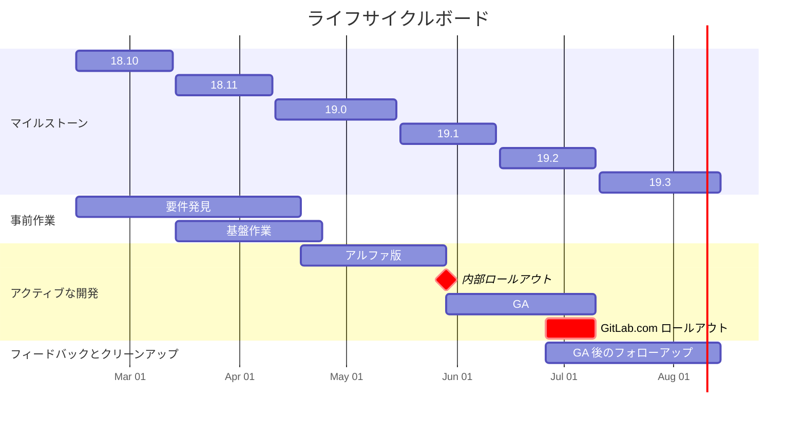

## タイムライン



## ステージ

認知的負荷を減らし、[最小限の価値ある変更](/handbook/values/#minimal-valuable-change-mvc)にスコープを絞り込むために、プロジェクトを時間制限のあるステージに分割します。これにより:

- 認知的負荷が減少します — エンジニアはより小さな変更、より小さな要件のセット、そしてより少ない Issue に取り組みます。
- プロジェクト管理が簡単になり、遅延を早期に発見できます — 小さなステージの方が追跡しやすく、遅れに気づきやすいです。
- バグやフィードバックをより早く表面化できます。

| ステージ | 成果 |
|-------|---------|
| **要件発見** | 後続のステージのスコープに関する意思決定。作業が Issue に分解される。プロジェクトの大まかな見積もり。スコープ外のことの明確な定義。 |
| **基盤作業** | 残りの開発を容易にするリファクタリングと適応。 |
| **アルファ版** | コアワークフローがドッグフーディングと内部テストに使用できるが、エッジが粗い場合がある。内部テストフィードバックへの対応を含む。 |
| **GA** | ユーザーへのリリースに満足できる最小限のまとまった体験。アルファ版のユーザーフィードバックへの対応、粗いエッジの修正、フィーチャーフラグのロールアウト期間（マイルストームカットオフの約2週間前）を含む。 |
| **GA 後のフォローアップ** | 初回リリース後に延期された機能、ユーザーフィードバック、コードとテストのクリーンアップ。GA から1〜2マイルストーム以内に完了する必要があります。判断に迷う場合はスコープ外に入れてください。 |
| **スコープ外** | コミットなし。後で行われるか、再優先化されるか、クローズされる可能性があります。 |

## Epic の構成

```plain
ライフサイクルボード（トップレベル Epic）
├── ライフサイクルボード — 要件発見
│   ├── UX 議論（Issue）
│   ├── ライフサイクルボード — カード（Epic）
│   ├── ライフサイクルボード — 列（Epic）
│   └── ...
├── ライフサイクルボード — 基盤作業
│   ├── ワークアイテムリストページのリファクタリング（Epic）
│   ├── リストページで GraphQL の代わりに REST API 経由でワークアイテムを読み込む（Epic）
│   └── ...
├── ライフサイクルボード — アルファ版
│   ├── ステータス列（Epic）
│   │   ├── 利用可能なステータスを読み込む（Issue）
│   │   └── 列でワークアイテムを読み込む（Issue）
│   ├── カード（Epic）
│   ├── API 変更（Epic）
│   ├── ビュー設定ドロップダウンをドロワーに変換（Epic）
│   ├── カードのドラッグアンドドロップ（Epic）
│   │   ├── 変更を永続化する（Issue）
│   │   └── 基本的なアニメーション（Issue）
│   └── ...
├── ライフサイクルボード — GA
│   ├── 内部テストフィードバック（Issue）
│   ├── カードの拡張（Epic）
│   ├── フィーチャーフラグのロールアウト（Epic）
│   ├── カードのドラッグアンドドロップ（Epic）
│   │   ├── アニメーションの改善（Issue）
│   │   └── 利用可能な列と利用不可能な列のハイライト（Issue）
│   └── ...
├── ライフサイクルボード — GA 後のフォローアップ
│   ├── ユーザーフィードバック（Issue）
│   ├── フィーチャーフラグ削除（Epic）
│   ├── 古いコードのクリーンアップ（Epic）
│   ├── テストのクリーンアップ（Epic）
│   └── ...
└── ライフサイクルボード — スコープ外
```
