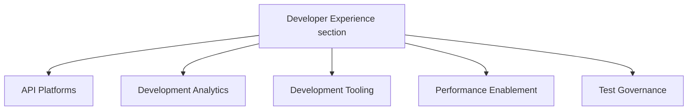

## ミッション

チーム、ツール、インサイトを統合した一貫した開発エコシステムを構築し、GitLab のエンジニアリング速度を加速させながら品質基準を高めます。

## ビジョン

GitLab エンジニアリングチームのために、エンジニアリングツール・プラクティス・データを単一の発見しやすい場所に集約した DevEx プラットフォームを確立します。可能な限り GitLab アプリケーション上に構築することで、この内部プラットフォームは自社製品を活用してエンジニアリング組織にサービスを提供します。

### 実現できること

すべての GitLab エンジニアが、以下を通じて高品質な機能を自信を持ってリリースできるようになります:

- バグ、脆弱性、インシデント、本番プラットフォームのニーズに関するツール、テスト、データ、インサイトへのアクセス
- 本番稼働準備、機能品質、セキュリティコンプライアンスに関する迅速なフィードバック

### 主なメリット

- ツールの発見しやすさの向上
- 部門横断的なアライメントの強化
- エンジニアリングチーム全体での開発プラクティスの標準化
- より一貫性のある効率的な機能デリバリー
- 自社製品のドッグフーディング

## 戦略的目標

SDLC のボトルネックにならずに GitLab の成長を支援するため、DevEx は 3 つの領域に注力します:

### 1. DevEx ツールプラットフォームの構築

開発プロセスに直接統合された、よく設計された発見しやすいツールへの単一のエントリポイントを提供します。これによりツールチェーンのオーバーヘッドとセットアップ時間を解消し、チームが自分たちの目標を持ちビジネス価値に集中できるようにします。

### 2. メトリクスの収集とダッシュボードの提供

チームの意思決定をサポートするメトリクスを提供し、ロールアップレポートを通じて VP 以上に開発者体験と品質への可視性を提供します

### 3. 完全で高品質なユーザー体験の提供

リアクティブなサポートからプロアクティブな品質基準へ移行します:

- 思慮深く設計されたプロセス
- 統合されたツールプラットフォーム
- 戦略的なテストフレームワーク

私たちは GitLab の進化するニーズ（AI 開発ワークフローなど）を予測し、DevEx による直接サポート作業ではなく、戦略的なコンサルテーションと包括的なプラットフォームツールを通じてチームを支援します。このプラットフォームファーストのアプローチは GitLab アプリケーション自体を活用しており、自社製品をドッグフーディングしながらエンジニアリング組織にサービスを提供できます。

DevEx は、進捗状況の追跡と新しいロードマップ項目の特定のために四半期ごとの DX サーベイを実施します。

## DevEx における AI

DevEx チームは AI ツールを積極的に活用して自分たちの作業を加速させ、内側から GitLab の AI 機能を検証しています。

- [DevEx における AI の活用方法](ai/) — ツール、ガイドライン、ワークフロー、ドッグフーディングのプラクティス
- [トップヒント](ai/top-tips/) — 日々のエンジニアリング業務のための実践的な AI ワークフロー

## 私たちとの協働

各 [DevEx チーム](#team-structure) はハンドブックページにロードマップを維持し、トップレベルのチームエピックにリンクされたエピックに取り組みます。

アドホックまたはサポートリクエストについては、[ヘルプリクエストプロセス](#request-for-help-process) をご利用ください

### ヘルプリクエストプロセス

以下の RFH プロセスを通じてサポートをリクエストするための Issue を作成してください。これにより、計画されたプロジェクトロードマップに対してリクエストを優先順位付けできます。

- [ヘルプリクエスト](https://gitlab.com/gitlab-org/quality/request-for-help) プロジェクトの指示に従ってください。Developer Experience の一部のチームは独自のヘルプリクエストプロセスを持っています。リクエストの送り先が不明な場合は、Developer Experience RFH プロジェクトを使用してください。適切に振り分けます。
- テンプレートのすべてのセクションを記入して、迅速にトリアージできるようにしてください
- Developer Experience は、リクエストのタイプと優先度に基づいて適切なラベルを付け、チームメンバーをアサインして、1 週間以内にリクエストをトリアージします。
- より緊急のリクエストについては、上記の管理チームにタグ付けしてください。

## プロジェクト管理

すべての作業はエピックと Issue で追跡されます。[Infrastructure Platforms プロジェクト管理プロセス](/handbook/engineering/infrastructure-platforms/project-management/) に従います。

### 新しいプロジェクトの開始

すべてのプロジェクトはエピックから始まります。必要な情報を含む新しいエピックを作成するには、[Infrastructure Platforms エピックガイド](/handbook/engineering/infrastructure-platforms/project-management/#epics) に従ってください。エピックの説明には、コンテキスト、プロジェクトのスコープ、意図したアウトカムを記載してください。多くの場合、エピックはより大きなプロジェクトのイテレーションになります。

- すべてのプロジェクトには DRI を割り当てる必要があります。DRI は意思決定、エピックと Issue の維持、毎週のエピックステータス更新の提供に責任を持ちます。
- 知識の共有を可能にするために、各プロジェクトには複数人が取り組むことを目指します。単一のスレッドの作業があるプロジェクトでは、タイムゾーンをまたいで作業することで知識を共有できます。チームの作業協力に最適な方法について EM に相談してください。

Grand Reviews に使用される毎週のエピックステータスオートメーションを有効にするには、https://gitlab.com/gitlab-com/gl-infra/epic-issue-summaries#child-epics の手順に従ってください。

### プロジェクトの完了

計画された作業が完了したら、[プロジェクト終了に関する Infrastructure Platforms ガイド](/handbook/engineering/infrastructure-platforms/project-management/#when-a-project-is-finished) に従ってください。

## DevEx グランドレビュー

毎週木曜日、DevEx シニア EM と DevEx EM の一人（またはその代理人）が、進行中のプロジェクトを順に説明する DevEx グランドレビューを録画します。目標はセクション全体でプロジェクトの可視性を向上させることです。[トップレベルエピック](https://gitlab.com/groups/gitlab-org/quality/-/epics/113) を使用してこれらのプロジェクトを特定します。

木曜日 17:00UTC までに、DevEx EM はエピックステータス更新を使用して [金曜日の Platforms グランドレビュー向けの更新（内部リンク）](https://docs.google.com/document/d/1gnoXNSpMXPfDqOyKRfIUHfNHUmSu88x8vjIeDOv73dE/edit?usp=sharing) の下書きを作成します。DevEx の更新は [金曜日グランドレビュー前の内部 Issue](https://gitlab.com/groups/gitlab-com/-/epics/2115) の録画で最終決定されます。

部門全体のアプローチについての詳細は、[Platforms グランドレビューハンドブックセクション](/handbook/engineering/infrastructure-platforms/project-management/#projects-are-reviewed-weekly-in-the-grand-review) をご覧ください。

## Developer Experience デモ

DevEx セクションは、隔週で内部同期デモコールを予定しています。デモコールの目標は、DevEx グループ全体でつながりを構築し、知識を共有することです。

デモをしたい方はデモアジェンダシートに名前を追加してください。デモは磨く必要も事前準備も不要です。

招待を希望される方は [DevEx Slack チャンネル](https://gitlab.enterprise.slack.com/archives/C07TWBRER7H) でメッセージしてください。

## チーム構成

[Infrastructure Platforms 部門構成](/handbook/engineering/infrastructure-platforms/#organization-structure) はハンドブックに記載されています。                                                                                                                   |

### Developer Experience セクション

## チームメンバー

### 管理チーム

チームメンバー情報は <a href="https://handbook.gitlab.com/handbook/engineering/infrastructure-platforms/developer-experience/#team-members" rel="external noopener">原文 (英語)</a> を参照してください。

### チーム

#### API

以下は [API グループ](api) のメンバーです:

チームメンバー情報は <a href="https://handbook.gitlab.com/handbook/engineering/infrastructure-platforms/developer-experience/#team-members" rel="external noopener">原文 (英語)</a> を参照してください。

#### Development Analytics

以下は [Development Analytics グループ](development-analytics) のメンバーです:

チームメンバー情報は <a href="https://handbook.gitlab.com/handbook/engineering/infrastructure-platforms/developer-experience/#team-members" rel="external noopener">原文 (英語)</a> を参照してください。

#### Development Tooling

以下は [Development Tooling グループ](development-tooling) のメンバーです:

チームメンバー情報は <a href="https://handbook.gitlab.com/handbook/engineering/infrastructure-platforms/developer-experience/#team-members" rel="external noopener">原文 (英語)</a> を参照してください。

#### Performance Enablement

以下は [Performance Enablement グループ](performance-enablement) のメンバーです:

チームメンバー情報は <a href="https://handbook.gitlab.com/handbook/engineering/infrastructure-platforms/developer-experience/#team-members" rel="external noopener">原文 (英語)</a> を参照してください。

#### Test Governance

以下は [Test Governance グループ](test-governance) のメンバーです:

チームメンバー情報は <a href="https://handbook.gitlab.com/handbook/engineering/infrastructure-platforms/developer-experience/#team-members" rel="external noopener">原文 (英語)</a> を参照してください。

