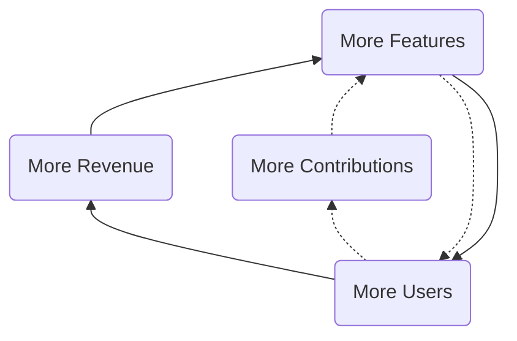
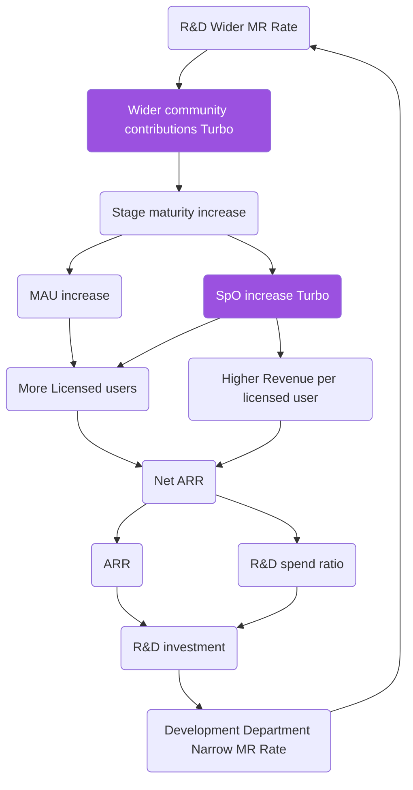

## デュアルフライホイール

GitLab には互いを強化し合う 2 つのフライホイール戦略があります。オープンコアフライホイールと開発フライホイールです。
フライホイール戦略とは、[定義によると](https://medium.com/evergreen-business-weekly/flywheel-effect-why-positive-feedback-loops-are-a-meta-competitive-advantage-6d0ed55b67c5)、正のフィードバックループによって勢いを生み出し、追加の取り組みの成果を高め続けるものです。
以下の図で、2 つのフライホイールがどのように連携して機能するかを視覚的に確認できます。

オープンコアフライホイールでは、より多くの機能がより多くのユーザーを呼び込み、その結果としてより多くの収益とコントリビューションが生まれ、さらに多くのユーザーへとつながります。

フライホイールの原動力は、複数のポイントソリューションを置き換える DevSecOps プラットフォームを使用することで、GitLab のお客様がコスト削減と効率向上を実現できるという点にあります。そのため、GitLab がプロダクトの成熟度を高める機能を開発するほど、ポイントソリューションの置き換えが容易になり、より多くのユーザーを引き付けられるようになります。



### KPI と担当部門

| フライホイールの要素 | 主要業績評価指標 (KPI) | 部門 |
|-----------------|---------------------------------|------------|
| ユーザー増加 | Stage Monthly Active Users | Product |
| コントリビューション増加 | 月間ユニーク広域コミュニティ・カスタマーコントリビューター数 | Developer Relations and Engineering |
| 機能増加 | エンジニア 1 人当たりリリースごとのマージリクエスト数（製品開発） | Engineering and Product |
| 収益増加 | IACV vs. 計画 | Sales and Marketing |

### 2 つのターボ付きフライホイール

GitLab は[完全なプラットフォーム](https://about.gitlab.com/platform/)であり、[広域コミュニティからのコントリビューション](https://about.gitlab.com/community/contribute/)を受けています。

他のプラットフォームと比較して、GitLab は会社を後押しする独自のターボを活用しています:

1. [単一アプリケーションの優位性](/handbook/product/categories/gitlab-the-product/single-application/)により、[組織あたりのステージ数](https://internal.gitlab.com/handbook/company/performance-indicators/product/#stages-per-organization-spo)が増加
1. [オープンソースのスチュワードシップ](/handbook/company/stewardship/)により、[広域コミュニティ・カスタマーコントリビューション](https://about.gitlab.com/community/contribute/)が促進

開発支出フライホイールでは、マージリクエスト (MR)、ある期間から次の期間への ARR の変化 (Delta ARR)、ハイパーグロースの R&D 支出、および MR への影響との関係を捉えています。私たちは、受け入れ基準をすべて満たしたより多くの MR のマージが、ステージの成熟度を高め、月間アクティブユーザー数とユーザーあたりのステージ数を増加させ、それがシート数と収益の増加につながり、R&D 支出の資金となり、より高品質な MR につながるという流れを見ています。



## 重点領域

私たちは、より多くのコントリビューションを獲得するという会社全体のデュアルフライホイール戦略を支援するため、5 つの重点領域で実行します。この 5 つの重点領域は、コントリビューターとコントリビューション 10 倍加速戦略の構成要素です。

```mermaid
flowchart LR
  subgraph moreContributions["More Contributions"]
    contributorIncrease["Contributor Increase"]
    contributionIncrease["Contribution Increase"]
    bothIncrease["Contributor & Contribution Increase"]
    increaseValue("Increase Contribution Value")
    improveJourney("Improve Contributor Journey")
    fosterDiversity("Foster Diversity, Equity, and Inclusion")
    scaleCommunity("Scale the Community")
    expandOutreach("Expand Outreach")
    scaleCommunity-->improveJourney
    scaleCommunity-->increaseValue
    scaleCommunity-->fosterDiversity
    expandOutreach-->scaleCommunity
    increaseValue-->contributionIncrease
    improveJourney-->contributorIncrease
    fosterDiversity-->bothIncrease
  end
  style moreContributions fill:#FFF, stroke:#9370DB, stroke-dasharray: 5 5
  style contributionIncrease fill:#9370DB,stroke:#9370DB,stroke-width:10px
  style contributorIncrease fill:#9370DB,stroke:#9370DB,stroke-width:10px
  style bothIncrease fill:#9370DB,stroke:#9370DB,stroke-width:10px
  style improveJourney color:#6b4fbb, stroke:#9370DB
  style increaseValue color:#6b4fbb, stroke:#9370DB
  style fosterDiversity color:#6b4fbb, stroke:#9370DB
  style expandOutreach color:#6b4fbb, stroke:#9370DB
  style scaleCommunity color:#6b4fbb, stroke:#9370DB
  click improveJourney "./#improve-contributor-journey" _self
  click increaseValue "./#increase-contribution-value" _self
  click fosterDiversity "./#foster-diversity-equity-and-inclusion" _self
  click expandOutreach "./#expand-outreach" _self
  click scaleCommunity "./#scale-the-community" _self
 ```

### 現在の優先事項

私たちは現在のキャパシティの中で最大のインパクトを生み出すため、以下の 5 つの重点項目を優先しています。すべてのイニシアチブは価値がありますが、この集中的なアプローチにより、より効果的に意味のある変化を推進できます。

* [オープンコミュニティ MR エイジの削減](/handbook/engineering/open-source/growth-strategy/#reduce-open-community-mr-age)
* [魅力的なコントリビューター価値提案の作成](/handbook/engineering/open-source/growth-strategy/#create-a-compelling-contributor-value-proposition)
* [コントリビューター昇進システム](/handbook/engineering/open-source/growth-strategy/#contributor-recognition--advancement-system)
* [リピートコントリビューターと頻繁なコントリビューター](/handbook/engineering/open-source/growth-strategy/#returning--frequent-contributors)
* [コード以外のコントリビューション](/handbook/engineering/open-source/growth-strategy/#non-code-contributions)

### コントリビュータージャーニーの改善 {#improve-contributor-journey}

オンボーディングから変更のマージまで、卓越した効率的かつ迅速なコントリビューター体験を提供します。取り組みの一つは、コントリビュージャーニーをより効率的にするためのコントリビューションの障壁を削減することです。これらの障壁は、広域コミュニティのコントリビューター、プロダクトチーム、GitLab チームメンバーからコントリビューションの摩擦についてフィードバックを収集することで特定されます。

#### オープンコミュニティ MR エイジの削減

* **理由:** [オープンコミュニティ MR エイジ (OCMA)](/handbook/marketing/developer-relations/performance-indicators/#open-community-mr-age) とレビュー時間を削減することで、本番環境へのコントリビューションのスピードを向上させます。OCMA が最も高いプロダクトグループを特定しました。最大の機会があるプロダクトグループに対処するための分析と改善が必要です。MR レビューの改善とフィードバックの収集も行います。
* **DRI:** [Developer Relations Engineering](/handbook/marketing/developer-relations/engineering/)

#### プロダクトとエンジニアリングの整合

* **理由:** [プロダクトグループ](/handbook/company/structure/#product-groups)内では、コントリビューションの提出、バックログ、テクノロジースタックが異なります。健全なコミュニティバックログの整合と、アウトリーチのための共通のベストプラクティスの確立が、コントリビューターの成功に不可欠です。さらに、広域コミュニティコントリビューションのための統一された既知のワークフローが必要です。
* **DRI:** [Developer Advocacy team](/handbook/marketing/developer-relations/developer-advocacy/) および [Developer Relations Engineering team](/handbook/marketing/developer-relations/engineering/)

#### コントリビューションガイドの簡素化と改善

* **理由:** コントリビューションガイドを分かりやすくナビゲートできるようにします。現在のコントリビューションガイドは断片化されており、新しいコントリビューターがナビゲートして理解するのが難しい場合があります。
* **DRI:** [Developer Relations team](/handbook/marketing/developer-relations/)

#### コントリビューションツールの改善

* **理由:** ツールを通じて迅速かつ効率的なコントリビューター体験を提供します。コントリビューターツールはコントリビューターの生産性向けに最適化する必要があります。
* **DRI:** [Development Tooling team](/handbook/engineering/infrastructure-platforms/developer-experience/development-tooling/)

### コントリビューション価値の向上 {#increase-contribution-value}

魅力的な価値を提供し、コントリビューターの作業に対する定期的な認定を行うことで、コントリビューターを促進、引き付け、維持します。コントリビューターのキャリア昇進資料と表彰も含みます。

#### 魅力的なコントリビューター価値提案の作成

* **理由:** 人々が GitLab にコントリビューションしようとする理由を明確に定義し、コードコントリビューション増加のための魅力的な価値提案を提示する必要があります。この課題を推進するプログラムの一つが、お客様向けの [Co-Create プログラム](https://about.gitlab.com/community/co-create/)です。
* **DRI:** [Developer Relations team](/handbook/marketing/developer-relations/)

#### コントリビューター認定・昇進システム

* **理由:** オープンソースプロジェクトでは、コントリビューターはバグの修正や機能の追加だけでなく、経験を積んでオンラインプレゼンスを構築することにも意欲を持ちます。これはレベルアップ、バッジ、その他のインセンティブシステムで解決できます。さらに、コントリビューターを認定して維持するための継続的かつ影響力のある認定を提供します。認定の頻度を高め、コントリビューターのタイプやペルソナに合わせた対象を絞った認定を行います。
* **DRI:** [Developer Relations Engineering team](/handbook/marketing/developer-relations/engineering/)

### 多様性・公平性・包括性の促進 {#foster-diversity-equity-and-inclusion}

オープンソースコミュニティの関係と広域コミュニティのコントリビューターの中で、多様性・公平性・包括性を中心に据えます。トップコントリビューターのより大きな層にリーチし、より公平なコントリビューションの機会を提供します。

#### オープンソースコミュニティの DEI イニシアチブとの整合

* **理由:** DEI イニシアチブを実践するオープンソースコミュニティと連携することで、新しいコントリビューターへのリーチに関するアイデアが増え、潜在的なコントリビューターへの DEI へのコミットメントを示せます。
* **DRI:** [Developer Relations team](/handbook/marketing/developer-relations/) および [Developer Relations Engineering team](/handbook/marketing/developer-relations/engineering/)

#### コントリビューターインクルージョンの改善

* **理由:** 新規コントリビューターとリピートコントリビューターのコントリビューター体験を改善し、異なる経験レベルのコントリビューターに対応します。より包括的な体験を作ることで、コントリビューターの再訪の可能性を高められます。
* **DRI:** [Developer Relations Engineering team](/handbook/marketing/developer-relations/engineering/)

### アウトリーチの拡大 {#expand-outreach}

コンテンツとイベントによる認知度向上で、多くのコントリビューターを呼び込みます。これまでのアウトリーチ活動は限られていました。認知度を高め、外部コミュニティからメンバーを引き込む積極的かつ集中的な取り組みが必要です。エンジニアリングは拡大されたアウトリーチイベントで Developer Relations と協力します。

#### コントリビューションバックログの露出度向上

* **理由:** 巨大なプロジェクトへの新規メンバーとしてのコントリビューションは圧倒されることがあり、分析麻痺につながり、コントリビューターを失う可能性があります。私たちは新規参加者を誘導できる、発見しやすい一定規模の Issue セットへのレンズを提供する必要があります。確立されたサードパーティのプラットフォームの活用も検討します。
* **DRI:** [Developer Relations team](/handbook/marketing/developer-relations/)

#### コントリビューターイベントのスケール拡大

* **理由:** 帰属意識を醸成し、コントリビューターが声を上げ、同僚と出会い、知識を共有し、祝うことができる社会的環境を提供します。
* **DRI:** [Developer Relations team](/handbook/marketing/developer-relations/) および [Developer Relations Engineering team](/handbook/marketing/developer-relations/engineering/)

#### コミュニティオフィスアワーとコミュニティペアリング

* **理由:** 従来はプロダクトグループがコードコントリビューターへのサポートやガイダンスを提供し、フィードバックを集める独自の機会となっていたオフィスアワーコールとコミュニティペアリングセッションをスケールさせる必要があります。
* **DRI:** [Developer Relations team](/handbook/marketing/developer-relations/) および [Developer Relations Engineering team](/handbook/marketing/developer-relations/engineering/)

#### ソーシャルプレゼンスの強化

* **理由:** 現在の限られたメディア (Twitter、Discord) を超えてソーシャルメディアプレゼンスを拡大することで、既存の開発者コミュニティにアクセスできるようになります。
* **DRI:** [Developer Relations team](/handbook/marketing/developer-relations/)

### コミュニティのスケール拡大 {#scale-the-community}

フルタイムのカスタマーコントリビューターモデルを活用し、持続可能な成長のための広域コミュニティチームを作ります。

#### リピートコントリビューターと頻繁なコントリビューター

* **理由:** お客様、パートナー、OSS コミュニティなど GitLab を使用または拡張する組織からの継続的なコントリビューションを動機付けることで、コントリビューションを増加させます。そのステータスを達成した人々に、個人と組織にとって価値ある GitLab の特典で報います。
* **DRI:** [Developer Relations team](/handbook/marketing/developer-relations/) および [Developer Relations Engineering team](/handbook/marketing/developer-relations/engineering/)

#### コード以外のコントリビューション

* **理由:** 私たちのユーザーベースはさまざまなペルソナで構成されており、それぞれが価値あるコントリビューションをして GitLab を改善できます。設計の提案、コードレビュー、Issue のトリアージ、または関係するすべての当事者の健全な議論を促進することは、私たちの目標達成を加速させます。さらに、プロダクトの宣伝、イベントへの参加、その他の方法でのコントリビューションといった非コードコントリビューションも認定し称えるべきです。
* **DRI:** [Developer Relations Engineering team](/handbook/marketing/developer-relations/engineering/)

#### さらなるコラボレーションの促進

* **理由:** コントリビューターが単独で作業するのではなく、一緒により多くのことができるチームを作りたいと思います。
* **DRI:** [Developer Relations Engineering team](/handbook/marketing/developer-relations/engineering/)
